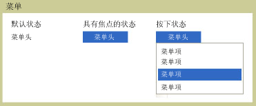

# 菜单Menu
A<xref:System.Windows.Controls.Menu>是允许的命令或事件处理程序与关联的元素的分层组织的控件。A <xref:System.Windows.Controls.Menu> is a control that allows hierarchical organization of elements associated with commands or event handlers. 每个<xref:System.Windows.Controls.Menu>可以包含多个<xref:System.Windows.Controls.MenuItem>控件。Each <xref:System.Windows.Controls.Menu> can contain multiple <xref:System.Windows.Controls.MenuItem> controls. 每个<xref:System.Windows.Controls.MenuItem>可以调用命令或调用`Click`事件处理程序。Each <xref:System.Windows.Controls.MenuItem> can invoke a command or invoke a `Click` event handler. A<xref:System.Windows.Controls.MenuItem>还可以有多个<xref:System.Windows.Controls.MenuItem>元素作为子级，构成子菜单。A <xref:System.Windows.Controls.MenuItem> can also have multiple <xref:System.Windows.Controls.MenuItem> elements as children, forming a submenu.  
  
 下图显示菜单控件的三个不同的状态。The following illustration shows the three different states of a menu control. 没有设备如鼠标指针停留在线上时的默认状态<xref:System.Windows.Controls.Menu>。The default state is when no device such as a mouse pointer is resting on the <xref:System.Windows.Controls.Menu>. 当鼠标指针悬停在焦点状态时发生<xref:System.Windows.Controls.Menu>并且通过单击鼠标按钮时发生按下的状态<xref:System.Windows.Controls.Menu>。The focus state occurs when the mouse pointer is hovering over the <xref:System.Windows.Controls.Menu> and pressed state occurs when a mouse button is clicked over the <xref:System.Windows.Controls.Menu>.  
  
   
不同状态中的菜单Menus in different states  
  
## 本节内容In This Section  
 [菜单概述Menu Overview](../../../../docs/framework/wpf/controls/menu-overview.md)  
  
## 参考Reference  
 <xref:System.Windows.Controls.Menu>  
  <xref:System.Windows.Controls.MenuItem>  
  <xref:System.Windows.Controls.Primitives.MenuBase>  
  <xref:System.Windows.Controls.ContextMenu>  
  
## 相关章节Related Sections
