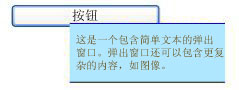

# 弹出项
<xref:System.Windows.Controls.Primitives.Popup>控件通过当前的应用程序窗口浮动的单独窗口中显示内容。  
  
 下图显示<xref:System.Windows.Controls.Primitives.Popup>相对于定位的控件<xref:System.Windows.Controls.Button>，它是其父级。  
  
   
  
## 本节内容  
 [Popup 概述](../../../../docs/framework/wpf/controls/popup-overview.md)  
 [Popup 放置行为](../../../../docs/framework/wpf/controls/popup-placement-behavior.md)  
 [帮助主题](../../../../docs/framework/wpf/controls/popup-how-to-topics.md)  
  
## 参考  
 <xref:System.Windows.Controls.Primitives.Popup>  
  
## 相关章节
