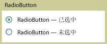

# RadioButton
<xref:System.Windows.Controls.RadioButton> 控件通常组合在一起以向用户提供若干选项; 中的单个选择可以选择一次只有一个按钮。  
  
 下图显示的示例<xref:System.Windows.Controls.RadioButton>控件。  
  
   
典型的单选按钮  
  
## 参考  
 <xref:System.Windows.Controls.Primitives.ToggleButton>  
  
## 相关章节
