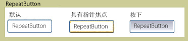

# RepeatButtonRepeatButton
<xref:System.Windows.Controls.Primitives.RepeatButton>类似于<xref:System.Windows.Controls.Button>。The <xref:System.Windows.Controls.Primitives.RepeatButton> is similar to a <xref:System.Windows.Controls.Button>. 但是，<xref:System.Windows.Controls.Primitives.RepeatButton>元素，可以控制何时以及如何<xref:System.Windows.Controls.Primitives.ButtonBase.Click>事件发生。However, <xref:System.Windows.Controls.Primitives.RepeatButton> elements give you control over when and how the <xref:System.Windows.Controls.Primitives.ButtonBase.Click> event occurs.  
  
 下图显示了重复的按钮控件、 默认、 PointerFocused，和已按的三个状态的示例。The following graphic shows an example of the three states of a repeat button control, Default, PointerFocused, and Pressed. 第一个按钮显示的默认状态<xref:System.Windows.Controls.Primitives.RepeatButton>。The first button shows the default state of the <xref:System.Windows.Controls.Primitives.RepeatButton>. 第二部分演示如何按钮的外观更改当鼠标指针悬停于按钮上，给予它焦点。The second shows how the appearance of the button changes when the mouse pointer hovers over the button, giving it focus. 最后一个按钮显示的外观<xref:System.Windows.Controls.Primitives.RepeatButton>当用户按鼠标按钮控件。The last button shows the appearance of the <xref:System.Windows.Controls.Primitives.RepeatButton> when the user presses the mouse button over the control.  
  
   
典型 RepeatButtonTypical RepeatButton  
  
## 本节内容In This Section  
  
## 参考Reference  
 <xref:System.Windows.Controls.Primitives.RepeatButton>  
  
## 相关章节Related Sections
