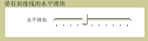

# Slider
<xref:System.Windows.Controls.Slider>允许您选择从一系列值，通过移动<xref:System.Windows.Controls.Primitives.Thumb>沿<xref:System.Windows.Controls.Primitives.Track>。  
  
 下图显示了水平的示例<xref:System.Windows.Controls.Slider>控件。  
  
   
  
## 本节内容  
 [自定义滑块上的刻度](how-to-customize-the-ticks-on-a-slider.md)  
  
## 参考  
 <xref:System.Windows.Controls.Slider>  
  <xref:System.Windows.Controls.Primitives.Track>  
  <xref:System.Windows.Controls.Primitives.Thumb>
