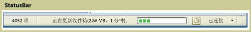

# StatusBarStatusBar
A<xref:System.Windows.Controls.Primitives.StatusBar>是在应用程序可在其中显示状态信息的窗口底部的水平区域。A <xref:System.Windows.Controls.Primitives.StatusBar> is a horizontal area at the bottom of a window where an application can display status information.  
  
 下图显示的示例<xref:System.Windows.Controls.Primitives.StatusBar>。The following illustration shows an example of a <xref:System.Windows.Controls.Primitives.StatusBar>.  
  
   
  
## 本节内容In This Section  
  
## 参考Reference  
 <xref:System.Windows.Controls.Primitives.StatusBar>  
  <xref:System.Windows.Controls.Primitives.StatusBarItem>  
  
## 相关章节Related Sections
