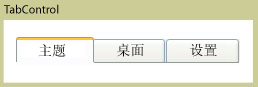

# TabControl
<xref:System.Windows.Controls.TabControl> 元素选择相应的选项卡，即可访问的不同页面上显示的内容。每个选项卡包含<xref:System.Windows.Controls.TabItem>。  
  
 下图显示<xref:System.Windows.Controls.TabControl>。  
  
   
典型 TabControl  
  
## 参考  
 <xref:System.Windows.Controls.TabControl>  
  <xref:System.Windows.Controls.TabItem>  
  
## 相关章节
