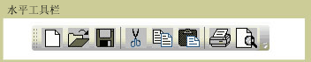
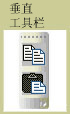

# ToolBarToolBar
<xref:System.Windows.Controls.ToolBar>控件是一组命令或通常在功能上相关的控件的容器。The <xref:System.Windows.Controls.ToolBar> control is a container for a group of commands or controls that are typically related in their function.  
  
 下图显示了水平和垂直<xref:System.Windows.Controls.ToolBar>控件。The following illustrations show horizontal and vertical <xref:System.Windows.Controls.ToolBar> controls.  
  
   
水平工具栏Horizontal Toolbar  
  
   
垂直工具栏Vertical Toolbar  
  
## 本节内容In This Section  
 [ToolBar 概述ToolBar Overview](../../../../docs/framework/wpf/controls/toolbar-overview.md)  
  [设置 ToolBar 上控件的样式Style Controls on a ToolBar](../../../../docs/framework/wpf/controls/how-to-style-controls-on-a-toolbar.md)  
  
## 参考Reference  
 <xref:System.Windows.Controls.ToolBar>  
  <xref:System.Windows.Controls.ToolBarTray>  
  
## 相关章节Related Sections
