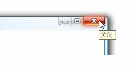

# ToolTipToolTip
工具提示，则用户将鼠标指针悬停在元素，通过上时，将显示一个小型弹出窗口<xref:System.Windows.Controls.Button>。A tooltip is a small pop-up window that appears when a user pauses the mouse pointer over an element, such as over a <xref:System.Windows.Controls.Button>.  
  
 下图显示了鼠标指针指向**关闭**<xref:System.Windows.Controls.Button>，后者随后会显示其标识<xref:System.Windows.Controls.ToolTip>。The following illustration shows a mouse pointer that points to the **Close**<xref:System.Windows.Controls.Button>, which then displays its identifying <xref:System.Windows.Controls.ToolTip>.  
  
 显示其显示工具提示关闭按钮Close button with its tooltip displayed  
  
   
  
## 本节内容In This Section  
 [ToolTip 概述ToolTip Overview](tooltip-overview.md)  
  [帮助主题How-to Topics](tooltip-how-to-topics.md)  
  
## 参考Reference  
 <xref:System.Windows.Controls.ToolTip>  
  <xref:System.Windows.Controls.ToolTipService>  
  <xref:System.Windows.Controls.Primitives.Popup>  
  
## 相关章节Related Sections  
 [Popup 概述Popup Overview](popup-overview.md)  
  [帮助主题How-to Topics](popup-how-to-topics.md)
