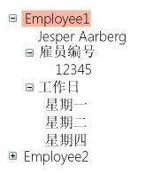

# TreeView
<xref:System.Windows.Controls.TreeView> 控件通过使用可折叠节点来以分层结构显示信息。  
  
 下图是一个嵌套了 <xref:System.Windows.Controls.TreeViewItem> 控件的 <xref:System.Windows.Controls.TreeView> 控件示例。  
  
   
  
## 本节内容  
 [TreeView 概述](../../../../docs/framework/wpf/controls/treeview-overview.md)  
 [帮助主题](../../../../docs/framework/wpf/controls/treeview-how-to-topics.md)  
  
## 参考  
 <xref:System.Windows.Controls.TreeView>  
 <xref:System.Windows.Controls.TreeViewItem>  
  
## 相关章节  
 [数据绑定概述](../../../../docs/framework/wpf/data/data-binding-overview.md)  
 [数据模板化概述](../../../../docs/framework/wpf/data/data-templating-overview.md)