# 演练：使用 Microsoft Expression Blend 创建按钮Walkthrough: Create a Button by Using Microsoft Expression Blend
本演练将引导你完成创建过程[!INCLUDE[TLA2#tla_wpf](../../../../includes/tla2sharptla-wpf-md.md)]使用 Microsoft Expression Blend 的自定义的按钮。This walkthrough steps you through the process of creating a [!INCLUDE[TLA2#tla_wpf](../../../../includes/tla2sharptla-wpf-md.md)] customized button using Microsoft Expression Blend.  
  
> [!IMPORTANT]
>  Microsoft Expression Blend 的工作原理是生成[!INCLUDE[TLA#tla_xaml](../../../../includes/tlasharptla-xaml-md.md)]然后编译以使可执行程序。Microsoft Expression Blend works by generating [!INCLUDE[TLA#tla_xaml](../../../../includes/tlasharptla-xaml-md.md)] that is then compiled to make the executable program. 如果使用中而不是所起的作用[!INCLUDE[TLA#tla_xaml](../../../../includes/tlasharptla-xaml-md.md)]直接，没有创建一个使用此条件的应用程序的另一个演练[!INCLUDE[TLA#tla_xaml](../../../../includes/tlasharptla-xaml-md.md)]与 Visual Studio 而不是 Blend。If you would rather work with [!INCLUDE[TLA#tla_xaml](../../../../includes/tlasharptla-xaml-md.md)] directly, there is another walkthrough that creates the same application as this one using [!INCLUDE[TLA#tla_xaml](../../../../includes/tlasharptla-xaml-md.md)] with Visual Studio rather than Blend. 请参阅[创建一个按钮通过使用 XAML](../../../../docs/framework/wpf/controls/walkthrough-create-a-button-by-using-xaml.md)有关详细信息。See [Create a Button by Using XAML](../../../../docs/framework/wpf/controls/walkthrough-create-a-button-by-using-xaml.md) for more information.  
  
 下图显示了您将创建的自定义的按钮。The following illustration shows the customized button that you will create.  
  
   
  
## 将形状转换为一个按钮Convert a Shape to a Button  
 在本演练的第一部分创建的自定义按钮的自定义外观。In the first part of this walkthrough you create the custom look of the custom button. 若要执行此操作，您首先将一个矩形成一个按钮。To do this, you first convert a rectangle to a button. 您将添加其他形状到模板的按钮，创建更复杂的美观按钮。You then add additional shapes to the template of the button, creating a more complex looking button. 为什么不使用常规按钮启动和自定义它？Why not start with a regular button and customize it? 因为一个按钮具有内置功能，您不需要;对于自定义按钮，它是更轻松地开始一个矩形。Because a button has built-in functionality that you do not need; for custom buttons, it is easier to start with a rectangle.  
  
#### 若要在 Expression Blend 中创建新项目To create a new project in Expression Blend  
  
1.  开始在 Expression Blend。Start Expression Blend. (单击**启动**，依次指向**所有程序**，指向**Microsoft Expression**，然后单击**Microsoft Expression Blend**。)(Click **Start**, point to **All Programs**, point to **Microsoft Expression**, and then click **Microsoft Expression Blend**.)  
  
2.  如果需要最大化应用程序。Maximize the application if needed.  
  
3.  在“文件”菜单上，单击“新建项目”。On the **File** menu, click **New Project**.  
  
4.  选择**标准应用程序 (.exe)**。Select **Standard Application (.exe)**.  
  
5.  将项目命名`CustomButton`并按**确定**。Name the project `CustomButton` and press **OK**.  
  
 此时您已具有一个空[!INCLUDE[TLA2#tla_wpf](../../../../includes/tla2sharptla-wpf-md.md)]项目。At this point you have a blank [!INCLUDE[TLA2#tla_wpf](../../../../includes/tla2sharptla-wpf-md.md)] project. 可以按 F5 运行该应用程序。You can press F5 to run the application. 正如您所料，此应用程序包含一个空白的窗口。As you might expect, the application consists of only a blank window. 接下来，创建一个圆角的矩形，并将其转换为一个按钮。Next, you create a rounded rectangle and convert it into a button.  
  
#### 若要将一个矩形转换为一个按钮To convert a Rectangle to a Button  
  
1.  **窗口背景属性设置为黑色：** 选择该窗口中，单击**属性选项卡**，并设置<xref:System.Windows.Controls.Control.Background%2A>属性设置为`Black`。**Set the Window Background property to black:** Select the Window, click the **Properties Tab**, and set the <xref:System.Windows.Controls.Control.Background%2A> property to `Black`.  
  
     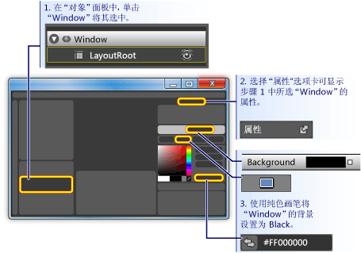  
  
2.  **窗口上绘制一个矩形大小与按钮：** 选择左侧的工具面板上的矩形工具并将该矩形拖到窗口。**Draw a rectangle approximately the size of a button on the Window:** Select the rectangle tool on the left-hand tool panel and drag the rectangle onto the Window.  
  
     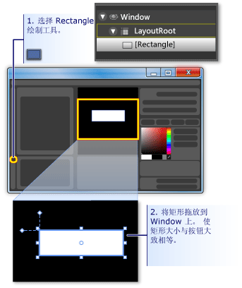  
  
3.  **为圆角矩形：** 拖动矩形的控点，或者直接设置<xref:System.Windows.Shapes.Rectangle.RadiusX%2A>和<xref:System.Windows.Shapes.Rectangle.RadiusY%2A>属性。**Round out the corners of the rectangle:** Either drag the control points of the rectangle or directly set the <xref:System.Windows.Shapes.Rectangle.RadiusX%2A> and <xref:System.Windows.Shapes.Rectangle.RadiusY%2A> properties. 设置的值<xref:System.Windows.Shapes.Rectangle.RadiusX%2A>和<xref:System.Windows.Shapes.Rectangle.RadiusY%2A>为 20。Set the values of <xref:System.Windows.Shapes.Rectangle.RadiusX%2A> and <xref:System.Windows.Shapes.Rectangle.RadiusY%2A> to 20.  
  
     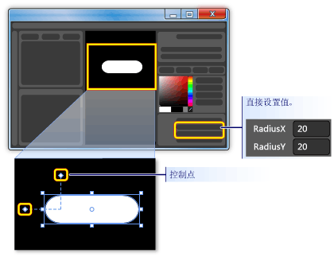  
  
4.  **将矩形更改为一个按钮：** 选择该矩形。**Change the rectangle into a button:** Select the rectangle. 上**工具**菜单上，单击**使按钮**。On the **Tools** menu, click **Make Button**.  
  
     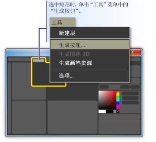  
  
5.  **指定样式模板的作用域：** 会显示如下所示的对话框。**Specify the scope of the style/template:** A dialog box like the following appears.  
  
     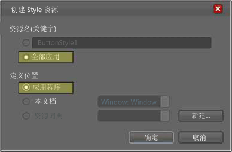  
  
     有关**资源名称 （键）**，选择**应用到所有**。For **Resource name (Key)**, select **Apply to all**.  这将使生成的样式和应用于所有对象的按钮的按钮模板。This will make the resulting style and button template apply to all objects that are buttons. 有关**中定义**，选择**应用程序**。For **Define in**, select **Application**. 这将使生成的样式和按钮模板的范围涵盖整个应用程序。This will make the resulting style and button template have scope over the entire application. 当这两个框中设置的值，在按钮样式和模板应用于整个应用程序中的所有按钮，创建应用程序中任何按钮将默认情况下，使用此模板。When you set the values in these two boxes, the button style and template apply to all buttons within the entire application and any button you create in the application will, by default, use this template.  
  
## 编辑按钮模板Edit the Button Template  
 你现在有一个已更改为一个按钮的矩形。You now have a rectangle that has been changed to a button. 在本部分中，将修改的按钮模板并进一步自定义其外观。In this section, you'll modify the template of the button and further customize how it looks.  
  
#### 若要编辑要更改按钮外观的按钮模板To edit the button template to change the button appearance  
  
1.  **请转到编辑模板视图：** 若要进一步自定义按钮的外观，我们需要编辑按钮模板。**Go into edit template view:** To further customize the look of our button, we need to edit the button template. 此模板创建时我们转换成一个按钮的矩形。This template was created when we converted the rectangle into a button. 若要编辑的按钮模板，右键单击该按钮，然后选择**编辑控件部件 （模板）** ，然后**编辑模板**。To edit the button template, right-click the button and select **Edit Control Parts (Template)** and then **Edit Template**.  
  
     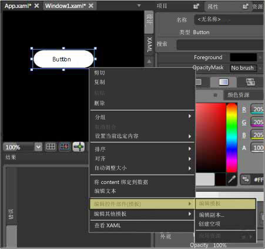  
  
     在模板编辑器中，请注意，现在分为按钮<xref:System.Windows.Shapes.Rectangle>和<xref:System.Windows.Controls.ContentPresenter>。In the template editor, notice that the button is now separated into a <xref:System.Windows.Shapes.Rectangle> and the <xref:System.Windows.Controls.ContentPresenter>. <xref:System.Windows.Controls.ContentPresenter>用于呈现按钮 （例如，字符串"Button"） 中的内容。The <xref:System.Windows.Controls.ContentPresenter> is used to present content within the button (for example, the string "Button"). 这两个矩形并<xref:System.Windows.Controls.ContentPresenter>内的布局<xref:System.Windows.Controls.Grid>。Both the rectangle and <xref:System.Windows.Controls.ContentPresenter> are laid out inside of a <xref:System.Windows.Controls.Grid>.  
  
     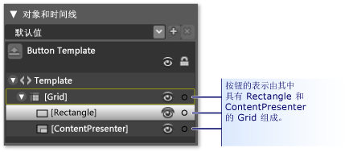  
  
2.  **更改模板组件的名称：** 右键单击在模板清单，更改矩形<xref:System.Windows.Shapes.Rectangle>名称从"[Rectangle]"到"outerRectangle"，并将"[ContentPresenter]"更改为"myContentPresenter"。**Change the names of the template components:** Right-click the rectangle in the template inventory, change the <xref:System.Windows.Shapes.Rectangle> name from "[Rectangle]" to "outerRectangle", and change "[ContentPresenter]" to "myContentPresenter".  
  
     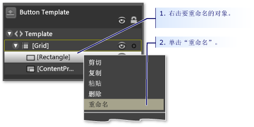  
  
3.  **Alter 矩形，使其为空内 （如一个圆环图）：** 选择**outerRectangle**并设置<xref:System.Windows.Shapes.Shape.Fill%2A>为"透明"和<xref:System.Windows.Shapes.Shape.StrokeThickness%2A>为 5。**Alter the rectangle so that it is empty inside (like a donut):** Select **outerRectangle** and set <xref:System.Windows.Shapes.Shape.Fill%2A> to "Transparent" and <xref:System.Windows.Shapes.Shape.StrokeThickness%2A> to 5.  
  
     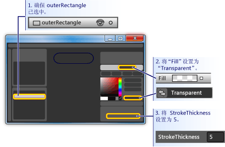  
  
     然后设置<xref:System.Windows.Shapes.Shape.Stroke%2A>该模板将在任何内容的颜色。Then set the <xref:System.Windows.Shapes.Shape.Stroke%2A> to the color of whatever the template will be. 若要执行此操作，请单击小白色框旁边**笔划**，选择**CustomExpression**，并在对话框中键入"{TemplateBinding 后台}"。To do this, click the small white box next to **Stroke**, select **CustomExpression**, and type "{TemplateBinding Background}" in the dialog box.  
  
     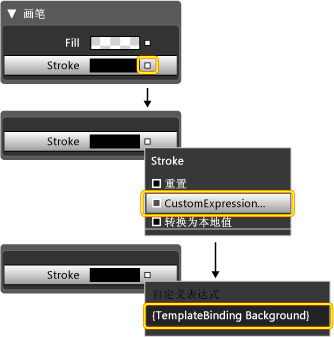  
  
4.  **创建一个内部矩形：** 现在，创建另一个矩形 （名称"innerRectangle"） 并将其定位对称的内部**outerRectangle** 。**Create an inner rectangle:** Now, create another rectangle (name it "innerRectangle") and position it symmetrically on the inside of **outerRectangle** . 对于此类型的工作，可能需要放大以使该按钮编辑区域在更大。For this kind of work, you will probably want to zoom to make the button larger in the editing area.  
  
    > [!NOTE]
    >  在矩形可能看起来比图中的一个不同 （例如，它可能会有了圆形角）。Your rectangle might look different than the one in the figure (for example, it might have rounded corners).  
  
     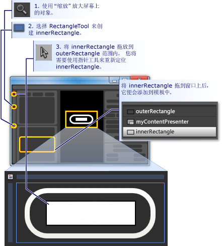  
  
5.  **将 ContentPresenter 移到顶部：** 此时，就可以文本"Button"才能不再可见。**Move ContentPresenter to the top:** At this point, it is possible that the text "Button" will not be visible any longer. 如果该条件，否则这是因为**innerRectangle**之上**myContentPresenter**。If this is so, this is because **innerRectangle** is on top of the **myContentPresenter**. 若要解决此问题，拖动**myContentPresenter**如下**innerRectangle**。To fix this, drag **myContentPresenter** below **innerRectangle**. 重新定位矩形并**myContentPresenter** ，看起来像下面。Reposition rectangles and **myContentPresenter** to look similar to below.  
  
    > [!NOTE]
    >  或者，您可以定位**myContentPresenter**通过右键单击它并按顶部**转发发送**。Alternatively, you can also position **myContentPresenter** on top by right-clicking it and pressing **Send Forward**.  
  
     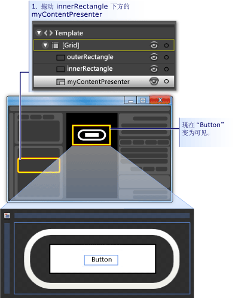  
  
6.  **更改 innerRectangle 的外观：** 设置<xref:System.Windows.Shapes.Rectangle.RadiusX%2A>， <xref:System.Windows.Shapes.Rectangle.RadiusY%2A>，和<xref:System.Windows.Shapes.Shape.StrokeThickness%2A>值为 20。**Change the look of innerRectangle:** Set the <xref:System.Windows.Shapes.Rectangle.RadiusX%2A>, <xref:System.Windows.Shapes.Rectangle.RadiusY%2A>, and <xref:System.Windows.Shapes.Shape.StrokeThickness%2A> values to 20. 此外，设置<xref:System.Windows.Shapes.Shape.Fill%2A>到后台，使用自定义表达式"{TemplateBinding 后台}"的模板) 并设置<xref:System.Windows.Shapes.Shape.Stroke%2A>"透明"。In addition, set the <xref:System.Windows.Shapes.Shape.Fill%2A> to the background of the template using the custom expression "{TemplateBinding Background}" ) and set <xref:System.Windows.Shapes.Shape.Stroke%2A> to "transparent". 请注意，设置<xref:System.Windows.Shapes.Shape.Fill%2A>并<xref:System.Windows.Shapes.Shape.Stroke%2A>的**innerRectangle**那些与相对**outerRectangle**。Notice that the settings for the <xref:System.Windows.Shapes.Shape.Fill%2A> and <xref:System.Windows.Shapes.Shape.Stroke%2A> of **innerRectangle** are the opposite of those for **outerRectangle**.  
  
     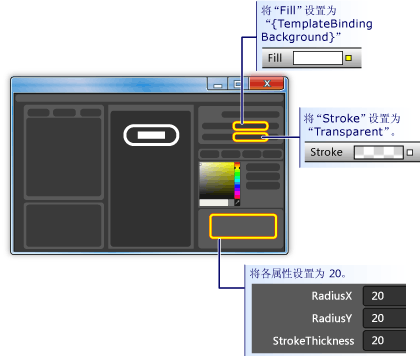  
  
7.  **在最前面添加玻璃层：** 自定义按钮的外观的最后一部分是在最前面添加玻璃层。**Add a glass layer on top:** The final piece of customizing the look of the button is to add a glass layer on top. 此平台层由第三个矩形构成。This glass layer consists of a third rectangle. 玻璃矩形玻璃将涵盖整个按钮，因为是在维度与类似**outerRectangle**。Because the glass will cover the entire button, the glass rectangle is similar in dimensions to the **outerRectangle**. 因此，创建矩形，从而只需一份**outerRectangle**。Therefore, create the rectangle by simply making a copy of the **outerRectangle**. 突出显示**outerRectangle** ，并使用 CTRL + C 和 CTRL + V 制作副本。Highlight **outerRectangle** and use CTRL+C and CTRL+V to make a copy. 命名此新矩形"glassCube"。Name this new rectangle "glassCube".  
  
8.  **如有必要，重新定位 glassCube:** 如果**glassCube**是尚不存在定位，以便它涵盖了整个按钮，将其拖至相应位置。**Reposition glassCube if necessary:** If **glassCube** is not already positioned so that it covers the entire button, drag it into position.  
  
9. **为 glassCube 提供比 outerRectangle 略有不同的形状：** 更改的属性**glassCube**。**Give glassCube a slightly different shape than outerRectangle:** Change the properties of **glassCube**. 首先，更改<xref:System.Windows.Shapes.Rectangle.RadiusX%2A>并<xref:System.Windows.Shapes.Rectangle.RadiusY%2A>属性设置为 10 和<xref:System.Windows.Shapes.Shape.StrokeThickness%2A>为 2。Start off by changing the <xref:System.Windows.Shapes.Rectangle.RadiusX%2A> and <xref:System.Windows.Shapes.Rectangle.RadiusY%2A> properties to 10 and the <xref:System.Windows.Shapes.Shape.StrokeThickness%2A> to 2.  
  
     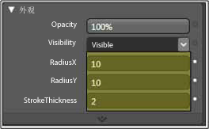  
  
10. **请看起来像玻璃 glassCube:** 设置<xref:System.Windows.Shapes.Shape.Fill%2A>到玻璃介绍通过使用线性渐变的 75%不透明和之间交替颜色白色和透明超过 6 大约均匀分布的时间间隔。**Make glassCube look like glass:** Set the <xref:System.Windows.Shapes.Shape.Fill%2A> to a glassy look by  using a linear gradient that is 75% opaque and alternates between the color White and Transparent over 6 approximately evenly spaced intervals. 这是要设置为梯度停止点：This is what to set the gradient stops to:  
  
    -   梯度停止点 1:Alpha 值为 75%的白色Gradient Stop 1: White with Alpha value of 75%  
  
    -   梯度停止点 2:透明Gradient Stop 2: Transparent  
  
    -   梯度停止点 3:Alpha 值为 75%的白色Gradient Stop 3: White with Alpha value of 75%  
  
    -   梯度停止点 4:透明Gradient Stop 4: Transparent  
  
    -   梯度停止点 5:Alpha 值为 75%的白色Gradient Stop 5: White with Alpha value of 75%  
  
    -   梯度停止点 6:透明Gradient Stop 6: Transparent  
  
     这将创建"波浪"玻璃外观。This creates a "wavy" glass look.  
  
     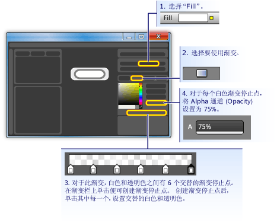  
  
11. **隐藏玻璃层：** 现在，您看到玻璃层如下所示，请转到**外观窗格**的**属性面板**和不透明度设置为 0%，以将其隐藏。**Hide the glass layer:** Now that you see what the glassy layer looks like, go into the **Appearance pane** of the **Properties panel** and set the Opacity to 0% to hide it. 在以下各部分，我们将使用属性触发器和事件来显示和操作玻璃层。In the sections ahead, we'll use property triggers and events to show and manipulate the glass layer.  
  
       
  
## 自定义按钮行为Customize the Button Behavior  
 此时，已通过编辑其模板自定义按钮的演示文稿，但该按钮不响应用户操作作为典型的按钮执行操作 （例如，更改在鼠标悬停时的外观，接收焦点，然后单击。）接下来两个过程演示如何构建类似这样到自定义按钮的行为。At this point, you have customized the presentation of the button by editing its template, but the button does not react to user actions as typical buttons do (for example, changing appearance upon mouse-over, receiving focus, and clicking.) The next two procedures show how to build behaviors like these into the custom button. 我们将使用简单的属性触发器启动，然后添加事件触发器和动画。We'll start with simple property triggers, and then add event triggers and animations.  
  
#### 若要设置属性触发器To set property triggers  
  
1.  **创建新的属性触发器：** 与**glassCube**处于选中状态，单击 **+ 属性**中**触发器**面板 （见图后面的下一步）。**Create a new property trigger:** With **glassCube** selected, click **+ Property** in the **Triggers** panel (see the figure that follows the next step). 这将创建具有默认属性触发器的属性触发器。This creates a property trigger with a default property trigger.  
  
2.  **请 IsMouseOver 由触发器使用的属性：** 将属性更改为<xref:System.Windows.UIElement.IsMouseOver%2A>。**Make IsMouseOver the property used by the trigger:** Change the property to <xref:System.Windows.UIElement.IsMouseOver%2A>. 这使属性触发器激活时<xref:System.Windows.UIElement.IsMouseOver%2A>属性是`true`（当用户指向使用鼠标按钮）。This makes the property trigger activate when the <xref:System.Windows.UIElement.IsMouseOver%2A> property is `true` (when the user points to the button with the mouse).  
  
     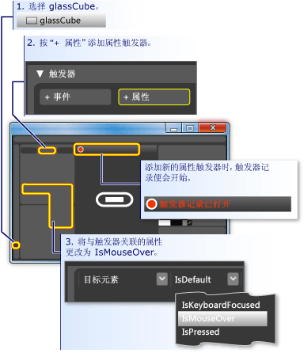  
  
3.  **IsMouseOver 触发 glasscube 的 100%的不透明度：** 请注意，**触发器录制已打开**（请参阅上图中）。**IsMouseOver triggers opacity of 100% for glassCube:** Notice that the **Trigger recording is on** (see the preceding figure). 这意味着，对的属性值进行任何更改**glassCube**录制已打开时将会发生时的操作<xref:System.Windows.UIElement.IsMouseOver%2A>是`true`。This means that any changes you make to the property values of **glassCube** while recording is on will become an action that takes place when <xref:System.Windows.UIElement.IsMouseOver%2A> is `true`. 录制时，更改<xref:System.Windows.UIElement.Opacity%2A>的**glassCube**为 100%。While recording, change the <xref:System.Windows.UIElement.Opacity%2A> of **glassCube** to 100%.  
  
     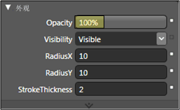  
  
     现在已创建你的第一个属性触发器。You have now created your first property trigger. 请注意，**触发器面板**编辑器的已记录<xref:System.Windows.UIElement.Opacity%2A>更改为 100%。Notice that the **Triggers panel** of the editor has recorded the <xref:System.Windows.UIElement.Opacity%2A> being changed to 100%.  
  
     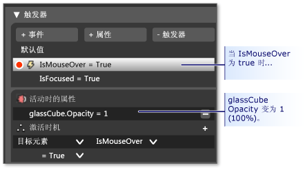  
  
     按 F5 以运行应用程序，并将鼠标指针移动和关闭按钮。Press F5 to run the application, and move the mouse pointer over and off the button. 应会看到玻璃层时显示鼠标悬停按钮并在指针离开时消失。You should see the glass layer appear when you mouse-over the button and disappear when the pointer leaves.  
  
4.  **IsMouseOver 触发器进行描边值更改：** 让我们将一些其他操作相关联<xref:System.Windows.UIElement.IsMouseOver%2A>触发器。**IsMouseOver triggers stroke value change:** Let's associate some other actions with the <xref:System.Windows.UIElement.IsMouseOver%2A> trigger. 尽管仍录制，切换您的选择从**glassCube**到**outerRectangle**。While recording continues, switch your selection from **glassCube** to **outerRectangle**. 然后设置<xref:System.Windows.Shapes.Shape.Stroke%2A>的**outerRectangle**到"{DynamicResource {x： 静态 SystemColors.HighlightBrushKey}}"的自定义表达式。Then set the <xref:System.Windows.Shapes.Shape.Stroke%2A> of **outerRectangle** to the custom expression of "{DynamicResource {x:Static SystemColors.HighlightBrushKey}}". 这将设置<xref:System.Windows.Shapes.Shape.Stroke%2A>到典型突出显示使用按钮的颜色。This sets the <xref:System.Windows.Shapes.Shape.Stroke%2A> to the typical highlight color used by buttons. 按 f5 键来查看当你将鼠标置于按钮上的效果。Press F5 to see the effect when you mouse over the button.  
  
       
  
5.  **IsMouseOver 触发模糊的文本：** 让我们将关联到一个更多操作<xref:System.Windows.UIElement.IsMouseOver%2A>属性触发器。**IsMouseOver triggers blurry text:** Let's associate one more action to the <xref:System.Windows.UIElement.IsMouseOver%2A> property trigger. 使玻璃出现其上方时显示有点模糊按钮的内容。Make the content of the button appear a little blurry when the glass appears over it. 若要执行此操作，我们可以应用模糊<xref:System.Windows.Media.Effects.BitmapEffect>到<xref:System.Windows.Controls.ContentPresenter>(**myContentPresenter**)。To do this, we can apply a blur <xref:System.Windows.Media.Effects.BitmapEffect> to the <xref:System.Windows.Controls.ContentPresenter> (**myContentPresenter**).  
  
     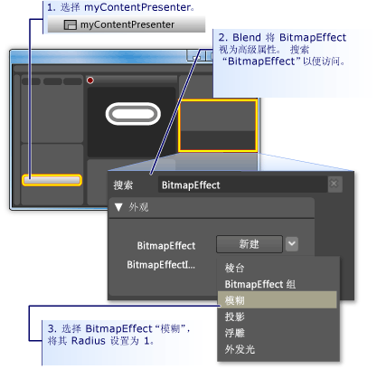  
  
    > [!NOTE]
    >  若要返回**属性面板**回其是你之前的搜索<xref:System.Windows.Media.Effects.BitmapEffect>，清除从文本**搜索框**。To return the **Properties panel** back to what it was before you did the search for <xref:System.Windows.Media.Effects.BitmapEffect>, clear the text from the **Search box**.  
  
     此时，我们使用了属性触发器与多个关联的操作时将鼠标指针进入和离开按钮区域创建突出显示行为。At this point, we have used a property trigger with several associated actions to create highlighting behavior for when the mouse pointer enters and leaves the button area. 另一个按钮的典型行为是突出显示具有焦点时 （如后单击它）。Another typical behavior for a button is to highlight when it has focus (as after it is clicked). 我们可以通过添加另一个属性触发器中添加此类行为<xref:System.Windows.UIElement.IsFocused%2A>属性。We can add such behavior by adding another property trigger for the <xref:System.Windows.UIElement.IsFocused%2A> property.  
  
6.  **创建 IsFocused 属性触发器：** 使用相同的过程<xref:System.Windows.UIElement.IsMouseOver%2A>（请参阅本部分中的第一步），创建另一个属性触发器<xref:System.Windows.UIElement.IsFocused%2A>属性。**Create property trigger for IsFocused:** Using the same procedure as for <xref:System.Windows.UIElement.IsMouseOver%2A> (see the first step of this section), create another property trigger for the <xref:System.Windows.UIElement.IsFocused%2A> property. 虽然**触发器录制已打开**，到触发器中添加下列操作：While **Trigger recording is on**, add the following actions to the trigger:  
  
    -   **glassCube**获取<xref:System.Windows.UIElement.Opacity%2A>的 100%。**glassCube** gets an <xref:System.Windows.UIElement.Opacity%2A> of 100%.  
  
    -   **outerRectangle**获取<xref:System.Windows.Shapes.Shape.Stroke%2A>"{DynamicResource {x： 静态 SystemColors.HighlightBrushKey}}"的自定义表达式值。**outerRectangle** gets a <xref:System.Windows.Shapes.Shape.Stroke%2A> custom expression value of "{DynamicResource {x:Static SystemColors.HighlightBrushKey}}".  
  
 作为本演练的最后一步，我们将向按钮添加动画。As the final step in this walkthrough, we will add animations to the button. 将由事件触发这些动画 — 具体而言，<xref:System.Windows.UIElement.MouseEnter>和<xref:System.Windows.Controls.Primitives.ButtonBase.Click>事件。These animations will be triggered by events—specifically, the <xref:System.Windows.UIElement.MouseEnter> and <xref:System.Windows.Controls.Primitives.ButtonBase.Click> events.  
  
#### 若要使用事件触发器和动画添加交互性To use event triggers and animations to add interactivity  
  
1.  **创建 MouseEnter 事件触发器：** 添加新的事件触发器，然后选择<xref:System.Windows.UIElement.MouseEnter>作为要在触发器中使用的事件。**Create a MouseEnter Event Trigger:** Add a new event trigger and select <xref:System.Windows.UIElement.MouseEnter> as the event to use in the trigger.  
  
     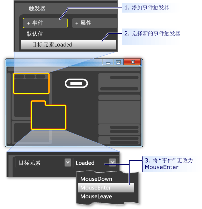  
  
2.  **创建动画时间线：** 接下来，将关联到动画时间线<xref:System.Windows.UIElement.MouseEnter>事件。**Create an animation timeline:** Next, associate an animation timeline to the <xref:System.Windows.UIElement.MouseEnter> event.  
  
     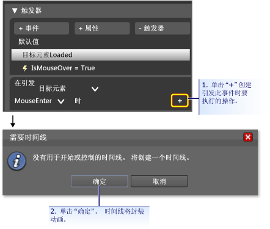  
  
     按后**确定**若要创建新的时间线**时间线面板**显示，"时间线录制已打开"设计面板中。After you press **OK** to create a new timeline, a **Timeline Panel** appears and "Timeline recording is on" is visible in the design panel. 这意味着我们可以开始 （进行动画处理属性更改） 在时间线中记录属性更改。This means we can start recording property changes in the timeline (animate property changes).  
  
    > [!NOTE]
    >  您可能需要调整大小窗口和/或面板，以查看它们的显示。You may need to resize your window and/or panels to see the display.  
  
     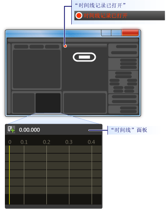  
  
3.  **创建关键帧：** 若要创建动画，请选择你想要进行动画处理，创建两个或多个关键帧在时间线，并在这些关键帧，设置您希望该动画之间进行内插的属性值的对象。**Create a keyframe:** To create an animation, select the object you want to animate, create two or more keyframes on the timeline, and for those keyframes, set the property values you want the animation to interpolate between. 下图将引导您完成创建关键帧。The following figure guides you through the creation of a keyframe.  
  
     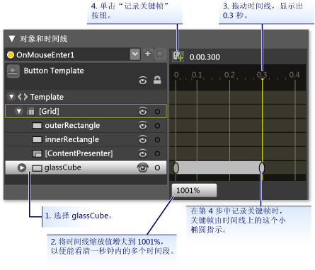  
  
4.  **此关键帧处收缩 glassCube:** 所选的第二个关键帧的大小收缩**glassCube**为使用其完整大小的 90%**大小转换**。**Shrink glassCube at this keyframe:** With the second keyframe selected, shrink the size of the **glassCube** to 90% of its full size using the **Size Transform**.  
  
     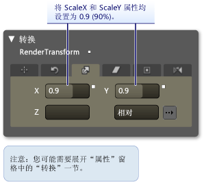  
  
     按 F5 运行该应用程序。Press F5 to run the application. 将鼠标指针移到按钮上方。Move the mouse pointer over the button. 请注意，玻璃层会缩小按钮的顶部。Notice that the glass layer shrinks on top of the button.  
  
5.  **创建另一个事件触发器，并将不同的动画与它相关联：** 让我们添加一个更多的动画。**Create another Event Trigger and associate a different animation with it:** Let's add one more animation. 使用你用于创建上一个事件触发器动画到类似的步骤：Use a similar procedure to what you used to create the previous event trigger animation:  
  
    1.  创建新的事件触发器使用<xref:System.Windows.Controls.Primitives.ButtonBase.Click>事件。Create a new event trigger using the <xref:System.Windows.Controls.Primitives.ButtonBase.Click> event.  
  
    2.  将相关联的新时间线<xref:System.Windows.Controls.Primitives.ButtonBase.Click>事件。Associate a new timeline with the <xref:System.Windows.Controls.Primitives.ButtonBase.Click> event.  
  
       
  
    1.  对于此时间线，创建两个关键帧，0.0 秒时的一个，另一个位于 0.3 秒之间。For this timeline, create two keyframes, one at 0.0 seconds and the second one at 0.3 seconds.  
  
    2.  在突出显示的 0.3 秒之间的关键帧，设置**旋转变换角度**到 360 度。With the keyframe at 0.3 seconds highlighted, set the **Rotate Transform Angle** to 360 degrees.  
  
     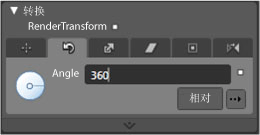  
  
    1.  按 F5 运行该应用程序。Press F5 to run the application. 单击按钮。Click the button. 请注意，在玻璃层会旋转一周。Notice that the glass layer spins around.  
  
## 结束语Conclusion  
 您已经完成了自定义的按钮。You have completed a customized button. 执行此过程通过已应用到应用程序中的所有按钮的按钮模板。You did this using a button template that was applied to all buttons in the application. 如果将模板编辑模式 （请参阅下图） 并创建多个按钮，会看到它们的外观和行为类似自定义按钮而不是像默认按钮。If you leave the template editing mode (see the following figure) and create more buttons, you will see that they look and behave like your custom button rather than like the default button.  
  
 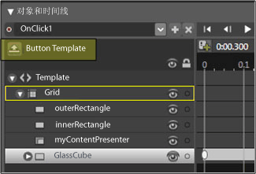  
  
 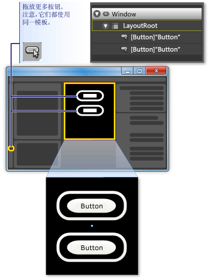  
  
 按 F5 运行该应用程序。Press F5 to run the application. 单击的按钮，并请注意，所有的行为方式相同。Click the buttons and notice how they all behave the same.  
  
 请记住，虽然您已自定义模板，您设置<xref:System.Windows.Shapes.Shape.Fill%2A>的属性**innerRectangle**并且<xref:System.Windows.Shapes.Shape.Stroke%2A>属性**outerRectangle**到模板背景 （{TemplateBinding 后台}）。Remember that while you were customizing the template, you set the <xref:System.Windows.Shapes.Shape.Fill%2A> property of **innerRectangle** and the <xref:System.Windows.Shapes.Shape.Stroke%2A> property **outerRectangle** to the template background ({TemplateBinding Background}). 正因为如此，当你设置的各个按钮的背景色时您设置的背景将用于这些相应的属性。Because of this, when you set the background color of the individual buttons, the background you set will be used for those respective properties. 请尝试现在更改背景。Try changing the backgrounds now. 在下图中，使用不同的渐变效果。In the following figure, different gradients are used. 因此，尽管模板非常有用的控件类似按钮的整体自定义项，使用模板的控件可以仍可修改看起来彼此不同。Therefore, although a template is useful for overall customization of controls like button, controls with templates can still be modified to look different from each other.  
  
   
  
 总之，自定义按钮模板的过程中已了解如何执行以下操作在 Microsoft Expression Blend 中：In conclusion, in the process of customizing a button template you have learned how to do the following in Microsoft Expression Blend:  
  
-   自定义控件的外观。Customize the look of a control.  
  
-   设置属性触发器。Set property triggers. 属性触发器是非常有用，因为它们可以用于大多数对象，而不仅仅是控件。Property triggers are very useful because they can be used on most objects, not just controls.  
  
-   设置事件触发器。Set event triggers. 事件触发器是非常有用，因为它们可以用于大多数对象，而不仅仅是控件。Event triggers are very useful because they can be used on most objects, not just controls.  
  
-   创建动画。Create animations.  
  
-   杂项： 创建渐变添加 BitmapEffects，使用转换，并设置对象的基本属性。Miscellaneous: create gradients, add BitmapEffects, use transforms, and set basic properties of objects.  
  
## 请参阅See also
- [使用 XAML 创建按钮Create a Button by Using XAML](../../../../docs/framework/wpf/controls/walkthrough-create-a-button-by-using-xaml.md)
- [样式设置和模板化Styling and Templating](../../../../docs/framework/wpf/controls/styling-and-templating.md)
- [动画概述Animation Overview](../../../../docs/framework/wpf/graphics-multimedia/animation-overview.md)
- [使用纯色和渐变进行绘制概述Painting with Solid Colors and Gradients Overview](../../../../docs/framework/wpf/graphics-multimedia/painting-with-solid-colors-and-gradients-overview.md)
- [位图效果概述Bitmap Effects Overview](../../../../docs/framework/wpf/graphics-multimedia/bitmap-effects-overview.md)
