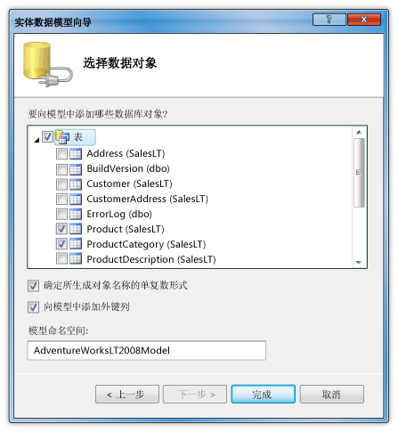
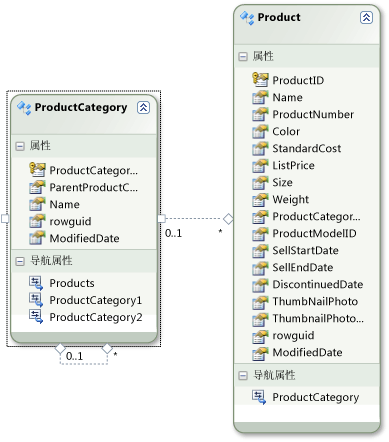
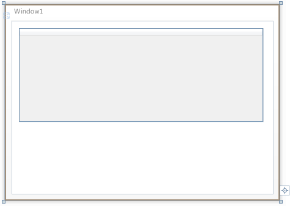

# 演练：DataGrid 控件中显示的 SQL Server 数据库中的数据

在本演练中，将从 SQL Server 数据库中检索数据和显示中的这些数据<xref:System.Windows.Controls.DataGrid>控件。 ADO.NET 实体框架用于创建表示数据，并使用 LINQ 编写从实体类检索指定的数据的查询的实体类。

## 系统必备

你需要以下组件来完成本演练：

- Visual Studio。

- 正在运行的 SQL Server 或 SQL Server Express 的 AdventureWorks 示例数据库附加到该实例的访问权限。 您可以下载 AdventureWorks 数据库从[GitHub](https://github.com/Microsoft/sql-server-samples/releases)。

## 创建实体类

1. 在 Visual Basic 或 C# 中，创建一个新的 WPF 应用程序项目并将其命名`DataGridSQLExample`。

2. 在解决方案资源管理器中右键单击你的项目，指向**外**，然后选择**新项**。

     添加新项对话框。

3. 在已安装的模板窗格中，选择**数据**，然后在模板列表中，选择**ADO.NET 实体数据模型**。

     

4. 将文件命名`AdventureWorksModel.edmx`，然后单击**添加**。

     此时将显示实体数据模型向导。

5. 在选择模型内容屏幕中，选择**EF 设计器从数据库**，然后单击**下一步**。

6. 在选择数据连接屏幕中，提供 AdventureWorksLT2008 数据库的连接。 有关详细信息，请参阅[选择数据连接对话框中](https://go.microsoft.com/fwlink/?LinkId=160190)。

    请确保名称是`AdventureWorksLT2008Entities`并且**将实体连接设置保存在 App.Config 作为**复选框已选中，然后依次**下一步**。

7. 在选择数据库对象屏幕中，展开表节点，并选择**产品**并**ProductCategory**表。

     您可以为生成实体类的所有表;但是，在此示例中您只能从检索数据这两个表。

     

8. 单击 **“完成”**。

     在实体设计器中显示 Product 和 ProductCategory 实体。

     

## 检索和呈现数据

1. 打开 MainWindow.xaml 文件。

2. 设置<xref:System.Windows.FrameworkElement.Width%2A>属性上的<xref:System.Windows.Window>到 450。

3. 在 XAML 编辑器中，添加以下<xref:System.Windows.Controls.DataGrid>标记之间`<Grid>`并`</Grid>`要添加的标记<xref:System.Windows.Controls.DataGrid>名为`dataGrid1`。

     [!code-xaml[DataGrid_SQL_EF_Walkthrough#3](~/samples/snippets/csharp/VS_Snippets_Wpf/DataGrid_SQL_EF_Walkthrough/CS/MainWindow.xaml#3)]

     

4. 选择 <xref:System.Windows.Window>。

5. 使用属性窗口或 XAML 编辑器中，创建的事件处理程序<xref:System.Windows.Window>名为`Window_Loaded`为<xref:System.Windows.FrameworkElement.Loaded>事件。 有关详细信息，请参阅[如何：创建一个简单的事件处理程序](https://docs.microsoft.com/previous-versions/visualstudio/visual-studio-2010/bb675300(v=vs.100))。

     下图显示 XAML mainwindow.xaml。

    > [!NOTE]
    > 如果使用的 Visual Basic 中，在 MainWindow.xaml 的第一行中，替换`x:Class="DataGridSQLExample.MainWindow"`与`x:Class="MainWindow"`。

     [!code-xaml[DataGrid_SQL_EF_Walkthrough#1](~/samples/snippets/csharp/VS_Snippets_Wpf/DataGrid_SQL_EF_Walkthrough/CS/MainWindow.xaml#1)]

6. 打开代码隐藏文件 （MainWindow.xaml.vb 或 MainWindow.xaml.cs） <xref:System.Windows.Window>。

7. 添加以下代码来联接表中检索特定的值并设置<xref:System.Windows.Controls.ItemsControl.ItemsSource%2A>属性的<xref:System.Windows.Controls.DataGrid>到查询的结果。

     [!code-csharp[DataGrid_SQL_EF_Walkthrough#2](~/samples/snippets/csharp/VS_Snippets_Wpf/DataGrid_SQL_EF_Walkthrough/CS/MainWindow.xaml.cs#2)]
     [!code-vb[DataGrid_SQL_EF_Walkthrough#2](~/samples/snippets/visualbasic/VS_Snippets_Wpf/DataGrid_SQL_EF_Walkthrough/VB/MainWindow.xaml.vb#2)]

8. 运行示例。

     应会看到<xref:System.Windows.Controls.DataGrid>显示数据。

     

## 请参阅

- <xref:System.Windows.Controls.DataGrid>
- [如何实现:开始使用 WPF 应用程序中的实体框架？](https://go.microsoft.com/fwlink/?LinkId=159868)
