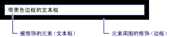

# WPF 内容模型WPF Content Model
[!INCLUDE[TLA#tla_winclient](../../../../includes/tlasharptla-winclient-md.md)] 是一个演示平台，提供了许多控件和类似控件的类型，主要用于显示不同类型的内容。is a presentation platform that provides many controls and control-like types whose primary purpose is to display different types of content. 若要确定所要使用的控件或要从其派生的控件，应该了解特定控件可以最佳效果显示的对象类型。To determine which control to use or which control to derive from, you should understand the kinds of objects a particular control can best display.  
  
 本主题概述了适用于 [!INCLUDE[TLA2#tla_winclient](../../../../includes/tla2sharptla-winclient-md.md)] 控件和类似控件的类型的内容模型。This topic summarizes the content model for [!INCLUDE[TLA2#tla_winclient](../../../../includes/tla2sharptla-winclient-md.md)] control and control-like types. 内容模型描述可在控件中使用的内容。The content model describes what content can be used in a control. 本主题还列出了每个内容模型的内容属性。This topic also lists the content properties for each content model. 内容属性是一种用于存储对象内容的属性。A content property is a property that is used to store the content of the object.  
  
 
  
   
## 包含任意内容的类Classes That Contain Arbitrary Content  
 某些控件可以包含的任何类型，如字符串、 对象<xref:System.DateTime>对象，或<xref:System.Windows.UIElement>，它是其他项的容器。Some controls can contain an object of any type, such as a string, a <xref:System.DateTime> object, or a <xref:System.Windows.UIElement> that is a container for additional items. 例如，<xref:System.Windows.Controls.Button>可以包含图像和一些文本，或<xref:System.Windows.Controls.CheckBox>可以包含的值<xref:System.DateTime.Now%2A?displayProperty=nameWithType>。For example, a <xref:System.Windows.Controls.Button> can contain an image and some text; or a <xref:System.Windows.Controls.CheckBox> can contain the value of <xref:System.DateTime.Now%2A?displayProperty=nameWithType>.  
  
 [!INCLUDE[TLA2#tla_winclient](../../../../includes/tla2sharptla-winclient-md.md)] 有四个可包含任意内容的类。has four classes that can contain arbitrary content. 下表列出了继承的类<xref:System.Windows.Controls.Control>。The following table lists the classes, which inherit from <xref:System.Windows.Controls.Control>.  
  
|包含任意内容的类Class that contains arbitrary content|内容Content|  
|-------------------------------------------|-------------|  
|<xref:System.Windows.Controls.ContentControl>|一个任意对象。A single arbitrary object.|  
|<xref:System.Windows.Controls.HeaderedContentControl>|一个标头和一个项（两者都是任意对象）。A header and a single item, both of which are arbitrary objects.|  
|<xref:System.Windows.Controls.ItemsControl>|一个任意对象集合。A collection of arbitrary objects.|  
|<xref:System.Windows.Controls.HeaderedItemsControl>|一个标头和一个项集合（全部都是任意对象）。A header and a collection of items, all of which are arbitrary objects.|  
  
 继承自这些类的控件可以包含相同类型的内容，并可以采用相同方式处理该内容。Controls that inherit from these classes can contain the same type of content and treat the content in the same way. 下图显示了来自每个内容模型包含图像和一些文本的控件：The following illustration shows one control from each content model that contains an image and some text:  
  
   
  
### 包含一个任意对象的控件Controls That Contain a Single Arbitrary Object  
 <xref:System.Windows.Controls.ContentControl>类包含一段任意内容。The <xref:System.Windows.Controls.ContentControl> class contains a single piece of arbitrary content. 它的内容属性是<xref:System.Windows.Controls.ContentControl.Content%2A>。Its content property is <xref:System.Windows.Controls.ContentControl.Content%2A>. 以下控件继承自<xref:System.Windows.Controls.ContentControl>并使用其内容模型：The following controls inherit from <xref:System.Windows.Controls.ContentControl> and use its content model:  
  
-   <xref:System.Windows.Controls.Button>  
  
-   <xref:System.Windows.Controls.Primitives.ButtonBase>  
  
-   <xref:System.Windows.Controls.CheckBox>  
  
-   <xref:System.Windows.Controls.ComboBoxItem>  
  
-   <xref:System.Windows.Controls.ContentControl>  
  
-   <xref:System.Windows.Controls.Frame>  
  
-   <xref:System.Windows.Controls.GridViewColumnHeader>  
  
-   <xref:System.Windows.Controls.GroupItem>  
  
-   <xref:System.Windows.Controls.Label>  
  
-   <xref:System.Windows.Controls.ListBoxItem>  
  
-   <xref:System.Windows.Controls.ListViewItem>  
  
-   <xref:System.Windows.Navigation.NavigationWindow>  
  
-   <xref:System.Windows.Controls.RadioButton>  
  
-   <xref:System.Windows.Controls.Primitives.RepeatButton>  
  
-   <xref:System.Windows.Controls.ScrollViewer>  
  
-   <xref:System.Windows.Controls.Primitives.StatusBarItem>  
  
-   <xref:System.Windows.Controls.Primitives.ToggleButton>  
  
-   <xref:System.Windows.Controls.ToolTip>  
  
-   <xref:System.Windows.Controls.UserControl>  
  
-   <xref:System.Windows.Window>  
  
 下图显示四个按钮，其<xref:System.Windows.Controls.ContentControl.Content%2A>设置为字符串，<xref:System.DateTime>对象， <xref:System.Windows.Shapes.Rectangle>，和一个<xref:System.Windows.Controls.Panel>，其中包含<xref:System.Windows.Shapes.Ellipse>和<xref:System.Windows.Controls.TextBlock>:The following illustration shows four buttons whose <xref:System.Windows.Controls.ContentControl.Content%2A> is set to a string, a <xref:System.DateTime> object, a <xref:System.Windows.Shapes.Rectangle>, and a <xref:System.Windows.Controls.Panel> that contains an <xref:System.Windows.Shapes.Ellipse> and a <xref:System.Windows.Controls.TextBlock>:  
  
   
  
 有关如何设置的示例<xref:System.Windows.Controls.ContentControl.Content%2A>属性，请参阅<xref:System.Windows.Controls.ContentControl>。For an example of how to set the <xref:System.Windows.Controls.ContentControl.Content%2A> property, see <xref:System.Windows.Controls.ContentControl>.  
  
### 包含一个标头和一个任意对象的控件Controls That Contain a Header and a Single Arbitrary Object  
 <xref:System.Windows.Controls.HeaderedContentControl>类继承自<xref:System.Windows.Controls.ContentControl>并显示一个标头的内容。The <xref:System.Windows.Controls.HeaderedContentControl> class inherits from <xref:System.Windows.Controls.ContentControl> and displays content with a header. 它将继承的 content 属性<xref:System.Windows.Controls.ContentControl.Content%2A>，从<xref:System.Windows.Controls.ContentControl>，并定义<xref:System.Windows.Controls.HeaderedContentControl.Header%2A>的类型的属性<xref:System.Object>; 因此，都可以为任意对象。It inherits the content property, <xref:System.Windows.Controls.ContentControl.Content%2A>, from <xref:System.Windows.Controls.ContentControl> and defines the <xref:System.Windows.Controls.HeaderedContentControl.Header%2A> property that is of type <xref:System.Object>; therefore, both can be an arbitrary object.  
  
 以下控件继承自<xref:System.Windows.Controls.HeaderedContentControl>并使用其内容模型：The following controls inherit from <xref:System.Windows.Controls.HeaderedContentControl> and use its content model:  
  
-   <xref:System.Windows.Controls.Expander>  
  
-   <xref:System.Windows.Controls.GroupBox>  
  
-   <xref:System.Windows.Controls.TabItem>  
  
 下图显示了两个<xref:System.Windows.Controls.TabItem>对象。The following illustration shows two <xref:System.Windows.Controls.TabItem> objects. 第一个<xref:System.Windows.Controls.TabItem>已<xref:System.Windows.UIElement>对象作为<xref:System.Windows.Controls.HeaderedContentControl.Header%2A>和<xref:System.Windows.Controls.ContentControl.Content%2A>。The first <xref:System.Windows.Controls.TabItem> has <xref:System.Windows.UIElement> objects as the <xref:System.Windows.Controls.HeaderedContentControl.Header%2A> and the <xref:System.Windows.Controls.ContentControl.Content%2A>. <xref:System.Windows.Controls.HeaderedContentControl.Header%2A>设置为<xref:System.Windows.Controls.StackPanel>，其中包含<xref:System.Windows.Shapes.Ellipse>和一个<xref:System.Windows.Controls.TextBlock>。The <xref:System.Windows.Controls.HeaderedContentControl.Header%2A> is set to a <xref:System.Windows.Controls.StackPanel> that contains an <xref:System.Windows.Shapes.Ellipse> and a <xref:System.Windows.Controls.TextBlock>. <xref:System.Windows.Controls.ContentControl.Content%2A>设置为<xref:System.Windows.Controls.StackPanel>，其中包含<xref:System.Windows.Controls.TextBlock>和一个<xref:System.Windows.Controls.Label>。The <xref:System.Windows.Controls.ContentControl.Content%2A> is set to a <xref:System.Windows.Controls.StackPanel> that contains a <xref:System.Windows.Controls.TextBlock> and a <xref:System.Windows.Controls.Label>. 第二个<xref:System.Windows.Controls.TabItem>具有一个字符串<xref:System.Windows.Controls.HeaderedContentControl.Header%2A>和一个<xref:System.Windows.Controls.TextBlock>中<xref:System.Windows.Controls.ContentControl.Content%2A>。The second <xref:System.Windows.Controls.TabItem> has a string in the <xref:System.Windows.Controls.HeaderedContentControl.Header%2A> and a <xref:System.Windows.Controls.TextBlock> in the <xref:System.Windows.Controls.ContentControl.Content%2A>.  
  
   
  
 有关如何创建的示例<xref:System.Windows.Controls.TabItem>对象，请参阅<xref:System.Windows.Controls.HeaderedContentControl>。For an example of how to create <xref:System.Windows.Controls.TabItem> objects, see <xref:System.Windows.Controls.HeaderedContentControl>.  
  
### 包含一个任意对象集合的控件Controls That Contain a Collection of Arbitrary Objects  
 <xref:System.Windows.Controls.ItemsControl>类继承自<xref:System.Windows.Controls.Control>，可以包含多个项，如字符串、 对象或其他元素。The <xref:System.Windows.Controls.ItemsControl> class inherits from <xref:System.Windows.Controls.Control> and can contain multiple items, such as strings, objects, or other elements. 其内容属性为<xref:System.Windows.Controls.ItemsControl.ItemsSource%2A>和<xref:System.Windows.Controls.ItemsControl.Items%2A>。Its content properties are <xref:System.Windows.Controls.ItemsControl.ItemsSource%2A> and <xref:System.Windows.Controls.ItemsControl.Items%2A>. <xref:System.Windows.Controls.ItemsControl.ItemsSource%2A> 通常用于填充<xref:System.Windows.Controls.ItemsControl>与数据收集。<xref:System.Windows.Controls.ItemsControl.ItemsSource%2A> is typically used to populate the <xref:System.Windows.Controls.ItemsControl> with a data collection. 如果您不想要使用集合来填充<xref:System.Windows.Controls.ItemsControl>，可以通过使用添加项<xref:System.Windows.Controls.ItemsControl.Items%2A>属性。If you do not want to use a collection to populate the <xref:System.Windows.Controls.ItemsControl>, you can add items by using the <xref:System.Windows.Controls.ItemsControl.Items%2A> property.  
  
 以下控件继承自<xref:System.Windows.Controls.ItemsControl>并使用其内容模型：The following controls inherit from <xref:System.Windows.Controls.ItemsControl> and use its content model:  
  
-   <xref:System.Windows.Controls.Menu>  
  
-   <xref:System.Windows.Controls.Primitives.MenuBase>  
  
-   <xref:System.Windows.Controls.ContextMenu>  
  
-   <xref:System.Windows.Controls.ComboBox>  
  
-   <xref:System.Windows.Controls.ItemsControl>  
  
-   <xref:System.Windows.Controls.ListBox>  
  
-   <xref:System.Windows.Controls.ListView>  
  
-   <xref:System.Windows.Controls.TabControl>  
  
-   <xref:System.Windows.Controls.TreeView>  
  
-   <xref:System.Windows.Controls.Primitives.Selector>  
  
-   <xref:System.Windows.Controls.Primitives.StatusBar>  
  
 下图显示<xref:System.Windows.Controls.ListBox>，其中包含这些类型的项：The following illustration shows a <xref:System.Windows.Controls.ListBox> that contains these types of items:  
  
-   一个字符串。A string.  
  
-   一个 <xref:System.DateTime> 对象。A <xref:System.DateTime> object.  
  
-   <xref:System.Windows.UIElement>。A <xref:System.Windows.UIElement>.  
  
-   一个<xref:System.Windows.Controls.Panel>，其中包含<xref:System.Windows.Shapes.Ellipse>和一个<xref:System.Windows.Controls.TextBlock>。A <xref:System.Windows.Controls.Panel> that contains an <xref:System.Windows.Shapes.Ellipse> and a <xref:System.Windows.Controls.TextBlock>.  
  
   
  
### 包含一个标头和一个任意对象集合的控件Controls That Contain a Header and a Collection of Arbitrary Objects  
 <xref:System.Windows.Controls.HeaderedItemsControl>类继承自<xref:System.Windows.Controls.ItemsControl>，可以包含多个项，如字符串、 对象或其他元素和一个标头。The <xref:System.Windows.Controls.HeaderedItemsControl> class inherits from <xref:System.Windows.Controls.ItemsControl> and can contain multiple items, such as strings, objects, or other elements, and a header. 它将继承<xref:System.Windows.Controls.ItemsControl>内容属性， <xref:System.Windows.Controls.ItemsControl.ItemsSource%2A>，并<xref:System.Windows.Controls.ItemsControl.Items%2A>，它定义<xref:System.Windows.Controls.HeaderedItemsControl.Header%2A>可以是任意对象的属性。It inherits the <xref:System.Windows.Controls.ItemsControl> content properties, <xref:System.Windows.Controls.ItemsControl.ItemsSource%2A>, and <xref:System.Windows.Controls.ItemsControl.Items%2A>, and it defines the <xref:System.Windows.Controls.HeaderedItemsControl.Header%2A> property that can be an arbitrary object.  
  
 以下控件继承自<xref:System.Windows.Controls.HeaderedItemsControl>并使用其内容模型：The following controls inherit from <xref:System.Windows.Controls.HeaderedItemsControl> and use its content model:  
  
-   <xref:System.Windows.Controls.MenuItem>  
  
-   <xref:System.Windows.Controls.ToolBar>  
  
-   <xref:System.Windows.Controls.TreeViewItem>  
  
   
## 包含一个 UIElement 对象集合的类Classes That Contain a Collection of UIElement Objects  
 <xref:System.Windows.Controls.Panel>类进行定位并排列子<xref:System.Windows.UIElement>对象。The <xref:System.Windows.Controls.Panel> class positions and arranges child <xref:System.Windows.UIElement> objects. 它的内容属性是<xref:System.Windows.Controls.Panel.Children%2A>。Its content property is <xref:System.Windows.Controls.Panel.Children%2A>.  
  
 以下类继承自<xref:System.Windows.Controls.Panel>类并使用其内容模型：The following classes inherit from the <xref:System.Windows.Controls.Panel> class and use its content model:  
  
-   <xref:System.Windows.Controls.Canvas>  
  
-   <xref:System.Windows.Controls.DockPanel>  
  
-   <xref:System.Windows.Controls.Grid>  
  
-   <xref:System.Windows.Controls.Primitives.TabPanel>  
  
-   <xref:System.Windows.Controls.Primitives.ToolBarOverflowPanel>  
  
-   <xref:System.Windows.Controls.Primitives.ToolBarPanel>  
  
-   <xref:System.Windows.Controls.Primitives.UniformGrid>  
  
-   <xref:System.Windows.Controls.StackPanel>  
  
-   <xref:System.Windows.Controls.VirtualizingPanel>  
  
-   <xref:System.Windows.Controls.VirtualizingStackPanel>  
  
-   <xref:System.Windows.Controls.WrapPanel>  
  
 有关详细信息，请参阅[面板概述](panels-overview.md)。For more information, see [Panels Overview](panels-overview.md).  
  
   
## 影响 UIElement 外观的类Classes That Affect the Appearance of a UIElement  
 <xref:System.Windows.Controls.Decorator>类应用视觉效果上或周围单个子<xref:System.Windows.UIElement>。The <xref:System.Windows.Controls.Decorator> class applies visual effects onto or around a single child <xref:System.Windows.UIElement>. 它的内容属性是<xref:System.Windows.Controls.Decorator.Child%2A>。Its content property is <xref:System.Windows.Controls.Decorator.Child%2A>. 以下类继承自<xref:System.Windows.Controls.Decorator>并使用其内容模型：The following classes inherit from <xref:System.Windows.Controls.Decorator> and use its content model:  
  
-   <xref:System.Windows.Documents.AdornerDecorator>  
  
-   <xref:System.Windows.Controls.Border>  
  
-   <xref:System.Windows.Controls.Primitives.BulletDecorator>  
  
-   <xref:Microsoft.Windows.Themes.ButtonChrome>  
  
-   <xref:Microsoft.Windows.Themes.ClassicBorderDecorator>  
  
-   <xref:System.Windows.Controls.InkPresenter>  
  
-   <xref:Microsoft.Windows.Themes.ListBoxChrome>  
  
-   <xref:Microsoft.Windows.Themes.SystemDropShadowChrome>  
  
-   <xref:System.Windows.Controls.Viewbox>  
  
 如下图所示<xref:System.Windows.Controls.TextBox>具有 （即装饰有）<xref:System.Windows.Controls.Border>围绕它。The following illustration shows a <xref:System.Windows.Controls.TextBox> that has (is decorated with) a <xref:System.Windows.Controls.Border> around it.  
  
   
具有边框的 TextBlockTextBlock that has a Border  
  
   
## 提供 UIElement 相关视觉反馈的类Classes That Provide Visual Feedback About a UIElement  
 <xref:System.Windows.Documents.Adorner>类向用户提供可视化提示。The <xref:System.Windows.Documents.Adorner> class provides visual cues to a user. 例如，使用<xref:System.Windows.Documents.Adorner>向元素添加功能句柄或提供有关控件的状态信息。For example, use an <xref:System.Windows.Documents.Adorner> to add functional handles to elements or provide state information about a control. <xref:System.Windows.Documents.Adorner>类提供一个框架，以便您可以创建自己的装饰器。The <xref:System.Windows.Documents.Adorner> class provides a framework so that you can create your own adorners. [!INCLUDE[TLA2#tla_winclient](../../../../includes/tla2sharptla-winclient-md.md)] 不会提供任何实现的装饰器。does not provide any implemented adorners. 有关详细信息，请参阅[装饰器概述](adorners-overview.md)。For more information, see [Adorners Overview](adorners-overview.md).  
  
   
## 可让用户输入文本的类Classes That Enable Users to Enter Text  
 WPF 提供了三个可让用户输入文本的主要控件。WPF provides three primary controls that enable users to enter text. 每个控件都以不同方式显示文本。Each control displays the text differently. 下表列出了这三个与文本相关的控件、显示文本时的功能以及包含控件文本的属性。The following table lists these three text-related controls, their capabilities when they display text, and their properties that contain the control's text.  
  
|控件Control|文本显示方式Text is displayed as|内容属性Content property|  
|-------------|--------------------------|----------------------|  
|<xref:System.Windows.Controls.TextBox>|纯文本Plain text|<xref:System.Windows.Controls.TextBox.Text%2A>|  
|<xref:System.Windows.Controls.RichTextBox>|带格式文本Formatted text|<xref:System.Windows.Controls.RichTextBox.Document%2A>|  
|<xref:System.Windows.Controls.PasswordBox>|隐藏文本（字符已屏蔽）Hidden text (characters are masked)|<xref:System.Windows.Controls.PasswordBox.Password%2A>|  
  
   
## 显示文本的类Classes That Display Your Text  
 某些类可用于显示纯文本或带格式文本。Several classes can be used to display plain or formatted text. 可以使用<xref:System.Windows.Controls.TextBlock>显示少量文本。You can use <xref:System.Windows.Controls.TextBlock> to display small amounts of text. 如果你想要显示大量文本，使用<xref:System.Windows.Controls.FlowDocumentReader>， <xref:System.Windows.Controls.FlowDocumentPageViewer>，或<xref:System.Windows.Controls.FlowDocumentScrollViewer>控件。If you want to display large amounts of text, use the <xref:System.Windows.Controls.FlowDocumentReader>, <xref:System.Windows.Controls.FlowDocumentPageViewer>, or <xref:System.Windows.Controls.FlowDocumentScrollViewer> controls.  
  
 <xref:System.Windows.Controls.TextBlock>具有两个内容属性：<xref:System.Windows.Controls.TextBlock.Text%2A>和<xref:System.Windows.Controls.TextBlock.Inlines%2A>。The <xref:System.Windows.Controls.TextBlock> has two content properties: <xref:System.Windows.Controls.TextBlock.Text%2A> and <xref:System.Windows.Controls.TextBlock.Inlines%2A>. 如果想要显示使用一致格式的文本<xref:System.Windows.Controls.TextBlock.Text%2A>属性通常是最佳选择。When you want to display text that uses consistent formatting, the <xref:System.Windows.Controls.TextBlock.Text%2A> property is often your best choice. 如果你打算使用不同的格式设置在整个文本，使用<xref:System.Windows.Controls.TextBlock.Inlines%2A>属性。If you plan to use different formatting throughout the text, use the <xref:System.Windows.Controls.TextBlock.Inlines%2A> property. <xref:System.Windows.Controls.TextBlock.Inlines%2A>属性是一系列<xref:System.Windows.Documents.Inline>对象，指定如何设置文本的格式。The <xref:System.Windows.Controls.TextBlock.Inlines%2A> property is a collection of <xref:System.Windows.Documents.Inline> objects, which specify how to format text.  
  
 下表列出的内容属性<xref:System.Windows.Controls.FlowDocumentReader>， <xref:System.Windows.Controls.FlowDocumentPageViewer>，和<xref:System.Windows.Controls.FlowDocumentScrollViewer>类。The following table lists the content property for <xref:System.Windows.Controls.FlowDocumentReader>, <xref:System.Windows.Controls.FlowDocumentPageViewer>, and <xref:System.Windows.Controls.FlowDocumentScrollViewer> classes.  
  
|控件Control|内容属性Content property|内容属性类型Content property type|  
|-------------|----------------------|---------------------------|  
|<xref:System.Windows.Controls.FlowDocumentPageViewer>|DocumentDocument|<xref:System.Windows.Documents.IDocumentPaginatorSource>|  
|<xref:System.Windows.Controls.FlowDocumentReader>|DocumentDocument|<xref:System.Windows.Documents.FlowDocument>|  
|<xref:System.Windows.Controls.FlowDocumentScrollViewer>|DocumentDocument|<xref:System.Windows.Documents.FlowDocument>|  
  
 <xref:System.Windows.Documents.FlowDocument>实现<xref:System.Windows.Documents.IDocumentPaginatorSource>接口; 因此，所有三个类，可能需要<xref:System.Windows.Documents.FlowDocument>作为内容。The <xref:System.Windows.Documents.FlowDocument> implements the <xref:System.Windows.Documents.IDocumentPaginatorSource> interface; therefore, all three classes can take a <xref:System.Windows.Documents.FlowDocument> as content.  
  
   
## 设置文本格式的类Classes That Format Your Text  
 <xref:System.Windows.Documents.TextElement> 和及其相关的类可用于设置文本的格式。<xref:System.Windows.Documents.TextElement> and its related classes allow you to format text. <xref:System.Windows.Documents.TextElement> 对象包含和中的文本格式<xref:System.Windows.Controls.TextBlock>和<xref:System.Windows.Documents.FlowDocument>对象。<xref:System.Windows.Documents.TextElement> objects contain and format text in <xref:System.Windows.Controls.TextBlock> and <xref:System.Windows.Documents.FlowDocument> objects. 两种主要类型的<xref:System.Windows.Documents.TextElement>对象是<xref:System.Windows.Documents.Block>元素和<xref:System.Windows.Documents.Inline>元素。The two primary types of <xref:System.Windows.Documents.TextElement> objects are <xref:System.Windows.Documents.Block> elements and <xref:System.Windows.Documents.Inline> elements. 一个<xref:System.Windows.Documents.Block>元素表示的文本，例如段落或列表的块。A <xref:System.Windows.Documents.Block> element represents a block of text, such as a paragraph or list. <xref:System.Windows.Documents.Inline>元素表示块中的文本的一部分。An <xref:System.Windows.Documents.Inline> element represents a portion of text in a block. 许多<xref:System.Windows.Documents.Inline>类指定应用于中文本的格式。Many <xref:System.Windows.Documents.Inline> classes specify formatting for the text to which they are applied. 每个<xref:System.Windows.Documents.TextElement>具有其自己的内容模型。Each <xref:System.Windows.Documents.TextElement> has its own content model. 有关详细信息，请参阅 [TextElement 内容模型概述](../advanced/textelement-content-model-overview.md)。For more information, see the [TextElement Content Model Overview](../advanced/textelement-content-model-overview.md).  
  
## 请参阅See also
- [高级Advanced](../advanced/index.md)
