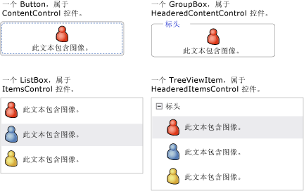
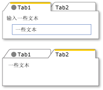
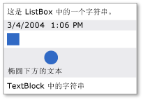

# WPF 内容模型
[!INCLUDE[TLA#tla_winclient](../../../../includes/tlasharptla-winclient-md.md)] 是一个演示平台，提供了许多主要用于显示不同类型内容的控件和类似于控件的类型。  若要确定所要使用的控件或要从其派生的控件，则应了解特定控件可以最佳效果显示的对象类型。  
  
 本主题汇总了 [!INCLUDE[TLA2#tla_winclient](../../../../includes/tla2sharptla-winclient-md.md)] 控件和类似于控件的类型的内容模型。  内容模型描述可在控件中使用的内容。本主题还列出了每个内容模型的内容属性。  内容属性是用于存储对象内容的属性。  
  
   
  
   
## 包含任意内容的类  
 某些控件可以包含任何类型的对象，例如字符串、<xref:System.DateTime> 对象或作为其他项的容器的 <xref:System.Windows.UIElement>。  例如，<xref:System.Windows.Controls.Button> 可以包含一幅图像和一些文本；<xref:System.Windows.Controls.CheckBox> 可以包含 <xref:System.DateTime.Now%2A?displayProperty=fullName> 的值。  
  
 [!INCLUDE[TLA2#tla_winclient](../../../../includes/tla2sharptla-winclient-md.md)] 有四个可以包含任意内容的类。  下表列出了从 <xref:System.Windows.Controls.Control> 继承的类。  
  
|包含任意内容的类|Content|  
|--------------|-------------|  
|<xref:System.Windows.Controls.ContentControl>|一个任意对象。|  
|<xref:System.Windows.Controls.HeaderedContentControl>|一个标头和一个项，二者都是任意对象。|  
|<xref:System.Windows.Controls.ItemsControl>|任意对象的集合。|  
|<xref:System.Windows.Controls.HeaderedItemsControl>|一个标头和一组项，它们都是任意对象。|  
  
 从这些类继承的控件可以包含相同类型的内容，并且可以相同的方式处理这些内容。  下图显示了来自每个内容模型的、包含一个图像和一些文本的控件。  
  
   
  
### 包含一个任意对象的控件  
 <xref:System.Windows.Controls.ContentControl> 类包含一段任意内容。  其内容属性为 <xref:System.Windows.Controls.ContentControl.Content%2A>。  以下控件继承自 <xref:System.Windows.Controls.ContentControl> 并使用其内容模型：  
  
-   <xref:System.Windows.Controls.Button>  
  
-   <xref:System.Windows.Controls.Primitives.ButtonBase>  
  
-   <xref:System.Windows.Controls.CheckBox>  
  
-   <xref:System.Windows.Controls.ComboBoxItem>  
  
-   <xref:System.Windows.Controls.ContentControl>  
  
-   <xref:System.Windows.Controls.Frame>  
  
-   <xref:System.Windows.Controls.GridViewColumnHeader>  
  
-   <xref:System.Windows.Controls.GroupItem>  
  
-   <xref:System.Windows.Controls.Label>  
  
-   <xref:System.Windows.Controls.ListBoxItem>  
  
-   <xref:System.Windows.Controls.ListViewItem>  
  
-   <xref:System.Windows.Navigation.NavigationWindow>  
  
-   <xref:System.Windows.Controls.RadioButton>  
  
-   <xref:System.Windows.Controls.Primitives.RepeatButton>  
  
-   <xref:System.Windows.Controls.ScrollViewer>  
  
-   <xref:System.Windows.Controls.Primitives.StatusBarItem>  
  
-   <xref:System.Windows.Controls.Primitives.ToggleButton>  
  
-   <xref:System.Windows.Controls.ToolTip>  
  
-   <xref:System.Windows.Controls.UserControl>  
  
-   <xref:System.Windows.Window>  
  
 下图显示了四个按钮，其 <xref:System.Windows.Controls.ContentControl.Content%2A> 分别设置为一个字符串、一个 <xref:System.DateTime> 对象、一个 <xref:System.Windows.Shapes.Rectangle> 以及一个包含 <xref:System.Windows.Shapes.Ellipse> 和 <xref:System.Windows.Controls.TextBlock> 的 <xref:System.Windows.Controls.Panel>。  
  
   
具有不同类型内容的四个按钮  
  
 有关如何设置 <xref:System.Windows.Controls.ContentControl.Content%2A> 属性的示例，请参见 <xref:System.Windows.Controls.ContentControl>。  
  
### 包含一个标头和一个任意对象的控件  
 <xref:System.Windows.Controls.HeaderedContentControl> 类继承自 <xref:System.Windows.Controls.ContentControl> 并显示内容和一个标头。  它从 <xref:System.Windows.Controls.ContentControl> 继承内容属性 <xref:System.Windows.Controls.ContentControl.Content%2A>，并定义类型为 <xref:System.Object> 的 <xref:System.Windows.Controls.HeaderedContentControl.Header%2A> 属性；因此，这两者都可以是任意对象。  
  
 以下控件继承自 <xref:System.Windows.Controls.HeaderedContentControl> 并使用其内容模型：  
  
-   <xref:System.Windows.Controls.Expander>  
  
-   <xref:System.Windows.Controls.GroupBox>  
  
-   <xref:System.Windows.Controls.TabItem>  
  
 下图显示了两个 <xref:System.Windows.Controls.TabItem> 对象。  第一个 <xref:System.Windows.Controls.TabItem> 具有作为 <xref:System.Windows.Controls.HeaderedContentControl.Header%2A> 和 <xref:System.Windows.Controls.ContentControl.Content%2A> 的 <xref:System.Windows.UIElement> 对象。  <xref:System.Windows.Controls.HeaderedContentControl.Header%2A> 设置为包含 <xref:System.Windows.Shapes.Ellipse> 和 <xref:System.Windows.Controls.TextBlock> 的 <xref:System.Windows.Controls.StackPanel>。  <xref:System.Windows.Controls.ContentControl.Content%2A> 设置为包含 <xref:System.Windows.Controls.TextBlock> 和 <xref:System.Windows.Controls.Label> 的 <xref:System.Windows.Controls.StackPanel>。  第二个 <xref:System.Windows.Controls.TabItem> 的 <xref:System.Windows.Controls.HeaderedContentControl.Header%2A> 中有一个字符串，而 <xref:System.Windows.Controls.ContentControl.Content%2A> 中有一个 <xref:System.Windows.Controls.TextBlock>。  
  
   
Header 属性中使用不同类型的 TabControl  
  
 有关如何创建 <xref:System.Windows.Controls.TabItem> 对象的示例，请参见 <xref:System.Windows.Controls.HeaderedContentControl>。  
  
### 包含任意对象集合的控件  
 <xref:System.Windows.Controls.ItemsControl> 类继承自 <xref:System.Windows.Controls.Control>，并且可以包含多个项，例如字符串、对象或其他元素。  其内容属性为 <xref:System.Windows.Controls.ItemsControl.ItemsSource%2A> 和 <xref:System.Windows.Controls.ItemsControl.Items%2A>。  <xref:System.Windows.Controls.ItemsControl.ItemsSource%2A> 通常用于使用数据集合填充 <xref:System.Windows.Controls.ItemsControl>。  如果您不想使用集合填充 <xref:System.Windows.Controls.ItemsControl>，则可以使用 <xref:System.Windows.Controls.ItemsControl.Items%2A> 属性添加项。  
  
 以下控件继承自 <xref:System.Windows.Controls.ItemsControl> 并使用其内容模型：  
  
-   <xref:System.Windows.Controls.Menu>  
  
-   <xref:System.Windows.Controls.Primitives.MenuBase>  
  
-   <xref:System.Windows.Controls.ContextMenu>  
  
-   <xref:System.Windows.Controls.ComboBox>  
  
-   <xref:System.Windows.Controls.ItemsControl>  
  
-   <xref:System.Windows.Controls.ListBox>  
  
-   <xref:System.Windows.Controls.ListView>  
  
-   <xref:System.Windows.Controls.TabControl>  
  
-   <xref:System.Windows.Controls.TreeView>  
  
-   <xref:System.Windows.Controls.Primitives.Selector>  
  
-   <xref:System.Windows.Controls.Primitives.StatusBar>  
  
 下图显示了一个包含这些类型的项的 <xref:System.Windows.Controls.ListBox>：  
  
-   一个字符串。  
  
-   一个 <xref:System.DateTime> 对象。  
  
-   <xref:System.Windows.UIElement>。  
  
-   一个 <xref:System.Windows.Controls.Panel>，其中包含 <xref:System.Windows.Shapes.Ellipse> 和 <xref:System.Windows.Controls.TextBlock>。  
  
   
包含多个类型对象的 ListBox  
  
### 包含一个标头和一组任意对象的控件  
 <xref:System.Windows.Controls.HeaderedItemsControl> 类继承自 <xref:System.Windows.Controls.ItemsControl>，并且可以包含多个项，例如字符串、对象或其他元素和标头。  它继承 <xref:System.Windows.Controls.ItemsControl> 内容属性 <xref:System.Windows.Controls.ItemsControl.ItemsSource%2A> 和 <xref:System.Windows.Controls.ItemsControl.Items%2A>，它还定义可以为任意对象的 <xref:System.Windows.Controls.HeaderedItemsControl.Header%2A> 属性。  
  
 以下控件继承自 <xref:System.Windows.Controls.HeaderedItemsControl> 并使用其内容模型：  
  
-   <xref:System.Windows.Controls.MenuItem>  
  
-   <xref:System.Windows.Controls.ToolBar>  
  
-   <xref:System.Windows.Controls.TreeViewItem>  
  
   
## 包含 UIElement 对象集合的类  
 <xref:System.Windows.Controls.Panel> 类定位并排列子级 <xref:System.Windows.UIElement> 对象。  其内容属性为 <xref:System.Windows.Controls.Panel.Children%2A>。  
  
 以下类继承自 <xref:System.Windows.Controls.Panel> 类并使用其内容模型：  
  
-   <xref:System.Windows.Controls.Canvas>  
  
-   <xref:System.Windows.Controls.DockPanel>  
  
-   <xref:System.Windows.Controls.Grid>  
  
-   <xref:System.Windows.Controls.Primitives.TabPanel>  
  
-   <xref:System.Windows.Controls.Primitives.ToolBarOverflowPanel>  
  
-   <xref:System.Windows.Controls.Primitives.ToolBarPanel>  
  
-   <xref:System.Windows.Controls.Primitives.UniformGrid>  
  
-   <xref:System.Windows.Controls.StackPanel>  
  
-   <xref:System.Windows.Controls.VirtualizingPanel>  
  
-   <xref:System.Windows.Controls.VirtualizingStackPanel>  
  
-   <xref:System.Windows.Controls.WrapPanel>  
  
 有关更多信息，请参见[面板概述](../../../../docs/framework/wpf/controls/panels-overview.md)。  
  
   
## 影响 UIElement 外观的类  
 <xref:System.Windows.Controls.Decorator> 类在单一子级 <xref:System.Windows.UIElement> 之上或周围应用视觉效果。  其内容属性为 <xref:System.Windows.Controls.Decorator.Child%2A>。  以下类继承自 <xref:System.Windows.Controls.Decorator> 并使用其内容模型：  
  
-   <xref:System.Windows.Documents.AdornerDecorator>  
  
-   <xref:System.Windows.Controls.Border>  
  
-   <xref:System.Windows.Controls.Primitives.BulletDecorator>  
  
-   <xref:Microsoft.Windows.Themes.ButtonChrome>  
  
-   <xref:Microsoft.Windows.Themes.ClassicBorderDecorator>  
  
-   <xref:System.Windows.Controls.InkPresenter>  
  
-   <xref:Microsoft.Windows.Themes.ListBoxChrome>  
  
-   <xref:Microsoft.Windows.Themes.SystemDropShadowChrome>  
  
-   <xref:System.Windows.Controls.Viewbox>  
  
 下图显示了一个周围具有（即装饰有）<xref:System.Windows.Controls.Border> 的 <xref:System.Windows.Controls.TextBox>。  
  
   
具有边框的 TextBlock  
  
   
## 提供有关 UIElement 的可视反馈的类  
 <xref:System.Windows.Documents.Adorner> 类向用户提供可视提示。  例如，使用 <xref:System.Windows.Documents.Adorner> 向元素添加功能控点，或提供有关控件的状态信息。  <xref:System.Windows.Documents.Adorner> 类提供框架，以便您可以创建自己的装饰器。  [!INCLUDE[TLA2#tla_winclient](../../../../includes/tla2sharptla-winclient-md.md)] 不提供任何实现的装饰器。  有关更多信息，请参见[装饰器概述](../../../../docs/framework/wpf/controls/adorners-overview.md)。  
  
   
## 可让用户输入文本的类  
 WPF 提供了三个可让用户输入文本的主控件。  每个控件都以不同的方式显示文本。  下表列出了这三个与文本相关的控件、其显示文本时的功能以及其包含控件文本的属性。  
  
|控件|文本显示为|内容属性|  
|--------|-----------|----------|  
|<xref:System.Windows.Controls.TextBox>|纯文本|<xref:System.Windows.Controls.TextBox.Text%2A>|  
|<xref:System.Windows.Controls.RichTextBox>|格式化文本|<xref:System.Windows.Controls.RichTextBox.Document%2A>|  
|<xref:System.Windows.Controls.PasswordBox>|隐藏文本（字符被遮盖）|<xref:System.Windows.Controls.PasswordBox.Password%2A>|  
  
   
## 显示文本的类  
 某些类可用于显示纯文本或格式化文本。  您可以使用 <xref:System.Windows.Controls.TextBlock> 显示少量文本。  如果希望显示大量文本，请使用 <xref:System.Windows.Controls.FlowDocumentReader>、<xref:System.Windows.Controls.FlowDocumentPageViewer> 或 <xref:System.Windows.Controls.FlowDocumentScrollViewer> 控件。  
  
 <xref:System.Windows.Controls.TextBlock> 具有两个内容属性：<xref:System.Windows.Controls.TextBlock.Text%2A> 和 <xref:System.Windows.Controls.TextBlock.Inlines%2A>。  如果希望显示采用一致格式的文本，<xref:System.Windows.Controls.TextBlock.Text%2A> 属性通常是最佳选择。  如果希望在整个文本中使用不同格式，请使用 <xref:System.Windows.Controls.TextBlock.Inlines%2A> 属性。  <xref:System.Windows.Controls.TextBlock.Inlines%2A> 属性是 <xref:System.Windows.Documents.Inline> 对象的集合，这些对象指定如何设置文本的格式。  
  
 下表列出了 <xref:System.Windows.Controls.FlowDocumentReader>、<xref:System.Windows.Controls.FlowDocumentPageViewer> 和 <xref:System.Windows.Controls.FlowDocumentScrollViewer> 类的内容属性。  
  
|控件|内容属性|内容属性类型|  
|--------|----------|------------|  
|<xref:System.Windows.Controls.FlowDocumentPageViewer>|Document|<xref:System.Windows.Documents.IDocumentPaginatorSource>|  
|<xref:System.Windows.Controls.FlowDocumentReader>|Document|<xref:System.Windows.Documents.FlowDocument>|  
|<xref:System.Windows.Controls.FlowDocumentScrollViewer>|Document|<xref:System.Windows.Documents.FlowDocument>|  
  
 <xref:System.Windows.Documents.FlowDocument> 实现 <xref:System.Windows.Documents.IDocumentPaginatorSource> 接口，因此，所有三个类都可以将 <xref:System.Windows.Documents.FlowDocument> 作为内容。  
  
   
## 设置文本格式的类  
 使用 <xref:System.Windows.Documents.TextElement> 及其相关类可以设置文本的格式。  <xref:System.Windows.Documents.TextElement> 对象包含 <xref:System.Windows.Controls.TextBlock> 和 <xref:System.Windows.Documents.FlowDocument> 对象中的文本，并设置这些文本的格式。  两种主要类型的 <xref:System.Windows.Documents.TextElement> 对象为 <xref:System.Windows.Documents.Block> 元素和 <xref:System.Windows.Documents.Inline> 元素。  <xref:System.Windows.Documents.Block> 元素代表文本块，例如段落或列表。  <xref:System.Windows.Documents.Inline> 元素代表块中的一部分文本。  许多 <xref:System.Windows.Documents.Inline> 类都指定它们应用于的文本的格式。  每个 <xref:System.Windows.Documents.TextElement> 都具有它自己的内容模型。  有关更多信息，请参见 [TextElement 内容模型概述](../../../../docs/framework/wpf/advanced/textelement-content-model-overview.md)。  
  
## 请参阅  
 [高级](../../../../docs/framework/wpf/advanced/index.md)