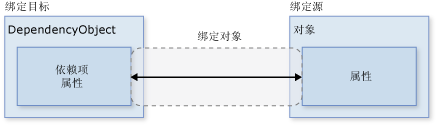
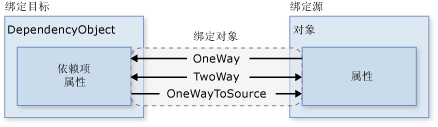
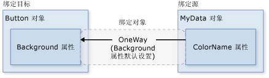
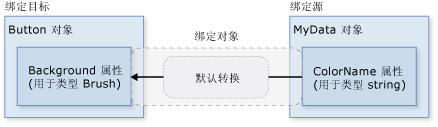
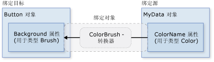
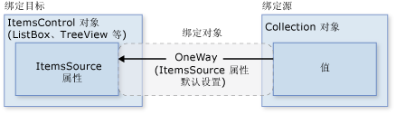

# <a name="data-binding-overview"></a>数据绑定概述
[!INCLUDE[TLA#tla_winclient](../../../../includes/tlasharptla-winclient-md.md)] 数据绑定为应用程序呈现数据并与数据交互提供了一种简单且一致的方式。 元素能够以 [!INCLUDE[TLA#tla_clr](../../../../includes/tlasharptla-clr-md.md)] 对象和 [!INCLUDE[TLA#tla_xml](../../../../includes/tlasharptla-xml-md.md)] 形式绑定到来自各种数据源的数据。 <xref:System.Windows.Controls.ContentControl>如 s<xref:System.Windows.Controls.Button>和<xref:System.Windows.Controls.ItemsControl>如 s<xref:System.Windows.Controls.ListBox>和<xref:System.Windows.Controls.ListView>具有内置的功能，以便实现灵活的样式设置单个数据项的集合。 可基于数据生成排序、筛选和分组视图。  
  
 [!INCLUDE[TLA2#tla_winclient](../../../../includes/tla2sharptla-winclient-md.md)] 中的数据绑定功能与传统模型相比具有几个优点，包括本质上支持数据绑定的大量属性、灵活的 [!INCLUDE[TLA2#tla_ui](../../../../includes/tla2sharptla-ui-md.md)] 数据 UI 表示形式以及业务逻辑与 [!INCLUDE[TLA2#tla_ui](../../../../includes/tla2sharptla-ui-md.md)] 的完全分离。  
  
 本主题首先讨论的基础概念[!INCLUDE[TLA2#tla_winclient](../../../../includes/tla2sharptla-winclient-md.md)]的使用情况数据绑定，然后<xref:System.Windows.Data.Binding>类和数据绑定的其他功能。  
  
  
<a name="what_is_data_binding"></a>   
## <a name="what-is-data-binding"></a>什么是数据绑定？  
 数据绑定是在应用程序 [!INCLUDE[TLA2#tla_ui](../../../../includes/tla2sharptla-ui-md.md)] 和业务逻辑之间建立连接的过程。 如果绑定具有正确的设置，并且数据提供适当的通知，则在数据更改其值时，绑定到该数据的元素会自动反映更改。 数据绑定还意味着，如果元素中数据的外部表示形式发生更改，则基础数据可以自动进行更新以反映更改。 例如，如果用户编辑中的值<xref:System.Windows.Controls.TextBox>元素，则基础数据值会自动更新以反映所做的更改。  
  
 数据绑定的典型用法是将服务器或本地配置数据放置到窗体或其他 [!INCLUDE[TLA2#tla_ui](../../../../includes/tla2sharptla-ui-md.md)] 控件中。 在 [!INCLUDE[TLA2#tla_winclient](../../../../includes/tla2sharptla-winclient-md.md)] 中，此概念得到扩展，包括将大量属性绑定到各种数据源。 在 [!INCLUDE[TLA2#tla_winclient](../../../../includes/tla2sharptla-winclient-md.md)] 中，元素的依赖属性可以绑定到 [!INCLUDE[TLA2#tla_clr](../../../../includes/tla2sharptla-clr-md.md)] 对象（包括 [!INCLUDE[TLA#tla_adonet](../../../../includes/tlasharptla-adonet-md.md)] 对象或与 Web 服务和 Web 属性关联的对象）和 [!INCLUDE[TLA2#tla_xml](../../../../includes/tla2sharptla-xml-md.md)] 数据。  
  
 有关数据绑定的示例，请参阅[数据绑定演示](http://go.microsoft.com/fwlink/?LinkID=163703)中的以下应用程序 [!INCLUDE[TLA2#tla_ui](../../../../includes/tla2sharptla-ui-md.md)]：  
  
   
  
 以上是一个显示拍卖项列表的应用程序 [!INCLUDE[TLA2#tla_ui](../../../../includes/tla2sharptla-ui-md.md)]。 应用程序演示了数据绑定的以下功能：  
  
-   内容<xref:System.Windows.Controls.ListBox>绑定到的集合*如上*对象。 *AuctionItem* 对象具有 *Description*、*StartPrice*、*StartDate*、*Category*、*SpecialFeatures* 等属性。  
  
-   数据 (*如上*对象) 中显示<xref:System.Windows.Controls.ListBox>是模板化，以便说明和当前价格显示每个项。 这是使用<xref:System.Windows.DataTemplate>。 此外，每个项的外观取决于要显示的 *AuctionItem* 的 *SpecialFeatures* 值。 如果 *AuctionItem* 的 *SpecialFeatures* 值为 *Color*，则该项具有蓝色边框。 如果值为 *Highlight*，则该项具有橙色边框和一个星号。 [数据模板化](#data_templating)部分提供了数据模板化的相关信息。  
  
-   用户可以进行分组、 筛选或排序数据使用<xref:System.Windows.Controls.CheckBox>es 提供。 在上图中，"分组依据类别"和"按类别和日期排序" <xref:System.Windows.Controls.CheckBox>es 选择。 你可能已注意到，数据按产品类别分组，类别名称按字母顺序排序。 这些项还按每个类别中的开始日期排序，但难以从图中注意到这一点。 这可使用*集合视图*来实现。 [绑定到集合](#binding_to_collections)部分讨论了集合视图。  
  
-   当用户选择某一项，<xref:System.Windows.Controls.ContentControl>显示选定项的详细信息。 这称为*主从方案*。 [主从方案](#master_detail_scenario)部分提供了有关此类型的绑定方案的信息。  
  
-   一种*StartDate*属性是<xref:System.DateTime>，这将返回包含到毫秒的时间的日期。 在此应用程序中，使用了一个自定义转换器，以便显示较短的日期字符串。 [数据转换](#data_conversion)部分提供了有关转换器的信息。  
  
 当用户单击“添加产品”按钮时，会出现以下窗体：  
  
   
  
 用户可以编辑窗体中的字段，使用简略预览和详细预览窗格来预览产品清单，然后单击“提交”以添加新的产品清单。 任何现有的分组、筛选和排序功能都将应用于新项。 在这种特殊情况下，上图中输入的项会作为 *Computer* 类别中的第二项显示。  
  
 不显示在此映像是中提供的验证逻辑*开始日期* <xref:System.Windows.Controls.TextBox>。 如果用户输入无效日期 （无效的格式设置或过去的日期），将通过通知用户<xref:System.Windows.Controls.ToolTip>和旁边的红色感叹号<xref:System.Windows.Controls.TextBox>。 [数据验证](#data_validation)一节讨论了如何创建验证逻辑。  
  
 在详细介绍数据绑定的上述不同功能之前，我们会先在下一节中讨论一些对理解 [!INCLUDE[TLA2#tla_winclient](../../../../includes/tla2sharptla-winclient-md.md)] 数据绑定非常重要的基本概念。  
  
## <a name="basic-data-binding-concepts"></a>数据绑定基本概念  
  
 不论要绑定什么元素，也不论数据源的特性是什么，每个绑定都始终遵循下图所示的模型：  
  
   
  
 如上图所示，数据绑定实质上是绑定目标与绑定源之间的桥梁。 该图演示了以下基本的 [!INCLUDE[TLA2#tla_winclient](../../../../includes/tla2sharptla-winclient-md.md)] 数据绑定概念：  
  
-   通常，每个绑定都具有以下四个组件：绑定目标对象、目标属性、绑定源，以及要使用的绑定源中的值路径。 例如，如果你想要绑定的内容<xref:System.Windows.Controls.TextBox>到*名称*属性*员工*对象，你的目标对象是<xref:System.Windows.Controls.TextBox>，target 属性不<xref:System.Windows.Controls.TextBox.Text%2A>属性，要使用的值是*名称*，并在源对象是*员工*对象。  
  
-   目标属性必须为依赖属性。 大多数<xref:System.Windows.UIElement>属性是依赖项属性，大多数依赖项属性，除了只读属性，默认情况下支持数据绑定。 (仅<xref:System.Windows.DependencyObject>类型可以定义依赖项属性，所有<xref:System.Windows.UIElement>s 派生自<xref:System.Windows.DependencyObject>。)  
  
-   尽管图中并未指出，但请注意，绑定源对象并不限于自定义 [!INCLUDE[TLA2#tla_clr](../../../../includes/tla2sharptla-clr-md.md)] 对象。 [!INCLUDE[TLA2#tla_winclient](../../../../includes/tla2sharptla-winclient-md.md)] 数据绑定支持 [!INCLUDE[TLA2#tla_clr](../../../../includes/tla2sharptla-clr-md.md)] 对象和 [!INCLUDE[TLA2#tla_xml](../../../../includes/tla2sharptla-xml-md.md)] 形式的数据。 若要提供一些示例，您的绑定源可能是<xref:System.Windows.UIElement>，任何列表对象、[!INCLUDE[TLA2#tla_clr](../../../../includes/tla2sharptla-clr-md.md)]与关联的对象[!INCLUDE[TLA#tla_adonet](../../../../includes/tlasharptla-adonet-md.md)]数据或 Web 服务或包含是 XmlNode 你[!INCLUDE[TLA2#tla_xml](../../../../includes/tla2sharptla-xml-md.md)]数据。 有关详细信息，请参阅[绑定源概述](../../../../docs/framework/wpf/data/binding-sources-overview.md)。  
  
 在通读其他 [!INCLUDE[TLA#tla_sdk](../../../../includes/tlasharptla-sdk-md.md)] 主题时，请务必记住：在建立绑定时，需要将绑定目标绑定*到*绑定源。 例如，如果您要显示某些基础[!INCLUDE[TLA2#tla_xml](../../../../includes/tla2sharptla-xml-md.md)]中的数据<xref:System.Windows.Controls.ListBox>使用数据绑定时，你正在绑定你<xref:System.Windows.Controls.ListBox>到[!INCLUDE[TLA2#tla_xml](../../../../includes/tla2sharptla-xml-md.md)]数据。  
  
 若要建立一个绑定，应使用<xref:System.Windows.Data.Binding>对象。 本主题的其余部分讨论中的许多与关联的概念以及的某些属性和使用情况的<xref:System.Windows.Data.Binding>对象。  
  
<a name="direction_of_data_flow"></a>   
### <a name="direction-of-the-data-flow"></a>数据流的方向  
 如前文所述以及在上图中箭头所示，可以由数据流的绑定到绑定源转从绑定目标 (例如，源值发生更改时用户编辑的值<xref:System.Windows.Controls.TextBox>) 和/或从绑定源到绑定目标 (例如，你<xref:System.Windows.Controls.TextBox>内容获取更新绑定源中的更改) 如果绑定源提供适当的通知。  
  
 可能希望应用程序允许用户更改数据，然后将该数据传播回源对象。 或者，可能不希望允许用户更新源数据。 你可以通过设置对此进行控制<xref:System.Windows.Data.Binding.Mode%2A>属性你<xref:System.Windows.Data.Binding>对象。 下图演示了不同类型的数据流：  
  
   
  
-   <xref:System.Windows.Data.BindingMode.OneWay>绑定会导致更改源属性自动更新目标属性，但不是会对目标属性的更改传播回源属性。 如果绑定的控件为隐式只读，则此类型的绑定适用。 例如，可能绑定到如股票行情自动收录器这样的源，或许目标属性没有用于进行更改的控件接口（如表的数据绑定背景色）。 如果无需监视目标属性的更改，则使用 <xref:System.Windows.Data.BindingMode.OneWay> 绑定模式可避免 <xref:System.Windows.Data.BindingMode.TwoWay> 绑定模式的系统开销。  
  
-   <xref:System.Windows.Data.BindingMode.TwoWay>绑定会导致更改源属性或自动更新另的目标属性。 此类型的绑定适用于可编辑窗体或其他完整交互式的 [!INCLUDE[TLA2#tla_ui](../../../../includes/tla2sharptla-ui-md.md)] 方案。 大多数属性默认为<xref:System.Windows.Data.BindingMode.OneWay>绑定，而某些依赖项属性 (通常是用户可编辑控件的属性<xref:System.Windows.Controls.TextBox.Text%2A>属性<xref:System.Windows.Controls.TextBox>和<xref:System.Windows.Controls.Primitives.ToggleButton.IsChecked%2A>属性<xref:System.Windows.Controls.CheckBox>) 默认为<xref:System.Windows.Data.BindingMode.TwoWay>绑定。 确定依赖属性绑定在默认情况下是单向还是双向的编程方法是：使用 <xref:System.Windows.DependencyProperty.GetMetadata%2A> 获取属性的属性元数据，然后检查 <xref:System.Windows.FrameworkPropertyMetadata.BindsTwoWayByDefault%2A> 属性的布尔值。  
  
-   <xref:System.Windows.Data.BindingMode.OneWayToSource>相反<xref:System.Windows.Data.BindingMode.OneWay>绑定; 它的源属性更改时，更新的目标属性。 一个示例方案是只需要从 [!INCLUDE[TLA2#tla_ui](../../../../includes/tla2sharptla-ui-md.md)] 重新计算源值的情况。  
  
-   未在图中所示是<xref:System.Windows.Data.BindingMode.OneTime>绑定，这将导致产生的源属性来初始化目标属性，但后续更改都不会传播。 这意味着，如果数据上下文发生了更改，或者数据上下文中的对象发生了更改，该更改不会反映在目标属性中。 如果你在适合使用当前状态的快照或数据实际为静态数据的位置使用数据，则此类型的绑定适合。 如果你想使用源属性中的某个值来初始化目标属性，且提前不知道数据上下文，则此类型的绑定也有用。 这是实质上是 <xref:System.Windows.Data.BindingMode.OneWay> 绑定的一种简化形式，它在源值不更改的情况下提供更好的性能。  
  
 请注意，若要检测源更改 (适用于<xref:System.Windows.Data.BindingMode.OneWay>和<xref:System.Windows.Data.BindingMode.TwoWay>绑定)，源必须实现适当的属性更改通知机制如<xref:System.ComponentModel.INotifyPropertyChanged>。 请参阅[实现属性更改通知](../../../../docs/framework/wpf/data/how-to-implement-property-change-notification.md)有关的示例<xref:System.ComponentModel.INotifyPropertyChanged>实现。  
  
 <xref:System.Windows.Data.Binding.Mode%2A>属性页提供了有关绑定模式和举例说明如何指定绑定的方向的详细信息。  
  
<a name="what_triggers_source_updates"></a>   
### <a name="what-triggers-source-updates"></a>触发源更新的因素  
 绑定<xref:System.Windows.Data.BindingMode.TwoWay>或<xref:System.Windows.Data.BindingMode.OneWayToSource>侦听中的目标属性的更改并将它们传播回源。 这称为更新源。 例如，可以编辑文本框的文本以更改基础源值。 如在上一部分中所述，由的值确定的数据流方向<xref:System.Windows.Data.Binding.Mode%2A>绑定属性。  
  
 但是，源值是在编辑文本的同时进行更新，还是在结束编辑文本并将鼠标指针从文本框移走后才进行更新呢？ <xref:System.Windows.Data.Binding.UpdateSourceTrigger%2A>绑定属性确定是什么触发了源的更新。 在下图中的右箭头的点说明的角色<xref:System.Windows.Data.Binding.UpdateSourceTrigger%2A>属性：  
  
   
  
 如果<xref:System.Windows.Data.Binding.UpdateSourceTrigger%2A>值是<xref:System.Windows.Data.UpdateSourceTrigger.PropertyChanged>，然后值指向的向右箭头<xref:System.Windows.Data.BindingMode.TwoWay>或<xref:System.Windows.Data.BindingMode.OneWayToSource>获取尽快目标属性更改更新绑定。 但是，如果<xref:System.Windows.Data.Binding.UpdateSourceTrigger%2A>值是<xref:System.Windows.Data.UpdateSourceTrigger.LostFocus>，则该值时，才能获取更新使用新值的目标属性失去焦点。  
  
 类似于<xref:System.Windows.Data.Binding.Mode%2A>属性，不同的依赖项属性具有不同的默认<xref:System.Windows.Data.Binding.UpdateSourceTrigger%2A>值。 大多数依赖属性的默认值为 <xref:System.Windows.Data.UpdateSourceTrigger.PropertyChanged>，而 <xref:System.Windows.Controls.TextBox.Text%2A> 属性的默认值为 <xref:System.Windows.Data.UpdateSourceTrigger.LostFocus>。 这意味着源更新通常发生每当目标属性更改，它适合<xref:System.Windows.Controls.CheckBox>es 和其他简单控件。 但对于文本字段，每次击键之后都进行更新会降低性能，用户也没有机会在提交新值之前使用 Backspace 键修改键入错误。 这就是为什么<xref:System.Windows.Controls.TextBox.Text%2A>属性具有默认值为<xref:System.Windows.Data.UpdateSourceTrigger.LostFocus>而不是<xref:System.Windows.Data.UpdateSourceTrigger.PropertyChanged>。  
  
 请参阅<xref:System.Windows.Data.Binding.UpdateSourceTrigger%2A>有关如何查找默认值的信息的属性页<xref:System.Windows.Data.Binding.UpdateSourceTrigger%2A>的依赖项属性的值。  
  
 下表提供的示例方案，为每个<xref:System.Windows.Data.Binding.UpdateSourceTrigger%2A>值使用<xref:System.Windows.Controls.TextBox>作为示例：  
  
|UpdateSourceTrigger 值|源值何时进行更新|文本框的示例方案|  
|-------------------------------|----------------------------------------|----------------------------------|  
|LostFocus (默认为<xref:System.Windows.Controls.TextBox.Text%2A?displayProperty=nameWithType>)|当 TextBox 控件失去焦点时|A<xref:System.Windows.Controls.TextBox>验证逻辑与该键相关联 （请参阅数据验证部分）|  
|PropertyChanged|当键入到<xref:System.Windows.Controls.TextBox>|<xref:System.Windows.Controls.TextBox>聊天室窗口中的控件|  
|Explicit|在应用程序调用<xref:System.Windows.Data.BindingExpression.UpdateSource%2A>|<xref:System.Windows.Controls.TextBox>（仅当用户单击提交按钮时的更新源值） 的可编辑窗体中的控件|  
  
 有关示例，请参阅[控制文本框文本更新源的时间](../../../../docs/framework/wpf/data/how-to-control-when-the-textbox-text-updates-the-source.md)。  
  
<a name="creating_a_binding"></a>   
## <a name="creating-a-binding"></a>创建绑定  
  
 若要概括一些前面部分中所述的概念，则建立绑定使用<xref:System.Windows.Data.Binding>对象，并且每个绑定通常具有四个组件： 绑定到要使用的源值的目标、 目标属性、 绑定源和路径。 本节讨论如何设置绑定。  
  
 请考虑以下示例，其中的绑定源对象是一个名为 *MyData* 的类，该类在 *SDKSample* 命名空间中定义。 出于演示目的，*MyData* 类具有一个名为 *ColorName* 的字符串属性，该属性的值设置为“Red”。 因此，此示例生成一个具有红色背景的按钮。  
  
 [!code-xaml[BindNonTextProperty#1](../../../../samples/snippets/csharp/VS_Snippets_Wpf/BindNonTextProperty/CS/Page1.xaml#1)]  
  
 有关绑定声明语法的详细信息以及如何在代码中设置绑定的示例，请参阅[绑定声明概述](../../../../docs/framework/wpf/data/binding-declarations-overview.md)。  
  
 如果将此示例应用于基本关系图，则生成的图如下所示。 这是<xref:System.Windows.Data.BindingMode.OneWay>绑定，因为后台属性支持<xref:System.Windows.Data.BindingMode.OneWay>默认绑定。  
  
   
  
 您可能想知道为什么此方法有效即使*ColorName*属性的类型是字符串时<xref:System.Windows.Controls.Control.Background%2A>属性属于类型<xref:System.Windows.Media.Brush>。 这是由于进行了默认类型转换，此类型转换在[数据转换](#data_conversion)一节中进行讨论。  
  
<a name="specifying_the_binding_source"></a>   
### <a name="specifying-the-binding-source"></a>指定绑定源  
 请注意，在前面的示例中，绑定源指定通过设置<xref:System.Windows.FrameworkElement.DataContext%2A>属性<xref:System.Windows.Controls.DockPanel>元素。 <xref:System.Windows.Controls.Button>然后继承<xref:System.Windows.FrameworkElement.DataContext%2A>值从<xref:System.Windows.Controls.DockPanel>，这是其父元素。 重申一下，绑定源对象是绑定的四个必需组件之一。 因此，如果未指定绑定源对象，则绑定将没有任何作用。  
  
 可通过多种方法指定绑定源对象。 使用<xref:System.Windows.FrameworkElement.DataContext%2A>时要将多个属性绑定到同一源父元素上的属性非常有用。 不过，有时在个别绑定声明中指定绑定源可能更为合适。 上一示例中，而不是使用<xref:System.Windows.FrameworkElement.DataContext%2A>属性，可以通过设置中指定的绑定源<xref:System.Windows.Data.Binding.Source%2A>直接在此按钮时，如以下示例所示绑定声明上的属性：  
  
 [!code-xaml[BindNonTextProperty#BackgroundBindingCompact](../../../../samples/snippets/csharp/VS_Snippets_Wpf/BindNonTextProperty/CS/Page2.xaml#backgroundbindingcompact)]  
  
 除设置<xref:System.Windows.FrameworkElement.DataContext%2A>直接，元素的属性上继承<xref:System.Windows.FrameworkElement.DataContext%2A>值从祖先 （如第一个示例中的按钮），并显式指定通过设置的绑定源<xref:System.Windows.Data.Binding.Source%2A>属性<xref:System.Windows.Data.Binding>（如按钮为最后一个示例） 还可以使用<xref:System.Windows.Data.Binding.ElementName%2A>属性或<xref:System.Windows.Data.Binding.RelativeSource%2A>属性指定绑定源。 <xref:System.Windows.Data.Binding.ElementName%2A>时你正在绑定到其他元素在应用程序，例如，当你使用滑块来调整按钮的宽度属性非常有用。 <xref:System.Windows.Data.Binding.RelativeSource%2A>属性中指定的绑定时有用<xref:System.Windows.Controls.ControlTemplate>或<xref:System.Windows.Style>。 有关详细信息，请参阅[指定绑定源](../../../../docs/framework/wpf/data/how-to-specify-the-binding-source.md)。  
  
<a name="specifying_the_path_to_the_value"></a>   
### <a name="specifying-the-path-to-the-value"></a>指定值的路径  
 如果绑定源是一个对象，则使用<xref:System.Windows.Data.Binding.Path%2A>属性来指定要用于绑定的值。 如果你正在绑定到[!INCLUDE[TLA2#tla_xml](../../../../includes/tla2sharptla-xml-md.md)]数据，你使用<xref:System.Windows.Data.Binding.XPath%2A>属性以指定的值。 在某些情况下，它可能是适用于使用<xref:System.Windows.Data.Binding.Path%2A>甚至当你的数据时，属性[!INCLUDE[TLA2#tla_xml](../../../../includes/tla2sharptla-xml-md.md)]。 例如，如果你想要访问的 （由于 XPath 查询） 返回 XmlNode 名称属性，则应使用<xref:System.Windows.Data.Binding.Path%2A>属性之外<xref:System.Windows.Data.Binding.XPath%2A>属性。  
  
 有关语法信息和示例，请参阅<xref:System.Windows.Data.Binding.Path%2A>和<xref:System.Windows.Data.Binding.XPath%2A>属性页。  
  
 请注意，虽然我们已强调<xref:System.Windows.Data.Binding.Path%2A>to 要使用的值是一个四个必要的组件的绑定，在你想要绑定到整个对象的情况下，要使用的值将作为绑定源对象相同。 在这些情况下，它是适用的不能指定<xref:System.Windows.Data.Binding.Path%2A>。 请看下面的示例：  
  
 [!code-xaml[MasterDetail#EmptyBinding](../../../../samples/snippets/csharp/VS_Snippets_Wpf/MasterDetail/CSharp/Page1.xaml#emptybinding)]  
  
 以上示例使用空绑定语法：{Binding}。 在这种情况下， <xref:System.Windows.Controls.ListBox> DataContext 继承父 DockPanel 元素 （未显示在此示例中）。 未指定路径时，默认为绑定到整个对象。 换而言之，在此示例中，该路径已被省略，因为我们绑定<xref:System.Windows.Controls.ItemsControl.ItemsSource%2A>到整个对象的属性。 （有关深入讨论，请参阅[绑定到集合](#binding_to_collections)一节。）  
  
 除了绑定到集合以外，在希望绑定到整个对象，而不是仅绑定到对象的单个属性时，也可以使用此方案。 例如，在源对象为类型字符串，并且仅仅希望绑定到该字符串本身时。 另一种常见情况是希望将一个元素绑定到一个具有多个属性的对象。  
  
 请注意，可能需要应用自定义逻辑，以便数据对于绑定的目标属性有意义。 自定义逻辑可能采用自定义转换器形式（如果不存在默认的类型转换）。 有关转换器的信息，请参阅[数据转换](#data_conversion)。  
  
<a name="binding_bindingexpression"></a>   
### <a name="binding-and-bindingexpression"></a>Binding 和 BindingExpression  
 获取到其他功能和数据绑定的用法前, 将很有用引入<xref:System.Windows.Data.BindingExpression>类。 正如前面部分中所看到<xref:System.Windows.Data.Binding>类是绑定; 的声明的高级类<xref:System.Windows.Data.Binding>类提供了许多允许你指定的绑定的特征的属性。 相关的类， <xref:System.Windows.Data.BindingExpression>，是保持在源和目标之间的连接的基础对象。 一个绑定包含了可以在多个绑定表达式之间共享的所有信息。 A<xref:System.Windows.Data.BindingExpression>是不能共享的实例表达式和包含的所有实例信息<xref:System.Windows.Data.Binding>。  
  
 例如，考虑以下内容，其中*看*是的一个实例*MyData*类， *myBinding*是源<xref:System.Windows.Data.Binding>对象，并且*MyData*类是一个包含名为的字符串属性的定义的类*其中*。 此示例将绑定的文本内容*mytext*，实例<xref:System.Windows.Controls.TextBlock>到*其中*。  
  
 [!code-csharp[CodeOnlyBinding#1](../../../../samples/snippets/csharp/VS_Snippets_Wpf/CodeOnlyBinding/CSharp/binding.cs#1)]
 [!code-vb[CodeOnlyBinding#1](../../../../samples/snippets/visualbasic/VS_Snippets_Wpf/CodeOnlyBinding/VisualBasic/App.vb#1)]  
  
 可以使用同一 *myBinding* 对象来创建其他绑定。 例如，可以使用 *myBinding* 对象将复选框的文本内容绑定到 *MyDataProperty*。 在这种情况下，将会有的两个实例<xref:System.Windows.Data.BindingExpression>共享*myBinding*对象。  
  
 A<xref:System.Windows.Data.BindingExpression>可以通过调用的返回值获取对象<xref:System.Windows.Data.BindingOperations.GetBindingExpression%2A>数据绑定对象上。 以下主题说明一些的用法<xref:System.Windows.Data.BindingExpression>类：  
  
-   [从已绑定的目标属性获取绑定对象](../../../../docs/framework/wpf/data/how-to-get-the-binding-object-from-a-bound-target-property.md)  
  
-   [控制文本框文本更新源的时间](../../../../docs/framework/wpf/data/how-to-control-when-the-textbox-text-updates-the-source.md)  
  
<a name="data_conversion"></a>   
## <a name="data-conversion"></a>数据转换  
 在前面的示例中，按钮是红色因为其<xref:System.Windows.Controls.Control.Background%2A>属性绑定到具有"Red"的值的字符串属性。 这样做的原因的类型转换器是位于<xref:System.Windows.Media.Brush>要转换到的字符串值类型<xref:System.Windows.Media.Brush>。  
  
 若要将此信息添加到[创建绑定](#creating_a_binding)一节的图中，关系图如下所示：  
  
   
  
 但是，如果而不是让你绑定源对象具有的类型字符串的属性*颜色*类型的属性<xref:System.Windows.Media.Color>？ 在这种情况下，按顺序绑定才能工作需到第一个轮次*颜色*到的内容的属性值的<xref:System.Windows.Controls.Control.Background%2A>属性接受。 你将需要通过实现创建的自定义转换器<xref:System.Windows.Data.IValueConverter>接口，如以下示例所示：  
  
 [!code-csharp[ColorPicker_snip#16](../../../../samples/snippets/csharp/VS_Snippets_Wpf/ColorPicker_snip/CSharp/ColorPickerLib/ColorPicker.cs#16)]
 [!code-vb[ColorPicker_snip#16](../../../../samples/snippets/visualbasic/VS_Snippets_Wpf/ColorPicker_snip/visualbasic/colorpickerlib/colorpicker.vb#16)]  
  
 <xref:System.Windows.Data.IValueConverter>参考页提供了详细信息。  
  
 现在使用自定义转换器而不是默认转换，关系图如下所示：  
  
   
  
 重申一下，由于要绑定到的类型中提供了类型转换器，因此可以使用默认转换。 此行为取决于目标中可用的类型转换器。 如果无法确定，请创建自己的转换器。  
  
 下面提供了一些典型方案，在这些方案中，实现数据转换器非常有意义：  
  
-   数据应根据区域性以不同方式显示。 例如，可能需要根据在特定区域性中使用的值或标准，实现货币转换器或日历日期/时间转换器。  
  
-   使用的数据不一定会更改属性的文本值，但会更改其他某个值（如图像的源，或显示文本的颜色或样式）。 在这种情况下，可以通过转换可能不合适的属性绑定（如将文本字段绑定到表单元格的 Background 属性）来使用转换器。  
  
-   将多个控件或控件的多个属性绑定到相同数据。 在这种情况下，主绑定可能仅显示文本，而其他绑定则处理特定的显示问题，但仍使用同一绑定作为源信息。  
  
-   到目前为止我们尚未讨论<xref:System.Windows.Data.MultiBinding>，其中的目标属性都有的绑定的集合。 情况下<xref:System.Windows.Data.MultiBinding>，使用自定义<xref:System.Windows.Data.IMultiValueConverter>以生成最终值从绑定的值。 例如，可以从红色、蓝色和绿色的值来计算颜色，这些值可能来自相同绑定源对象，也可能来自不同绑定源对象。 请参阅<xref:System.Windows.Data.MultiBinding>有关示例和信息类页。  
  
<a name="binding_to_collections"></a>   
## <a name="binding-to-collections"></a>绑定到集合  
  
 绑定源对象可以视为其属性包含数据的单个对象，也可以视为通常组合在一起的多态对象的数据集合（如数据库的查询结果）。 到目前为止，我们仅讨论了绑定到单个对象，但绑定到数据集合才是一种常见方案。 例如，一种常见方案是使用<xref:System.Windows.Controls.ItemsControl>如<xref:System.Windows.Controls.ListBox>， <xref:System.Windows.Controls.ListView>，或<xref:System.Windows.Controls.TreeView>以显示数据集合，诸如应用程序中所示[什么是数据绑定？](#what_is_data_binding)部分。  
  
 幸运的是，基本关系图仍然适用。 如果你正在绑定<xref:System.Windows.Controls.ItemsControl>到集合，该关系图类似如下所示：  
  
   
  
 此图中中, 所示将绑定<xref:System.Windows.Controls.ItemsControl>集合对象、<xref:System.Windows.Controls.ItemsControl.ItemsSource%2A>属性是要使用的属性。 你可以将<xref:System.Windows.Controls.ItemsControl.ItemsSource%2A>属性的内容作为<xref:System.Windows.Controls.ItemsControl>。 请注意，该绑定是<xref:System.Windows.Data.BindingMode.OneWay>因为<xref:System.Windows.Controls.ItemsControl.ItemsSource%2A>属性支持<xref:System.Windows.Data.BindingMode.OneWay>默认绑定。  
  
<a name="how_to_implement_collections"></a>   
### <a name="how-to-implement-collections"></a>如何实现集合  
 你可以枚举任何集合可实现<xref:System.Collections.IEnumerable>接口。 但是，若要设置动态绑定，使插入或删除集合中的更新[!INCLUDE[TLA2#tla_ui](../../../../includes/tla2sharptla-ui-md.md)]集合必须实现自动<xref:System.Collections.Specialized.INotifyCollectionChanged>接口。 此接口公开一个事件，只要基础集合发生更改，就应该引发该事件。  
  
 [!INCLUDE[TLA2#tla_winclient](../../../../includes/tla2sharptla-winclient-md.md)]提供<xref:System.Collections.ObjectModel.ObservableCollection%601>类，它是公开的数据集合的内置实现<xref:System.Collections.Specialized.INotifyCollectionChanged>接口。 请注意，若要完全支持传输来自源对象到目标的数据值，您支持可绑定属性的集合中每个对象还必须实现<xref:System.ComponentModel.INotifyPropertyChanged>接口。 有关详细信息，请参阅[绑定源概述](../../../../docs/framework/wpf/data/binding-sources-overview.md)。  
  
 在实施之前你自己的集合，请考虑使用<xref:System.Collections.ObjectModel.ObservableCollection%601>或一个现有集合类，如<xref:System.Collections.Generic.List%601>， <xref:System.Collections.ObjectModel.Collection%601>，和<xref:System.ComponentModel.BindingList%601>，此外还有许多其他。 如果你有高级的方案，并想要实现您自己的集合，请考虑使用<xref:System.Collections.IList>，它提供可通过索引，因此最佳性能单独访问的对象的非泛型集合。  
  
<a name="collection_views"></a>   
### <a name="collection-views"></a>集合视图  
 一次你<xref:System.Windows.Controls.ItemsControl>绑定到数据集合，你可能需要对排序、 筛选器或分组数据。 若要做到这一点，你可以使用集合视图，这是实现类<xref:System.ComponentModel.ICollectionView>接口。  
  
  
#### <a name="what-are-collection-views"></a>什么是集合视图？  
 集合视图这一层基于绑定源集合，它允许基于排序、筛选和分组查询来导航并显示源集合，而无需更改基础源集合本身。 集合视图还维护一个指向集合中当前项的指针。 如果源集合实现<xref:System.Collections.Specialized.INotifyCollectionChanged>接口，引发的更改<xref:System.Collections.Specialized.INotifyCollectionChanged.CollectionChanged>事件传播到视图的视图。  
  
 由于视图不会更改基础源集合，因此每个源集合都可以有多个关联的视图。 例如，可以有 *Task* 对象的集合。 使用视图，可以通过不同方式显示相同数据。 例如，可能希望在页面左侧显示按优先级排序的任务，而在页面右侧显示按区域分组的任务。  
  
<a name="how_to_create_a_view"></a>   
#### <a name="how-to-create-a-view"></a>如何创建视图  
 创建并使用视图的一种方式是直接实例化视图对象，然后将它用作绑定源。 例如，请考虑在[什么是数据绑定？](#what_is_data_binding)一节中显示的[数据绑定演示](http://go.microsoft.com/fwlink/?LinkID=163703)应用程序。 实现应用程序以便<xref:System.Windows.Controls.ListBox>直接绑定到视图访问数据而不是数据集合的集合。 下面的示例摘自[数据绑定演示](http://go.microsoft.com/fwlink/?LinkID=163703)应用程序。 <xref:System.Windows.Data.CollectionViewSource>类是[!INCLUDE[TLA#tla_xaml](../../../../includes/tlasharptla-xaml-md.md)]继承自的类的代理<xref:System.Windows.Data.CollectionView>。 在此特定示例中，<xref:System.Windows.Data.CollectionViewSource.Source%2A>视图的已绑定到*AuctionItems*集合 (类型的<xref:System.Collections.ObjectModel.ObservableCollection%601>) 的当前应用程序对象。  
  
 [!code-xaml[DataBindingLab#WindowResources1](../../../../samples/snippets/csharp/VS_Snippets_Wpf/DataBindingLab/CSharp/MainWindow.xaml#windowresources1)]  
[!code-xaml[DataBindingLab#CollectionViewSource](../../../../samples/snippets/csharp/VS_Snippets_Wpf/DataBindingLab/CSharp/MainWindow.xaml#collectionviewsource)]  
[!code-xaml[DataBindingLab#WindowResources2](../../../../samples/snippets/csharp/VS_Snippets_Wpf/DataBindingLab/CSharp/MainWindow.xaml#windowresources2)]  
  
 资源*listingDataView*然后如用作应用程序中的元素的绑定源<xref:System.Windows.Controls.ListBox>:  
  
 [!code-xaml[DataBindingLab#Master1](../../../../samples/snippets/csharp/VS_Snippets_Wpf/DataBindingLab/CSharp/MainWindow.xaml#master1)]  
[!code-xaml[DataBindingLab#Master2](../../../../samples/snippets/csharp/VS_Snippets_Wpf/DataBindingLab/CSharp/MainWindow.xaml#master2)]  
  
 若要创建找不到相同的另一个视图，可以创建另一个<xref:System.Windows.Data.CollectionViewSource>实例并为其提供不同`x:Key`名称。  
  
 下表显示哪些视图数据类型为默认集合视图或通过创建<xref:System.Windows.Data.CollectionViewSource>基于源集合类型。  
  
|源集合类型|集合视图类型|说明|  
|----------------------------|--------------------------|-----------|  
|<xref:System.Collections.IEnumerable>|基于内部类型<xref:System.Windows.Data.CollectionView>|无法对项进行分组。|  
|<xref:System.Collections.IList>|<xref:System.Windows.Data.ListCollectionView>|最快。|  
|<xref:System.ComponentModel.IBindingList>|<xref:System.Windows.Data.BindingListCollectionView>||  
  
##### <a name="using-a-default-view"></a>使用默认视图  
 创建并使用集合视图的一种方式是指定集合视图作为绑定源。 WPF 还会为用作绑定源的每个集合创建一个默认集合视图。 如果直接绑定到集合，WPF 会绑定到该集合的默认视图。 请注意，此默认视图由同一集合的所有绑定共享，因此一个绑定控件或代码对默认视图所做的更改（如排序或对当前项指针的更改，下文将对此进行讨论）会反映到同一集合的所有其他绑定中。  
  
 若要获取的默认视图，你可以使用<xref:System.Windows.Data.CollectionViewSource.GetDefaultView%2A>方法。 有关示例，请参阅[获取数据集合的默认视图](../../../../docs/framework/wpf/data/how-to-get-the-default-view-of-a-data-collection.md)。  
  
##### <a name="collection-views-with-adonet-datatables"></a>包含 ADO.NET DataTables 的集合视图  
 若要提高性能，为 ADO.NET 集合视图<xref:System.Data.DataTable>或<xref:System.Data.DataView>对象委托排序和筛选到<xref:System.Data.DataView>。 这会导致排序和筛选任务由数据源的所有集合视图分担。 若要启用每个集合视图进行排序和筛选独立，初始化每个有其自己的集合视图<xref:System.Data.DataView>对象。  
  
#### <a name="sorting"></a>排序  
 如前所述，视图可以将排序顺序应用于集合。 如同在基础集合中一样，数据可能具有或不具有相关的固有顺序。 借助集合视图，可以根据自己提供的比较条件来强制确定顺序，或更改默认顺序。 由于这是基于客户端的数据视图，因此一种常见情况是用户可能希望根据列对应的值，对多列表格数据进行排序。 通过使用视图，可以应用这种用户实施的排序，而无需对基础集合进行任何更改，甚至不必再次查询集合内容。 有关示例，请参阅[在单击标题时对 GridView 列进行排序](../../../../docs/framework/wpf/controls/how-to-sort-a-gridview-column-when-a-header-is-clicked.md)。  
  
 下面的示例演示的"排序依据类别和日期"的排序逻辑<xref:System.Windows.Controls.CheckBox>的应用程序[!INCLUDE[TLA2#tla_ui](../../../../includes/tla2sharptla-ui-md.md)]中[什么是数据绑定？](#what_is_data_binding)部分：  
  
 [!code-csharp[DataBindingLab#8](../../../../samples/snippets/csharp/VS_Snippets_Wpf/DataBindingLab/CSharp/MainWindow.xaml.cs#8)]
 [!code-vb[DataBindingLab#8](../../../../samples/snippets/visualbasic/VS_Snippets_Wpf/DataBindingLab/VisualBasic/MainWindow.xaml.vb#8)]  
  
#### <a name="filtering"></a>筛选  
 视图还可以将筛选器应用于集合。 这意味着即使集合中可能存在一个项，此特定视图也仅用于显示整个集合的某个子集。 可以根据条件在数据中进行筛选。 例如，正如在[什么是数据绑定？](#what_is_data_binding)部分中，"显示仅 bargains"<xref:System.Windows.Controls.CheckBox>包含逻辑，以便筛选掉成本 $25 个以上的项。 下面的代码执行，以设置*ShowOnlyBargainsFilter*作为<xref:System.Windows.Data.CollectionViewSource.Filter>事件处理程序时，<xref:System.Windows.Controls.CheckBox>选择：  
  
 [!code-csharp[DataBindingLab#10](../../../../samples/snippets/csharp/VS_Snippets_Wpf/DataBindingLab/CSharp/MainWindow.xaml.cs#10)]
 [!code-vb[DataBindingLab#10](../../../../samples/snippets/visualbasic/VS_Snippets_Wpf/DataBindingLab/VisualBasic/MainWindow.xaml.vb#10)]  
  
 *ShowOnlyBargainsFilter* 事件处理程序具有以下实现：  
  
 [!code-csharp[DataBindingLab#5](../../../../samples/snippets/csharp/VS_Snippets_Wpf/DataBindingLab/CSharp/MainWindow.xaml.cs#5)]
 [!code-vb[DataBindingLab#5](../../../../samples/snippets/visualbasic/VS_Snippets_Wpf/DataBindingLab/VisualBasic/MainWindow.xaml.vb#5)]  
  
 如果你正在使用它的<xref:System.Windows.Data.CollectionView>类而不是直接<xref:System.Windows.Data.CollectionViewSource>，你将使用<xref:System.Windows.Data.CollectionView.Filter%2A>属性来指定一个回调。 有关示例，请参阅[筛选视图中的数据](../../../../docs/framework/wpf/data/how-to-filter-data-in-a-view.md)。  
  
#### <a name="grouping"></a>分组  
 视图的内部类除外<xref:System.Collections.IEnumerable>集合，所有集合视图都支持分组，这样用户就可以分区成逻辑组的集合视图中的集合的功能。 这些组可以是显式的，由用户提供组列表；也可以是隐式的，这些组依据数据动态生成。  
  
 下面的示例演示的"分组依据类别"的逻辑<xref:System.Windows.Controls.CheckBox>:  
  
 [!code-csharp[DataBindingLab#6](../../../../samples/snippets/csharp/VS_Snippets_Wpf/DataBindingLab/CSharp/MainWindow.xaml.cs#6)]
 [!code-vb[DataBindingLab#6](../../../../samples/snippets/visualbasic/VS_Snippets_Wpf/DataBindingLab/VisualBasic/MainWindow.xaml.vb#6)]  
  
 有关其他分组示例，请参阅[对实现 GridView 的 ListView 中的项进行分组](../../../../docs/framework/wpf/controls/how-to-group-items-in-a-listview-that-implements-a-gridview.md)。  
  
#### <a name="current-item-pointers"></a>当前项指针  
 视图还支持当前项的概念。 可以在集合视图中的对象之间导航。 在导航时，你是在移动项指针，该指针可用于检索存在于集合中特定位置的对象。 有关示例，请参阅[在数据集合视图中的对象之间导航](../../../../docs/framework/wpf/data/how-to-navigate-through-the-objects-in-a-data-collectionview.md)。  
  
 由于 WPF 只通过使用视图（你指定的视图或集合的默认视图）绑定到集合，因此集合的所有绑定都有一个当前项指针。 绑定到视图时，`Path` 值中的斜杠（“/”）字符用于指定视图的当前项。 在下面的示例中，数据上下文是一个集合视图。 第一行绑定到集合。 第二行绑定到集合中的当前项。 第三行绑定到集合中当前项的 `Description` 属性。  
  
```xaml  
<Button Content="{Binding }" />  
<Button Content="{Binding Path=/}" />  
<Button Content="{Binding Path=/Description}" />   
```  
  
 还可以连着使用斜杠和属性语法以遍历集合的分层。 以下示例绑定到一个名为 `Offices` 的集合的当前项，此集合是源集合的当前项的属性。  
  
```xaml  
<Button Content="{Binding /Offices/}" />  
```  
  
 当前项指针可能会受对集合应用的任何排序或筛选操作的影响。 排序操作将当前项指针保留在所选的最后一项上，但集合视图现已围绕此指针重构。 （或许所选项以前曾位于列表的开头，但现在所选项可能位于中间的某个位置。）如果所选内容在筛选之后保留在视图中，则筛选操作会保留所选项。 否则，当前项指针会设置为经过筛选的集合视图的第一项。  
  
<a name="master_detail_scenario"></a>   
#### <a name="master-detail-binding-scenario"></a>主-从绑定方案  
 当前项的概念不仅适用于集合中各项的导航，也适用于主-从绑定方案。 再考虑一下[什么是数据绑定？](#what_is_data_binding)一节中的应用程序 [!INCLUDE[TLA2#tla_ui](../../../../includes/tla2sharptla-ui-md.md)]。 在该应用程序内的选定文本<xref:System.Windows.Controls.ListBox>确定中所示的内容<xref:System.Windows.Controls.ContentControl>。 若要将其放入另一种方法，当<xref:System.Windows.Controls.ListBox>选择项目时，<xref:System.Windows.Controls.ContentControl>显示选定项的详细信息。  
  
 只需将两个或更多控件绑定到同一视图即可实现主-从方案。 下面的示例从[数据绑定演示](http://go.microsoft.com/fwlink/?LinkID=163703)显示的标记<xref:System.Windows.Controls.ListBox>和<xref:System.Windows.Controls.ContentControl>你在应用程序上看到[!INCLUDE[TLA2#tla_ui](../../../../includes/tla2sharptla-ui-md.md)]中[什么是数据绑定？](#what_is_data_binding)部分：  
  
 [!code-xaml[DataBindingLab#Master1](../../../../samples/snippets/csharp/VS_Snippets_Wpf/DataBindingLab/CSharp/MainWindow.xaml#master1)]  
[!code-xaml[DataBindingLab#Master2](../../../../samples/snippets/csharp/VS_Snippets_Wpf/DataBindingLab/CSharp/MainWindow.xaml#master2)]  
[!code-xaml[DataBindingLab#Detail](../../../../samples/snippets/csharp/VS_Snippets_Wpf/DataBindingLab/CSharp/MainWindow.xaml#detail)]  
  
 请注意，这两个控件都绑定到同一个源，即 *listingDataView* 静态资源（请参阅[如何创建视图](#how_to_create_a_view)一节中此资源的定义）。 这样做的原因的单一实例对象时 (<xref:System.Windows.Controls.ContentControl>在这种情况下) 绑定到集合视图时，它自动绑定到<xref:System.Windows.Data.CollectionView.CurrentItem%2A>的视图。 请注意，<xref:System.Windows.Data.CollectionViewSource>对象自动同步货币与所选内容。 如果列表控件未绑定到<xref:System.Windows.Data.CollectionViewSource>对象如此示例所示，则需要设置其<xref:System.Windows.Controls.Primitives.Selector.IsSynchronizedWithCurrentItem%2A>属性`true`为使工作。  
  
 有关其他示例，请参阅[绑定到集合并基于选择显示信息](../../../../docs/framework/wpf/data/how-to-bind-to-a-collection-and-display-information-based-on-selection.md)和[对分层数据使用主-从模式](../../../../docs/framework/wpf/data/how-to-use-the-master-detail-pattern-with-hierarchical-data.md)。  
  
 你可能已经注意到上述示例使用了一个模板。 事实上，数据将不会显示不使用模板的情况下我们希望的方式 (显式使用的那个<xref:System.Windows.Controls.ContentControl>和隐式使用的那个<xref:System.Windows.Controls.ListBox>)。 现在，我们开始介绍下一节中的数据模板化。  
  
<a name="data_templating"></a>   
## <a name="data-templating"></a>数据模板化  
 如果不使用数据模板，[什么是数据绑定？](#what_is_data_binding)一节中的应用程序 [!INCLUDE[TLA2#tla_ui](../../../../includes/tla2sharptla-ui-md.md)] 将如下所示：  
  
   
  
 上一节中的示例中所示同时<xref:System.Windows.Controls.ListBox>控件和<xref:System.Windows.Controls.ContentControl>绑定到整个集合对象 （或更具体地说，对集合对象的视图） 的*如上*s。 如果没有特殊说明如何显示数据集合的<xref:System.Windows.Controls.ListBox>基础集合中显示的字符串表示形式的每个对象和<xref:System.Windows.Controls.ContentControl>所显示的字符串表示形式绑定到的对象。  
  
 若要解决该问题，应用程序定义<xref:System.Windows.DataTemplate>s。 上一节中的示例中所示<xref:System.Windows.Controls.ContentControl>显式使用*detailsProductListingTemplate*<xref:System.Windows.DataTemplate>。 <xref:System.Windows.Controls.ListBox>控件隐式使用以下<xref:System.Windows.DataTemplate>显示时*如上*集合中的对象：  
  
 [!code-xaml[DataBindingLab#AuctionItemDataTemplate](../../../../samples/snippets/csharp/VS_Snippets_Wpf/DataBindingLab/CSharp/DataBindingLabApp.xaml#auctionitemdatatemplate)]  
  
 这两个使用<xref:System.Windows.DataTemplate>s，生成的 UI 是中所示[什么是数据绑定？](#what_is_data_binding)部分。 正如您可以从该屏幕截图中看到，除了让您将数据放置在控件中， <xref:System.Windows.DataTemplate>s 允许你定义引人注目的视觉对象，为你的数据。 例如， <xref:System.Windows.DataTrigger>s 使用在上述<xref:System.Windows.DataTemplate>以便*如上*与*SpecialFeatures*值*突出显示*将显示与橙色边框和星号。  
  
 有关数据模板的详细信息，请参阅[数据模板化概述](../../../../docs/framework/wpf/data/data-templating-overview.md)。  
  
<a name="data_validation"></a>   
## <a name="data-validation"></a>数据验证  
  
 接受用户输入的大多数应用程序都需要具有验证逻辑，以确保用户输入了预期信息。 可基于类型、范围、格式或特定于应用程序的其他要求执行验证检查。 本节讨论了数据验证在 [!INCLUDE[TLA2#tla_winclient](../../../../includes/tla2sharptla-winclient-md.md)] 中的工作原理。  
  
### <a name="associating-validation-rules-with-a-binding"></a>将验证规则与绑定关联  
 [!INCLUDE[TLA2#tla_winclient](../../../../includes/tla2sharptla-winclient-md.md)]数据绑定模型，可将关联<xref:System.Windows.Data.Binding.ValidationRules%2A>与你<xref:System.Windows.Data.Binding>对象。 例如，下面的示例将绑定<xref:System.Windows.Controls.TextBox>到名为的属性`StartPrice`并添加<xref:System.Windows.Controls.ExceptionValidationRule>对象传递给<xref:System.Windows.Data.Binding.ValidationRules%2A?displayProperty=nameWithType>属性。  
  
 [!code-xaml[DataBindingLab#DefaultValidation](../../../../samples/snippets/csharp/VS_Snippets_Wpf/DataBindingLab/CSharp/AddProductWindow.xaml#defaultvalidation)]  
  
 A<xref:System.Windows.Controls.ValidationRule>对象检查属性的值是否有效。 [!INCLUDE[TLA2#tla_winclient](../../../../includes/tla2sharptla-winclient-md.md)]具有以下两个类型的内置<xref:System.Windows.Controls.ValidationRule>对象：  
  
-   A<xref:System.Windows.Controls.ExceptionValidationRule>检查的绑定源属性更新过程中引发的异常。 在以上示例中，`StartPrice` 为整数类型。 当用户输入的值无法转换为整数时，将引发异常，这会导致将绑定标记为无效。 设置的可选语法<xref:System.Windows.Controls.ExceptionValidationRule>显式是设置<xref:System.Windows.Data.Binding.ValidatesOnExceptions%2A>属性`true`上你<xref:System.Windows.Data.Binding>或<xref:System.Windows.Data.MultiBinding>对象。  
  
-   A<xref:System.Windows.Controls.DataErrorValidationRule>对象检查由实现的对象引发的错误<xref:System.ComponentModel.IDataErrorInfo>接口。 使用此验证规则的示例，请参阅<xref:System.Windows.Controls.DataErrorValidationRule>。 设置的可选语法<xref:System.Windows.Controls.DataErrorValidationRule>显式是设置<xref:System.Windows.Data.Binding.ValidatesOnDataErrors%2A>属性`true`上你<xref:System.Windows.Data.Binding>或<xref:System.Windows.Data.MultiBinding>对象。  
  
 此外可以通过从派生来创建你自己的验证规则<xref:System.Windows.Controls.ValidationRule>类并实现<xref:System.Windows.Controls.ValidationRule.Validate%2A>方法。 下面的示例演示使用的规则*添加产品清单*"开始日期"<xref:System.Windows.Controls.TextBox>从[什么是数据绑定？](#what_is_data_binding)部分：  
  
 [!code-csharp[DataBindingLab#2](../../../../samples/snippets/csharp/VS_Snippets_Wpf/DataBindingLab/CSharp/FutureDateRule.cs#2)]
 [!code-vb[DataBindingLab#2](../../../../samples/snippets/visualbasic/VS_Snippets_Wpf/DataBindingLab/VisualBasic/FutureDateRule.vb#2)]  
  
 *StartDateEntryForm* <xref:System.Windows.Controls.TextBox>使用此*FutureDateRule*，下面的示例中所示：  
  
 [!code-xaml[DataBindingLab#CustomValidation](../../../../samples/snippets/csharp/VS_Snippets_Wpf/DataBindingLab/CSharp/AddProductWindow.xaml#customvalidation)]  
  
 请注意，因为<xref:System.Windows.Data.Binding.UpdateSourceTrigger%2A>值是<xref:System.Windows.Data.UpdateSourceTrigger.PropertyChanged>，绑定引擎更新在每次击键后，这意味着它还检查源值中的所有规则<xref:System.Windows.Data.Binding.ValidationRules%2A>在每次击键后的集合。 我们会在“验证过程”一节中对此深入讨论。  
  
<a name="invalidation_feedback"></a>   
### <a name="providing-visual-feedback"></a>提供视觉反馈  
 如果用户输入的值无效，你可能希望在应用程序 [!INCLUDE[TLA2#tla_ui](../../../../includes/tla2sharptla-ui-md.md)] 上提供一些有关错误的反馈。 一种方法提供这种反馈是设置<xref:System.Windows.Controls.Validation.ErrorTemplate%2A?displayProperty=nameWithType>向自定义附加属性<xref:System.Windows.Controls.ControlTemplate>。 在上一节中所示*StartDateEntryForm* <xref:System.Windows.Controls.TextBox>使用<xref:System.Windows.Controls.Validation.ErrorTemplate%2A>调用*validationTemplate*。 以下示例显示了 *validationTemplate* 的定义：  
  
 [!code-xaml[DataBindingLab#1](../../../../samples/snippets/csharp/VS_Snippets_Wpf/DataBindingLab/CSharp/AddProductWindow.xaml#1)]  
  
 <xref:System.Windows.Controls.AdornedElementPlaceholder>元素指定要装饰的控件的放置位置。  
  
 此外，还可以使用<xref:System.Windows.Controls.ToolTip>以显示错误消息。 这两个*StartDateEntryForm*和*StartPriceEntryForm*<xref:System.Windows.Controls.TextBox>es 使用的形式*textStyleTextBox*，这将创建<xref:System.Windows.Controls.ToolTip>，显示的错误消息。 以下示例显示了 *textStyleTextBox* 的定义。 附加的属性<xref:System.Windows.Controls.Validation.HasError%2A?displayProperty=nameWithType>是`true`当一个或多个绑定元素的属性上的绑定位于错误。  
  
 [!code-xaml[DataBindingLab#14](../../../../samples/snippets/csharp/VS_Snippets_Wpf/DataBindingLab/CSharp/DataBindingLabApp.xaml#14)]  
  
 使用的自定义<xref:System.Windows.Controls.Validation.ErrorTemplate%2A>和<xref:System.Windows.Controls.ToolTip>、 *StartDateEntryForm* <xref:System.Windows.Controls.TextBox>将类似于以下验证错误时：  
  
   
  
 如果你<xref:System.Windows.Data.Binding>具有关联的验证规则但未指定<xref:System.Windows.Controls.Validation.ErrorTemplate%2A>绑定的控件中，默认<xref:System.Windows.Controls.Validation.ErrorTemplate%2A>将用于验证错误时通知用户。 默认值<xref:System.Windows.Controls.Validation.ErrorTemplate%2A>是装饰器层中定义了红色边框的控件模板。 使用默认<xref:System.Windows.Controls.Validation.ErrorTemplate%2A>和<xref:System.Windows.Controls.ToolTip>、[!INCLUDE[TLA2#tla_ui](../../../../includes/tla2sharptla-ui-md.md)]的*StartPriceEntryForm* <xref:System.Windows.Controls.TextBox>将类似于以下验证错误时：  
  
   
  
 有关如何提供逻辑以验证对话框中所有控件的示例，请参阅[对话框概述](../../../../docs/framework/wpf/app-development/dialog-boxes-overview.md)中的“自定义对话框”一节。  
  
### <a name="validation-process"></a>验证过程  
 通常，在目标的值传输到绑定源属性时会进行验证。 在将发生这种情况<xref:System.Windows.Data.BindingMode.TwoWay>和<xref:System.Windows.Data.BindingMode.OneWayToSource>绑定。 重申一遍，什么因素会导致源更新依赖于的值<xref:System.Windows.Data.Binding.UpdateSourceTrigger%2A>属性，如下所述[触发源更新](#what_triggers_source_updates)部分。  
  
 下面描述了*验证*过程。 注意，只要在验证过程中发生验证错误或其他类型的错误，该过程就会中断。  
  
1.  绑定引擎将检查是否存在任何自定义<xref:System.Windows.Controls.ValidationRule>对象定义其<xref:System.Windows.Controls.ValidationRule.ValidationStep%2A>设置为<xref:System.Windows.Controls.ValidationStep.RawProposedValue>该<xref:System.Windows.Data.Binding>，在这种情况下它将调用<xref:System.Windows.Controls.ValidationRule.Validate%2A>上每个方法<xref:System.Windows.Controls.ValidationRule>到其中一个运行时遇到错误或直到全部规则都通过。  
  
2.  绑定引擎随后会调用转换器（如果存在）。  
  
3.  如果该转换器成功，则绑定引擎将检查是否存在任何自定义<xref:System.Windows.Controls.ValidationRule>对象定义其<xref:System.Windows.Controls.ValidationRule.ValidationStep%2A>设置为<xref:System.Windows.Controls.ValidationStep.ConvertedProposedValue>该<xref:System.Windows.Data.Binding>，在这种情况下它将调用<xref:System.Windows.Controls.ValidationRule.Validate%2A>上每个方法<xref:System.Windows.Controls.ValidationRule>具有<xref:System.Windows.Controls.ValidationRule.ValidationStep%2A>设置为<xref:System.Windows.Controls.ValidationStep.ConvertedProposedValue>直到其中之一时遇到错误或全部规则都通过。  
  
4.  绑定引擎设置源属性。  
  
5.  绑定引擎将检查是否存在任何自定义<xref:System.Windows.Controls.ValidationRule>对象定义其<xref:System.Windows.Controls.ValidationRule.ValidationStep%2A>设置为<xref:System.Windows.Controls.ValidationStep.UpdatedValue>该<xref:System.Windows.Data.Binding>，在这种情况下它将调用<xref:System.Windows.Controls.ValidationRule.Validate%2A>上每个方法<xref:System.Windows.Controls.ValidationRule>具有<xref:System.Windows.Controls.ValidationRule.ValidationStep%2A>设置为<xref:System.Windows.Controls.ValidationStep.UpdatedValue>直到其中之一时遇到错误或全部规则都通过。 如果<xref:System.Windows.Controls.DataErrorValidationRule>与绑定相关联并将其<xref:System.Windows.Controls.ValidationRule.ValidationStep%2A>设置为默认情况下， <xref:System.Windows.Controls.ValidationStep.UpdatedValue>、<xref:System.Windows.Controls.DataErrorValidationRule>此时检查。 这也是点时具有的绑定<xref:System.Windows.Data.Binding.ValidatesOnDataErrors%2A>设置为`true`检查。  
  
6.  绑定引擎将检查是否存在任何自定义<xref:System.Windows.Controls.ValidationRule>对象定义其<xref:System.Windows.Controls.ValidationRule.ValidationStep%2A>设置为<xref:System.Windows.Controls.ValidationStep.CommittedValue>该<xref:System.Windows.Data.Binding>，在这种情况下它将调用<xref:System.Windows.Controls.ValidationRule.Validate%2A>上每个方法<xref:System.Windows.Controls.ValidationRule>具有<xref:System.Windows.Controls.ValidationRule.ValidationStep%2A>设置为<xref:System.Windows.Controls.ValidationStep.CommittedValue>直到其中之一时遇到错误或全部规则都通过。  
  
 如果<xref:System.Windows.Controls.ValidationRule>不能通过任何时候在这整个过程，该绑定引擎创建<xref:System.Windows.Controls.ValidationError>对象，并将其添加到<xref:System.Windows.Controls.Validation.Errors%2A?displayProperty=nameWithType>绑定元素的集合。 在绑定之前引擎运行<xref:System.Windows.Controls.ValidationRule>对象在任何给定的步骤，它会删除任何<xref:System.Windows.Controls.ValidationError>已添加到<xref:System.Windows.Controls.Validation.Errors%2A?displayProperty=nameWithType>该步骤中安装附加的绑定元素的属性。 例如，如果<xref:System.Windows.Controls.ValidationRule>其<xref:System.Windows.Controls.ValidationRule.ValidationStep%2A>设置为<xref:System.Windows.Controls.ValidationStep.UpdatedValue>失败，下一次验证过程时，绑定引擎会移除该<xref:System.Windows.Controls.ValidationError>立即之前调用任何<xref:System.Windows.Controls.ValidationRule>具有<xref:System.Windows.Controls.ValidationRule.ValidationStep%2A>设置为<xref:System.Windows.Controls.ValidationStep.UpdatedValue>.  
  
 当<xref:System.Windows.Controls.Validation.Errors%2A?displayProperty=nameWithType>不为空，<xref:System.Windows.Controls.Validation.HasError%2A?displayProperty=nameWithType>附加的属性的元素设置为`true`。 此外，如果<xref:System.Windows.Data.Binding.NotifyOnValidationError%2A>属性<xref:System.Windows.Data.Binding>设置为`true`，然后绑定引擎将引发<xref:System.Windows.Controls.Validation.Error?displayProperty=nameWithType>附加元素上的事件。  
  
 另请注意，在任一方向 （从目标到源或目标的源） 的有效的值传输清除<xref:System.Windows.Controls.Validation.Errors%2A?displayProperty=nameWithType>附加属性。  
  
 如果绑定具有<xref:System.Windows.Controls.ExceptionValidationRule>与之关联，或具有<xref:System.Windows.Data.Binding.ValidatesOnExceptions%2A>属性设置为`true`和绑定引擎设置的源时，将引发异常，则绑定引擎将检查以查看是否有<xref:System.Windows.Data.Binding.UpdateSourceExceptionFilter%2A>。 你可以选择要使用<xref:System.Windows.Data.Binding.UpdateSourceExceptionFilter%2A>回调提供自定义处理程序处理异常。 如果<xref:System.Windows.Data.Binding.UpdateSourceExceptionFilter%2A>上未指定<xref:System.Windows.Data.Binding>，该绑定引擎创建<xref:System.Windows.Controls.ValidationError>出现异常并将其添加到<xref:System.Windows.Controls.Validation.Errors%2A?displayProperty=nameWithType>绑定元素的集合。  
  
## <a name="debugging-mechanism"></a>调试机制  
 你可以设置附加的属性<xref:System.Diagnostics.PresentationTraceSources.TraceLevel%2A?displayProperty=nameWithType>上用于接收状态信息的特定绑定的绑定相关的对象。  
  
## <a name="see-also"></a>请参阅  
 <xref:System.Windows.Controls.DataErrorValidationRule>  
 [WPF 版本 4.5 中的新增功能](../../../../docs/framework/wpf/getting-started/whats-new.md)  
 [绑定到 LINQ 查询结果](../../../../docs/framework/wpf/data/how-to-bind-to-the-results-of-a-linq-query.md)  
 [数据绑定](../../../../docs/framework/wpf/advanced/optimizing-performance-data-binding.md)  
 [数据绑定演示](http://go.microsoft.com/fwlink/?LinkID=163703)  
 [帮助主题](../../../../docs/framework/wpf/data/data-binding-how-to-topics.md)  
 [绑定到 ADO.NET 数据源](../../../../docs/framework/wpf/data/how-to-bind-to-an-ado-net-data-source.md)
