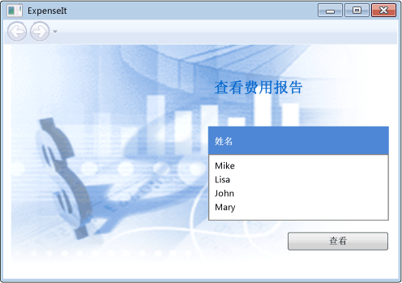
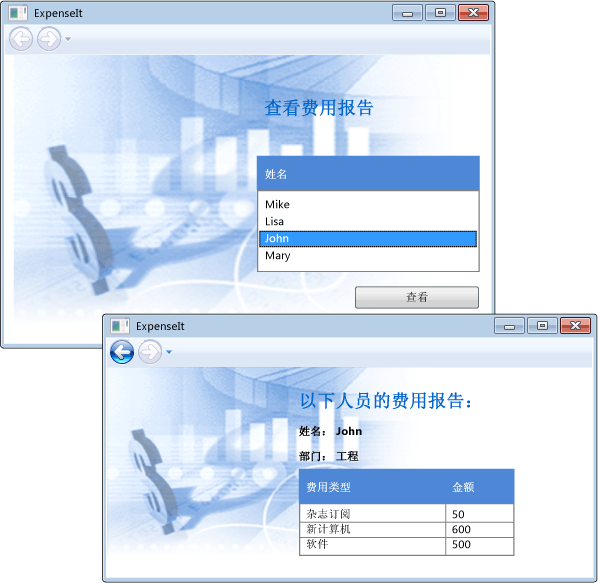

# <a name="walkthrough-my-first-wpf-desktop-application"></a><span data-ttu-id="024b0-102">演练：我的第一个 WPF 桌面应用程序</span><span class="sxs-lookup"><span data-stu-id="024b0-102">Walkthrough: My first WPF desktop application</span></span>

<span data-ttu-id="024b0-103">本文介绍如何开发一个简单的 Windows Presentation Foundation (WPF) 应用程序，其中包括大多数 WPF 应用程序共有的元素： Extensible Application Markup Language (XAML) 标记、 代码隐藏、 应用程序定义控件、 布局、 数据绑定和样式。</span><span class="sxs-lookup"><span data-stu-id="024b0-103">This article shows you how to develop a simple Windows Presentation Foundation (WPF) application that includes the elements that are common to most WPF applications: Extensible Application Markup Language (XAML) markup, code-behind, application definitions, controls, layout, data binding, and styles.</span></span>

<span data-ttu-id="024b0-104">本演练包含以下步骤：</span><span class="sxs-lookup"><span data-stu-id="024b0-104">This walkthrough includes the following steps:</span></span>

- <span data-ttu-id="024b0-105">使用 XAML 来设计应用程序的用户界面 (UI) 的外观。</span><span class="sxs-lookup"><span data-stu-id="024b0-105">Use XAML to design the appearance of the application's user interface (UI).</span></span>

- <span data-ttu-id="024b0-106">编写代码以生成应用程序的行为。</span><span class="sxs-lookup"><span data-stu-id="024b0-106">Write code to build the application's behavior.</span></span>

- <span data-ttu-id="024b0-107">创建应用程序定义管理应用程序。</span><span class="sxs-lookup"><span data-stu-id="024b0-107">Create an application definition to manage the application.</span></span>

- <span data-ttu-id="024b0-108">将控件添加和创建布局以构成应用程序 UI。</span><span class="sxs-lookup"><span data-stu-id="024b0-108">Add controls and create the layout to compose the application UI.</span></span>

- <span data-ttu-id="024b0-109">创建应用程序的 UI 具有一致外观的样式。</span><span class="sxs-lookup"><span data-stu-id="024b0-109">Create styles for a consistent appearance throughout an application's UI.</span></span>

- <span data-ttu-id="024b0-110">绑定到数据来填充数据从 UI 和保护数据和 UI 同步的用户界面。</span><span class="sxs-lookup"><span data-stu-id="024b0-110">Bind the UI to data to both populate the UI from data and keep the data and UI synchronized.</span></span>

<span data-ttu-id="024b0-111">本演练结束时，你将生成独立的 Windows 应用程序，允许用户查看所选人员的费用报表。</span><span class="sxs-lookup"><span data-stu-id="024b0-111">By the end of the walkthrough, you'll have built a standalone Windows application that allows users to view expense reports for selected people.</span></span> <span data-ttu-id="024b0-112">应用程序的托管在浏览器样式的窗口中的多个 WPF 页面组成。</span><span class="sxs-lookup"><span data-stu-id="024b0-112">The application is composed of several WPF pages that are hosted in a browser-style window.</span></span>

> [!TIP]
> <span data-ttu-id="024b0-113">用于生成此演练的示例代码是适用于 Visual Basic 和 C# 均适用于[生成 WPF 应用程序简介](https://go.microsoft.com/fwlink/?LinkID=160008)。</span><span class="sxs-lookup"><span data-stu-id="024b0-113">The sample code that is used to build this walkthrough is available for both Visual Basic and C# at [Introduction to Building WPF Applications](https://go.microsoft.com/fwlink/?LinkID=160008).</span></span>

## <a name="prerequisites"></a><span data-ttu-id="024b0-114">系统必备</span><span class="sxs-lookup"><span data-stu-id="024b0-114">Prerequisites</span></span>

- <span data-ttu-id="024b0-115">Visual Studio 2012 或更高版本</span><span class="sxs-lookup"><span data-stu-id="024b0-115">Visual Studio 2012 or later</span></span>

<span data-ttu-id="024b0-116">有关安装 Visual Studio 的最新版本的详细信息，请参阅[安装 Visual Studio](/visualstudio/install/install-visual-studio)。</span><span class="sxs-lookup"><span data-stu-id="024b0-116">For more information about installing the latest version of Visual Studio, see [Install Visual Studio](/visualstudio/install/install-visual-studio).</span></span>

## <a name="create-the-application-project"></a><span data-ttu-id="024b0-117">创建应用程序项目</span><span class="sxs-lookup"><span data-stu-id="024b0-117">Create the application project</span></span>

<span data-ttu-id="024b0-118">第一步是创建应用程序基础结构，其中包括应用程序定义，两个页面和一个图像。</span><span class="sxs-lookup"><span data-stu-id="024b0-118">The first step is to create the application infrastructure, which includes an application definition, two pages, and an image.</span></span>

1. <span data-ttu-id="024b0-119">在 Visual Basic 或 Visual C# 名为创建新的 WPF 应用程序项目**`ExpenseIt`**:</span><span class="sxs-lookup"><span data-stu-id="024b0-119">Create a new WPF Application project in Visual Basic or Visual C# named **`ExpenseIt`**:</span></span>

   1. <span data-ttu-id="024b0-120">打开 Visual Studio 并选择**文件** > **新建** > **项目**。</span><span class="sxs-lookup"><span data-stu-id="024b0-120">Open Visual Studio and select **File** > **New** > **Project**.</span></span>

      <span data-ttu-id="024b0-121">**新的项目**对话框随即打开。</span><span class="sxs-lookup"><span data-stu-id="024b0-121">The **New Project** dialog opens.</span></span>

   2. <span data-ttu-id="024b0-122">下**已安装**类别中，展开**Visual C#** 或**Visual Basic**节点，然后再选择**Windows 经典桌面**。</span><span class="sxs-lookup"><span data-stu-id="024b0-122">Under the **Installed** category, expand either the **Visual C#** or **Visual Basic** node, and then select **Windows Classic Desktop**.</span></span>

   3. <span data-ttu-id="024b0-123">选择**WPF 应用 (.NET Framework)** 模板。</span><span class="sxs-lookup"><span data-stu-id="024b0-123">Select the **WPF App (.NET Framework)** template.</span></span> <span data-ttu-id="024b0-124">输入的名称**`ExpenseIt`** ，然后选择**确定**。</span><span class="sxs-lookup"><span data-stu-id="024b0-124">Enter the name **`ExpenseIt`** and then select **OK**.</span></span>

      

      <span data-ttu-id="024b0-126">Visual Studio 创建项目并打开名为的默认应用程序窗口的设计器**MainWindow.xaml**。</span><span class="sxs-lookup"><span data-stu-id="024b0-126">Visual Studio creates the project and opens the designer for the default application window named **MainWindow.xaml**.</span></span>

   > [!NOTE]
   > <span data-ttu-id="024b0-127">本演练使用<xref:System.Windows.Controls.DataGrid>在.NET Framework 4 和更高版本的控件。</span><span class="sxs-lookup"><span data-stu-id="024b0-127">This walkthrough uses the <xref:System.Windows.Controls.DataGrid> control that is available in the .NET Framework 4 and later.</span></span> <span data-ttu-id="024b0-128">为确保你的项目面向.NET Framework 4 或更高版本。</span><span class="sxs-lookup"><span data-stu-id="024b0-128">Be sure that your project targets the .NET Framework 4 or later.</span></span> <span data-ttu-id="024b0-129">有关详细信息，请参阅[如何：面向 .NET Framework 的某个版本](/visualstudio/ide/how-to-target-a-version-of-the-dotnet-framework)。</span><span class="sxs-lookup"><span data-stu-id="024b0-129">For more information, see [How to: Target a Version of the .NET Framework](/visualstudio/ide/how-to-target-a-version-of-the-dotnet-framework).</span></span>

2. <span data-ttu-id="024b0-130">打开*Application.xaml* (Visual Basic) 或*App.xaml* (C#)。</span><span class="sxs-lookup"><span data-stu-id="024b0-130">Open *Application.xaml* (Visual Basic) or *App.xaml* (C#).</span></span>

    <span data-ttu-id="024b0-131">此 XAML 文件定义 WPF 应用程序和任何应用程序资源。</span><span class="sxs-lookup"><span data-stu-id="024b0-131">This XAML file defines a WPF application and any application resources.</span></span> <span data-ttu-id="024b0-132">此外使用此文件来指定用户界面时，会自动显示在应用程序启动;在这种情况下， *MainWindow.xaml*。</span><span class="sxs-lookup"><span data-stu-id="024b0-132">You also use this file to specify the UI that automatically shows when the application starts; in this case, *MainWindow.xaml*.</span></span>

    <span data-ttu-id="024b0-133">在 XAML 应在 Visual Basic 中如下所示：</span><span class="sxs-lookup"><span data-stu-id="024b0-133">Your XAML should look like this in Visual Basic:</span></span>

    [!code-xaml[ExpenseIt#1_A](../../../../samples/snippets/visualbasic/VS_Snippets_Wpf/ExpenseIt/VB/ExpenseIt1_A/Application.xaml#1_a)]

    <span data-ttu-id="024b0-134">或者，在 C# 中是这样：</span><span class="sxs-lookup"><span data-stu-id="024b0-134">Or like this in C#:</span></span>

    [!code-xaml[ExpenseIt#1](../../../../samples/snippets/csharp/VS_Snippets_Wpf/ExpenseIt/CSharp/ExpenseIt/App.xaml#1)]

3. <span data-ttu-id="024b0-135">打开*MainWindow.xaml*。</span><span class="sxs-lookup"><span data-stu-id="024b0-135">Open *MainWindow.xaml*.</span></span>

    <span data-ttu-id="024b0-136">此 XAML 文件是你的应用程序的主窗口，并显示在页面中创建的内容。</span><span class="sxs-lookup"><span data-stu-id="024b0-136">This XAML file is the main window of your application and displays content created in pages.</span></span> <span data-ttu-id="024b0-137"><xref:System.Windows.Window>类定义的属性窗口中，例如其标题、 大小或图标，并处理事件，例如关闭或隐藏。</span><span class="sxs-lookup"><span data-stu-id="024b0-137">The <xref:System.Windows.Window> class defines the properties of a window, such as its title, size, or icon, and handles events, such as closing or hiding.</span></span>

4. <span data-ttu-id="024b0-138">更改<xref:System.Windows.Window>元素<xref:System.Windows.Navigation.NavigationWindow>，如以下 XAML 所示：</span><span class="sxs-lookup"><span data-stu-id="024b0-138">Change the <xref:System.Windows.Window> element to a <xref:System.Windows.Navigation.NavigationWindow>, as shown in the following XAML:</span></span>

   ```xaml
   <NavigationWindow x:Class="ExpenseIt.MainWindow"
        xmlns="http://schemas.microsoft.com/winfx/2006/xaml/presentation"
        xmlns:x="http://schemas.microsoft.com/winfx/2006/xaml"
        ...
   </NavigationWindow>
   ```

   <span data-ttu-id="024b0-139">此应用程序中导航到不同的内容，具体取决于用户输入。</span><span class="sxs-lookup"><span data-stu-id="024b0-139">This app navigates to different content depending on the user input.</span></span> <span data-ttu-id="024b0-140">这就是为什么主要<xref:System.Windows.Window>需要更改为<xref:System.Windows.Navigation.NavigationWindow>。</span><span class="sxs-lookup"><span data-stu-id="024b0-140">This is why the main <xref:System.Windows.Window> needs to be changed to a <xref:System.Windows.Navigation.NavigationWindow>.</span></span> <span data-ttu-id="024b0-141"><xref:System.Windows.Navigation.NavigationWindow> 继承的所有属性<xref:System.Windows.Window>。</span><span class="sxs-lookup"><span data-stu-id="024b0-141"><xref:System.Windows.Navigation.NavigationWindow> inherits all the properties of <xref:System.Windows.Window>.</span></span> <span data-ttu-id="024b0-142"><xref:System.Windows.Navigation.NavigationWindow> XAML 文件中的元素创建的实例<xref:System.Windows.Navigation.NavigationWindow>类。</span><span class="sxs-lookup"><span data-stu-id="024b0-142">The <xref:System.Windows.Navigation.NavigationWindow> element in the XAML file creates an instance of the <xref:System.Windows.Navigation.NavigationWindow> class.</span></span> <span data-ttu-id="024b0-143">有关详细信息，请参阅[导航概述](../../../../docs/framework/wpf/app-development/navigation-overview.md)。</span><span class="sxs-lookup"><span data-stu-id="024b0-143">For more information, see [Navigation overview](../../../../docs/framework/wpf/app-development/navigation-overview.md).</span></span>

5. <span data-ttu-id="024b0-144">更改以下属性上<xref:System.Windows.Navigation.NavigationWindow>元素：</span><span class="sxs-lookup"><span data-stu-id="024b0-144">Change the following properties on the <xref:System.Windows.Navigation.NavigationWindow> element:</span></span>

    - <span data-ttu-id="024b0-145">设置<xref:System.Windows.Window.Title%2A>属性设置为"`ExpenseIt`"。</span><span class="sxs-lookup"><span data-stu-id="024b0-145">Set the <xref:System.Windows.Window.Title%2A> property to "`ExpenseIt`".</span></span>

    - <span data-ttu-id="024b0-146">设置<xref:System.Windows.FrameworkElement.Width%2A>属性设置为 500 像素。</span><span class="sxs-lookup"><span data-stu-id="024b0-146">Set the <xref:System.Windows.FrameworkElement.Width%2A> property to 500 pixels.</span></span>

    - <span data-ttu-id="024b0-147">设置<xref:System.Windows.FrameworkElement.Height%2A>属性设置为 350 像素。</span><span class="sxs-lookup"><span data-stu-id="024b0-147">Set the <xref:System.Windows.FrameworkElement.Height%2A> property to 350 pixels.</span></span>

    - <span data-ttu-id="024b0-148">删除<xref:System.Windows.Controls.Grid>之间的元素<xref:System.Windows.Navigation.NavigationWindow>标记。</span><span class="sxs-lookup"><span data-stu-id="024b0-148">Remove the <xref:System.Windows.Controls.Grid> elements between the <xref:System.Windows.Navigation.NavigationWindow> tags.</span></span>

    <span data-ttu-id="024b0-149">在 XAML 应在 Visual Basic 中如下所示：</span><span class="sxs-lookup"><span data-stu-id="024b0-149">Your XAML should look like this in Visual Basic:</span></span>

    [!code-xaml[ExpenseIt#2_A](../../../../samples/snippets/visualbasic/VS_Snippets_Wpf/ExpenseIt/VB/ExpenseIt/MainWindow.xaml#2_a)]

    <span data-ttu-id="024b0-150">或者，在 C# 中是这样：</span><span class="sxs-lookup"><span data-stu-id="024b0-150">Or like this in C#:</span></span>

    [!code-xaml[ExpenseIt#2](../../../../samples/snippets/csharp/VS_Snippets_Wpf/ExpenseIt/CSharp/ExpenseIt/MainWindow.xaml#2)]

6. <span data-ttu-id="024b0-151">打开*MainWindow.xaml.vb*或*MainWindow.xaml.cs*。</span><span class="sxs-lookup"><span data-stu-id="024b0-151">Open *MainWindow.xaml.vb* or *MainWindow.xaml.cs*.</span></span>

    <span data-ttu-id="024b0-152">此文件是包含代码来处理中声明的事件的代码隐藏文件*MainWindow.xaml*。</span><span class="sxs-lookup"><span data-stu-id="024b0-152">This file is a code-behind file that contains code to handle the events declared in *MainWindow.xaml*.</span></span> <span data-ttu-id="024b0-153">此文件包含在 XAML 中定义的窗口的分部类。</span><span class="sxs-lookup"><span data-stu-id="024b0-153">This file contains a partial class for the window defined in XAML.</span></span>

7. <span data-ttu-id="024b0-154">如果使用的 C#，更改`MainWindow`类进行派生<xref:System.Windows.Navigation.NavigationWindow>。</span><span class="sxs-lookup"><span data-stu-id="024b0-154">If you are using C#, change the `MainWindow` class to derive from <xref:System.Windows.Navigation.NavigationWindow>.</span></span> <span data-ttu-id="024b0-155">（在 Visual Basic 中，自动发生此情况更改 XAML 中的窗口。）</span><span class="sxs-lookup"><span data-stu-id="024b0-155">(In Visual Basic, this happens automatically when you change the window in XAML.)</span></span>

   <span data-ttu-id="024b0-156">你的代码应如下所示：</span><span class="sxs-lookup"><span data-stu-id="024b0-156">Your code should look like this:</span></span>

   [!code-csharp[ExpenseIt#3](../../../../samples/snippets/csharp/VS_Snippets_Wpf/ExpenseIt/CSharp/ExpenseIt/MainWindow.xaml.cs#3)]
   [!code-vb[ExpenseIt#3](../../../../samples/snippets/visualbasic/VS_Snippets_Wpf/ExpenseIt/VB/ExpenseIt1_A/MainWindow.xaml.vb#3)]

   > [!TIP]
   > <span data-ttu-id="024b0-157">您可以切换之间 C# 和 Visual Basic 中的示例代码的代码语言**语言**这篇文章右上角的下拉列表。</span><span class="sxs-lookup"><span data-stu-id="024b0-157">You can toggle the code language of the sample code between C# and Visual Basic in the **Language** drop-down on the upper right side of this article.</span></span>

## <a name="add-files-to-the-application"></a><span data-ttu-id="024b0-158">将文件添加到应用程序</span><span class="sxs-lookup"><span data-stu-id="024b0-158">Add files to the application</span></span>

<span data-ttu-id="024b0-159">本部分将向应用程序添加两个页面和一个图像。</span><span class="sxs-lookup"><span data-stu-id="024b0-159">In this section, you'll add two pages and an image to the application.</span></span>

1. <span data-ttu-id="024b0-160">将新的 WPF 页添加到项目中，并将其命名*`ExpenseItHome.xaml`*:</span><span class="sxs-lookup"><span data-stu-id="024b0-160">Add a new WPF page to the project, and name it *`ExpenseItHome.xaml`*:</span></span>

   1. <span data-ttu-id="024b0-161">在中**解决方案资源管理器**，右键单击**`ExpenseIt`** 项目节点，然后选择**添加** > **页**。</span><span class="sxs-lookup"><span data-stu-id="024b0-161">In **Solution Explorer**, right-click on the **`ExpenseIt`** project node and choose **Add** > **Page**.</span></span>

   1. <span data-ttu-id="024b0-162">在中**添加新项**对话框中，**页面 (WPF)** 尚未选择模板。</span><span class="sxs-lookup"><span data-stu-id="024b0-162">In the **Add New Item** dialog, the **Page (WPF)** template is already selected.</span></span> <span data-ttu-id="024b0-163">输入的名称**`ExpenseItHome`**，然后选择**添加**。</span><span class="sxs-lookup"><span data-stu-id="024b0-163">Enter the name **`ExpenseItHome`**, and then select **Add**.</span></span>

    <span data-ttu-id="024b0-164">此页是应用程序启动时显示的第一页。</span><span class="sxs-lookup"><span data-stu-id="024b0-164">This page is the first page that's displayed when the application is launched.</span></span> <span data-ttu-id="024b0-165">它将显示要从中，以查看其费用报表的人员列表。</span><span class="sxs-lookup"><span data-stu-id="024b0-165">It will show a list of people to select from, to show an expense report for.</span></span>

2. <span data-ttu-id="024b0-166">打开*`ExpenseItHome.xaml`*。</span><span class="sxs-lookup"><span data-stu-id="024b0-166">Open *`ExpenseItHome.xaml`*.</span></span>

3. <span data-ttu-id="024b0-167">设置<xref:System.Windows.Controls.Page.Title%2A>到"`ExpenseIt - Home`"。</span><span class="sxs-lookup"><span data-stu-id="024b0-167">Set the <xref:System.Windows.Controls.Page.Title%2A> to "`ExpenseIt - Home`".</span></span>

    <span data-ttu-id="024b0-168">在 XAML 应在 Visual Basic 中如下所示：</span><span class="sxs-lookup"><span data-stu-id="024b0-168">Your XAML should look like this in Visual Basic:</span></span>

    [!code-xaml[ExpenseIt#6_A](../../../../samples/snippets/visualbasic/VS_Snippets_Wpf/ExpenseIt/VB/ExpenseIt1_A/ExpenseItHome.xaml#6_a)]

    <span data-ttu-id="024b0-169">或者，在 C# 中是这样：</span><span class="sxs-lookup"><span data-stu-id="024b0-169">Or this in C#:</span></span>

    [!code-xaml[ExpenseIt#6](../../../../samples/snippets/csharp/VS_Snippets_Wpf/ExpenseIt/CSharp/ExpenseIt2/ExpenseItHome.xaml#6)]

4. <span data-ttu-id="024b0-170">打开*MainWindow.xaml*。</span><span class="sxs-lookup"><span data-stu-id="024b0-170">Open *MainWindow.xaml*.</span></span>

5. <span data-ttu-id="024b0-171">设置<xref:System.Windows.Navigation.NavigationWindow.Source%2A>上的属性<xref:System.Windows.Navigation.NavigationWindow>到"`ExpenseItHome.xaml`"。</span><span class="sxs-lookup"><span data-stu-id="024b0-171">Set the <xref:System.Windows.Navigation.NavigationWindow.Source%2A> property on the <xref:System.Windows.Navigation.NavigationWindow> to "`ExpenseItHome.xaml`".</span></span>

    <span data-ttu-id="024b0-172">这将设置*`ExpenseItHome.xaml`* 的第一页时打开应用程序启动。</span><span class="sxs-lookup"><span data-stu-id="024b0-172">This sets *`ExpenseItHome.xaml`* to be the first page opened when the application starts.</span></span> <span data-ttu-id="024b0-173">在 XAML 应在 Visual Basic 中如下所示：</span><span class="sxs-lookup"><span data-stu-id="024b0-173">Your XAML should look like this in Visual Basic:</span></span>

    [!code-xaml[ExpenseIt#7_A](../../../../samples/snippets/visualbasic/VS_Snippets_Wpf/ExpenseIt/VB/ExpenseIt1_A/MainWindow.xaml#7_a)]

    <span data-ttu-id="024b0-174">或者，在 C# 中是这样：</span><span class="sxs-lookup"><span data-stu-id="024b0-174">Or this in C#:</span></span>

    [!code-xaml[ExpenseIt#7](../../../../samples/snippets/csharp/VS_Snippets_Wpf/ExpenseIt/CSharp/ExpenseIt2/MainWindow.xaml#7)]

   > [!TIP]
   > <span data-ttu-id="024b0-175">您还可以设置**源**属性中的**杂项**类别**属性**窗口。</span><span class="sxs-lookup"><span data-stu-id="024b0-175">You can also set the **Source** property in the **Miscellaneous** category of the **Properties** window.</span></span>
   >
   > 

6. <span data-ttu-id="024b0-177">将另一个新的 WPF 页添加到项目中，并将其命名*ExpenseReportPage.xaml*::</span><span class="sxs-lookup"><span data-stu-id="024b0-177">Add another new WPF page to the project, and name it *ExpenseReportPage.xaml*::</span></span>

   1. <span data-ttu-id="024b0-178">在中**解决方案资源管理器**，右键单击**`ExpenseIt`** 项目节点，然后选择**添加** > **页**。</span><span class="sxs-lookup"><span data-stu-id="024b0-178">In **Solution Explorer**, right-click on the **`ExpenseIt`** project node and choose **Add** > **Page**.</span></span>

   1. <span data-ttu-id="024b0-179">在中**添加新项**对话框中，**页面 (WPF)** 尚未选择模板。</span><span class="sxs-lookup"><span data-stu-id="024b0-179">In the **Add New Item** dialog, the **Page (WPF)** template is already selected.</span></span> <span data-ttu-id="024b0-180">输入的名称**ExpenseReportPage**，然后选择**添加**。</span><span class="sxs-lookup"><span data-stu-id="024b0-180">Enter the name **ExpenseReportPage**, and then select **Add**.</span></span>

    <span data-ttu-id="024b0-181">此页会显示费用报表上选择的人员**`ExpenseItHome`** 页。</span><span class="sxs-lookup"><span data-stu-id="024b0-181">This page will show the expense report for the person that is selected on the **`ExpenseItHome`** page.</span></span>

7. <span data-ttu-id="024b0-182">打开 *ExpenseReportPage.xaml*。</span><span class="sxs-lookup"><span data-stu-id="024b0-182">Open *ExpenseReportPage.xaml*.</span></span>

8. <span data-ttu-id="024b0-183">设置<xref:System.Windows.Controls.Page.Title%2A>到"`ExpenseIt - View Expense`"。</span><span class="sxs-lookup"><span data-stu-id="024b0-183">Set the <xref:System.Windows.Controls.Page.Title%2A> to "`ExpenseIt - View Expense`".</span></span>

    <span data-ttu-id="024b0-184">在 XAML 应在 Visual Basic 中如下所示：</span><span class="sxs-lookup"><span data-stu-id="024b0-184">Your XAML should look like this in Visual Basic:</span></span>

    [!code-xaml[ExpenseIt#4_A](../../../../samples/snippets/visualbasic/VS_Snippets_Wpf/ExpenseIt/VB/ExpenseIt1_A/ExpenseReportPage.xaml#4_a)]

    <span data-ttu-id="024b0-185">或者，在 C# 中是这样：</span><span class="sxs-lookup"><span data-stu-id="024b0-185">Or this in C#:</span></span>

    [!code-xaml[ExpenseIt#4](../../../../samples/snippets/csharp/VS_Snippets_Wpf/ExpenseIt/CSharp/ExpenseIt/ExpenseReportPage.xaml#4)]

9. <span data-ttu-id="024b0-186">打开*ExpenseItHome.xaml.vb*并*ExpenseReportPage.xaml.vb*，或*ExpenseItHome.xaml.cs*和*ExpenseReportPage.xaml.cs*.</span><span class="sxs-lookup"><span data-stu-id="024b0-186">Open *ExpenseItHome.xaml.vb* and *ExpenseReportPage.xaml.vb*, or *ExpenseItHome.xaml.cs* and *ExpenseReportPage.xaml.cs*.</span></span>

    <span data-ttu-id="024b0-187">创建新的页面文件时，Visual Studio 将自动创建*代码隐藏*文件。</span><span class="sxs-lookup"><span data-stu-id="024b0-187">When you create a new Page file, Visual Studio automatically creates a *code-behind* file.</span></span> <span data-ttu-id="024b0-188">这些代码隐藏文件处理响应用户输入的逻辑。</span><span class="sxs-lookup"><span data-stu-id="024b0-188">These code-behind files handle the logic for responding to user input.</span></span>

    <span data-ttu-id="024b0-189">你的代码应如下所示的**`ExpenseItHome`**:</span><span class="sxs-lookup"><span data-stu-id="024b0-189">Your code should look like this for **`ExpenseItHome`**:</span></span>

    [!code-csharp[ExpenseIt#2_5](../../../../samples/snippets/csharp/VS_Snippets_Wpf/ExpenseIt/CSharp/ExpenseIt2/ExpenseItHome.xaml.cs#2_5)]
    [!code-vb[ExpenseIt#2_5](../../../../samples/snippets/visualbasic/VS_Snippets_Wpf/ExpenseIt/VB/ExpenseIt1_A/ExpenseItHome.xaml.vb#2_5)]

    <span data-ttu-id="024b0-190">并为如下**ExpenseReportPage**:</span><span class="sxs-lookup"><span data-stu-id="024b0-190">And like this for **ExpenseReportPage**:</span></span>

    [!code-csharp[ExpenseIt#5](../../../../samples/snippets/csharp/VS_Snippets_Wpf/ExpenseIt/CSharp/ExpenseIt/ExpenseReportPage.xaml.cs#5)]
    [!code-vb[ExpenseIt#5](../../../../samples/snippets/visualbasic/VS_Snippets_Wpf/ExpenseIt/VB/ExpenseIt1_A/ExpenseReportPage.xaml.vb#5)]

10. <span data-ttu-id="024b0-191">添加名为图像*watermark.png*到项目。</span><span class="sxs-lookup"><span data-stu-id="024b0-191">Add an image named *watermark.png* to the project.</span></span> <span data-ttu-id="024b0-192">可以创建自己的映像、 将文件从示例代码中，或获取它[此处](https://github.com/dotnet/docs/blob/master/docs/framework/wpf/getting-started/media/watermark.png)。</span><span class="sxs-lookup"><span data-stu-id="024b0-192">You can create your own image, copy the file from the sample code, or get it [here](https://github.com/dotnet/docs/blob/master/docs/framework/wpf/getting-started/media/watermark.png).</span></span>

   1. <span data-ttu-id="024b0-193">右键单击项目节点并选择**外** > **现有项**，或按**Shift**+**Alt**+ **A**。</span><span class="sxs-lookup"><span data-stu-id="024b0-193">Right-click on the project node and select **Add** > **Existing Item**, or press **Shift**+**Alt**+**A**.</span></span>

   2. <span data-ttu-id="024b0-194">在中**添加现有项**对话框中，浏览到你想要使用，并选择图像文件**添加**。</span><span class="sxs-lookup"><span data-stu-id="024b0-194">In the **Add Existing Item** dialog, browse to the image file you want to use, and then select **Add**.</span></span>

## <a name="build-and-run-the-application"></a><span data-ttu-id="024b0-195">编译和运行应用程序</span><span class="sxs-lookup"><span data-stu-id="024b0-195">Build and run the application</span></span>

1. <span data-ttu-id="024b0-196">若要生成并运行应用程序，按**F5**或选择**开始调试**从**调试**菜单。</span><span class="sxs-lookup"><span data-stu-id="024b0-196">To build and run the application, press **F5** or select **Start Debugging** from the **Debug** menu.</span></span>

    <span data-ttu-id="024b0-197">下图显示了与应用程序<xref:System.Windows.Navigation.NavigationWindow>按钮：</span><span class="sxs-lookup"><span data-stu-id="024b0-197">The following illustration shows the application with the <xref:System.Windows.Navigation.NavigationWindow> buttons:</span></span>

    

2. <span data-ttu-id="024b0-199">关闭要返回到 Visual Studio 的应用程序。</span><span class="sxs-lookup"><span data-stu-id="024b0-199">Close the application to return to Visual Studio.</span></span>

## <a name="create-the-layout"></a><span data-ttu-id="024b0-200">创建布局</span><span class="sxs-lookup"><span data-stu-id="024b0-200">Create the layout</span></span>

<span data-ttu-id="024b0-201">布局提供有序的方式来放置 UI 元素，并调整 UI 时还管理的大小和这些元素的位置。</span><span class="sxs-lookup"><span data-stu-id="024b0-201">Layout provides an ordered way to place UI elements, and also manages the size and position of those elements when a UI is resized.</span></span> <span data-ttu-id="024b0-202">通常使用以下布局控件之一来创建布局：</span><span class="sxs-lookup"><span data-stu-id="024b0-202">You typically create a layout with one of the following layout controls:</span></span>

- <xref:System.Windows.Controls.Canvas>
- <xref:System.Windows.Controls.DockPanel>
- <xref:System.Windows.Controls.Grid>
- <xref:System.Windows.Controls.StackPanel>
- <xref:System.Windows.Controls.VirtualizingStackPanel>
- <xref:System.Windows.Controls.WrapPanel>

<span data-ttu-id="024b0-203">每个布局控件都为子元素支持特殊类型的布局。</span><span class="sxs-lookup"><span data-stu-id="024b0-203">Each of these layout controls supports a special type of layout for its child elements.</span></span> <span data-ttu-id="024b0-204">`ExpenseIt` 页面可进行调整，但每个页面不水平或垂直排列以及其他元素的元素。</span><span class="sxs-lookup"><span data-stu-id="024b0-204">`ExpenseIt` pages can be resized, and each page has elements that are arranged horizontally and vertically alongside other elements.</span></span> <span data-ttu-id="024b0-205">因此，<xref:System.Windows.Controls.Grid>是应用程序的理想布局元素。</span><span class="sxs-lookup"><span data-stu-id="024b0-205">Consequently, the <xref:System.Windows.Controls.Grid> is the ideal layout element for the application.</span></span>

> [!TIP]
> <span data-ttu-id="024b0-206">有关详细信息<xref:System.Windows.Controls.Panel>元素，请参阅[面板概述](../../../../docs/framework/wpf/controls/panels-overview.md)。</span><span class="sxs-lookup"><span data-stu-id="024b0-206">For more information about <xref:System.Windows.Controls.Panel> elements, see [Panels overview](../../../../docs/framework/wpf/controls/panels-overview.md).</span></span> <span data-ttu-id="024b0-207">有关布局的详细信息，请参阅[布局](../../../../docs/framework/wpf/advanced/layout.md)。</span><span class="sxs-lookup"><span data-stu-id="024b0-207">For more information about layout, see [Layout](../../../../docs/framework/wpf/advanced/layout.md).</span></span>

<span data-ttu-id="024b0-208">在部分中，您创建的单列表包含三个行和 10 像素边距添加到的列和行定义<xref:System.Windows.Controls.Grid>中*`ExpenseItHome.xaml`*。</span><span class="sxs-lookup"><span data-stu-id="024b0-208">In the section, you create a single-column table with three rows and a 10-pixel margin by adding column and row definitions to the <xref:System.Windows.Controls.Grid> in *`ExpenseItHome.xaml`*.</span></span>

1. <span data-ttu-id="024b0-209">打开*`ExpenseItHome.xaml`*。</span><span class="sxs-lookup"><span data-stu-id="024b0-209">Open *`ExpenseItHome.xaml`*.</span></span>

2. <span data-ttu-id="024b0-210">设置<xref:System.Windows.FrameworkElement.Margin%2A>属性上的<xref:System.Windows.Controls.Grid>"10,0,10,10"，对应于左侧、 顶部、 右侧和底部边距的元素：</span><span class="sxs-lookup"><span data-stu-id="024b0-210">Set the <xref:System.Windows.FrameworkElement.Margin%2A> property on the <xref:System.Windows.Controls.Grid> element to "10,0,10,10", which corresponds to left, top, right and bottom margins:</span></span>

   ```xaml
   <Grid Margin="10,0,10,10">
   ```

   > [!TIP]
   > <span data-ttu-id="024b0-211">您还可以设置**边距**中的值**属性**窗口下**布局**类别：</span><span class="sxs-lookup"><span data-stu-id="024b0-211">You can also set the **Margin** values in the **Properties** window, under the **Layout** category:</span></span>
   >
   > 

3. <span data-ttu-id="024b0-213">添加以下 XAML 之间<xref:System.Windows.Controls.Grid>标记以创建行和列定义：</span><span class="sxs-lookup"><span data-stu-id="024b0-213">Add the following XAML between the <xref:System.Windows.Controls.Grid> tags to create the row and column definitions:</span></span>

    [!code-xaml[ExpenseIt#8](../../../../samples/snippets/csharp/VS_Snippets_Wpf/ExpenseIt/CSharp/ExpenseIt3/ExpenseItHome.xaml#8)]

    <span data-ttu-id="024b0-214"><xref:System.Windows.Controls.RowDefinition.Height%2A>的两个行设置为<xref:System.Windows.GridLength.Auto%2A>，这意味着行大小将调整的基础的行中的内容。</span><span class="sxs-lookup"><span data-stu-id="024b0-214">The <xref:System.Windows.Controls.RowDefinition.Height%2A> of two rows is set to <xref:System.Windows.GridLength.Auto%2A>, which means that the rows are sized base on the content in the rows.</span></span> <span data-ttu-id="024b0-215">默认值<xref:System.Windows.Controls.RowDefinition.Height%2A>是<xref:System.Windows.GridUnitType.Star>大小调整，这意味着行的高度可用空间的加权的比例。</span><span class="sxs-lookup"><span data-stu-id="024b0-215">The default <xref:System.Windows.Controls.RowDefinition.Height%2A> is <xref:System.Windows.GridUnitType.Star> sizing, which means that the row height is a weighted proportion of the available space.</span></span> <span data-ttu-id="024b0-216">例如，如果两个行具有<xref:System.Windows.Controls.RowDefinition.Height%2A>的"\*"，它们都有高度将会是可用空间的一半。</span><span class="sxs-lookup"><span data-stu-id="024b0-216">For example if two rows each have a <xref:System.Windows.Controls.RowDefinition.Height%2A> of "\*", they each have a height that is half of the available space.</span></span>

    <span data-ttu-id="024b0-217">你<xref:System.Windows.Controls.Grid>现在应如以下 XAML 所示：</span><span class="sxs-lookup"><span data-stu-id="024b0-217">Your <xref:System.Windows.Controls.Grid> should now look like the following XAML:</span></span>

    [!code-xaml[ExpenseIt#9](../../../../samples/snippets/csharp/VS_Snippets_Wpf/ExpenseIt/CSharp/ExpenseIt3/ExpenseItHome.xaml#9)]

## <a name="add-controls"></a><span data-ttu-id="024b0-218">添加控件</span><span class="sxs-lookup"><span data-stu-id="024b0-218">Add controls</span></span>

<span data-ttu-id="024b0-219">在本部分中，将更新主页 UI 以显示一个用户可以选择从以显示费用报表的人员列表。</span><span class="sxs-lookup"><span data-stu-id="024b0-219">In this section, you'll update the home page UI to show a list of people that a user can select from to show the expense report for.</span></span> <span data-ttu-id="024b0-220">控件是允许用户与应用程序交互的 UI 对象。</span><span class="sxs-lookup"><span data-stu-id="024b0-220">Controls are UI objects that allow users to interact with your application.</span></span> <span data-ttu-id="024b0-221">有关详细信息，请参阅 [控件](../../../../docs/framework/wpf/controls/index.md)。</span><span class="sxs-lookup"><span data-stu-id="024b0-221">For more information, see [Controls](../../../../docs/framework/wpf/controls/index.md).</span></span>

<span data-ttu-id="024b0-222">若要创建此 UI，将添加到以下元素*`ExpenseItHome.xaml`*:</span><span class="sxs-lookup"><span data-stu-id="024b0-222">To create this UI, you'll add the following elements to *`ExpenseItHome.xaml`*:</span></span>

- <span data-ttu-id="024b0-223"><xref:System.Windows.Controls.ListBox> （用于人员列表）。</span><span class="sxs-lookup"><span data-stu-id="024b0-223"><xref:System.Windows.Controls.ListBox> (for the list of people).</span></span>
- <span data-ttu-id="024b0-224"><xref:System.Windows.Controls.Label> （用于列表标题）。</span><span class="sxs-lookup"><span data-stu-id="024b0-224"><xref:System.Windows.Controls.Label> (for the list header).</span></span>
- <span data-ttu-id="024b0-225"><xref:System.Windows.Controls.Button> （若要单击以查看费用报表的列表中选择的人员）。</span><span class="sxs-lookup"><span data-stu-id="024b0-225"><xref:System.Windows.Controls.Button> (to click to view the expense report for the person that is selected in the list).</span></span>

<span data-ttu-id="024b0-226">每个控件的某一行中放置<xref:System.Windows.Controls.Grid>通过设置<xref:System.Windows.Controls.Grid.Row%2A?displayProperty=nameWithType>附加属性。</span><span class="sxs-lookup"><span data-stu-id="024b0-226">Each control is placed in a row of the <xref:System.Windows.Controls.Grid> by setting the <xref:System.Windows.Controls.Grid.Row%2A?displayProperty=nameWithType> attached property.</span></span> <span data-ttu-id="024b0-227">有关附加属性的详细信息，请参阅[附加属性概述](../../../../docs/framework/wpf/advanced/attached-properties-overview.md)。</span><span class="sxs-lookup"><span data-stu-id="024b0-227">For more information about attached properties, see [Attached Properties Overview](../../../../docs/framework/wpf/advanced/attached-properties-overview.md).</span></span>

1. <span data-ttu-id="024b0-228">打开*`ExpenseItHome.xaml`*。</span><span class="sxs-lookup"><span data-stu-id="024b0-228">Open *`ExpenseItHome.xaml`*.</span></span>

2. <span data-ttu-id="024b0-229">添加以下 XAML 某处之间<xref:System.Windows.Controls.Grid>标记：</span><span class="sxs-lookup"><span data-stu-id="024b0-229">Add the following XAML somewhere between the <xref:System.Windows.Controls.Grid> tags:</span></span>

   [!code-xaml[ExpenseIt#10](../../../../samples/snippets/csharp/VS_Snippets_Wpf/ExpenseIt/CSharp/ExpenseIt4/ExpenseItHome.xaml#10)]

   > [!TIP]
   > <span data-ttu-id="024b0-230">此外可以通过将其从拖动来创建控件**工具箱**窗口拖到设计窗口中，然后设置其属性**属性**窗口。</span><span class="sxs-lookup"><span data-stu-id="024b0-230">You can also create the controls by dragging them from the **Toolbox** window onto the design window, and then setting their properties in the **Properties** window.</span></span>

3. <span data-ttu-id="024b0-231">生成并运行应用程序。</span><span class="sxs-lookup"><span data-stu-id="024b0-231">Build and run the application.</span></span>

<span data-ttu-id="024b0-232">下图显示了刚创建的控件：</span><span class="sxs-lookup"><span data-stu-id="024b0-232">The following illustration shows the controls you just created:</span></span>


## <a name="add-an-image-and-a-title"></a><span data-ttu-id="024b0-234">添加图像和标题</span><span class="sxs-lookup"><span data-stu-id="024b0-234">Add an image and a title</span></span>

<span data-ttu-id="024b0-235">在本部分中，将更新主页 UI 的图像和页面标题。</span><span class="sxs-lookup"><span data-stu-id="024b0-235">In this section, you'll update the home page UI with an image and a page title.</span></span>

1. <span data-ttu-id="024b0-236">打开*`ExpenseItHome.xaml`*。</span><span class="sxs-lookup"><span data-stu-id="024b0-236">Open *`ExpenseItHome.xaml`*.</span></span>

2. <span data-ttu-id="024b0-237">添加到另一个列<xref:System.Windows.Controls.Grid.ColumnDefinitions%2A>具有固定<xref:System.Windows.Controls.ColumnDefinition.Width%2A>为 230 像素：</span><span class="sxs-lookup"><span data-stu-id="024b0-237">Add another column to the <xref:System.Windows.Controls.Grid.ColumnDefinitions%2A> with a fixed <xref:System.Windows.Controls.ColumnDefinition.Width%2A> of 230 pixels:</span></span>

    [!code-xaml[ExpenseIt#11](../../../../samples/snippets/csharp/VS_Snippets_Wpf/ExpenseIt/CSharp/ExpenseIt5/ExpenseItHome.xaml#11)]

3. <span data-ttu-id="024b0-238">添加到另一行<xref:System.Windows.Controls.Grid.RowDefinitions%2A>，总共四行：</span><span class="sxs-lookup"><span data-stu-id="024b0-238">Add another row to the <xref:System.Windows.Controls.Grid.RowDefinitions%2A>, for a total of four rows:</span></span>

    [!code-xaml[ExpenseIt#11b](../../../../samples/snippets/csharp/VS_Snippets_Wpf/ExpenseIt/CSharp/ExpenseIt5/ExpenseItHome.xaml#11b)]

4. <span data-ttu-id="024b0-239">将控件移动到第二列中，通过设置<xref:System.Windows.Controls.Grid.Column%2A?displayProperty=nameWithType>为 1 的三个控件 （边框、 列表框中，和按钮） 每个属性。</span><span class="sxs-lookup"><span data-stu-id="024b0-239">Move the controls to the second column by setting the <xref:System.Windows.Controls.Grid.Column%2A?displayProperty=nameWithType> property to 1 in each of the three controls (Border, ListBox, and Button).</span></span>

5. <span data-ttu-id="024b0-240">递增每个控件下移一行，其<xref:System.Windows.Controls.Grid.Row%2A?displayProperty=nameWithType>值加 1。</span><span class="sxs-lookup"><span data-stu-id="024b0-240">Move each control down a row, by incrementing its <xref:System.Windows.Controls.Grid.Row%2A?displayProperty=nameWithType> value by 1.</span></span>

   <span data-ttu-id="024b0-241">现在，三个控件的 XAML 如下所示：</span><span class="sxs-lookup"><span data-stu-id="024b0-241">The XAML for the three controls now looks like this:</span></span>

    [!code-xaml[ExpenseIt#12](../../../../samples/snippets/csharp/VS_Snippets_Wpf/ExpenseIt/CSharp/ExpenseIt5/ExpenseItHome.xaml#12)]

6. <span data-ttu-id="024b0-242">设置<xref:System.Windows.Controls.Panel.Background%2A>的<xref:System.Windows.Controls.Grid>要*watermark.png*图像文件，添加以下 XAML 某处之间`<Grid>`和`</Grid>`标记：</span><span class="sxs-lookup"><span data-stu-id="024b0-242">Set the <xref:System.Windows.Controls.Panel.Background%2A> of the <xref:System.Windows.Controls.Grid> to be the *watermark.png* image file, by adding the following XAML somewhere between the `<Grid>` and `</Grid>` tags:</span></span>

    [!code-xaml[ExpenseIt#14](../../../../samples/snippets/csharp/VS_Snippets_Wpf/ExpenseIt/CSharp/ExpenseIt5/ExpenseItHome.xaml#14)]

7. <span data-ttu-id="024b0-243">之前<xref:System.Windows.Controls.Border>元素中，添加<xref:System.Windows.Controls.Label>"查看费用报表"的内容。</span><span class="sxs-lookup"><span data-stu-id="024b0-243">Before the <xref:System.Windows.Controls.Border> element, add a <xref:System.Windows.Controls.Label> with the content "View Expense Report".</span></span> <span data-ttu-id="024b0-244">这是页面的标题。</span><span class="sxs-lookup"><span data-stu-id="024b0-244">This is the title of the page.</span></span>

    [!code-xaml[ExpenseIt#13](../../../../samples/snippets/csharp/VS_Snippets_Wpf/ExpenseIt/CSharp/ExpenseIt5/ExpenseItHome.xaml#13)]

8. <span data-ttu-id="024b0-245">生成并运行应用程序。</span><span class="sxs-lookup"><span data-stu-id="024b0-245">Build and run the application.</span></span>

<span data-ttu-id="024b0-246">下图显示了刚添加的结果：</span><span class="sxs-lookup"><span data-stu-id="024b0-246">The following illustration shows the results of what you just added:</span></span>



## <a name="add-code-to-handle-events"></a><span data-ttu-id="024b0-248">添加代码以处理事件</span><span class="sxs-lookup"><span data-stu-id="024b0-248">Add code to handle events</span></span>

1. <span data-ttu-id="024b0-249">打开*`ExpenseItHome.xaml`*。</span><span class="sxs-lookup"><span data-stu-id="024b0-249">Open *`ExpenseItHome.xaml`*.</span></span>

2. <span data-ttu-id="024b0-250">添加<xref:System.Windows.Controls.Primitives.ButtonBase.Click>事件处理程序<xref:System.Windows.Controls.Button>元素。</span><span class="sxs-lookup"><span data-stu-id="024b0-250">Add a <xref:System.Windows.Controls.Primitives.ButtonBase.Click> event handler to the <xref:System.Windows.Controls.Button> element.</span></span> <span data-ttu-id="024b0-251">有关详细信息，请参阅[如何： 创建简单的事件处理程序](https://msdn.microsoft.com/library/b1456e07-9dec-4354-99cf-18666b64f480)。</span><span class="sxs-lookup"><span data-stu-id="024b0-251">For more information, see [How to: Create a simple event handler](https://msdn.microsoft.com/library/b1456e07-9dec-4354-99cf-18666b64f480).</span></span>

    [!code-xaml[ExpenseIt#15](../../../../samples/snippets/csharp/VS_Snippets_Wpf/ExpenseIt/CSharp/ExpenseIt6/ExpenseItHome.xaml#15)]

3. <span data-ttu-id="024b0-252">打开*`ExpenseItHome.xaml.vb`* 或*`ExpenseItHome.xaml.cs`*。</span><span class="sxs-lookup"><span data-stu-id="024b0-252">Open *`ExpenseItHome.xaml.vb`* or *`ExpenseItHome.xaml.cs`*.</span></span>

4. <span data-ttu-id="024b0-253">将以下代码添加到`ExpenseItHome`类添加一个按钮单击事件处理程序。</span><span class="sxs-lookup"><span data-stu-id="024b0-253">Add the following code to the `ExpenseItHome` class to add a button click event handler.</span></span> <span data-ttu-id="024b0-254">事件处理程序打开**ExpenseReportPage**页。</span><span class="sxs-lookup"><span data-stu-id="024b0-254">The event handler opens the **ExpenseReportPage** page.</span></span>

    [!code-csharp[ExpenseIt#16](../../../../samples/snippets/csharp/VS_Snippets_Wpf/ExpenseIt/CSharp/ExpenseIt6/ExpenseItHome.xaml.cs#16)]
    [!code-vb[ExpenseIt#16](../../../../samples/snippets/visualbasic/VS_Snippets_Wpf/ExpenseIt/VB/ExpenseIt6/ExpenseItHome.xaml.vb#16)]

## <a name="create-the-ui-for-expensereportpage"></a><span data-ttu-id="024b0-255">为 ExpenseReportPage 创建 UI</span><span class="sxs-lookup"><span data-stu-id="024b0-255">Create the UI for ExpenseReportPage</span></span>

<span data-ttu-id="024b0-256">*ExpenseReportPage.xaml*选择的人员显示费用报表**`ExpenseItHome`** 页。</span><span class="sxs-lookup"><span data-stu-id="024b0-256">*ExpenseReportPage.xaml* displays the expense report for the person that's selected on the **`ExpenseItHome`** page.</span></span> <span data-ttu-id="024b0-257">在本部分中，您将创建的用户界面**ExpenseReportPage**。</span><span class="sxs-lookup"><span data-stu-id="024b0-257">In this section, you'll create the UI for **ExpenseReportPage**.</span></span> <span data-ttu-id="024b0-258">此外将添加背景和填充到各种 UI 元素的颜色。</span><span class="sxs-lookup"><span data-stu-id="024b0-258">You'll also add background and fill colors to the various UI elements.</span></span>

1. <span data-ttu-id="024b0-259">打开 *ExpenseReportPage.xaml*。</span><span class="sxs-lookup"><span data-stu-id="024b0-259">Open *ExpenseReportPage.xaml*.</span></span>

2. <span data-ttu-id="024b0-260">添加以下 XAML 之间<xref:System.Windows.Controls.Grid>标记：</span><span class="sxs-lookup"><span data-stu-id="024b0-260">Add the following XAML between the <xref:System.Windows.Controls.Grid> tags:</span></span>

    [!code-xaml[ExpenseIt#17](../../../../samples/snippets/csharp/VS_Snippets_Wpf/ExpenseIt/CSharp/ExpenseIt6/ExpenseReportPage.xaml#17)]

    <span data-ttu-id="024b0-261">此用户界面是类似于*`ExpenseItHome.xaml`*，但报表数据显示在<xref:System.Windows.Controls.DataGrid>。</span><span class="sxs-lookup"><span data-stu-id="024b0-261">This UI is similar to *`ExpenseItHome.xaml`*, except the report data is displayed in a <xref:System.Windows.Controls.DataGrid>.</span></span>

3. <span data-ttu-id="024b0-262">生成并运行应用程序。</span><span class="sxs-lookup"><span data-stu-id="024b0-262">Build and run the application.</span></span>

    > [!NOTE]
    > <span data-ttu-id="024b0-263">如果收到错误<xref:System.Windows.Controls.DataGrid>找不到或不存在，请确保你的项目面向.NET Framework 4 或更高版本。</span><span class="sxs-lookup"><span data-stu-id="024b0-263">If you get an error that the <xref:System.Windows.Controls.DataGrid> was not found or does not exist, make sure that your project targets the .NET Framework 4 or later.</span></span> <span data-ttu-id="024b0-264">有关详细信息，请参阅[如何：面向 .NET Framework 的某个版本](/visualstudio/ide/how-to-target-a-version-of-the-dotnet-framework)。</span><span class="sxs-lookup"><span data-stu-id="024b0-264">For more information, see [How to: Target a Version of the .NET Framework](/visualstudio/ide/how-to-target-a-version-of-the-dotnet-framework).</span></span>

4. <span data-ttu-id="024b0-265">选择**视图**按钮。</span><span class="sxs-lookup"><span data-stu-id="024b0-265">Select the **View** button.</span></span>

    <span data-ttu-id="024b0-266">出现费用报告页。</span><span class="sxs-lookup"><span data-stu-id="024b0-266">The expense report page appears.</span></span> <span data-ttu-id="024b0-267">另请注意，启用向后导航按钮。</span><span class="sxs-lookup"><span data-stu-id="024b0-267">Also notice that the back navigation button is enabled.</span></span>

<span data-ttu-id="024b0-268">下图显示了添加到的 UI 元素*ExpenseReportPage.xaml*。</span><span class="sxs-lookup"><span data-stu-id="024b0-268">The following illustration shows the UI elements added to *ExpenseReportPage.xaml*.</span></span>


## <a name="style-controls"></a><span data-ttu-id="024b0-270">控件的样式</span><span class="sxs-lookup"><span data-stu-id="024b0-270">Style controls</span></span>

<span data-ttu-id="024b0-271">各种元素的外观通常是相同的 UI 中的相同类型的所有元素。</span><span class="sxs-lookup"><span data-stu-id="024b0-271">The appearance of various elements is often the same for all elements of the same type in a UI.</span></span> <span data-ttu-id="024b0-272">使用 UI[样式](../../../../docs/framework/wpf/controls/styling-and-templating.md)以使外观可重复使用跨多个元素。</span><span class="sxs-lookup"><span data-stu-id="024b0-272">UI uses [styles](../../../../docs/framework/wpf/controls/styling-and-templating.md) to make appearances reusable across multiple elements.</span></span> <span data-ttu-id="024b0-273">重复使用样式有助于简化 XAML 创建和管理。</span><span class="sxs-lookup"><span data-stu-id="024b0-273">The reusability of styles helps to simplify XAML creation and management.</span></span> <span data-ttu-id="024b0-274">本部分替换在以前步骤中通过样式定义的按元素划分的属性。</span><span class="sxs-lookup"><span data-stu-id="024b0-274">This section replaces the per-element attributes that were defined in previous steps with styles.</span></span>

1. <span data-ttu-id="024b0-275">打开*Application.xaml*或*App.xaml*。</span><span class="sxs-lookup"><span data-stu-id="024b0-275">Open *Application.xaml* or *App.xaml*.</span></span>

2. <span data-ttu-id="024b0-276">添加以下 XAML 之间<xref:System.Windows.Application.Resources%2A?displayProperty=nameWithType>标记：</span><span class="sxs-lookup"><span data-stu-id="024b0-276">Add the following XAML between the <xref:System.Windows.Application.Resources%2A?displayProperty=nameWithType> tags:</span></span>

    [!code-xaml[ExpenseIt#18](../../../../samples/snippets/csharp/VS_Snippets_Wpf/ExpenseIt/CSharp/ExpenseIt7/App.xaml#18)]

    <span data-ttu-id="024b0-277">此 XAML 将添加以下样式：</span><span class="sxs-lookup"><span data-stu-id="024b0-277">This XAML adds the following styles:</span></span>

    - <span data-ttu-id="024b0-278">`headerTextStyle`：可设置页标题 <xref:System.Windows.Controls.Label>的格式。</span><span class="sxs-lookup"><span data-stu-id="024b0-278">`headerTextStyle`: To format the page title <xref:System.Windows.Controls.Label>.</span></span>

    - <span data-ttu-id="024b0-279">`labelStyle`：可设置 <xref:System.Windows.Controls.Label> 控件的格式。</span><span class="sxs-lookup"><span data-stu-id="024b0-279">`labelStyle`: To format the <xref:System.Windows.Controls.Label> controls.</span></span>

    - <span data-ttu-id="024b0-280">`columnHeaderStyle`：可设置 <xref:System.Windows.Controls.Primitives.DataGridColumnHeader>的格式。</span><span class="sxs-lookup"><span data-stu-id="024b0-280">`columnHeaderStyle`: To format the <xref:System.Windows.Controls.Primitives.DataGridColumnHeader>.</span></span>

    - <span data-ttu-id="024b0-281">`listHeaderStyle`：可设置列表标头 <xref:System.Windows.Controls.Border> 控件的格式。</span><span class="sxs-lookup"><span data-stu-id="024b0-281">`listHeaderStyle`: To format the list header <xref:System.Windows.Controls.Border> controls.</span></span>

    - <span data-ttu-id="024b0-282">`listHeaderTextStyle`： 设置的格式列表标头<xref:System.Windows.Controls.Label>。</span><span class="sxs-lookup"><span data-stu-id="024b0-282">`listHeaderTextStyle`: To format the list header <xref:System.Windows.Controls.Label>.</span></span>

    - <span data-ttu-id="024b0-283">`buttonStyle`： 设置的格式<xref:System.Windows.Controls.Button>上`ExpenseItHome.xaml`。</span><span class="sxs-lookup"><span data-stu-id="024b0-283">`buttonStyle`: To format the <xref:System.Windows.Controls.Button> on `ExpenseItHome.xaml`.</span></span>

    <span data-ttu-id="024b0-284">请注意，这些样式是资源和子级的<xref:System.Windows.Application.Resources%2A?displayProperty=nameWithType>属性元素。</span><span class="sxs-lookup"><span data-stu-id="024b0-284">Notice that the styles are resources and children of the <xref:System.Windows.Application.Resources%2A?displayProperty=nameWithType> property element.</span></span> <span data-ttu-id="024b0-285">在此位置中，这些样式将应用到应用程序中的所有元素。</span><span class="sxs-lookup"><span data-stu-id="024b0-285">In this location, the styles are applied to all the elements in an application.</span></span> <span data-ttu-id="024b0-286">在.NET Framework 应用程序中使用的资源的示例，请参阅[使用应用程序资源](../../../../docs/framework/wpf/advanced/how-to-use-application-resources.md)。</span><span class="sxs-lookup"><span data-stu-id="024b0-286">For an example of using resources in a .NET Framework application, see [Use Application Resources](../../../../docs/framework/wpf/advanced/how-to-use-application-resources.md).</span></span>

3. <span data-ttu-id="024b0-287">打开*`ExpenseItHome.xaml`*。</span><span class="sxs-lookup"><span data-stu-id="024b0-287">Open *`ExpenseItHome.xaml`*.</span></span>

4. <span data-ttu-id="024b0-288">替换之间的所有内容<xref:System.Windows.Controls.Grid>具有以下 XAML 元素：</span><span class="sxs-lookup"><span data-stu-id="024b0-288">Replace everything between the <xref:System.Windows.Controls.Grid> elements with the following XAML:</span></span>

    [!code-xaml[ExpenseIt#19](../../../../samples/snippets/csharp/VS_Snippets_Wpf/ExpenseIt/CSharp/ExpenseIt7/ExpenseItHome.xaml#19)]

    <span data-ttu-id="024b0-289">应用样式会删除和替换定义每个控件外观的属性（如 <xref:System.Windows.VerticalAlignment> 和 <xref:System.Windows.Media.FontFamily> 。</span><span class="sxs-lookup"><span data-stu-id="024b0-289">The properties such as <xref:System.Windows.VerticalAlignment> and <xref:System.Windows.Media.FontFamily> that define the look of each control are removed and replaced by applying the styles.</span></span> <span data-ttu-id="024b0-290">例如，`headerTextStyle`应用于"查看费用报表" <xref:System.Windows.Controls.Label>。</span><span class="sxs-lookup"><span data-stu-id="024b0-290">For example, the `headerTextStyle` is applied to the "View Expense Report" <xref:System.Windows.Controls.Label>.</span></span>

5. <span data-ttu-id="024b0-291">打开 *ExpenseReportPage.xaml*。</span><span class="sxs-lookup"><span data-stu-id="024b0-291">Open *ExpenseReportPage.xaml*.</span></span>

6. <span data-ttu-id="024b0-292">替换之间的所有内容<xref:System.Windows.Controls.Grid>具有以下 XAML 元素：</span><span class="sxs-lookup"><span data-stu-id="024b0-292">Replace everything between the <xref:System.Windows.Controls.Grid> elements with the following XAML:</span></span>

    [!code-xaml[ExpenseIt#20](../../../../samples/snippets/csharp/VS_Snippets_Wpf/ExpenseIt/CSharp/ExpenseIt7/ExpenseReportPage.xaml#20)]

    <span data-ttu-id="024b0-293">这会将样式添加到 <xref:System.Windows.Controls.Label> 和 <xref:System.Windows.Controls.Border> 元素。</span><span class="sxs-lookup"><span data-stu-id="024b0-293">This adds styles to the <xref:System.Windows.Controls.Label> and <xref:System.Windows.Controls.Border> elements.</span></span>

## <a name="bind-data-to-a-control"></a><span data-ttu-id="024b0-294">将数据绑定到控件</span><span class="sxs-lookup"><span data-stu-id="024b0-294">Bind data to a control</span></span>

<span data-ttu-id="024b0-295">在本部分中，将创建绑定到各种控件的 XML 数据。</span><span class="sxs-lookup"><span data-stu-id="024b0-295">In this section, you'll create the XML data that is bound to various controls.</span></span>

1. <span data-ttu-id="024b0-296">打开*`ExpenseItHome.xaml`*。</span><span class="sxs-lookup"><span data-stu-id="024b0-296">Open *`ExpenseItHome.xaml`*.</span></span>

2. <span data-ttu-id="024b0-297">打开之后<xref:System.Windows.Controls.Grid>元素中，添加以下 XAML 以创建<xref:System.Windows.Data.XmlDataProvider>包含数据的每个用户：</span><span class="sxs-lookup"><span data-stu-id="024b0-297">After the opening <xref:System.Windows.Controls.Grid> element, add the following XAML to create an <xref:System.Windows.Data.XmlDataProvider> that contains the data for each person:</span></span>

    [!code-xaml[ExpenseIt#21](../../../../samples/snippets/csharp/VS_Snippets_Wpf/ExpenseIt/CSharp/ExpenseIt8/ExpenseItHome.xaml#21)]
    [!code-xaml[ExpenseIt#23](../../../../samples/snippets/csharp/VS_Snippets_Wpf/ExpenseIt/CSharp/ExpenseIt8/ExpenseItHome.xaml#23)]
    [!code-xaml[ExpenseIt#22](../../../../samples/snippets/csharp/VS_Snippets_Wpf/ExpenseIt/CSharp/ExpenseIt8/ExpenseItHome.xaml#22)]

    <span data-ttu-id="024b0-298">作为创建数据<xref:System.Windows.Controls.Grid>资源。</span><span class="sxs-lookup"><span data-stu-id="024b0-298">The data is created as a <xref:System.Windows.Controls.Grid> resource.</span></span> <span data-ttu-id="024b0-299">这通常会作为文件加载，但为简单起见数据以内联方式添加。</span><span class="sxs-lookup"><span data-stu-id="024b0-299">Normally this would be loaded as a file, but for simplicity the data is added inline.</span></span>

3. <span data-ttu-id="024b0-300">内`<Grid.Resources>`元素中，添加以下<xref:System.Windows.DataTemplate>，用于定义如何显示中的数据<xref:System.Windows.Controls.ListBox>:</span><span class="sxs-lookup"><span data-stu-id="024b0-300">Within the `<Grid.Resources>` element, add the following <xref:System.Windows.DataTemplate>, which defines how to display the data in the <xref:System.Windows.Controls.ListBox>:</span></span>

    [!code-xaml[ExpenseIt#21](../../../../samples/snippets/csharp/VS_Snippets_Wpf/ExpenseIt/CSharp/ExpenseIt8/ExpenseItHome.xaml#21)]
    [!code-xaml[ExpenseIt#24](../../../../samples/snippets/csharp/VS_Snippets_Wpf/ExpenseIt/CSharp/ExpenseIt8/ExpenseItHome.xaml#24)]
    [!code-xaml[ExpenseIt#22](../../../../samples/snippets/csharp/VS_Snippets_Wpf/ExpenseIt/CSharp/ExpenseIt8/ExpenseItHome.xaml#22)]

    <span data-ttu-id="024b0-301">有关数据模板的详细信息，请参阅[数据模板化概述](../../../../docs/framework/wpf/data/data-templating-overview.md)。</span><span class="sxs-lookup"><span data-stu-id="024b0-301">For more information about data templates, see [Data templating overview](../../../../docs/framework/wpf/data/data-templating-overview.md).</span></span>

4. <span data-ttu-id="024b0-302">替换现有<xref:System.Windows.Controls.ListBox>使用以下 XAML:</span><span class="sxs-lookup"><span data-stu-id="024b0-302">Replace the existing <xref:System.Windows.Controls.ListBox> with the following XAML:</span></span>

    [!code-xaml[ExpenseIt#25](../../../../samples/snippets/csharp/VS_Snippets_Wpf/ExpenseIt/CSharp/ExpenseIt8/ExpenseItHome.xaml#25)]

    <span data-ttu-id="024b0-303">此 XAML 绑定<xref:System.Windows.Controls.ItemsControl.ItemsSource%2A>的属性<xref:System.Windows.Controls.ListBox>到数据源，并应用数据模板作为<xref:System.Windows.Controls.ItemsControl.ItemTemplate%2A>。</span><span class="sxs-lookup"><span data-stu-id="024b0-303">This XAML binds the <xref:System.Windows.Controls.ItemsControl.ItemsSource%2A> property of the <xref:System.Windows.Controls.ListBox> to the data source and applies the data template as the <xref:System.Windows.Controls.ItemsControl.ItemTemplate%2A>.</span></span>

## <a name="connect-data-to-controls"></a><span data-ttu-id="024b0-304">将数据连接到控件</span><span class="sxs-lookup"><span data-stu-id="024b0-304">Connect data to controls</span></span>

<span data-ttu-id="024b0-305">接下来，将添加代码以检索名称上所选**`ExpenseItHome`** 页上，并将其传递给构造函数的**ExpenseReportPage**。</span><span class="sxs-lookup"><span data-stu-id="024b0-305">Next, you'll add code to retrieve the name that's selected on the **`ExpenseItHome`** page and pass it to the constructor of **ExpenseReportPage**.</span></span> <span data-ttu-id="024b0-306">**ExpenseReportPage**设置与所传递的项目，这是定义的控件的数据上下文中*ExpenseReportPage.xaml*将绑定到。</span><span class="sxs-lookup"><span data-stu-id="024b0-306">**ExpenseReportPage** sets its data context with the passed item, which is what the controls defined in *ExpenseReportPage.xaml* bind to.</span></span>

1. <span data-ttu-id="024b0-307">打开 *ExpenseReportPage.xaml.vb* 或 *ExpenseReportPage.xaml.cs*。</span><span class="sxs-lookup"><span data-stu-id="024b0-307">Open *ExpenseReportPage.xaml.vb* or *ExpenseReportPage.xaml.cs*.</span></span>

2. <span data-ttu-id="024b0-308">添加获取对象的构造函数，以便传递所选人员的费用报表数据。</span><span class="sxs-lookup"><span data-stu-id="024b0-308">Add a constructor that takes an object so you can pass the expense report data of the selected person.</span></span>

    [!code-csharp[ExpenseIt#26](../../../../samples/snippets/csharp/VS_Snippets_Wpf/ExpenseIt/CSharp/ExpenseIt8/ExpenseReportPage.xaml.cs#26)]
    [!code-vb[ExpenseIt#26](../../../../samples/snippets/visualbasic/VS_Snippets_Wpf/ExpenseIt/VB/ExpenseIt8/ExpenseReportPage.xaml.vb#26)]

3. <span data-ttu-id="024b0-309">打开*`ExpenseItHome.xaml.vb`* 或*`ExpenseItHome.xaml.cs`*。</span><span class="sxs-lookup"><span data-stu-id="024b0-309">Open *`ExpenseItHome.xaml.vb`* or *`ExpenseItHome.xaml.cs`*.</span></span>

4. <span data-ttu-id="024b0-310">更改<xref:System.Windows.Controls.Primitives.ButtonBase.Click>事件处理程序以调用新的构造函数传递所选人员的费用报表数据。</span><span class="sxs-lookup"><span data-stu-id="024b0-310">Change the <xref:System.Windows.Controls.Primitives.ButtonBase.Click> event handler to call the new constructor passing the expense report data of the selected person.</span></span>

    [!code-csharp[ExpenseIt#27](../../../../samples/snippets/csharp/VS_Snippets_Wpf/ExpenseIt/CSharp/ExpenseIt8/ExpenseItHome.xaml.cs#27)]
    [!code-vb[ExpenseIt#27](../../../../samples/snippets/visualbasic/VS_Snippets_Wpf/ExpenseIt/VB/ExpenseIt8/ExpenseItHome.xaml.vb#27)]

## <a name="style-data-with-data-templates"></a><span data-ttu-id="024b0-311">使用数据模板的样式数据</span><span class="sxs-lookup"><span data-stu-id="024b0-311">Style data with data templates</span></span>

<span data-ttu-id="024b0-312">在本部分中，将使用数据模板来更新数据绑定列表中每个项的 UI。</span><span class="sxs-lookup"><span data-stu-id="024b0-312">In this section, you'll update the UI for each item in the data-bound lists by using data templates.</span></span>

1. <span data-ttu-id="024b0-313">打开 *ExpenseReportPage.xaml*。</span><span class="sxs-lookup"><span data-stu-id="024b0-313">Open *ExpenseReportPage.xaml*.</span></span>

2. <span data-ttu-id="024b0-314">将"Name"和"部门"的内容绑定<xref:System.Windows.Controls.Label>元素到相应的数据源属性。</span><span class="sxs-lookup"><span data-stu-id="024b0-314">Bind the content of the "Name" and "Department" <xref:System.Windows.Controls.Label> elements to the appropriate data source property.</span></span> <span data-ttu-id="024b0-315">有关数据绑定的详细信息，请参阅[数据绑定概述](../../../../docs/framework/wpf/data/data-binding-overview.md)。</span><span class="sxs-lookup"><span data-stu-id="024b0-315">For more information about data binding, see [Data binding overview](../../../../docs/framework/wpf/data/data-binding-overview.md).</span></span>

    [!code-xaml[ExpenseIt#31](../../../../samples/snippets/csharp/VS_Snippets_Wpf/ExpenseIt/CSharp/ExpenseIt9/ExpenseReportPage.xaml#31)]

3. <span data-ttu-id="024b0-316">打开之后<xref:System.Windows.Controls.Grid>元素中，添加以下数据模板，用于定义如何显示费用报表数据：</span><span class="sxs-lookup"><span data-stu-id="024b0-316">After the opening <xref:System.Windows.Controls.Grid> element, add the following data templates, which define how to display the expense report data:</span></span>

    [!code-xaml[ExpenseIt#30](../../../../samples/snippets/csharp/VS_Snippets_Wpf/ExpenseIt/CSharp/ExpenseIt9/ExpenseReportPage.xaml#30)]

4. <span data-ttu-id="024b0-317">替换<xref:System.Windows.Controls.DataGridTextColumn>具有的元素<xref:System.Windows.Controls.DataGridTemplateColumn>下<xref:System.Windows.Controls.DataGrid>元素并将模板应用于它们。</span><span class="sxs-lookup"><span data-stu-id="024b0-317">Replace the <xref:System.Windows.Controls.DataGridTextColumn> elements with <xref:System.Windows.Controls.DataGridTemplateColumn> under the <xref:System.Windows.Controls.DataGrid> element and apply the templates to them.</span></span>

    [!code-xaml[ExpenseIt#32](../../../../samples/snippets/csharp/VS_Snippets_Wpf/ExpenseIt/CSharp/ExpenseIt9/ExpenseReportPage.xaml#32)]

5. <span data-ttu-id="024b0-318">生成并运行应用程序。</span><span class="sxs-lookup"><span data-stu-id="024b0-318">Build and run the application.</span></span>

6. <span data-ttu-id="024b0-319">选择 person，然后选择**视图**按钮。</span><span class="sxs-lookup"><span data-stu-id="024b0-319">Select a person and then select the **View** button.</span></span>

<span data-ttu-id="024b0-320">下图显示的两个页面`ExpenseIt`控件、 布局、 样式、 数据绑定和数据模板应用与应用程序：</span><span class="sxs-lookup"><span data-stu-id="024b0-320">The following illustration shows both pages of the `ExpenseIt` application with controls, layout, styles, data binding, and data templates applied:</span></span>



> [!NOTE]
> <span data-ttu-id="024b0-322">此示例演示了 WPF 的特定功能并不遵循所有最佳实践等安全、 本地化和可访问性。</span><span class="sxs-lookup"><span data-stu-id="024b0-322">This sample demonstrates a specific feature of WPF and doesn't follow all best practices for things like security, localization, and accessibility.</span></span> <span data-ttu-id="024b0-323">WPF 和.NET Framework 应用程序开发最佳做法的全面介绍，请参阅以下主题：</span><span class="sxs-lookup"><span data-stu-id="024b0-323">For comprehensive coverage of WPF and the .NET Framework application development best practices, see the following topics:</span></span>
>
> - [<span data-ttu-id="024b0-324">辅助功能</span><span class="sxs-lookup"><span data-stu-id="024b0-324">Accessibility</span></span>](../../../../docs/framework/ui-automation/accessibility-best-practices.md)
>
> - [<span data-ttu-id="024b0-325">安全性</span><span class="sxs-lookup"><span data-stu-id="024b0-325">Security</span></span>](../../../../docs/framework/wpf/security-wpf.md)
>
> - [<span data-ttu-id="024b0-326">WPF 全球化和本地化</span><span class="sxs-lookup"><span data-stu-id="024b0-326">WPF globalization and localization</span></span>](../../../../docs/framework/wpf/advanced/wpf-globalization-and-localization-overview.md)
>
> - [<span data-ttu-id="024b0-327">WPF 性能</span><span class="sxs-lookup"><span data-stu-id="024b0-327">WPF performance</span></span>](../../../../docs/framework/wpf/advanced/optimizing-wpf-application-performance.md)

## <a name="next-steps"></a><span data-ttu-id="024b0-328">后续步骤</span><span class="sxs-lookup"><span data-stu-id="024b0-328">Next steps</span></span>

<span data-ttu-id="024b0-329">在本演练中介绍了大量用于创建使用 Windows Presentation Foundation (WPF) UI 技术。</span><span class="sxs-lookup"><span data-stu-id="024b0-329">In this walkthrough you learned a number of techniques for creating a UI using Windows Presentation Foundation (WPF).</span></span> <span data-ttu-id="024b0-330">现在应具有一个基本的了解数据绑定，.NET Framework 应用程序的构建基块。</span><span class="sxs-lookup"><span data-stu-id="024b0-330">You should now have a basic understanding of the building blocks of a data-bound, .NET Framework application.</span></span> <span data-ttu-id="024b0-331">有关 WPF 体系结构和编程模型的详细信息，请参阅以下主题：</span><span class="sxs-lookup"><span data-stu-id="024b0-331">For more information about the WPF architecture and programming models, see the following topics:</span></span>

- [<span data-ttu-id="024b0-332">WPF 体系结构</span><span class="sxs-lookup"><span data-stu-id="024b0-332">WPF architecture</span></span>](../../../../docs/framework/wpf/advanced/wpf-architecture.md)
- [<span data-ttu-id="024b0-333">XAML 概述 (WPF)</span><span class="sxs-lookup"><span data-stu-id="024b0-333">XAML overview (WPF)</span></span>](../../../../docs/framework/wpf/advanced/xaml-overview-wpf.md)
- [<span data-ttu-id="024b0-334">依赖属性概述</span><span class="sxs-lookup"><span data-stu-id="024b0-334">Dependency properties overview</span></span>](../../../../docs/framework/wpf/advanced/dependency-properties-overview.md)
- [<span data-ttu-id="024b0-335">布局</span><span class="sxs-lookup"><span data-stu-id="024b0-335">Layout</span></span>](../../../../docs/framework/wpf/advanced/layout.md)

<span data-ttu-id="024b0-336">有关创建应用程序的详细信息，请参阅以下主题：</span><span class="sxs-lookup"><span data-stu-id="024b0-336">For more information about creating applications, see the following topics:</span></span>

- [<span data-ttu-id="024b0-337">应用程序开发</span><span class="sxs-lookup"><span data-stu-id="024b0-337">Application development</span></span>](../../../../docs/framework/wpf/app-development/index.md)
- [<span data-ttu-id="024b0-338">控件</span><span class="sxs-lookup"><span data-stu-id="024b0-338">Controls</span></span>](../../../../docs/framework/wpf/controls/index.md)
- [<span data-ttu-id="024b0-339">数据绑定概述</span><span class="sxs-lookup"><span data-stu-id="024b0-339">Data binding overview</span></span>](../../../../docs/framework/wpf/data/data-binding-overview.md)
- [<span data-ttu-id="024b0-340">图形和多媒体</span><span class="sxs-lookup"><span data-stu-id="024b0-340">Graphics and multimedia</span></span>](../../../../docs/framework/wpf/graphics-multimedia/index.md)
- [<span data-ttu-id="024b0-341">WPF 中的文档</span><span class="sxs-lookup"><span data-stu-id="024b0-341">Documents in WPF</span></span>](../../../../docs/framework/wpf/advanced/documents-in-wpf.md)

## <a name="see-also"></a><span data-ttu-id="024b0-342">请参阅</span><span class="sxs-lookup"><span data-stu-id="024b0-342">See also</span></span>

- [<span data-ttu-id="024b0-343">面板概述</span><span class="sxs-lookup"><span data-stu-id="024b0-343">Panels overview</span></span>](../../../../docs/framework/wpf/controls/panels-overview.md)
- [<span data-ttu-id="024b0-344">数据模板化概述</span><span class="sxs-lookup"><span data-stu-id="024b0-344">Data templating overview</span></span>](../../../../docs/framework/wpf/data/data-templating-overview.md)
- [<span data-ttu-id="024b0-345">生成 WPF 应用程序</span><span class="sxs-lookup"><span data-stu-id="024b0-345">Build a WPF application</span></span>](../../../../docs/framework/wpf/app-development/building-a-wpf-application-wpf.md)
- [<span data-ttu-id="024b0-346">样式和模板</span><span class="sxs-lookup"><span data-stu-id="024b0-346">Styles and templates</span></span>](../../../../docs/framework/wpf/controls/styles-and-templates.md)
