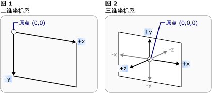

# 三维图形概述3-D Graphics Overview
通过 [!INCLUDE[TLA#tla_winclient](../../../../includes/tlasharptla-winclient-md.md)] 中的 [!INCLUDE[TLA2#tla_3d](../../../../includes/tla2sharptla-3d-md.md)] 功能，开发人员可以使用标记和程序代码绘制和转换 3D 图形，并对其进行动画处理。The [!INCLUDE[TLA2#tla_3d](../../../../includes/tla2sharptla-3d-md.md)] functionality in [!INCLUDE[TLA#tla_winclient](../../../../includes/tlasharptla-winclient-md.md)] enables developers to draw, transform, and animate 3-D graphics in both markup and procedural code. 开发人员可以合并 [!INCLUDE[TLA#tla_2d](../../../../includes/tlasharptla-2d-md.md)] 和 [!INCLUDE[TLA2#tla_3d](../../../../includes/tla2sharptla-3d-md.md)] 图形以创建丰富的控件、提供复杂的数据图解，或者增强用户对应用程序界面的体验。Developers can combine [!INCLUDE[TLA#tla_2d](../../../../includes/tlasharptla-2d-md.md)] and [!INCLUDE[TLA2#tla_3d](../../../../includes/tla2sharptla-3d-md.md)] graphics to create rich controls, provide complex illustrations of data, or enhance the user experience of an application's interface. [!INCLUDE[TLA2#tla_winclient](../../../../includes/tla2sharptla-winclient-md.md)] 中的 [!INCLUDE[TLA2#tla_3d](../../../../includes/tla2sharptla-3d-md.md)] 支持并非旨在提供功能齐全的游戏开发平台。 support in [!INCLUDE[TLA2#tla_winclient](../../../../includes/tla2sharptla-winclient-md.md)] is not designed to provide a full-featured game-development platform. 本主题概述了 [!INCLUDE[TLA2#tla_winclient](../../../../includes/tla2sharptla-winclient-md.md)] 图形系统中的 [!INCLUDE[TLA#tla_3d](../../../../includes/tlasharptla-3d-md.md)] 功能。This topic provides an overview of [!INCLUDE[TLA#tla_3d](../../../../includes/tlasharptla-3d-md.md)] functionality in the [!INCLUDE[TLA2#tla_winclient](../../../../includes/tla2sharptla-winclient-md.md)] graphics system.  
 
  
   
## 2D 容器中的 3D3-D in a 2-D Container  
 [!INCLUDE[TLA2#tla_3d](../../../../includes/tla2sharptla-3d-md.md)]图形中的内容[!INCLUDE[TLA2#tla_winclient](../../../../includes/tla2sharptla-winclient-md.md)]封装在一个元素， <xref:System.Windows.Controls.Viewport3D>，该元素可以参与二维元素结构。 graphics content in [!INCLUDE[TLA2#tla_winclient](../../../../includes/tla2sharptla-winclient-md.md)] is encapsulated in an element, <xref:System.Windows.Controls.Viewport3D>, that can participate in the two-dimensional element structure. 图形系统将<xref:System.Windows.Controls.Viewport3D>作为一个二维的可见元素，如中的许多其他[!INCLUDE[TLA2#tla_winclient](../../../../includes/tla2sharptla-winclient-md.md)]。The graphics system treats <xref:System.Windows.Controls.Viewport3D> as a two-dimensional visual element like many others in [!INCLUDE[TLA2#tla_winclient](../../../../includes/tla2sharptla-winclient-md.md)]. <xref:System.Windows.Controls.Viewport3D>为窗口函数-视区-三维场景。<xref:System.Windows.Controls.Viewport3D> functions as a window—a viewport—into a three-dimensional scene. 更准确地说，它是 [!INCLUDE[TLA2#tla_3d](../../../../includes/tla2sharptla-3d-md.md)] 场景所投影到的图面。More accurately, it is a surface on which a [!INCLUDE[TLA2#tla_3d](../../../../includes/tla2sharptla-3d-md.md)] scene is projected.  
  
 中的传统[!INCLUDE[TLA2#tla_2d](../../../../includes/tla2sharptla-2d-md.md)]应用程序，使用<xref:System.Windows.Controls.Viewport3D>就像另一个容器元素，如网格或画布。In a conventional [!INCLUDE[TLA2#tla_2d](../../../../includes/tla2sharptla-2d-md.md)] application, use <xref:System.Windows.Controls.Viewport3D> as you would another container element like Grid or Canvas.  尽管可以使用<xref:System.Windows.Controls.Viewport3D>与其他[!INCLUDE[TLA2#tla_2d](../../../../includes/tla2sharptla-2d-md.md)]你在相同的场景关系图中绘制对象，不能内部渗透[!INCLUDE[TLA2#tla_2d](../../../../includes/tla2sharptla-2d-md.md)]和[!INCLUDE[TLA2#tla_3d](../../../../includes/tla2sharptla-3d-md.md)]对象内<xref:System.Windows.Controls.Viewport3D>。Although you can use <xref:System.Windows.Controls.Viewport3D> with other [!INCLUDE[TLA2#tla_2d](../../../../includes/tla2sharptla-2d-md.md)] drawing objects in the same scene graph, you cannot interpenetrate [!INCLUDE[TLA2#tla_2d](../../../../includes/tla2sharptla-2d-md.md)] and [!INCLUDE[TLA2#tla_3d](../../../../includes/tla2sharptla-3d-md.md)] objects within a <xref:System.Windows.Controls.Viewport3D>.  本主题将重点介绍如何绘制[!INCLUDE[TLA2#tla_3d](../../../../includes/tla2sharptla-3d-md.md)]内的图形<xref:System.Windows.Controls.Viewport3D>。This topic will focus on how to draw [!INCLUDE[TLA2#tla_3d](../../../../includes/tla2sharptla-3d-md.md)] graphics inside the <xref:System.Windows.Controls.Viewport3D>.  
  
   
## 3D 坐标空间3-D Coordinate Space  
 [!INCLUDE[TLA2#tla_2d](../../../../includes/tla2sharptla-2d-md.md)] 图形的 [!INCLUDE[TLA2#tla_winclient](../../../../includes/tla2sharptla-winclient-md.md)] 坐标系将原点定位在呈现区域（通常是屏幕）的左上角。The [!INCLUDE[TLA2#tla_winclient](../../../../includes/tla2sharptla-winclient-md.md)] coordinate system for [!INCLUDE[TLA2#tla_2d](../../../../includes/tla2sharptla-2d-md.md)] graphics locates the origin in the upper left of the rendering area (typically the screen). 在 [!INCLUDE[TLA2#tla_2d](../../../../includes/tla2sharptla-2d-md.md)] 系统中，x 轴上的正值朝右，y 轴上的正值朝下。In the [!INCLUDE[TLA2#tla_2d](../../../../includes/tla2sharptla-2d-md.md)] system, positive x-axis values proceed to the right and positive y-axis values proceed downward.  但是，在 [!INCLUDE[TLA2#tla_3d](../../../../includes/tla2sharptla-3d-md.md)] 坐标系中，原点位于呈现区域的中心，x 轴上的正值朝右，但是 y 轴上的正值朝上，z 轴上的正值从原点向外朝向观察者。In the [!INCLUDE[TLA2#tla_3d](../../../../includes/tla2sharptla-3d-md.md)] coordinate system, however, the origin is located in the center of the rendering area, with positive x-axis values proceeding to the right but positive y-axis values proceeding upward instead, and positive z-axis values proceeding outward from the origin, toward the viewer.  
  
   
传统的 2D 和 3D 坐标系表示形式Conventional 2-D and 3-D coordinate system representations  
  
 由这些轴定义的空间是 [!INCLUDE[TLA2#tla_3d](../../../../includes/tla2sharptla-3d-md.md)] 对象在 [!INCLUDE[TLA2#tla_winclient](../../../../includes/tla2sharptla-winclient-md.md)] 中的固定参考框架。The space defined by these axes is the stationary frame of reference for [!INCLUDE[TLA2#tla_3d](../../../../includes/tla2sharptla-3d-md.md)] objects in [!INCLUDE[TLA2#tla_winclient](../../../../includes/tla2sharptla-winclient-md.md)]. 当在该空间中生成模型并创建光源和照相机以查看这些模型时，一定要在向每个模型应用转换时，将固定参考框架或“全局空间”与为该模型创建的局部参考框架区分开。As you build models in this space and create lights and cameras to view them, it's helpful to distinguish this stationary frame of reference, or "world space," from the local frame of reference you create for each model when you apply transformations to it. 另请记住，根据光源和照相机设置，全局空间中的对象可能会看上去完全不同或者根本不可见，但是照相机的位置不会改变对象在全局空间中的位置。Remember also that objects in world space might look entirely different, or not be visible at all, depending on light and camera settings, but the position of the camera does not change the location of objects in world space.  
  
   
## 照相机和投影Cameras and Projections  
 处理 [!INCLUDE[TLA2#tla_2d](../../../../includes/tla2sharptla-2d-md.md)] 的开发人员习惯于将绘图基元置于二维屏幕上。Developers who work in [!INCLUDE[TLA2#tla_2d](../../../../includes/tla2sharptla-2d-md.md)] are accustomed to positioning drawing primitives on a two-dimensional screen. 创建 [!INCLUDE[TLA2#tla_3d](../../../../includes/tla2sharptla-3d-md.md)] 场景时，务必记住实际上是要创建 [!INCLUDE[TLA2#tla_3d](../../../../includes/tla2sharptla-3d-md.md)] 对象的 [!INCLUDE[TLA2#tla_2d](../../../../includes/tla2sharptla-2d-md.md)] 表示形式。When you create a [!INCLUDE[TLA2#tla_3d](../../../../includes/tla2sharptla-3d-md.md)] scene, it's important to remember that you are really creating a [!INCLUDE[TLA2#tla_2d](../../../../includes/tla2sharptla-2d-md.md)] representation of [!INCLUDE[TLA2#tla_3d](../../../../includes/tla2sharptla-3d-md.md)] objects. 由于 [!INCLUDE[TLA2#tla_3d](../../../../includes/tla2sharptla-3d-md.md)] 场景的外观会因观察者的观察位置而异，因此必须指定观察位置。Because a [!INCLUDE[TLA2#tla_3d](../../../../includes/tla2sharptla-3d-md.md)] scene looks different depending on the onlooker's point of view, you must specify that point of view. <xref:System.Windows.Media.Media3D.Camera>类，可指定有关此角度来看[!INCLUDE[TLA2#tla_3d](../../../../includes/tla2sharptla-3d-md.md)]场景。The <xref:System.Windows.Media.Media3D.Camera> class allows you to specify this point of view for a [!INCLUDE[TLA2#tla_3d](../../../../includes/tla2sharptla-3d-md.md)] scene.  
  
 了解 [!INCLUDE[TLA2#tla_3d](../../../../includes/tla2sharptla-3d-md.md)] 场景如何在 [!INCLUDE[TLA2#tla_2d](../../../../includes/tla2sharptla-2d-md.md)] 图面上表示的另一种方法就是将场景描述为到观察表面上的投影。Another way to understand how a [!INCLUDE[TLA2#tla_3d](../../../../includes/tla2sharptla-3d-md.md)] scene is represented on a [!INCLUDE[TLA2#tla_2d](../../../../includes/tla2sharptla-2d-md.md)] surface is by describing the scene as a projection onto the viewing surface. <xref:System.Windows.Media.Media3D.ProjectionCamera>允许您指定不同的投影和其属性以更改观察者如何查看[!INCLUDE[TLA2#tla_3d](../../../../includes/tla2sharptla-3d-md.md)]模型。The <xref:System.Windows.Media.Media3D.ProjectionCamera> allows you to specify different projections and their properties to change how the onlooker sees [!INCLUDE[TLA2#tla_3d](../../../../includes/tla2sharptla-3d-md.md)] models. A<xref:System.Windows.Media.Media3D.PerspectiveCamera>指定 foreshortens 场景的投影。A <xref:System.Windows.Media.Media3D.PerspectiveCamera> specifies a projection that foreshortens the scene.  换而言之，<xref:System.Windows.Media.Media3D.PerspectiveCamera>提供消失点透视。In other words, the <xref:System.Windows.Media.Media3D.PerspectiveCamera> provides vanishing-point perspective.  可以指定照相机在场景坐标系中的位置、照相机的方向和视野以及用来定义场景中“向上”方向的矢量。You can specify the position of the camera in the coordinate space of the scene, the direction and field of view for the camera, and a vector that defines the direction of "up" in the scene. 下图说明了<xref:System.Windows.Media.Media3D.PerspectiveCamera>的投影。The following diagram illustrates the <xref:System.Windows.Media.Media3D.PerspectiveCamera>'s projection.  
  
 <xref:System.Windows.Media.Media3D.ProjectionCamera.NearPlaneDistance%2A>和<xref:System.Windows.Media.Media3D.ProjectionCamera.FarPlaneDistance%2A>属性<xref:System.Windows.Media.Media3D.ProjectionCamera>限制的照相机的投影的范围。The <xref:System.Windows.Media.Media3D.ProjectionCamera.NearPlaneDistance%2A> and <xref:System.Windows.Media.Media3D.ProjectionCamera.FarPlaneDistance%2A> properties of <xref:System.Windows.Media.Media3D.ProjectionCamera> limit the range of the camera's projection. 由于照相机可以位于场景中的任何位置，因此照相机实际上可能会位于模型内部或者紧靠模型，这使正确区分对象变得很困难。Because cameras can be located anywhere in the scene, it's possible for the camera to be actually positioned inside a model or very near a model, making it hard to distinguish objects properly.  <xref:System.Windows.Media.Media3D.ProjectionCamera.NearPlaneDistance%2A>使用此选项可以指定从相机超过该值将不绘制对象的最小距离。<xref:System.Windows.Media.Media3D.ProjectionCamera.NearPlaneDistance%2A> allows you to specify a minimum distance from the camera beyond which objects will not be drawn.  相反，<xref:System.Windows.Media.Media3D.ProjectionCamera.FarPlaneDistance%2A>可指定超出该不将绘制对象，这样可以确保不会在场景中包含对象太远是可以识别的照相机的距离。Conversely, <xref:System.Windows.Media.Media3D.ProjectionCamera.FarPlaneDistance%2A> lets you specify a distance from the camera beyond which objects will not be drawn, which ensures that objects too far away to be recognizable won't be included in the scene.  
  
   
照相机位置Camera position  
  
 <xref:System.Windows.Media.Media3D.OrthographicCamera>指定的正交投影[!INCLUDE[TLA2#tla_3d](../../../../includes/tla2sharptla-3d-md.md)]模型到[!INCLUDE[TLA2#tla_2d](../../../../includes/tla2sharptla-2d-md.md)]可视化图面。<xref:System.Windows.Media.Media3D.OrthographicCamera> specifies an orthogonal projection of a [!INCLUDE[TLA2#tla_3d](../../../../includes/tla2sharptla-3d-md.md)] model to a [!INCLUDE[TLA2#tla_2d](../../../../includes/tla2sharptla-2d-md.md)] visual surface. 与其他照相机一样，它指定位置、观察方向和“向上”方向。Like other cameras, it specifies a position, viewing direction, and "upward" direction. 与不同<xref:System.Windows.Media.Media3D.PerspectiveCamera>，但<xref:System.Windows.Media.Media3D.OrthographicCamera>描述不包含透视收缩投影。Unlike <xref:System.Windows.Media.Media3D.PerspectiveCamera>, however, <xref:System.Windows.Media.Media3D.OrthographicCamera> describes a projection that does not include perspective foreshortening. 换而言之，<xref:System.Windows.Media.Media3D.OrthographicCamera>说明边是并行的而不是一个在相机上的点的边满足这种查看。In other words, <xref:System.Windows.Media.Media3D.OrthographicCamera> describes a viewing box whose sides are parallel, instead of one whose sides meet in a point at the camera. 下图显示相同的模型，如使用查看<xref:System.Windows.Media.Media3D.PerspectiveCamera>和<xref:System.Windows.Media.Media3D.OrthographicCamera>。The following image shows the same model as viewed using <xref:System.Windows.Media.Media3D.PerspectiveCamera> and <xref:System.Windows.Media.Media3D.OrthographicCamera>.  
  
   
透视投影和正投影Perspective and Orthographic Projections  
  
 下面的代码演示一些典型的照相机设置。The following code shows some typical camera settings.  
  
 [!code-csharp[3dgallery_procedural_snip#Basic3DShapeCodeExampleInline1](../../../../samples/snippets/csharp/VS_Snippets_Wpf/3DGallery_procedural_snip/CSharp/Basic3DShapeExample.cs#basic3dshapecodeexampleinline1)]
 [!code-vb[3dgallery_procedural_snip#Basic3DShapeCodeExampleInline1](../../../../samples/snippets/visualbasic/VS_Snippets_Wpf/3DGallery_procedural_snip/visualbasic/basic3dshapeexample.vb#basic3dshapecodeexampleinline1)]  
  
   
## 模型和网格基元Model and Mesh Primitives  
  
 <xref:System.Windows.Media.Media3D.Model3D>是表示泛型的抽象基类[!INCLUDE[TLA2#tla_3d](../../../../includes/tla2sharptla-3d-md.md)]对象。<xref:System.Windows.Media.Media3D.Model3D> is the abstract base class that represents a generic [!INCLUDE[TLA2#tla_3d](../../../../includes/tla2sharptla-3d-md.md)] object. 若要生成[!INCLUDE[TLA2#tla_3d](../../../../includes/tla2sharptla-3d-md.md)]场景，您需要某些对象，若要查看，而且构成场景关系图的对象派生自<xref:System.Windows.Media.Media3D.Model3D>。To build a [!INCLUDE[TLA2#tla_3d](../../../../includes/tla2sharptla-3d-md.md)] scene, you need some objects to view, and the objects that make up the scene graph derive from <xref:System.Windows.Media.Media3D.Model3D>. 目前，[!INCLUDE[TLA2#tla_winclient](../../../../includes/tla2sharptla-winclient-md.md)]支持建模与几何图形<xref:System.Windows.Media.Media3D.GeometryModel3D>。Currently, the [!INCLUDE[TLA2#tla_winclient](../../../../includes/tla2sharptla-winclient-md.md)] supports modeling geometries with <xref:System.Windows.Media.Media3D.GeometryModel3D>. <xref:System.Windows.Media.Media3D.GeometryModel3D.Geometry%2A>此模型的属性采用网格基元。The <xref:System.Windows.Media.Media3D.GeometryModel3D.Geometry%2A> property of this model takes a mesh primitive.  
  
 若要生成模型，请首先生成一个基元或网格。To build a model, begin by building a primitive, or mesh. [!INCLUDE[TLA2#tla_3d](../../../../includes/tla2sharptla-3d-md.md)] 基元是一系列构成单个 [!INCLUDE[TLA2#tla_3d](../../../../includes/tla2sharptla-3d-md.md)] 实体的顶点。A [!INCLUDE[TLA2#tla_3d](../../../../includes/tla2sharptla-3d-md.md)] primitive is a collection of vertices that form a single [!INCLUDE[TLA2#tla_3d](../../../../includes/tla2sharptla-3d-md.md)] entity. 大多数 [!INCLUDE[TLA2#tla_3d](../../../../includes/tla2sharptla-3d-md.md)] 系统都提供在最简单的闭合图（由三个顶点定义的三角形）上建模的基元。Most [!INCLUDE[TLA2#tla_3d](../../../../includes/tla2sharptla-3d-md.md)] systems provide primitives modeled on the simplest closed figure: a triangle defined by three vertices.  由于三角形的三个点在一个平面上，因此可以继续添加三角形，以便对网格这样较为复杂的形状建模。Because the three points of a triangle are coplanar, you can continue adding triangles in order to model more complex shapes, called meshes.  
  
 [!INCLUDE[TLA2#tla_winclient](../../../../includes/tla2sharptla-winclient-md.md)] [!INCLUDE[TLA2#tla_3d](../../../../includes/tla2sharptla-3d-md.md)]系统当前提供<xref:System.Windows.Media.Media3D.MeshGeometry3D>类，该编辑器可以指定任何几何图形; 当前不支持预定义[!INCLUDE[TLA2#tla_3d](../../../../includes/tla2sharptla-3d-md.md)]基元如球体和三次方窗体。The [!INCLUDE[TLA2#tla_winclient](../../../../includes/tla2sharptla-winclient-md.md)] [!INCLUDE[TLA2#tla_3d](../../../../includes/tla2sharptla-3d-md.md)] system currently provides the <xref:System.Windows.Media.Media3D.MeshGeometry3D> class, which allows you to specify any geometry; it does not currently support predefined [!INCLUDE[TLA2#tla_3d](../../../../includes/tla2sharptla-3d-md.md)] primitives like spheres and cubic forms. 开始创建<xref:System.Windows.Media.Media3D.MeshGeometry3D>通过指定的顶点列表的三角形作为其<xref:System.Windows.Media.Media3D.MeshGeometry3D.Positions%2A>属性。Begin creating a <xref:System.Windows.Media.Media3D.MeshGeometry3D> by specifying a list of triangle vertices as its <xref:System.Windows.Media.Media3D.MeshGeometry3D.Positions%2A> property. 每个顶点指定为<xref:System.Windows.Media.Media3D.Point3D>。Each vertex is specified as a <xref:System.Windows.Media.Media3D.Point3D>.  （在 [!INCLUDE[TLA#tla_xaml](../../../../includes/tlasharptla-xaml-md.md)] 中，将该属性指定为三个一组的数字列表，每组中的三个数字表示每个顶点的坐标）。根据网格的几何形状，网格可能会由多个三角形组成，有些三角形共用相同的角（顶点）。(In [!INCLUDE[TLA#tla_xaml](../../../../includes/tlasharptla-xaml-md.md)], specify this property as a list of numbers grouped in threes that represent the coordinates of each vertex.) Depending on its geometry, your mesh might be composed of many triangles, some of which share the same corners (vertices). 若要正确绘制网格，[!INCLUDE[TLA2#tla_winclient](../../../../includes/tla2sharptla-winclient-md.md)] 需要有关哪些顶点由哪些三角形共用的信息。To draw the mesh correctly, the [!INCLUDE[TLA2#tla_winclient](../../../../includes/tla2sharptla-winclient-md.md)] needs information about which vertices are shared by which triangles. 通过指定与三角形索引的列表提供此信息<xref:System.Windows.Media.Media3D.MeshGeometry3D.TriangleIndices%2A>属性。You provide this information by specifying a list of triangle indices with the <xref:System.Windows.Media.Media3D.MeshGeometry3D.TriangleIndices%2A> property. 此列表指定点中指定的顺序<xref:System.Windows.Media.Media3D.MeshGeometry3D.Positions%2A>列表将确定一个三角形。This list specifies the order in which the points specified in the <xref:System.Windows.Media.Media3D.MeshGeometry3D.Positions%2A> list will determine a triangle.  
  
 [!code-xaml[basic3d#Basic3DXAML3DN3](../../../../samples/snippets/xaml/VS_Snippets_Wpf/Basic3D/XAML/Window1.xaml#basic3dxaml3dn3)]  
  
 在前面的示例中，<xref:System.Windows.Media.Media3D.MeshGeometry3D.Positions%2A>列表指定八个顶点来定义多维数据集调整的网格。In the preceding example, the <xref:System.Windows.Media.Media3D.MeshGeometry3D.Positions%2A> list specifies eight vertices to define a cube-shaped mesh. <xref:System.Windows.Media.Media3D.MeshGeometry3D.TriangleIndices%2A>属性指定的三个索引的 12 个组的列表。The <xref:System.Windows.Media.Media3D.MeshGeometry3D.TriangleIndices%2A> property specifies a list of twelve groups of three indices.  该列表中的每个数是指的偏移量<xref:System.Windows.Media.Media3D.MeshGeometry3D.Positions%2A>列表。Each number in the list refers to an offset into the <xref:System.Windows.Media.Media3D.MeshGeometry3D.Positions%2A> list.  例如，由指定的前三个顶点<xref:System.Windows.Media.Media3D.MeshGeometry3D.Positions%2A>列表是否 (1,1,0) (0,1,0) 和 (0,0,0)。For example, the first three vertices specified by the <xref:System.Windows.Media.Media3D.MeshGeometry3D.Positions%2A> list are (1,1,0), (0,1,0), and (0,0,0). 指定的前三个索引<xref:System.Windows.Media.Media3D.MeshGeometry3D.TriangleIndices%2A>列表是 0、 2 和 1，其中第三，对应于第一个和第二个中的点<xref:System.Windows.Media.Media3D.MeshGeometry3D.Positions%2A>列表。The first three indices specified by the <xref:System.Windows.Media.Media3D.MeshGeometry3D.TriangleIndices%2A> list are 0, 2, and 1, which correspond to the first, third, and second points in the <xref:System.Windows.Media.Media3D.MeshGeometry3D.Positions%2A> list. 因此，构成立方体模型的第一个三角形将按照从 (1,1,0) 到 (0,1,0) 再到 (0,0,0) 的顺序组合而成，其余的十一个三角形将按照类似方式确定。As a result, the first triangle that makes up the cube model will be composed from (1,1,0) to (0,1,0) to  (0,0,0), and the remaining eleven triangles will be determined similarly.  
  
 你可以继续通过指定的值定义模型<xref:System.Windows.Media.Media3D.MeshGeometry3D.Normals%2A>和<xref:System.Windows.Media.Media3D.MeshGeometry3D.TextureCoordinates%2A>属性。You can continue defining the model by specifying values for the <xref:System.Windows.Media.Media3D.MeshGeometry3D.Normals%2A> and <xref:System.Windows.Media.Media3D.MeshGeometry3D.TextureCoordinates%2A> properties.  为了呈现模型的图面，图形系统需要有关曲面在任何给定三角形上的朝向信息。To render the surface of the model, the graphics system needs information about which direction the surface is facing at any given triangle. 图形系统使用此信息来针对该模型进行照明计算：正对光源的图面比偏离光源的图面显得更亮。It uses this information to make lighting calculations for the model: surfaces that face directly towards a light source appear brighter than those angled away from the light. 尽管 [!INCLUDE[TLA2#tla_winclient](../../../../includes/tla2sharptla-winclient-md.md)] 可以使用位置坐标来确定默认的法矢量，但是你还可以指定不同的法矢量来近似计算曲面的外观。Though the [!INCLUDE[TLA2#tla_winclient](../../../../includes/tla2sharptla-winclient-md.md)] can determine default normal vectors by using the position coordinates, you can also specify different normal vectors to approximate the appearance of curved surfaces.  
  
 <xref:System.Windows.Media.Media3D.MeshGeometry3D.TextureCoordinates%2A>属性指定的集合<xref:System.Windows.Point>告诉图形系统如何确定如何将纹理绘制到网格的顶点的坐标映射的 s。The <xref:System.Windows.Media.Media3D.MeshGeometry3D.TextureCoordinates%2A> property specifies a collection of <xref:System.Windows.Point>s that tell the graphics system how to map the coordinates that determine how a texture is drawn to the vertices of the mesh. <xref:System.Windows.Media.Media3D.MeshGeometry3D.TextureCoordinates%2A>指定为介于 0 与 1，（含) 之间的值。<xref:System.Windows.Media.Media3D.MeshGeometry3D.TextureCoordinates%2A> are specified as a value between zero and 1, inclusive.  与<xref:System.Windows.Media.Media3D.MeshGeometry3D.Normals%2A>图形系统可以计算属性，默认纹理坐标，但你可以选择设置不同的纹理坐标，包括对部分重复模式，例如对纹理的映射进行控制。As with the <xref:System.Windows.Media.Media3D.MeshGeometry3D.Normals%2A> property, the graphics system can calculate default texture coordinates, but you might choose to set different texture coordinates to control the mapping of a texture that includes part of a repeating pattern, for example. 有关纹理坐标的详细信息，可在后续主题或 Managed Direct3D SDK 中找到。More information about texture coordinates can be found in subsequent topics or in the Managed Direct3D SDK.  
  
 下面的示例演示如何在过程代码中创建立方体模型的一面。The following example shows how to create one face of the cube model in procedural code. 请注意，可以将整个立方体绘制为单个 GeometryModel3D；此示例将该立方体面绘制为一个不同的模型，以便在以后向每个面应用不同的纹理。Note that you can draw the entire cube as a single GeometryModel3D; this example draws the cube's face as a distinct model in order to apply separate textures to each face later.  
  
 [!code-csharp[3doverview#3DOverview3DN6](../../../../samples/snippets/csharp/VS_Snippets_Wpf/3DOverview/CSharp/Window1.xaml.cs#3doverview3dn6)]
 [!code-vb[3doverview#3DOverview3DN6](../../../../samples/snippets/visualbasic/VS_Snippets_Wpf/3DOverview/visualbasic/window1.xaml.vb#3doverview3dn6)]  
  
 [!code-csharp[3doverview#3DOverview3DN7](../../../../samples/snippets/csharp/VS_Snippets_Wpf/3DOverview/CSharp/Window1.xaml.cs#3doverview3dn7)]
 [!code-vb[3doverview#3DOverview3DN7](../../../../samples/snippets/visualbasic/VS_Snippets_Wpf/3DOverview/visualbasic/window1.xaml.vb#3doverview3dn7)]  
  
   
## 向模型应用材料Applying Materials to the Model  
  
 为了使网格看上去像三维对象，必须向其应用纹理，以便覆盖由顶点和三角形定义的图面，从而使其可以由照相机照明和投影。For a mesh to look like a three-dimensional object, it must have an applied texture to cover the surface defined by its vertices and triangles so it can be lit and projected by the camera. 在[!INCLUDE[TLA2#tla_2d](../../../../includes/tla2sharptla-2d-md.md)]，你使用<xref:System.Windows.Media.Brush>类应用于的屏幕的区域的颜色、 模式、 渐变或其他可视内容。In [!INCLUDE[TLA2#tla_2d](../../../../includes/tla2sharptla-2d-md.md)], you use the <xref:System.Windows.Media.Brush> class to apply colors, patterns, gradients, or other visual content to areas of the screen.  但是，[!INCLUDE[TLA2#tla_3d](../../../../includes/tla2sharptla-3d-md.md)] 对象的外观是照明模型的功能，而不只是应用于它们的颜色或图案。The appearance of [!INCLUDE[TLA2#tla_3d](../../../../includes/tla2sharptla-3d-md.md)] objects, however, is a function of the lighting model, not just of the color or pattern applied to them. 实际对象的图面质量不同，它们反射光的方式也会有所不同：光亮的图面与粗糙或不光滑的图面看上去不同，某些对象似乎可以吸收光，而某些对象似乎能够发光。Real-world objects reflect light differently depending on the quality of their surfaces: glossy and shiny surfaces don't look the same as rough or matte surfaces, and some objects seem to absorb light while others glow. 可以向 [!INCLUDE[TLA2#tla_3d](../../../../includes/tla2sharptla-3d-md.md)] 对象应用与应用于 [!INCLUDE[TLA2#tla_2d](../../../../includes/tla2sharptla-2d-md.md)] 对象的完全相同的画笔，但是不能直接应用它们。You can apply all the same brushes to [!INCLUDE[TLA2#tla_3d](../../../../includes/tla2sharptla-3d-md.md)] objects that you can apply to [!INCLUDE[TLA2#tla_2d](../../../../includes/tla2sharptla-2d-md.md)] objects, but you can't apply them directly.  
  
 若要定义的模型的面的特征[!INCLUDE[TLA2#tla_winclient](../../../../includes/tla2sharptla-winclient-md.md)]使用<xref:System.Windows.Media.Media3D.Material>抽象类。To define the characteristics of a model's surface, [!INCLUDE[TLA2#tla_winclient](../../../../includes/tla2sharptla-winclient-md.md)] uses the <xref:System.Windows.Media.Media3D.Material> abstract class. Material 的具体子类用来确定模型图面的某些外观特征，每个子类还提供一个可以向其传递 SolidColorBrush、TileBrush 或 VisualBrush 的 Brush 属性。The concrete subclasses of Material determine some of the appearance characteristics of the model's surface, and each also provides a Brush property to which you can pass a SolidColorBrush, TileBrush, or VisualBrush.  
  
-   <xref:System.Windows.Media.Media3D.DiffuseMaterial>指定将向该模型应用画笔，就好像该模型已漫射照明。<xref:System.Windows.Media.Media3D.DiffuseMaterial> specifies that the brush will be applied to the model as though that model were lit diffusely. 使用 DiffuseMaterial 与直接针对 [!INCLUDE[TLA2#tla_2d](../../../../includes/tla2sharptla-2d-md.md)] 模型使用画笔非常相似；模型表面不反射光，就好像是自发光一样。Using DiffuseMaterial most resembles using brushes directly on [!INCLUDE[TLA2#tla_2d](../../../../includes/tla2sharptla-2d-md.md)] models; model surfaces do not reflect light as though shiny.  
  
-   <xref:System.Windows.Media.Media3D.SpecularMaterial>指定将对模型应用画笔，就像模型的图面是硬或亮，能够反映突出显示。<xref:System.Windows.Media.Media3D.SpecularMaterial> specifies that the brush will be applied to the model as though the model's surface were hard or shiny, capable of reflecting highlights. 您可以通过指定的值设置到的纹理将建议此反射质量或"增加亮点，"的程度<xref:System.Windows.Media.Media3D.SpecularMaterial.SpecularPower%2A>属性。You can set the degree to which the texture will suggest this reflective quality, or "shine," by specifying a value for the <xref:System.Windows.Media.Media3D.SpecularMaterial.SpecularPower%2A> property.  
  
-   <xref:System.Windows.Media.Media3D.EmissiveMaterial>使用此选项可以指定将应用纹理，就像模型所发出的相等的画笔的颜色的光一样。<xref:System.Windows.Media.Media3D.EmissiveMaterial> allows you to specify that the texture will be applied as though the model were emitting light equal to the color of the brush. 这不会使模型成为光源；但是它参与阴影设置的方式将不同于用 DiffuseMaterial 或 SpecularMaterial 设置纹理时的情况。This does not make the model a light; however, it will participate differently in shadowing than it would if textured with DiffuseMaterial or SpecularMaterial.  
  
 为了提高性能的背面<xref:System.Windows.Media.Media3D.GeometryModel3D>（这些不视图，因为它们是相机的模型的另一侧） 剔除从场景。For better performance, the backfaces of a <xref:System.Windows.Media.Media3D.GeometryModel3D> (those faces that are out of view because they are on the opposite side of the model from the camera) are culled from the scene.  若要指定<xref:System.Windows.Media.Media3D.Material>若要将应用于背面的类似这样一个平面的模型，将设置模型的<xref:System.Windows.Media.Media3D.GeometryModel3D.BackMaterial%2A>属性。To specify a <xref:System.Windows.Media.Media3D.Material> to apply to the backface of a model like a plane, set the model's <xref:System.Windows.Media.Media3D.GeometryModel3D.BackMaterial%2A> property.  
  
 为了实现某些图面质量（如发光或发射效果），用户可能希望向模型连续应用几个不同的画笔。To achieve some surface qualities, like glowing or reflective effects, you might want to apply several different brushes to a model in succession. 你可以应用并重复多个材料使用通过<xref:System.Windows.Media.Media3D.MaterialGroup>类。You can apply and reuse multiple Materials by using the <xref:System.Windows.Media.Media3D.MaterialGroup> class. MaterialGroup 的子级在多个呈现过程中按照从头到尾的顺序来应用。The children of the MaterialGroup are applied first to last in multiple rendering passes.  
  
 下面的代码示例演示如何将纯色和绘图以画笔形式应用于 [!INCLUDE[TLA2#tla_3d](../../../../includes/tla2sharptla-3d-md.md)] 模型。The following code examples show how to apply a solid color and a drawing as brushes to [!INCLUDE[TLA2#tla_3d](../../../../includes/tla2sharptla-3d-md.md)] models.  
  
 [!code-xaml[basic3d#Basic3DXAML3DN5](../../../../samples/snippets/xaml/VS_Snippets_Wpf/Basic3D/XAML/Window1.xaml#basic3dxaml3dn5)]  
  
 [!code-xaml[3doverview#3DOverview3DN9](../../../../samples/snippets/csharp/VS_Snippets_Wpf/3DOverview/CSharp/app.xaml#3doverview3dn9)]  
  
 [!code-csharp[3doverview#3DOverview3DN8](../../../../samples/snippets/csharp/VS_Snippets_Wpf/3DOverview/CSharp/Window1.xaml.cs#3doverview3dn8)]
 [!code-vb[3doverview#3DOverview3DN8](../../../../samples/snippets/visualbasic/VS_Snippets_Wpf/3DOverview/visualbasic/window1.xaml.vb#3doverview3dn8)]  
  
   
## 照亮场景Illuminating the Scene  
 与实际的光一样，[!INCLUDE[TLA2#tla_3d](../../../../includes/tla2sharptla-3d-md.md)] 图形中的光能够使图面可见。Lights in [!INCLUDE[TLA2#tla_3d](../../../../includes/tla2sharptla-3d-md.md)] graphics do what lights do in the real world: they make surfaces visible. 更确切地说，光确定了场景的哪个部分将包括在投影中。More to the point, lights determine what part of a scene will be included in the projection. [!INCLUDE[TLA2#tla_winclient](../../../../includes/tla2sharptla-winclient-md.md)] 中的光对象创建了各种光和阴影效果，并且按照各种实际光的行为进行了建模。Light objects in [!INCLUDE[TLA2#tla_winclient](../../../../includes/tla2sharptla-winclient-md.md)] create a variety of light and shadow effects and are modeled after the behavior of various real-world lights. 必须至少在场景中包括一个光，否则模型将不可见。You must include at least one light in your scene, or no models will be visible.  
  
 下面的光派生自的基类<xref:System.Windows.Media.Media3D.Light>:The following lights derive from the base class <xref:System.Windows.Media.Media3D.Light>:  
  
-   <xref:System.Windows.Media.Media3D.AmbientLight>： 提供环境的照明，照亮统一而不考虑其位置或方向的所有对象。<xref:System.Windows.Media.Media3D.AmbientLight>: Provides ambient lighting that illuminates all objects uniformly regardless of their location or orientation.  
  
-   <xref:System.Windows.Media.Media3D.DirectionalLight>： 像远距离的光源那样照亮。<xref:System.Windows.Media.Media3D.DirectionalLight>: Illuminates like a distant light source.  方向性光源具有<xref:System.Windows.Media.Media3D.DirectionalLight.Direction%2A>指定为 Vector3D，但没有指定的位置。Directional lights have a <xref:System.Windows.Media.Media3D.DirectionalLight.Direction%2A> specified as a Vector3D, but no specified location.  
  
-   <xref:System.Windows.Media.Media3D.PointLight>： 像附近光源那样照亮。<xref:System.Windows.Media.Media3D.PointLight>: Illuminates like a nearby light source. PointLights 具有一个位置并从该位置投射光。PointLights have a position and cast light from that position. 场景中的对象根据对象相对于光源的位置和距离被照亮。Objects in the scene are illuminated depending on their position and distance with respect to the light. <xref:System.Windows.Media.Media3D.PointLightBase>公开<xref:System.Windows.Media.Media3D.PointLightBase.Range%2A>属性，确定超过该模型将不会由光源照亮的距离。<xref:System.Windows.Media.Media3D.PointLightBase> exposes a <xref:System.Windows.Media.Media3D.PointLightBase.Range%2A> property, which determines a distance beyond which models will not be illuminated by the light. PointLight 还公开了多个衰减属性，这些属性确定光源的亮度如何随距离的增加而减小。PointLight also exposes attenuation properties which determine how the light's intensity diminishes over distance. 可以为光源的衰减指定恒定、线性或二次内插算法。You can specify constant, linear, or quadratic interpolations for the light's attenuation.  
  
-   <xref:System.Windows.Media.Media3D.SpotLight>： 继承自<xref:System.Windows.Media.Media3D.PointLight>。<xref:System.Windows.Media.Media3D.SpotLight>: Inherits from <xref:System.Windows.Media.Media3D.PointLight>. Spotlights 的照亮方式与 PointLight 类似，但是它既具有位置又具有方向。Spotlights illuminate like PointLight and have both position and direction. 这些项目设置的锥形区域采用浅色<xref:System.Windows.Media.Media3D.SpotLight.InnerConeAngle%2A>和<xref:System.Windows.Media.Media3D.SpotLight.OuterConeAngle%2A>以度为单位指定的属性。They project light in a cone-shaped area set by <xref:System.Windows.Media.Media3D.SpotLight.InnerConeAngle%2A> and <xref:System.Windows.Media.Media3D.SpotLight.OuterConeAngle%2A> properties, specified in degrees.  
  
 灯都<xref:System.Windows.Media.Media3D.Model3D>对象，因此你可以转换和浅色属性，包括位置、 颜色、 方向和范围进行动画处理。Lights are <xref:System.Windows.Media.Media3D.Model3D> objects, so you can transform and animate light properties, including position, color, direction, and range.  
  
 [!code-xaml[hittest3d#HitTest3D3DN6](../../../../samples/snippets/csharp/VS_Snippets_Wpf/HitTest3D/CSharp/Window1.xaml#hittest3d3dn6)]  
  
 [!code-csharp[basic3d#Basic3D3DN11](../../../../samples/snippets/csharp/VS_Snippets_Wpf/Basic3D/CSharp/Window1.xaml.cs#basic3d3dn11)]
 [!code-vb[basic3d#Basic3D3DN11](../../../../samples/snippets/visualbasic/VS_Snippets_Wpf/Basic3D/visualbasic/window1.xaml.vb#basic3d3dn11)]  
  
 [!code-csharp[basic3d#Basic3D3DN12](../../../../samples/snippets/csharp/VS_Snippets_Wpf/Basic3D/CSharp/Window1.xaml.cs#basic3d3dn12)]
 [!code-vb[basic3d#Basic3D3DN12](../../../../samples/snippets/visualbasic/VS_Snippets_Wpf/Basic3D/visualbasic/window1.xaml.vb#basic3d3dn12)]  
  
 [!code-csharp[basic3d#Basic3D3DN13](../../../../samples/snippets/csharp/VS_Snippets_Wpf/Basic3D/CSharp/Window1.xaml.cs#basic3d3dn13)]
 [!code-vb[basic3d#Basic3D3DN13](../../../../samples/snippets/visualbasic/VS_Snippets_Wpf/Basic3D/visualbasic/window1.xaml.vb#basic3d3dn13)]  
  
   
## 转换模型Transforming Models  
 创建模型时，它们在场景中有特定的位置。When you create models, they have a particular location in the scene. 为了在场景中移动、旋转这些模型或者更改这些模型的大小而更改用来定义模型本身的顶点不切实际。To move those models around in the scene, to rotate them, or to change their size, it's not practical to change the vertices that define the models themselves.  而正如在 [!INCLUDE[TLA2#tla_2d](../../../../includes/tla2sharptla-2d-md.md)] 中一样，可以向模型应用转换。Instead, just as in [!INCLUDE[TLA2#tla_2d](../../../../includes/tla2sharptla-2d-md.md)], you apply transformations to models.  
  
 每个模型对象具有<xref:System.Windows.Media.Media3D.Model3D.Transform%2A>属性与其可以移动、 重定向，或调整大小的模型。Each model object has a <xref:System.Windows.Media.Media3D.Model3D.Transform%2A> property with which you can move, re-orient, or resize the model.  应用转换时，实际上是按照由转换功能指定的矢量或值（以适用者为准）来偏移模型的所有点。When you apply a transform, you effectively offset all the points of the model by whatever vector or value specified by the transform. 换言之，用户已经转换了在其中定义模型的坐标空间（“模型空间”），但是尚未更改在整个场景的坐标系（“全局空间”）中构成模型几何形状的值。In other words, you've transformed the coordinate space in which the model is defined ("model space"), but you haven't changed the values that make up the model's geometry in the coordinate system of the entire scene ("world space").  
  
 有关转换模型的详细信息，请参阅 [3D 转换概述](../../../../docs/framework/wpf/graphics-multimedia/3-d-transformations-overview.md)。For more information about transforming models, see [3-D Transformations Overview](../../../../docs/framework/wpf/graphics-multimedia/3-d-transformations-overview.md).  
  
   
## 对模型进行动画处理Animating Models  
 [!INCLUDE[TLA2#tla_winclient](../../../../includes/tla2sharptla-winclient-md.md)] [!INCLUDE[TLA2#tla_3d](../../../../includes/tla2sharptla-3d-md.md)] 实现与 [!INCLUDE[TLA2#tla_2d](../../../../includes/tla2sharptla-2d-md.md)] 图形参与同一个计时和动画系统。The [!INCLUDE[TLA2#tla_winclient](../../../../includes/tla2sharptla-winclient-md.md)] [!INCLUDE[TLA2#tla_3d](../../../../includes/tla2sharptla-3d-md.md)] implementation participates in the same timing and animation system as [!INCLUDE[TLA2#tla_2d](../../../../includes/tla2sharptla-2d-md.md)] graphics. 换言之，若要对 3D 场景进行动画处理，需要对其模型的属性进行动画处理。In other words, to animate a 3-D scene, animate the properties of its models. 可以直接对基元的属性进行动画处理，但是通常很容易对用来更改模型位置或外观的转换进行动画处理。It's possible to animate properties of primitives directly, but it's typically easier to animate transformations that change the position or appearance of models. 由于转换可以应用到<xref:System.Windows.Media.Media3D.Model3DGroup>对象及其各个模型，可以将一组动画应用于的 Model3DGroup 子和另一组到一组子对象的动画。Because transformations can be applied to <xref:System.Windows.Media.Media3D.Model3DGroup> objects as well as individual models, it's possible to apply one set of animations to a child of a Model3DGroup and another set of animations to a group of child objects. 还可以通过对场景的照明属性进行动画处理来实现各种视觉效果。You can also achieve a variety of visual effects by animating the properties of your scene's lighting. 最后，可以选择通过对照相机的位置或视野进行动画处理来对投影本身进行动画处理。Finally, you might choose to animate the projection itself by animating the camera position or field of view. 有关 [!INCLUDE[TLA2#tla_winclient](../../../../includes/tla2sharptla-winclient-md.md)] 计时和动画系统的背景信息，请参阅[动画概述](../../../../docs/framework/wpf/graphics-multimedia/animation-overview.md)、[演示图板概述](../../../../docs/framework/wpf/graphics-multimedia/storyboards-overview.md)和 [Freezable 对象概述](../../../../docs/framework/wpf/advanced/freezable-objects-overview.md)主题。For background information on the [!INCLUDE[TLA2#tla_winclient](../../../../includes/tla2sharptla-winclient-md.md)] timing and animation system, see the [Animation Overview](../../../../docs/framework/wpf/graphics-multimedia/animation-overview.md), [Storyboards Overview](../../../../docs/framework/wpf/graphics-multimedia/storyboards-overview.md), and [Freezable Objects Overview](../../../../docs/framework/wpf/advanced/freezable-objects-overview.md) topics.  
  
 若要对 [!INCLUDE[TLA2#tla_winclient](../../../../includes/tla2sharptla-winclient-md.md)] 中的对象进行动画处理，可以创建时间线、定义动画（实际上是随着时间的推移而更改某个属性值）并指定要向其应用动画的属性。To animate an object in [!INCLUDE[TLA2#tla_winclient](../../../../includes/tla2sharptla-winclient-md.md)], you create a timeline, define an animation (which is really a change in some property value over time), and specify the property to which to apply the animation. 因为中的所有对象[!INCLUDE[TLA2#tla_3d](../../../../includes/tla2sharptla-3d-md.md)]场景是子级<xref:System.Windows.Controls.Viewport3D>，针对你想要应用于场景任何的动画的属性是 Viewport3D 的属性的属性。Because all the objects in a [!INCLUDE[TLA2#tla_3d](../../../../includes/tla2sharptla-3d-md.md)] scene are children of <xref:System.Windows.Controls.Viewport3D>, the properties targeted by any animation you want to apply to the scene are properties of properties of Viewport3D.  
  
 假设你希望实现模型看上去是在原地摇摆的效果。Suppose you want to make a model appear to wobble in place. 你可以选择要应用<xref:System.Windows.Media.Media3D.RotateTransform3D>为模式，并进行动画处理到另一个向量从其旋转的轴。You might choose to apply a <xref:System.Windows.Media.Media3D.RotateTransform3D> to the model, and animate the axis of its rotation from one vector to another. 下面的代码示例演示如何将 Vector3DAnimation 应用于该转换的 Rotation3D 的 Axis 属性，并假设 RotateTransform3D 是应用于具有 TransformGroup 的模型的几个转换之一。The following code example demonstrates applying a Vector3DAnimation to the Axis property of the transformation's Rotation3D, assuming the RotateTransform3D to be one of several transforms applied to the model with a TransformGroup.  
  
 [!code-csharp[3doverview#3DOverview3DN1](../../../../samples/snippets/csharp/VS_Snippets_Wpf/3DOverview/CSharp/Window1.xaml.cs#3doverview3dn1)]
 [!code-vb[3doverview#3DOverview3DN1](../../../../samples/snippets/visualbasic/VS_Snippets_Wpf/3DOverview/visualbasic/window1.xaml.vb#3doverview3dn1)]  
  
 [!code-csharp[3doverview#3DOverview3DN3](../../../../samples/snippets/csharp/VS_Snippets_Wpf/3DOverview/CSharp/Window1.xaml.cs#3doverview3dn3)]
 [!code-vb[3doverview#3DOverview3DN3](../../../../samples/snippets/visualbasic/VS_Snippets_Wpf/3DOverview/visualbasic/window1.xaml.vb#3doverview3dn3)]  
  
 [!code-csharp[3doverview#3DOverview3DN4](../../../../samples/snippets/csharp/VS_Snippets_Wpf/3DOverview/CSharp/Window1.xaml.cs#3doverview3dn4)]
 [!code-vb[3doverview#3DOverview3DN4](../../../../samples/snippets/visualbasic/VS_Snippets_Wpf/3DOverview/visualbasic/window1.xaml.vb#3doverview3dn4)]  
  
 [!code-csharp[3doverview#3DOverview3DN5](../../../../samples/snippets/csharp/VS_Snippets_Wpf/3DOverview/CSharp/Window1.xaml.cs#3doverview3dn5)]
 [!code-vb[3doverview#3DOverview3DN5](../../../../samples/snippets/visualbasic/VS_Snippets_Wpf/3DOverview/visualbasic/window1.xaml.vb#3doverview3dn5)]  
  
   
## 向窗口中添加 3D 内容Add 3-D Content to the Window  
 若要呈现的场景，添加模型和到灯<xref:System.Windows.Media.Media3D.Model3DGroup>，然后设置<xref:System.Windows.Media.Media3D.Model3DGroup>作为<xref:System.Windows.Media.Media3D.ModelVisual3D.Content%2A>的<xref:System.Windows.Media.Media3D.ModelVisual3D>。To render the scene, add models and lights to a <xref:System.Windows.Media.Media3D.Model3DGroup>, then set the <xref:System.Windows.Media.Media3D.Model3DGroup> as the <xref:System.Windows.Media.Media3D.ModelVisual3D.Content%2A> of a <xref:System.Windows.Media.Media3D.ModelVisual3D>. 添加<xref:System.Windows.Media.Media3D.ModelVisual3D>到<xref:System.Windows.Controls.Viewport3D.Children%2A>集合<xref:System.Windows.Controls.Viewport3D>。Add the <xref:System.Windows.Media.Media3D.ModelVisual3D> to the <xref:System.Windows.Controls.Viewport3D.Children%2A> collection of the <xref:System.Windows.Controls.Viewport3D>. 添加到的摄像头<xref:System.Windows.Controls.Viewport3D>通过设置其<xref:System.Windows.Controls.Viewport3D.Camera%2A>属性。Add cameras to the <xref:System.Windows.Controls.Viewport3D> by setting its <xref:System.Windows.Controls.Viewport3D.Camera%2A> property.  
  
 最后，添加<xref:System.Windows.Controls.Viewport3D>到窗口。Finally, add the <xref:System.Windows.Controls.Viewport3D> to the window. 当<xref:System.Windows.Controls.Viewport3D>画布，如布局元素的内容通过设置指定 Viewport3D 的大小是包含其<xref:System.Windows.FrameworkElement.Height%2A>和<xref:System.Windows.FrameworkElement.Width%2A>属性 (继承自<xref:System.Windows.FrameworkElement>)。When the <xref:System.Windows.Controls.Viewport3D> is included as the content of a layout element like Canvas, specify the size of the Viewport3D by setting its <xref:System.Windows.FrameworkElement.Height%2A> and <xref:System.Windows.FrameworkElement.Width%2A> properties (inherited from <xref:System.Windows.FrameworkElement>).  
  
 [!code-xaml[hostingwpfusercontrolinwf#1](../../../../samples/snippets/csharp/VS_Snippets_Wpf/HostingWpfUserControlInWf/CSharp/HostingWpfUserControlInWf/ConeControl.xaml#1)]  
  
## 请参阅See Also  
 <xref:System.Windows.Controls.Viewport3D>  
 <xref:System.Windows.Media.Media3D.PerspectiveCamera>  
 <xref:System.Windows.Media.Media3D.DirectionalLight>  
 <xref:System.Windows.Media.Media3D.Material>  
 [3D 转换概述3-D Transformations Overview](../../../../docs/framework/wpf/graphics-multimedia/3-d-transformations-overview.md)  
 [最大限度地提升 WPF 3D 性能Maximize WPF 3D Performance](../../../../docs/framework/wpf/graphics-multimedia/maximize-wpf-3d-performance.md)  
 [帮助主题How-to Topics](../../../../docs/framework/wpf/graphics-multimedia/3-d-graphics-how-to-topics.md)  
 [WPF 中的形状和基本绘图概述Shapes and Basic Drawing in WPF Overview](../../../../docs/framework/wpf/graphics-multimedia/shapes-and-basic-drawing-in-wpf-overview.md)  
 [使用图像、绘图和视觉对象进行绘制Painting with Images, Drawings, and Visuals](../../../../docs/framework/wpf/graphics-multimedia/painting-with-images-drawings-and-visuals.md)
