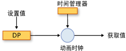
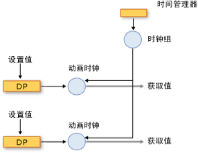
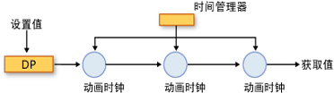

# 动画和计时系统概述Animation and Timing System Overview
本主题描述计时系统如何使用动画<xref:System.Windows.Media.Animation.Timeline>，和<xref:System.Windows.Media.Animation.Clock>类属性进行动画处理。This topic describes how the timing system uses the animation, <xref:System.Windows.Media.Animation.Timeline>, and <xref:System.Windows.Media.Animation.Clock> classes to animate properties.  
  
   
## 系统必备Prerequisites  
 为了了解本主题，应该能够使用 [!INCLUDE[TLA2#tla_winclient](../../../../includes/tla2sharptla-winclient-md.md)] 动画来对属性进行动画处理，如[动画概述](animation-overview.md)中所述。To understand this topic, you should be able to use [!INCLUDE[TLA2#tla_winclient](../../../../includes/tla2sharptla-winclient-md.md)] animations to animate properties, as described in the [Animation Overview](animation-overview.md). 本主题还有助于熟悉依赖属性；有关详细信息，请参阅[依赖属性概述](../advanced/dependency-properties-overview.md)。It also helps to be familiar with dependency properties; for more information, see the [Dependency Properties Overview](../advanced/dependency-properties-overview.md).  
  
   
## 时间线和时钟Timelines and Clocks  
 [动画概述](animation-overview.md)所述方式<xref:System.Windows.Media.Animation.Timeline>表示的时间和动画段是一种<xref:System.Windows.Media.Animation.Timeline>产生输出值。The [Animation Overview](animation-overview.md) described how a <xref:System.Windows.Media.Animation.Timeline> represents a segment of time, and an animation is a type of <xref:System.Windows.Media.Animation.Timeline> that produces output values. 其本身而言， <xref:System.Windows.Media.Animation.Timeline>，不执行任何操作而不只是介绍了一个时间段。By itself, a <xref:System.Windows.Media.Animation.Timeline>, doesn't do anything other than just describe a segment of time. 时间线的<xref:System.Windows.Media.Animation.Clock>对象执行实际工作。It's the timeline's <xref:System.Windows.Media.Animation.Clock> object that does the real work. 同样，动画并不实际属性进行动画处理： 动画类描述应如何计算输出值，但它是<xref:System.Windows.Media.Animation.Clock>创建动画促进动画输出并将其应用到属性。Likewise, animation doesn't actually animate properties: an animation class describes how output values should be calculated, but it’s the <xref:System.Windows.Media.Animation.Clock> that was created for the animation that drives the animation output and applies it to properties.  
  
 一个<xref:System.Windows.Media.Animation.Clock>是一种特殊的维护与时间有关运行时的状态对象<xref:System.Windows.Media.Animation.Timeline>。A <xref:System.Windows.Media.Animation.Clock> is a special type of object that maintains timing-related run-time state for the <xref:System.Windows.Media.Animation.Timeline>. 它提供对动画和计时系统至关重要的三个信息位： <xref:System.Windows.Media.Animation.Clock.CurrentTime%2A>， <xref:System.Windows.Media.Animation.Clock.CurrentProgress%2A>，和<xref:System.Windows.Media.Animation.Clock.CurrentState%2A>。It provides three bits of information that are essential to the animation and timing system: <xref:System.Windows.Media.Animation.Clock.CurrentTime%2A>, <xref:System.Windows.Media.Animation.Clock.CurrentProgress%2A>, and <xref:System.Windows.Media.Animation.Clock.CurrentState%2A>. 一个<xref:System.Windows.Media.Animation.Clock>通过使用所描述的计时行为来确定其当前时间、 进度和状态及其<xref:System.Windows.Media.Animation.Timeline>: <xref:System.Windows.Media.Animation.Timeline.Duration%2A>， <xref:System.Windows.Media.Animation.Timeline.RepeatBehavior%2A>， <xref:System.Windows.Media.Animation.Timeline.AutoReverse%2A>，依次类推。A <xref:System.Windows.Media.Animation.Clock> determines its current time, progress, and state by using the timing behaviors described by its <xref:System.Windows.Media.Animation.Timeline>: <xref:System.Windows.Media.Animation.Timeline.Duration%2A>, <xref:System.Windows.Media.Animation.Timeline.RepeatBehavior%2A>, <xref:System.Windows.Media.Animation.Timeline.AutoReverse%2A>, and so on.  
  
 在大多数情况下，<xref:System.Windows.Media.Animation.Clock>会自动为你的时间线创建。In most cases, a <xref:System.Windows.Media.Animation.Clock> is created automatically for your timeline. 当您使用进行动画处理<xref:System.Windows.Media.Animation.Storyboard>或<xref:System.Windows.Media.Animation.Animatable.BeginAnimation%2A>方法中，自动为时间线和动画创建时钟并应用于其目标属性。When you animate by using a <xref:System.Windows.Media.Animation.Storyboard> or the <xref:System.Windows.Media.Animation.Animatable.BeginAnimation%2A> method, clocks are automatically created for your timelines and animations and applied to their targeted properties. 此外可以创建<xref:System.Windows.Media.Animation.Clock>通过使用显式<xref:System.Windows.Media.Animation.Timeline.CreateClock%2A>方法在<xref:System.Windows.Media.Animation.Timeline>。You can also create a <xref:System.Windows.Media.Animation.Clock> explicitly by using the <xref:System.Windows.Media.Animation.Timeline.CreateClock%2A> method of your <xref:System.Windows.Media.Animation.Timeline>. <xref:System.Windows.Media.MediaTimeline.CreateClock%2A?displayProperty=nameWithType>方法创建的相应类型的时钟<xref:System.Windows.Media.Animation.Timeline>上调用它。The <xref:System.Windows.Media.MediaTimeline.CreateClock%2A?displayProperty=nameWithType> method creates a clock of the appropriate type for the <xref:System.Windows.Media.Animation.Timeline> on which it is called. 如果<xref:System.Windows.Media.Animation.Timeline>包含子时间线，它会创建<xref:System.Windows.Media.Animation.Clock>也为其对象。If the <xref:System.Windows.Media.Animation.Timeline> contains child timelines, it creates <xref:System.Windows.Media.Animation.Clock> objects for them as well. 得到<xref:System.Windows.Media.Animation.Clock>在匹配的结构的树中排列对象<xref:System.Windows.Media.Animation.Timeline>从中创建树对象。The resulting <xref:System.Windows.Media.Animation.Clock> objects are arranged in trees that match the structure of the <xref:System.Windows.Media.Animation.Timeline> objects tree from which they are created.  
  
 不同类型的时间线具有不同类型的时钟。There are different types of clocks for different types of timelines. 下表显示<xref:System.Windows.Media.Animation.Clock>对应于一些不同的类型<xref:System.Windows.Media.Animation.Timeline>类型。The following table shows the <xref:System.Windows.Media.Animation.Clock> types that correspond to some of the different <xref:System.Windows.Media.Animation.Timeline> types.  
  
|时间线类型Timeline type|时钟类型Clock type|时钟用途Clock purpose|  
|-------------------|----------------|-------------------|  
|动画 (继承自<xref:System.Windows.Media.Animation.AnimationTimeline>)Animation (inherits from <xref:System.Windows.Media.Animation.AnimationTimeline>)|<xref:System.Windows.Media.Animation.AnimationClock>|为依赖属性生成输出值。Generates output values for a dependency property.|  
|<xref:System.Windows.Media.MediaTimeline>|<xref:System.Windows.Media.MediaClock>|处理媒体文件。Processes a media file.|  
|<xref:System.Windows.Media.Animation.ParallelTimeline>|<xref:System.Windows.Media.Animation.ClockGroup>|分组和控制其子<xref:System.Windows.Media.Animation.Clock>对象Groups and controls its child <xref:System.Windows.Media.Animation.Clock> objects|  
|<xref:System.Windows.Media.Animation.Storyboard>|<xref:System.Windows.Media.Animation.ClockGroup>|分组和控制其子<xref:System.Windows.Media.Animation.Clock>对象Groups and controls its child <xref:System.Windows.Media.Animation.Clock> objects|  
  
 您可以应用任意<xref:System.Windows.Media.Animation.AnimationClock>对象通过创建到兼容的依赖属性<xref:System.Windows.Media.Animation.IAnimatable.ApplyAnimationClock%2A>方法。You can apply any <xref:System.Windows.Media.Animation.AnimationClock> objects you create to compatible dependency properties by using the <xref:System.Windows.Media.Animation.IAnimatable.ApplyAnimationClock%2A> method.  
  
 需要进行大量性能的情况下，例如对大量类似对象进行动画处理管理你自己<xref:System.Windows.Media.Animation.Clock>使用可以提供性能优势。In performance-intensive scenarios, such as animating large numbers of similar objects, managing your own <xref:System.Windows.Media.Animation.Clock> use can provide performance benefits.  
  
   
## 时钟和时间管理器Clocks and the Time Manager  
 当您设置中的对象有动画效果[!INCLUDE[TLA2#tla_winclient](../../../../includes/tla2sharptla-winclient-md.md)]，它是时间管理器，用于管理<xref:System.Windows.Media.MediaPlayer.Clock%2A>为时间线创建的对象。When you animate objects in [!INCLUDE[TLA2#tla_winclient](../../../../includes/tla2sharptla-winclient-md.md)], it’s the time manager that manages the <xref:System.Windows.Media.MediaPlayer.Clock%2A> objects created for your timelines. 时间管理器是 <xref:System.Windows.Media.MediaPlayer.Clock%2A> 对象树的根，并控制该树中的时间流。The time manager is the root of a tree of <xref:System.Windows.Media.MediaPlayer.Clock%2A> objects and controls the flow of time in that tree.  将自动为每个 [!INCLUDE[TLA2#tla_winclient](../../../../includes/tla2sharptla-winclient-md.md)] 应用程序创建时间管理器，它对于应用程序开发人员不可见。A time manager is automatically created for each [!INCLUDE[TLA2#tla_winclient](../../../../includes/tla2sharptla-winclient-md.md)] application and is invisible to the application developer. 时间管理器每秒钟“滴答”多次；每秒发生的实际滴答次数取决于可用的系统资源。The time manager "ticks" many times per second; the actual number of ticks that occur each second varies depending on available system resources. 在每个滴答，时间管理器计算的所有状态<xref:System.Windows.Media.Animation.ClockState.Active><xref:System.Windows.Media.Animation.Clock>计时树中的对象。During each one of these ticks, the time manager computes the state of all <xref:System.Windows.Media.Animation.ClockState.Active> <xref:System.Windows.Media.Animation.Clock> objects in the timing tree.  
  
 下图演示时间管理器之间的关系和<xref:System.Windows.Media.Animation.AnimationClock>，和动画处理的依赖属性。The following illustration shows the relationship between the time manager, and <xref:System.Windows.Media.Animation.AnimationClock>, and an animated dependency property.  
  
   
对属性进行动画处理Animating a property  
  
 当时间管理器滴答时，它会更新的时间每个<xref:System.Windows.Media.Animation.ClockState.Active><xref:System.Windows.Media.Animation.Clock>应用程序中。When the time manager ticks, it updates the time of every <xref:System.Windows.Media.Animation.ClockState.Active> <xref:System.Windows.Media.Animation.Clock> in the application. 如果<xref:System.Windows.Media.Animation.Clock>是<xref:System.Windows.Media.Animation.AnimationClock>，它使用<xref:System.Windows.Media.Animation.AnimationTimeline.GetCurrentValue%2A>方法的<xref:System.Windows.Media.Animation.AnimationTimeline>于创建它来计算其当前输出值。If the <xref:System.Windows.Media.Animation.Clock> is an <xref:System.Windows.Media.Animation.AnimationClock>, it uses the <xref:System.Windows.Media.Animation.AnimationTimeline.GetCurrentValue%2A> method of the <xref:System.Windows.Media.Animation.AnimationTimeline> from which it was created to calculate its current output value. <xref:System.Windows.Media.Animation.AnimationClock>提供<xref:System.Windows.Media.Animation.AnimationTimeline>当前本地时间、 输入的值，这通常是属性的基值，与默认目标值。The <xref:System.Windows.Media.Animation.AnimationClock> supplies the <xref:System.Windows.Media.Animation.AnimationTimeline> with the current local time, an input value, which is typically the base value of the property, and a default destination value. 检索一个经过动画处理的值时通过属性使用<xref:System.Windows.DependencyObject.GetValue%2A>方法或其 CLR 访问器，你获得的输出其<xref:System.Windows.Media.Animation.AnimationClock>。When you retrieve the value of an animated by property using the <xref:System.Windows.DependencyObject.GetValue%2A> method or its CLR accessor, you get the output of its <xref:System.Windows.Media.Animation.AnimationClock>.  
  
#### 时钟组Clock Groups  
 前面部分介绍了如何有不同类型的<xref:System.Windows.Media.Animation.Clock>时间线的不同类型的对象。The preceding section described how there are different types of <xref:System.Windows.Media.Animation.Clock> objects for different types of timelines. 下图演示时间管理器之间的关系<xref:System.Windows.Media.Animation.ClockGroup>、 <xref:System.Windows.Media.Animation.AnimationClock>，和动画处理的依赖属性。The following illustration shows the relationship between the time manager, a <xref:System.Windows.Media.Animation.ClockGroup>, an <xref:System.Windows.Media.Animation.AnimationClock>, and an animated dependency property. 一个<xref:System.Windows.Media.Animation.ClockGroup>为进行分组的其他时间线，如创建<xref:System.Windows.Media.Animation.Storyboard>类，该类对动画和其他时间线。A <xref:System.Windows.Media.Animation.ClockGroup> is created for timelines that group other timelines, such as the <xref:System.Windows.Media.Animation.Storyboard> class, which groups animations and other timelines.  
  
   
ClockGroupA ClockGroup  
  
#### 撰写Composition  
 可以将多个时钟与一个属性相关联，在这种情况下，每个时钟都将上一个时钟的输出值用作其基值。It's possible to associate multiple clocks with a single property, in which case each clock uses the output value of the preceding clock as its base value. 下图显示了三个<xref:System.Windows.Media.Animation.AnimationClock>应用于相同的属性对象。The following illustration shows three <xref:System.Windows.Media.Animation.AnimationClock> objects applied to the same property. 时钟1 将经过动画处理的属性的基值用作其输入，并使用该值生成输出。Clock1 uses the base value of the animated property as its input and uses it to generate output. 时钟2 将时钟1 的输出用作其输入，并使用该值生成输出。Clock2 takes the output from Clock1 as its input and uses it to generate output. 时钟3 将时钟2 的输出用作其输入，并使用该值生成输出。Clock3 takes the output from Clock2 as its input and uses it to generate output. 如果多个时钟同时影响同一个属性，则认为这些时钟位于一个组合链中。When multiple clocks affect the same property simultaneously, they are said to be in a composition chain.  
  
   
组合链A composition chain  
  
 请注意，虽然在输入和输出之间创建关系<xref:System.Windows.Media.Animation.AnimationClock>中组合链中，其计时行为不会受到影响; 的对象<xref:System.Windows.Media.Animation.Clock>对象 (包括<xref:System.Windows.Media.Animation.AnimationClock>对象) 上其父级具有分层依赖性<xref:System.Windows.Media.Animation.Clock>对象。Note that although a relationship is created among the input and output of the <xref:System.Windows.Media.Animation.AnimationClock> objects in the composition chain, their timing behaviors are not affected; <xref:System.Windows.Media.Animation.Clock> objects (including <xref:System.Windows.Media.Animation.AnimationClock> objects) have a hierarchical dependency on their parent <xref:System.Windows.Media.Animation.Clock> objects.  
  
 若要将多个时钟应用于同一个属性，请使用<xref:System.Windows.Media.Animation.HandoffBehavior.Compose><xref:System.Windows.Media.Animation.HandoffBehavior>应用时<xref:System.Windows.Media.Animation.Storyboard>，动画，或<xref:System.Windows.Media.Animation.AnimationClock>。To apply multiple clocks to the same property, use the <xref:System.Windows.Media.Animation.HandoffBehavior.Compose> <xref:System.Windows.Media.Animation.HandoffBehavior> when applying a <xref:System.Windows.Media.Animation.Storyboard>, animation, or <xref:System.Windows.Media.Animation.AnimationClock>.  
  
#### 滴答和事件合并Ticks and Event Consolidation  
 除了计算输出值以外，时间管理器还会在它每滴答一次时执行其他工作：它会确定每个时钟的状态并根据需要引发事件。In addition to calculating output values, the time manager does other work every time it ticks: it determines the state of each clock and raises events as appropriate.  
  
 尽管时钟周期频繁发生，但是不同时钟周期之间可能会很多操作。While ticks occur frequently, it's possible for a lot of things to happen between ticks. 例如，<xref:System.Windows.Media.Animation.Clock>可能会停止、 启动，并再次停止，在这种情况下其<xref:System.Windows.Media.Animation.Clock.CurrentState%2A>值将更改三次。For example, a <xref:System.Windows.Media.Animation.Clock> might be stopped, started, and stopped again, in which case its <xref:System.Windows.Media.Animation.Clock.CurrentState%2A> value will have changed three times. 从理论上讲，<xref:System.Windows.Media.Animation.Clock.CurrentStateInvalidated>事件可能会引发多个时间在一个时钟周期中; 但是，计时引擎会合并事件，以便<xref:System.Windows.Media.Animation.Clock.CurrentStateInvalidated>每个滴答一次引发事件。In theory, the <xref:System.Windows.Media.Animation.Clock.CurrentStateInvalidated> event could be raised multiple times in a single tick; however, the timing engine consolidates events, so that the <xref:System.Windows.Media.Animation.Clock.CurrentStateInvalidated> event can be raised at most once per tick. 这适用于所有的计时事件： 针对引发一个事件最多每种类型的给定<xref:System.Windows.Media.Animation.Clock>对象。This is true for all timing events: at most one event of each type is raised for a given <xref:System.Windows.Media.Animation.Clock> object.  
  
 当<xref:System.Windows.Media.Animation.Clock>切换状态并返回到其原始状态计时周期之间 (例如从<xref:System.Windows.Media.Animation.ClockState.Active>到<xref:System.Windows.Media.Animation.ClockState.Stopped>并返回到<xref:System.Windows.Media.Animation.ClockState.Active>)，仍发生关联的事件。When a <xref:System.Windows.Media.Animation.Clock> switches states and returns back to its original state between ticks (such as changing from <xref:System.Windows.Media.Animation.ClockState.Active> to <xref:System.Windows.Media.Animation.ClockState.Stopped> and back to <xref:System.Windows.Media.Animation.ClockState.Active>), the associated event still occurs.  
  
 有关计时事件的详细信息，请参阅[计时事件概述](timing-events-overview.md)。For more information about timing events, see the [Timing Events Overview](timing-events-overview.md).  
  
   
## 属性的当前值和基值Current Values and Base Values of Properties  
 可进行动画处理的属性具有两个值：基值和当前值。An animatable property can have two values: a base value and a current value. 在将使用其 CLR 访问器的属性的设置或<xref:System.Windows.DependencyObject.SetValue%2A>方法，您并将其基值。When you set property using its CLR accessor or the <xref:System.Windows.DependencyObject.SetValue%2A> method, you set its base value. 对于尚未进行动画处理的属性，基值和当前值相同。When a property is not animated, its base and current values are the same.  
  
 当您对属性进行动画处理<xref:System.Windows.Media.Animation.AnimationClock>设置的属性*当前*值。When you animate a property, the <xref:System.Windows.Media.Animation.AnimationClock> sets the property's *current* value. 检索通过其 CLR 访问器的属性的值或<xref:System.Windows.DependencyObject.GetValue%2A>方法返回的输出<xref:System.Windows.Media.Animation.AnimationClock>时<xref:System.Windows.Media.Animation.AnimationClock>是<xref:System.Windows.Media.Animation.ClockState.Active>或<xref:System.Windows.Media.Animation.ClockState.Filling>。Retrieving the property's value through its CLR accessor or the <xref:System.Windows.DependencyObject.GetValue%2A> method returns the output of the <xref:System.Windows.Media.Animation.AnimationClock> when the <xref:System.Windows.Media.Animation.AnimationClock> is <xref:System.Windows.Media.Animation.ClockState.Active> or <xref:System.Windows.Media.Animation.ClockState.Filling>. 可以使用来检索属性的基值<xref:System.Windows.Media.Animation.IAnimatable.GetAnimationBaseValue%2A>方法。You can retrieve the property's base value by using the <xref:System.Windows.Media.Animation.IAnimatable.GetAnimationBaseValue%2A> method.  
  
## 请参阅See also

- [动画概述Animation Overview](animation-overview.md)
- [计时事件概述Timing Events Overview](timing-events-overview.md)
- [计时行为概述Timing Behaviors Overview](timing-behaviors-overview.md)
