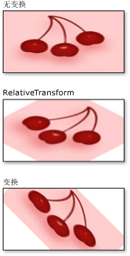

# Brush 变换概述
Brush 类提供了两个变换属性：<xref:System.Windows.Media.Brush.Transform%2A> 和 <xref:System.Windows.Media.Brush.RelativeTransform%2A>。  使用这些属性可以旋转、缩放、扭曲和平移画笔的内容。  本主题描述了这两个属性之间的区别，并提供了它们的用法示例。  
  
   
   
## 必备组件  
 若要了解本主题，您应当了解要变换的画笔的功能。  对于 <xref:System.Windows.Media.LinearGradientBrush> 和 <xref:System.Windows.Media.RadialGradientBrush>，请参见[使用纯色和渐变进行绘制概述](../../../../docs/framework/wpf/graphics-multimedia/painting-with-solid-colors-and-gradients-overview.md)。  对于 <xref:System.Windows.Media.ImageBrush>、<xref:System.Windows.Media.DrawingBrush> 或 <xref:System.Windows.Media.VisualBrush>，请参见[使用图像、绘图和 Visual 进行绘制](../../../../docs/framework/wpf/graphics-multimedia/painting-with-images-drawings-and-visuals.md)。  您还应当熟悉[变换概述](../../../../docs/framework/wpf/graphics-multimedia/transforms-overview.md)中所描述的二维变换。  
  
   
## Transform 和 RelativeTransform 属性的区别  
 向画笔的 <xref:System.Windows.Media.Brush.Transform%2A> 属性应用变换时，如果您想要绕画笔的中心变换画笔内容，则需要知道所绘制区域的大小。  假设绘制区域的宽度为 200，高度为 150（以[与设备无关的像素](GTMT)为单位）。  如果使用一个 <xref:System.Windows.Media.RotateTransform> 将画笔输出绕其中心旋转约 45 度，您将为 <xref:System.Windows.Media.RotateTransform> 指定 <xref:System.Windows.Media.RotateTransform.CenterX%2A> 100，<xref:System.Windows.Media.RotateTransform.CenterY%2A> 75。  
  
 向画笔的 <xref:System.Windows.Media.Brush.RelativeTransform%2A> 属性应用变换时，变换会在其输出映射到绘制区域之前应用于画笔。  下面的列表描述了处理和变换画笔内容的顺序。  
  
1.  处理画笔的内容。  对于 <xref:System.Windows.Media.GradientBrush>，这意味着确定渐变区域。  对于 <xref:System.Windows.Media.TileBrush>，<xref:System.Windows.Media.TileBrush.Viewbox%2A> 映射到 <xref:System.Windows.Media.TileBrush.Viewport%2A>。  这将成为画笔的输出。  
  
2.  将画笔输出投影到 1 x 1 变换矩形上。  
  
3.  应用画笔的 <xref:System.Windows.Media.Brush.RelativeTransform%2A>（如果有）。  
  
4.  将变换后的输出投影到要绘制的区域。  
  
5.  应用画笔的 <xref:System.Windows.Media.Transform>（如果有）。  
  
 由于是在画笔的输出映射到 1 x 1 矩形的情况下应用 <xref:System.Windows.Media.Brush.RelativeTransform%2A>，因此变换中心和偏移量值是相对的。  例如，如果使用一个 <xref:System.Windows.Media.RotateTransform> 将画笔输出绕其中心旋转 45 度，您将为 <xref:System.Windows.Media.RotateTransform> 指定 <xref:System.Windows.Media.RotateTransform.CenterX%2A> 0.5，<xref:System.Windows.Media.RotateTransform.CenterY%2A> 0.5。  
  
 下图演示已使用 <xref:System.Windows.Media.Brush.RelativeTransform%2A> 和 <xref:System.Windows.Media.Brush.Transform%2A> 属性旋转了 45 度的几个画笔的输出。  
  
   
  
   
## 与 TileBrush 一起使用 RelativeTransform  
 由于图块画笔比其他画笔更复杂，因此向这种画笔应用 <xref:System.Windows.Media.Brush.RelativeTransform%2A> 可能会产生意外结果。  以下面的图像为例。  
  
   
  
 下面的示例使用一个 <xref:System.Windows.Media.ImageBrush> 来绘制一个包含前面的图像的矩形区域。  它将 <xref:System.Windows.Media.RotateTransform> 应用于 <xref:System.Windows.Media.ImageBrush> 对象的 <xref:System.Windows.Media.Brush.RelativeTransform%2A> 属性，并将其 <xref:System.Windows.Media.TileBrush.Stretch%2A> 属性设置为 <xref:System.Windows.Media.Stretch>，以便在拉伸图像以完全填充矩形时保留图像的纵横比。  
  
 [!code-xml[BrushOverviewExamples_snip#GraphicsMMRelativeTransformExample2Inline](../../../../samples/snippets/xaml/VS_Snippets_Wpf/BrushOverviewExamples_snip/XAML/RelativeTransformIllustration.xaml#graphicsmmrelativetransformexample2inline)]  
  
 该示例产生下面的输出：  
  
   
  
 请注意，即使画笔的 <xref:System.Windows.Media.TileBrush.Stretch%2A> 设置为 <xref:System.Windows.Media.Stretch>，图像也会扭曲。  这是因为在将画笔的 <xref:System.Windows.Media.TileBrush.Viewbox%2A> 映射到其 <xref:System.Windows.Media.TileBrush.Viewport%2A> 之后应用了相对变换。  下面的列表描述该过程的各个步骤：  
  
1.  使用画笔的 <xref:System.Windows.Media.TileBrush.Stretch%2A> 设置将画笔内容 \(<xref:System.Windows.Media.TileBrush.Viewbox%2A>\) 投影到其基本图块 \(<xref:System.Windows.Media.TileBrush.Viewport%2A>\)。  
  
       
  
2.  将基本图块投影到 1 x 1 变换矩形上。  
  
       
  
3.  应用 <xref:System.Windows.Media.RotateTransform>。  
  
       
  
4.  将变换后的基本图块投影到要绘制的区域。  
  
       
  
   
## 示例：将一个 ImageBrush 旋转 45 度  
 下面的示例将 <xref:System.Windows.Media.RotateTransform> 应用于 <xref:System.Windows.Media.ImageBrush> 的 <xref:System.Windows.Media.Brush.RelativeTransform%2A> 属性。  <xref:System.Windows.Media.RotateTransform> 对象的 <xref:System.Windows.Media.RotateTransform.CenterX%2A> 和 <xref:System.Windows.Media.RotateTransform.CenterY%2A> 属性均设置为 0.5，这是此内容的中心点的相对坐标。  这样，将绕画笔的中心来旋转画笔内容。  
  
 [!code-csharp[BrushesIntroduction_snip#ImageBrushRelativeTransformExample](../../../../samples/snippets/csharp/VS_Snippets_Wpf/BrushesIntroduction_snip/CSharp/BrushTransformExample.cs#imagebrushrelativetransformexample)]
 [!code-vb[BrushesIntroduction_snip#ImageBrushRelativeTransformExample](../../../../samples/snippets/visualbasic/VS_Snippets_Wpf/BrushesIntroduction_snip/visualbasic/brushtransformexample.vb#imagebrushrelativetransformexample)]
 [!code-xml[BrushesIntroduction_snip#ImageBrushRelativeTransformExample](../../../../samples/snippets/xaml/VS_Snippets_Wpf/BrushesIntroduction_snip/XAML/BrushTransformExample.xaml#imagebrushrelativetransformexample)]  
  
 下面的示例还将 <xref:System.Windows.Media.RotateTransform> 应用于 <xref:System.Windows.Media.ImageBrush>，但使用的是 <xref:System.Windows.Media.Brush.Transform%2A> 属性而不是 <xref:System.Windows.Media.Brush.RelativeTransform%2A> 属性。  若要使画笔围绕其中心旋转，必须将 <xref:System.Windows.Media.RotateTransform> 对象的 <xref:System.Windows.Media.RotateTransform.CenterX%2A> 和 <xref:System.Windows.Media.RotateTransform.CenterY%2A> 设置为绝对坐标。  由于画笔要绘制的矩形为 175 x 90 像素，因此其中心点为 \(87.5, 45\)。  
  
 [!code-csharp[BrushesIntroduction_snip#ImageBrushTransformExample](../../../../samples/snippets/csharp/VS_Snippets_Wpf/BrushesIntroduction_snip/CSharp/BrushTransformExample.cs#imagebrushtransformexample)]
 [!code-vb[BrushesIntroduction_snip#ImageBrushTransformExample](../../../../samples/snippets/visualbasic/VS_Snippets_Wpf/BrushesIntroduction_snip/visualbasic/brushtransformexample.vb#imagebrushtransformexample)]
 [!code-xml[BrushesIntroduction_snip#ImageBrushTransformExample](../../../../samples/snippets/xaml/VS_Snippets_Wpf/BrushesIntroduction_snip/XAML/BrushTransformExample.xaml#imagebrushtransformexample)]  
  
 下图演示画笔未进行变换的情况、变换应用于 <xref:System.Windows.Media.Brush.RelativeTransform%2A> 属性的情况以及变换应用于 <xref:System.Windows.Media.Brush.Transform%2A> 属性的情况。  
  
   
  
 此示例摘自一个更大的示例。  有关完整示例，请参见 [Brushes Sample](http://go.microsoft.com/fwlink/?LinkID=159973)（Brushes 示例）。  有关画笔的更多信息，请参见 [WPF 画笔概述](../../../../docs/framework/wpf/graphics-multimedia/wpf-brushes-overview.md)。  
  
## 请参阅  
 <xref:System.Windows.Media.Brush.Transform%2A>   
 <xref:System.Windows.Media.Brush.RelativeTransform%2A>   
 <xref:System.Windows.Media.Transform>   
 <xref:System.Windows.Media.Brush>   
 [使用纯色和渐变进行绘制概述](../../../../docs/framework/wpf/graphics-multimedia/painting-with-solid-colors-and-gradients-overview.md)   
 [使用图像、绘图和 Visual 进行绘制](../../../../docs/framework/wpf/graphics-multimedia/painting-with-images-drawings-and-visuals.md)   
 [变换概述](../../../../docs/framework/wpf/graphics-multimedia/transforms-overview.md)