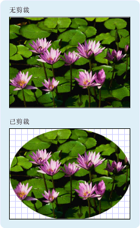

# Geometry 概述
本概述介绍如何使用[!INCLUDE[TLA#tla_winclient](../../../../includes/tlasharptla-winclient-md.md)]<xref:System.Windows.Media.Geometry>类描述形状。 本主题还对照了之间的差异<xref:System.Windows.Media.Geometry>对象和<xref:System.Windows.Shapes.Shape>元素。  

   
## 什么是 Geometry？  
 <xref:System.Windows.Media.Geometry>类和类派生，如<xref:System.Windows.Media.EllipseGeometry>， <xref:System.Windows.Media.PathGeometry>，和<xref:System.Windows.Media.CombinedGeometry>，使你可以描述 2-d 形状的几何图形。 这些几何描述具有许多用途，例如定义要绘制到屏幕的形状或定义命中测试和剪裁区域。 甚至可以使用几何定义动画路径。  
  
 <xref:System.Windows.Media.Geometry> 对象可以很简单，如矩形和圆形，也组合键，由两个或多个几何对象创建。  可以通过创建更复杂的几何<xref:System.Windows.Media.PathGeometry>和<xref:System.Windows.Media.StreamGeometry>类，可用于描述弧线和曲线。  
  
 因为<xref:System.Windows.Media.Geometry>是一种<xref:System.Windows.Freezable>，<xref:System.Windows.Media.Geometry>对象提供多种特殊功能： 它们可以声明为[资源](../advanced/xaml-resources.md)、 在多个对象，变为只读以提高性能，克隆，共享和变为线程安全。 有关所提供的不同功能的详细信息<xref:System.Windows.Freezable>对象，请参阅[Freezable 对象概述](../advanced/freezable-objects-overview.md)。  
  
   
## 几何与形状  
 <xref:System.Windows.Media.Geometry>和<xref:System.Windows.Shapes.Shape>类的相似，因为它们均描述 2-d 形状 (比较<xref:System.Windows.Media.EllipseGeometry>和<xref:System.Windows.Shapes.Ellipse>例如)，但有重要区别。  
  
 对于其中一个，<xref:System.Windows.Media.Geometry>类继承自<xref:System.Windows.Freezable>类，而<xref:System.Windows.Shapes.Shape>类继承自<xref:System.Windows.FrameworkElement>。 由于它们是元素，<xref:System.Windows.Shapes.Shape>对象可以自行呈现并参与布局系统，而<xref:System.Windows.Media.Geometry>对象则不能。  
  
 尽管<xref:System.Windows.Shapes.Shape>对象是相比更易于使用<xref:System.Windows.Media.Geometry>对象，<xref:System.Windows.Media.Geometry>对象是更灵活。 虽然<xref:System.Windows.Shapes.Shape>对象用于呈现二维图形<xref:System.Windows.Media.Geometry>对象可以用于定义 2-d 图形的几何区域、 定义剪裁的区域或定义命中测试的区域，例如。  
  
### Path 形状  
 一个<xref:System.Windows.Shapes.Shape>，则<xref:System.Windows.Shapes.Path>类，实际使用<xref:System.Windows.Media.Geometry>描述其内容。 通过设置<xref:System.Windows.Shapes.Path.Data%2A>的属性<xref:System.Windows.Shapes.Path>与<xref:System.Windows.Media.Geometry>并设置其<xref:System.Windows.Shapes.Shape.Fill%2A>并<xref:System.Windows.Shapes.Shape.Stroke%2A>属性，您可以呈现<xref:System.Windows.Media.Geometry>。  
  
   
## 采用 Geometry 的常见属性  
 上述部分提到了可将 Geometry 对象与其他对象结合用于各种目的，如绘制形状、动画处理和剪裁。 下表列出了几个类具有采用属性<xref:System.Windows.Media.Geometry>对象。  
  
|类型|属性|  
|----------|--------------|  
|<xref:System.Windows.Media.Animation.DoubleAnimationUsingPath>|<xref:System.Windows.Media.Animation.DoubleAnimationUsingPath.PathGeometry%2A>|  
|<xref:System.Windows.Media.DrawingGroup>|<xref:System.Windows.Media.DrawingGroup.ClipGeometry%2A>|  
|<xref:System.Windows.Media.GeometryDrawing>|<xref:System.Windows.Media.GeometryDrawing.Geometry%2A>|  
|<xref:System.Windows.Shapes.Path>|<xref:System.Windows.Shapes.Path.Data%2A>|  
|<xref:System.Windows.UIElement>|<xref:System.Windows.UIElement.Clip%2A>|  
  
   
## 简单几何类型  
 针对所有几何的基类是抽象类<xref:System.Windows.Media.Geometry>。  派生类<xref:System.Windows.Media.Geometry>类可大致分为三个类别： 简单几何、 路径几何和复合几何。  
  
 简单的几何类包括<xref:System.Windows.Media.LineGeometry>， <xref:System.Windows.Media.RectangleGeometry>，和<xref:System.Windows.Media.EllipseGeometry>和用于创建基本几何形状，例如线条、 矩形和圆形。  
  
-   一个<xref:System.Windows.Media.LineGeometry>定义通过指定行和终结点的起始点。  
  
-   一个<xref:System.Windows.Media.RectangleGeometry>定义与<xref:System.Windows.Rect>结构指定其相对位置以及高度和宽度。 可以通过设置创建一个圆角的矩形<xref:System.Windows.Media.RectangleGeometry.RadiusX%2A>和<xref:System.Windows.Media.RectangleGeometry.RadiusY%2A>属性。  
  
-   <xref:System.Windows.Media.EllipseGeometry>由中心点、 x 半径和 y 半径定义。  以下示例介绍如何创建简单几何来进行呈现和剪裁。  
  
 这些相同的形状以及更复杂的形状，可以使用创建<xref:System.Windows.Media.PathGeometry>或通过合并几何对象组合在一起，但这些类用于生成这些基本几何形状提供更简单的方法。  
  
 下面的示例演示如何创建和呈现<xref:System.Windows.Media.LineGeometry>。  如前所述，<xref:System.Windows.Media.Geometry>对象是无法自我绘制，因此该示例使用<xref:System.Windows.Shapes.Path>形状呈现直线。  由于直线没有面积，设置<xref:System.Windows.Shapes.Shape.Fill%2A>的属性<xref:System.Windows.Shapes.Path>会产生任何影响; 相反，仅<xref:System.Windows.Shapes.Shape.Stroke%2A>和<xref:System.Windows.Shapes.Shape.StrokeThickness%2A>指定属性。 下图显示该示例的输出。  
  
   
从 (10,20) 绘制到 (100,130) 的 LineGeometry  
  
 [!code-xaml[GeometryOverviewSamples_snip#GraphicsMMLineGeometryExample](~/samples/snippets/csharp/VS_Snippets_Wpf/GeometryOverviewSamples_snip/CS/GeometryExamples.xaml#graphicsmmlinegeometryexample)]  
  
 [!code-csharp[GeometryOverviewSamples_procedural_snip#GraphicsMMLineGeometryExample](~/samples/snippets/csharp/VS_Snippets_Wpf/GeometryOverviewSamples_procedural_snip/CSharp/GeometryExamples.cs#graphicsmmlinegeometryexample)]
 [!code-vb[GeometryOverviewSamples_procedural_snip#GraphicsMMLineGeometryExample](~/samples/snippets/visualbasic/VS_Snippets_Wpf/GeometryOverviewSamples_procedural_snip/visualbasic/geometryexamples.vb#graphicsmmlinegeometryexample)]  
  
 下面的示例演示如何创建和呈现<xref:System.Windows.Media.EllipseGeometry>。  示例集<xref:System.Windows.Media.EllipseGeometry.Center%2A>的<xref:System.Windows.Media.EllipseGeometry>设置为点`50,50`和 x 轴半径和 y 半径均设置为`50`，这将创建一个圆圈直径为 100。  通过这种情况下向 Path 元素的 Fill 属性分配值绘制椭圆的内部<xref:System.Windows.Media.Brushes.Gold%2A>。 下图显示该示例的输出。  
  
   
在 (50,50) 处绘制的一个 EllipseGeometry  
  
 [!code-xaml[GeometryOverviewSamples_snip#GraphicsMMEllipseGeometryExample](~/samples/snippets/csharp/VS_Snippets_Wpf/GeometryOverviewSamples_snip/CS/GeometryExamples.xaml#graphicsmmellipsegeometryexample)]  
  
 [!code-csharp[GeometryOverviewSamples_procedural_snip#GraphicsMMEllipseGeometryExample](~/samples/snippets/csharp/VS_Snippets_Wpf/GeometryOverviewSamples_procedural_snip/CSharp/GeometryExamples.cs#graphicsmmellipsegeometryexample)]
 [!code-vb[GeometryOverviewSamples_procedural_snip#GraphicsMMEllipseGeometryExample](~/samples/snippets/visualbasic/VS_Snippets_Wpf/GeometryOverviewSamples_procedural_snip/visualbasic/geometryexamples.vb#graphicsmmellipsegeometryexample)]  
  
 下面的示例演示如何创建和呈现<xref:System.Windows.Media.RectangleGeometry>。  由定义的位置和矩形的尺寸<xref:System.Windows.Rect>结构。 位置为 `50,50`，高度和宽度均为 `25`，这将创建一个正方形。 下图显示该示例的输出。  
  
   
在 50,50 处绘制的一个 RectangleGeometry  
  
 [!code-xaml[GeometryOverviewSamples_snip#GraphicsMMRectangleGeometryExample](~/samples/snippets/csharp/VS_Snippets_Wpf/GeometryOverviewSamples_snip/CS/GeometryExamples.xaml#graphicsmmrectanglegeometryexample)]  
  
 [!code-csharp[GeometryOverviewSamples_procedural_snip#GraphicsMMRectangleGeometryExample](~/samples/snippets/csharp/VS_Snippets_Wpf/GeometryOverviewSamples_procedural_snip/CSharp/GeometryExamples.cs#graphicsmmrectanglegeometryexample)]
 [!code-vb[GeometryOverviewSamples_procedural_snip#GraphicsMMRectangleGeometryExample](~/samples/snippets/visualbasic/VS_Snippets_Wpf/GeometryOverviewSamples_procedural_snip/visualbasic/geometryexamples.vb#graphicsmmrectanglegeometryexample)]  
  
 下面的示例演示如何使用<xref:System.Windows.Media.EllipseGeometry>作为图像的剪裁区域。  <xref:System.Windows.Controls.Image>对象定义与<xref:System.Windows.FrameworkElement.Width%2A>为 200 和<xref:System.Windows.FrameworkElement.Height%2A>的 150。  <xref:System.Windows.Media.EllipseGeometry>与<xref:System.Windows.Media.EllipseGeometry.RadiusX%2A>值为 100，<xref:System.Windows.Media.EllipseGeometry.RadiusY%2A>值为 75，和一个<xref:System.Windows.Media.EllipseGeometry.Center%2A>100,75 的值设置为<xref:System.Windows.UIElement.Clip%2A>图像属性。  将仅显示处于椭圆形区域内的图像部分。 下图显示该示例的输出。  
  
   
用于剪裁 Image 控件的 EllipseGeometry  
  
 [!code-xaml[GeometryOverviewSamples_snip#GraphicsMMImageClipGeometryExample](~/samples/snippets/csharp/VS_Snippets_Wpf/GeometryOverviewSamples_snip/CS/GeometryExamples.xaml#graphicsmmimageclipgeometryexample)]  
  
 [!code-csharp[GeometryOverviewSamples_procedural_snip#GraphicsMMImageClipGeometryExample](~/samples/snippets/csharp/VS_Snippets_Wpf/GeometryOverviewSamples_procedural_snip/CSharp/GeometryExamples.cs#graphicsmmimageclipgeometryexample)]
 [!code-vb[GeometryOverviewSamples_procedural_snip#GraphicsMMImageClipGeometryExample](~/samples/snippets/visualbasic/VS_Snippets_Wpf/GeometryOverviewSamples_procedural_snip/visualbasic/geometryexamples.vb#graphicsmmimageclipgeometryexample)]  
  
   
## 路径几何  
 <xref:System.Windows.Media.PathGeometry>类，其轻型等效项，<xref:System.Windows.Media.StreamGeometry>类中，提供方法来描述多个复杂图形组成弧线、 曲线和直线。  
  
 核心<xref:System.Windows.Media.PathGeometry>是一系列<xref:System.Windows.Media.PathFigure>对象，如此命名是因为每个图形都描述中的一个离散形状<xref:System.Windows.Media.PathGeometry>。 每个<xref:System.Windows.Media.PathFigure>本身包含一个或多个<xref:System.Windows.Media.PathSegment>对象，其中每个描述该图的段。  
  
 有多种类型的线段。  
  
|线段类型|描述|示例|  
|------------------|-----------------|-------------|  
|<xref:System.Windows.Media.ArcSegment>|创建两个点之间的椭圆弧。|[创建椭圆弧](how-to-create-an-elliptical-arc.md)。|  
|<xref:System.Windows.Media.BezierSegment>|创建两个点之间的三次方贝塞尔曲线。|[创建三次方贝塞尔曲线](how-to-create-a-cubic-bezier-curve.md)。|  
|<xref:System.Windows.Media.LineSegment>|创建两个点之间的直线。|[在 PathGeometry 中创建 LineSegment](how-to-create-a-linesegment-in-a-pathgeometry.md)|  
|<xref:System.Windows.Media.PolyBezierSegment>|创建一系列三次方贝塞尔曲线。|请参阅<xref:System.Windows.Media.PolyBezierSegment>类型页。|  
|<xref:System.Windows.Media.PolyLineSegment>|创建一系列直线。|请参阅<xref:System.Windows.Media.PolyLineSegment>类型页。|  
|<xref:System.Windows.Media.PolyQuadraticBezierSegment>|创建一系列的二次贝塞尔曲线。|请参阅<xref:System.Windows.Media.PolyQuadraticBezierSegment>页。|  
|<xref:System.Windows.Media.QuadraticBezierSegment>|创建一条二次贝塞尔曲线。|[创建二次贝塞尔曲线](how-to-create-a-quadratic-bezier-curve.md)。|  
  
 内部的分段<xref:System.Windows.Media.PathFigure>合并为一个几何形状，每一段的下一段的起始点的终结点。 <xref:System.Windows.Media.PathFigure.StartPoint%2A>属性的<xref:System.Windows.Media.PathFigure>指定从中绘制第一条线段的点。 每个后续线段都从上一线段的终点开始。 例如，从竖线`10,50`到`10,150`可以通过设置定义<xref:System.Windows.Media.PathFigure.StartPoint%2A>属性设置为`10,50`和创建<xref:System.Windows.Media.LineSegment>与<xref:System.Windows.Media.LineSegment.Point%2A>属性设置`10,150`。  
  
 下面的示例创建一个简单<xref:System.Windows.Media.PathGeometry>组成单个<xref:System.Windows.Media.PathFigure>与<xref:System.Windows.Media.LineSegment>，并显示其使用<xref:System.Windows.Shapes.Path>元素。 <xref:System.Windows.Media.PathFigure>对象的<xref:System.Windows.Media.PathFigure.StartPoint%2A>设置为`10,20`和一个<xref:System.Windows.Media.LineSegment>使用的终结点定义`100,130`。 下图显示<xref:System.Windows.Media.PathGeometry>创建此示例。  
  
   
包含单个 LineSegment 的 PathGeometry  
  
 [!code-xaml[GeometryOverviewSamples_snip#GraphicsMMPathGeometryLineExample](~/samples/snippets/csharp/VS_Snippets_Wpf/GeometryOverviewSamples_snip/CS/GeometryExamples.xaml#graphicsmmpathgeometrylineexample)]  
  
 [!code-csharp[GeometryOverviewSamples_procedural_snip#GraphicsMMPathGeometryLineExample](~/samples/snippets/csharp/VS_Snippets_Wpf/GeometryOverviewSamples_procedural_snip/CSharp/GeometryExamples.cs#graphicsmmpathgeometrylineexample)]
 [!code-vb[GeometryOverviewSamples_procedural_snip#GraphicsMMPathGeometryLineExample](~/samples/snippets/visualbasic/VS_Snippets_Wpf/GeometryOverviewSamples_procedural_snip/visualbasic/geometryexamples.vb#graphicsmmpathgeometrylineexample)]  
  
 必要将此示例与前面<xref:System.Windows.Media.LineGeometry>示例。  使用的语法<xref:System.Windows.Media.PathGeometry>比用于简单的更详细<xref:System.Windows.Media.LineGeometry>，并且它可能会更合理使用<xref:System.Windows.Media.LineGeometry>类，在这种情况下，但使用的详细语法<xref:System.Windows.Media.PathGeometry>允许极其错综复杂几何区域。  
  
 可以使用的组合创建更复杂的几何<xref:System.Windows.Media.PathSegment>对象。  
  
 下面的示例使用<xref:System.Windows.Media.BezierSegment>、 一个<xref:System.Windows.Media.LineSegment>，和一个<xref:System.Windows.Media.ArcSegment>若要创建形状。 该示例首先创建三次方贝塞尔曲线是通过定义四个点： 一个开始点，这是前一条线段，终结点的结束点 (<xref:System.Windows.Media.BezierSegment.Point3%2A>)，以及两个控制点 (<xref:System.Windows.Media.BezierSegment.Point1%2A>和<xref:System.Windows.Media.BezierSegment.Point2%2A>)。  三次方贝赛尔曲线的两个控制点行为像磁铁一样，朝着自身方向吸引本应为直线的部分，从而形成一条曲线。 第一个控制点<xref:System.Windows.Media.BezierSegment.Point1%2A>，会影响开头曲线部分; 第二个控制点， <xref:System.Windows.Media.BezierSegment.Point2%2A>，影响曲线的结束部分。  
  
 然后该示例添加<xref:System.Windows.Media.LineSegment>，其中前面的终结点之间绘制<xref:System.Windows.Media.BezierSegment>由指定的点到其<xref:System.Windows.Media.LineSegment>属性。  
  
 然后该示例添加<xref:System.Windows.Media.ArcSegment>，其中从前面的终点绘制<xref:System.Windows.Media.LineSegment>由指定的点到其<xref:System.Windows.Media.ArcSegment.Point%2A>属性。 该示例还指定弧线的 x 轴半径和 y 的半径 (<xref:System.Windows.Media.ArcSegment.Size%2A>)，旋转角度 (<xref:System.Windows.Media.ArcSegment.RotationAngle%2A>)、 一个标志，指示生成的弧线角度应为多大 (<xref:System.Windows.Media.ArcSegment.IsLargeArc%2A>)，以及指示哪个方向绘制弧线的值 (<xref:System.Windows.Media.ArcSegment.SweepDirection%2A>). 下图显示此示例所创建的形状。  
  
   
一个 PathGeometry  
  
 [!code-xaml[GeometryOverviewSamples_snip#GraphicsMMPathGeometryComplexExample](~/samples/snippets/csharp/VS_Snippets_Wpf/GeometryOverviewSamples_snip/CS/GeometryExamples.xaml#graphicsmmpathgeometrycomplexexample)]  
  
 [!code-csharp[GeometryOverviewSamples_procedural_snip#GraphicsMMPathGeometryComplexExample](~/samples/snippets/csharp/VS_Snippets_Wpf/GeometryOverviewSamples_procedural_snip/CSharp/GeometryExamples.cs#graphicsmmpathgeometrycomplexexample)]
 [!code-vb[GeometryOverviewSamples_procedural_snip#GraphicsMMPathGeometryComplexExample](~/samples/snippets/visualbasic/VS_Snippets_Wpf/GeometryOverviewSamples_procedural_snip/visualbasic/geometryexamples.vb#graphicsmmpathgeometrycomplexexample)]  
  
 可以通过使用多个创建变得更加复杂的几何<xref:System.Windows.Media.PathFigure>中的对象<xref:System.Windows.Media.PathGeometry>。  
  
 下面的示例创建<xref:System.Windows.Media.PathGeometry>具有两个<xref:System.Windows.Media.PathFigure>对象，其中每个包含多个<xref:System.Windows.Media.PathSegment>对象。  <xref:System.Windows.Media.PathFigure>从上面的示例和一个<xref:System.Windows.Media.PathFigure>与<xref:System.Windows.Media.PolyLineSegment>和一个<xref:System.Windows.Media.QuadraticBezierSegment>使用。  一个<xref:System.Windows.Media.PolyLineSegment>使用的点数组定义和<xref:System.Windows.Media.QuadraticBezierSegment>使用控点和终结点定义。 下图显示此示例所创建的形状。  
  
   
带有多个图形的 PathGeometry  
  
 [!code-xaml[GeometryOverviewSamples_snip#GraphicsMMPathGeometryComplexMultiExample](~/samples/snippets/csharp/VS_Snippets_Wpf/GeometryOverviewSamples_snip/CS/GeometryExamples.xaml#graphicsmmpathgeometrycomplexmultiexample)]  
  
 [!code-csharp[GeometryOverviewSamples_procedural_snip#GraphicsMMPathGeometryComplexMultiExample](~/samples/snippets/csharp/VS_Snippets_Wpf/GeometryOverviewSamples_procedural_snip/CSharp/GeometryExamples.cs#graphicsmmpathgeometrycomplexmultiexample)]
 [!code-vb[GeometryOverviewSamples_procedural_snip#GraphicsMMPathGeometryComplexMultiExample](~/samples/snippets/visualbasic/VS_Snippets_Wpf/GeometryOverviewSamples_procedural_snip/visualbasic/geometryexamples.vb#graphicsmmpathgeometrycomplexmultiexample)]  
  
### StreamGeometry  
 像<xref:System.Windows.Media.PathGeometry>类，<xref:System.Windows.Media.StreamGeometry>定义可能包含曲线、 弧线和直线的复杂几何形状。 与不同<xref:System.Windows.Media.PathGeometry>的内容<xref:System.Windows.Media.StreamGeometry>不支持数据绑定、 动画或修改。 使用<xref:System.Windows.Media.StreamGeometry>何时需要描述复杂几何，但不是希望支持数据绑定、 动画或修改的开销。 由于其效率<xref:System.Windows.Media.StreamGeometry>类是描述装饰器的一个不错选择。  
  
 有关示例，请参阅[使用 StreamGeometry 创建形状](how-to-create-a-shape-using-a-streamgeometry.md)。  
  
### 路径标记语法  
 <xref:System.Windows.Media.PathGeometry>并<xref:System.Windows.Media.StreamGeometry>类型支持的[!INCLUDE[TLA#tla_xaml](../../../../includes/tlasharptla-xaml-md.md)]特性语法使用一系列特殊的移动和绘制命令。 有关详细信息，请参阅[路径标记语法](path-markup-syntax.md)。  
  
   
## 复合几何  
 可以使用创建复合几何对象<xref:System.Windows.Media.GeometryGroup>、 一个<xref:System.Windows.Media.CombinedGeometry>，或通过调用静态<xref:System.Windows.Media.Geometry>方法<xref:System.Windows.Media.Geometry.Combine%2A>。  
  
-   <xref:System.Windows.Media.CombinedGeometry>对象和<xref:System.Windows.Media.Geometry.Combine%2A>方法执行布尔操作以合并由两个几何定义的区域。 <xref:System.Windows.Media.Geometry> 将放弃没有面积的对象。 只有两个<xref:System.Windows.Media.Geometry>（尽管这两个几何也可能是复合几何），可以组合对象。  
  
-   <xref:System.Windows.Media.GeometryGroup>类创建的合并，<xref:System.Windows.Media.Geometry>对象包含而合并其面积。 任意数量的<xref:System.Windows.Media.Geometry>可以将对象添加到<xref:System.Windows.Media.GeometryGroup>。 有关示例，请参阅[创建复合形状](how-to-create-a-composite-shape.md)。  
  
 因为它们不会执行合并操作，使用<xref:System.Windows.Media.GeometryGroup>对象通过使用提供性能优势<xref:System.Windows.Media.CombinedGeometry>对象或<xref:System.Windows.Media.Geometry.Combine%2A>方法。  
  
   
## 合并几何  
 上一节所述<xref:System.Windows.Media.CombinedGeometry>对象和<xref:System.Windows.Media.Geometry.Combine%2A>方法合并它们所包含的几何所定义的区域。 <xref:System.Windows.Media.GeometryCombineMode>枚举指定如何合并几何。 可能的值<xref:System.Windows.Media.CombinedGeometry.GeometryCombineMode%2A>属性是： <xref:System.Windows.Media.GeometryCombineMode.Union>， <xref:System.Windows.Media.GeometryCombineMode.Intersect>， <xref:System.Windows.Media.GeometryCombineMode.Exclude>，和<xref:System.Windows.Media.GeometryCombineMode.Xor>。  
  
 在以下示例中，<xref:System.Windows.Media.CombinedGeometry>使用 Union 的合并模式定义。  这两<xref:System.Windows.Media.CombinedGeometry.Geometry1%2A>和<xref:System.Windows.Media.CombinedGeometry.Geometry2%2A>定义为圆的半径相同，但中心偏移 50。  
  
 [!code-xaml[GeometrySample#23](~/samples/snippets/csharp/VS_Snippets_Wpf/GeometrySample/CS/combininggeometriesexample.xaml#23)]  
  
   
  
 在以下示例中，<xref:System.Windows.Media.CombinedGeometry>使用的合并模式定义<xref:System.Windows.Media.GeometryCombineMode.Xor>。  这两<xref:System.Windows.Media.CombinedGeometry.Geometry1%2A>和<xref:System.Windows.Media.CombinedGeometry.Geometry2%2A>定义为圆的半径相同，但中心偏移 50。  
  
 [!code-xaml[GeometrySample#24](~/samples/snippets/csharp/VS_Snippets_Wpf/GeometrySample/CS/combininggeometriesexample.xaml#24)]  
  
   
  
 有关其他示例，请参阅[创建复合形状](how-to-create-a-composite-shape.md)和[创建合并的几何](how-to-create-a-combined-geometry.md)。  
  
   
## Freezable 功能  
 因为它继承自<xref:System.Windows.Freezable>类，<xref:System.Windows.Media.Geometry>类提供多种特殊功能：<xref:System.Windows.Media.Geometry>对象可声明为[XAML 资源](../advanced/xaml-resources.md)、 在多个对象，变为只读以提高共享性能、 克隆以及变为线程安全。 有关所提供的不同功能的详细信息<xref:System.Windows.Freezable>对象，请参阅[Freezable 对象概述](../advanced/freezable-objects-overview.md)。  
  
   
## 其他几何功能  
 <xref:System.Windows.Media.Geometry>类还提供了有用的实用工具方法，如下所示：  
  
-   <xref:System.Windows.Media.Geometry.GetArea%2A> -获取的区域<xref:System.Windows.Media.Geometry>。  
  
-   <xref:System.Windows.Media.Geometry.FillContains%2A> -确定 Geometry 是否包含另一个<xref:System.Windows.Media.Geometry>。  
  
-   <xref:System.Windows.Media.Geometry.StrokeContains%2A> -确定是否的笔划<xref:System.Windows.Media.Geometry>包含指定的点。  
  
 请参阅<xref:System.Windows.Media.Geometry>类及其方法的完整列表。  
  
## 请参阅

- <xref:System.Windows.Media.Geometry>
- <xref:System.Windows.Media.PathGeometry>
- <xref:System.Windows.Shapes.Path>
- <xref:System.Windows.Media.GeometryDrawing>
- [二维图形和图像处理](../advanced/optimizing-performance-2d-graphics-and-imaging.md)
- [路径标记语法](path-markup-syntax.md)
- [帮助主题](geometries-how-to-topics.md)
- [动画概述](animation-overview.md)
- [WPF 中的形状和基本图形概述](shapes-and-basic-drawing-in-wpf-overview.md)
- [Drawing 对象概述](drawing-objects-overview.md)
