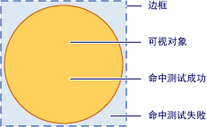

# 可视化层中的命中测试
本主题概述可视化层提供的命中测试功能。 命中测试支持，您可以确定几何或点值是否落在所呈现内容的<xref:System.Windows.Media.Visual>，从而可以实现用户界面行为，例如选择矩形来选择多个对象。  

   
## 命中测试方案  
 <xref:System.Windows.UIElement>类提供了<xref:System.Windows.UIElement.InputHitTest%2A>方法，它允许你针对使用给定的坐标值对元素进行命中测试。 在许多情况下，<xref:System.Windows.UIElement.InputHitTest%2A>方法提供实现命中测试的元素的所需的功能。 但是，有多种方案可能需要在可视化层上实现命中测试。  
  
-   命中测试所针对非<xref:System.Windows.UIElement>对象：如果要执行命中测试不是如此<xref:System.Windows.UIElement>对象，如<xref:System.Windows.Media.DrawingVisual>或图形对象。  
  
-   命中测试几何图形的使用：如果你需要将 geometry 对象而不是一个点的坐标值的命中测试是如此。  
  
-   命中测试所针对多个对象：这适用于需要针对多个对象，如重叠的对象进行命中测试。 可以获取与几何或点相交的所有视觉对象的结果，而不仅仅是第一个视觉对象的结果。  
  
-   忽略<xref:System.Windows.UIElement>命中测试策略：适用于需要忽略<xref:System.Windows.UIElement>命中测试策略，将考虑这些因素，如元素是否已被禁用或不可见。  
  
> [!NOTE]
>  有关演示在可视化层上进行命中测试的完整代码示例，请参阅[使用 DrawingVisuals 进行命中测试示例](https://go.microsoft.com/fwlink/?LinkID=159994)和[使用 Win32 互操作进行命中测试示例](https://go.microsoft.com/fwlink/?LinkID=159995)。  
  
   
## 命中测试支持  
 目的<xref:System.Windows.Media.VisualTreeHelper.HitTest%2A>中的方法<xref:System.Windows.Media.VisualTreeHelper>类是确定几何或点坐标值是否为给定的对象，如控件或图形元素的呈现内容内。 例如，可以使用命中测试确定对象边框内的鼠标单击是否落在圆形的几何内。 还可以选择重写命中测试的默认实现，以执行自己的自定义命中测试计算。  
  
 下图显示非矩形对象的区域与其边框之间的关系。  
  
   
有效命中测试区域示意图  
  
   
## 命中测试和 Z 顺序  
 [!INCLUDE[TLA#tla_winclient](../../../../includes/tlasharptla-winclient-md.md)] 可视化层支持针对点或几何下的所有对象（而不仅仅是最顶层对象）进行命中测试。 结果按 z 顺序返回。 但是，作为参数传递的视觉对象<xref:System.Windows.Media.VisualTreeHelper.HitTest%2A>方法确定哪个部分将被命中的可视化树的测试。 可以针对整个可视化树或它的任意部分进行命中测试。  
  
 在下图中，圆形对象在正方形和三角形对象之上。 如果只对感兴趣的命中测试其 z 顺序值为最顶层的视觉对象，可以设置可视化命中的测试枚举返回<xref:System.Windows.Media.HitTestResultBehavior.Stop>从<xref:System.Windows.Media.HitTestResultCallback>的第一项后停止命中的测试遍历。  
  
   
可视化树的 z 顺序示意图  
  
 如果你想要枚举特定点或几何下的所有视觉对象，则返回<xref:System.Windows.Media.HitTestResultBehavior.Continue>从<xref:System.Windows.Media.HitTestResultCallback>。 这意味着可以为其他对象之下的视觉对象进行命中测试，即使它们被完全遮挡也是如此。 有关详细信息，请参阅“使用命中测试结果回叫”部分中的示例代码。  
  
> [!NOTE]
>  还可以对透明的视觉对象进行命中测试。  
  
   
## 使用默认命中测试  
 您可以确定一个点是否位于视觉对象的几何内使用<xref:System.Windows.Media.VisualTreeHelper.HitTest%2A>方法，以指定的视觉对象和一个点坐标值要对其测试。 视觉对象参数为命中测试搜索确定可视化树中的起始点。 如果其几何包含该坐标对可视化树中找到的视觉对象，则它设置为<xref:System.Windows.Media.HitTestResult.VisualHit%2A>属性的<xref:System.Windows.Media.HitTestResult>对象。 <xref:System.Windows.Media.HitTestResult>则返回从<xref:System.Windows.Media.VisualTreeHelper.HitTest%2A>方法。 如果该点不包含要执行命中测试的可视化子树<xref:System.Windows.Media.VisualTreeHelper.HitTest%2A>返回`null`。  
  
> [!NOTE]
>  默认命中测试始终返回 z 顺序中最顶层的对象。 为了标识所有视觉对象（甚至是被部分或完全遮挡的视觉对象），请使用命中测试结果回叫。  
  
 将作为的点参数传递的坐标值<xref:System.Windows.Media.VisualTreeHelper.HitTest%2A>方法必须是相对于命中测试所针对的视觉对象的坐标空间。 例如，如果在父级坐标空间的 (100, 100) 处定义了嵌套可视化对象，则对位于 (0, 0) 的子视觉对象进行命中测试等效于对父级坐标空间的 (100, 100) 处的子视觉对象进行命中测试。  
  
 下面的代码演示如何设置鼠标事件处理程序为<xref:System.Windows.UIElement>用于捕获用于事件的对象进行命中测试。  
  
 [!code-csharp[HitTestingOverview#100](~/samples/snippets/csharp/VS_Snippets_Wpf/HitTestingOverview/CSharp/Window1.xaml.cs#100)]
 [!code-vb[HitTestingOverview#100](~/samples/snippets/visualbasic/VS_Snippets_Wpf/HitTestingOverview/visualbasic/window1.xaml.vb#100)]  
  
### 可视化树如何影响命中测试  
 可视化树中的起始点确定在对象的命中测试枚举期间返回哪些对象。 如果要对多个对象进行命中测试，在可视化树中用作起始点的视觉对象必须是所有相关对象的公共上级。 例如，如果希望对以下关系图中的按钮元素和绘图视觉对象进行命中测试，必须将可视化树中的起始点设置为两者的公共上级。 在这种情况下，画布元素是按钮元素和绘图视觉对象的公共上级。  
  
   
可视化树的层次结构示意图  
  
> [!NOTE]
>  <xref:System.Windows.UIElement.IsHitTestVisible%2A>属性获取或设置一个值，声明是否<xref:System.Windows.UIElement>-派生的对象从其呈现内容的某些部分可能是返回作为命中的测试结果。 这使用户可以选择性地更改可视化树，以确定命中测试涉及哪些视觉对象。  
  
   
## 使用命中测试结果回叫  
 可以在可视化树中枚举其几何包含特定坐标值的所有视觉对象。 这使用户可以标识所有视觉对象（甚至是被其他视觉对象部分或完全遮挡的视觉对象）。 若要枚举可视化树使用的视觉对象<xref:System.Windows.Media.VisualTreeHelper.HitTest%2A>方法与命中的测试回叫函数。 当指定的坐标值包含在视觉对象中时，系统会调用命中测试回叫函数。  
  
 在命中测试结果枚举期间，不应执行任何修改可视化树的操作。 在遍历可视化树的过程中，在可视化树中添加或删除对象可能会导致不可预知的行为。 您可以安全地修改后的可视化树<xref:System.Windows.Media.VisualTreeHelper.HitTest%2A>方法返回。 您可能想要提供的数据结构，例如<xref:System.Collections.ArrayList>、 命中的测试结果枚举期间存储值。  
  
 [!code-csharp[HitTestingOverview#101](~/samples/snippets/csharp/VS_Snippets_Wpf/HitTestingOverview/CSharp/Window1.xaml.cs#101)]
 [!code-vb[HitTestingOverview#101](~/samples/snippets/visualbasic/VS_Snippets_Wpf/HitTestingOverview/visualbasic/window1.xaml.vb#101)]  
  
 命中测试回叫方法定义在可视化树中的特定视觉对象上标识命中测试时要执行的操作。 执行操作后，返回<xref:System.Windows.Media.HitTestResultBehavior>值，该值确定是否要继续或不进行任何其他视觉对象的枚举。  
  
 [!code-csharp[HitTestingOverview#102](~/samples/snippets/csharp/VS_Snippets_Wpf/HitTestingOverview/CSharp/Window1.xaml.cs#102)]
 [!code-vb[HitTestingOverview#102](~/samples/snippets/visualbasic/VS_Snippets_Wpf/HitTestingOverview/visualbasic/window1.xaml.vb#102)]  
  
> [!NOTE]
>  命中视觉对象的枚举顺序为 z 顺序。 位于最顶层 z 顺序级别上的视觉对象是第一个枚举的对象。 所有其他视觉对象按递减的 z 顺序级别进行枚举。 此枚举顺序对应于视觉对象的呈现顺序。  
  
 可以通过返回停止命中的测试回叫函数中的任何时候视觉对象的枚举<xref:System.Windows.Media.HitTestResultBehavior.Stop>。  
  
 [!code-csharp[HitTestingOverview#103](~/samples/snippets/csharp/VS_Snippets_Wpf/HitTestingOverview/CSharp/Window1.xaml.cs#103)]
 [!code-vb[HitTestingOverview#103](~/samples/snippets/visualbasic/VS_Snippets_Wpf/HitTestingOverview/visualbasic/window1.xaml.vb#103)]  
  
   
## 使用命中测试筛选器回叫  
 可使用可选的命中测试筛选器来限制传递给命中测试结果的对象。 这样一来，你便可以在处理命中测试结果时忽略可视化树中的无关部分。 若要实现命中的测试筛选器，定义命中的测试筛选回调函数，并将其作为参数值传递，在调用时<xref:System.Windows.Media.VisualTreeHelper.HitTest%2A>方法。  
  
 [!code-csharp[HitTestingOverview#104](~/samples/snippets/csharp/VS_Snippets_Wpf/HitTestingOverview/CSharp/Window1.xaml.cs#104)]
 [!code-vb[HitTestingOverview#104](~/samples/snippets/visualbasic/VS_Snippets_Wpf/HitTestingOverview/visualbasic/window1.xaml.vb#104)]  
  
 如果不希望提供可选的命中的测试筛选器回叫函数，传递`null`作为其参数的值<xref:System.Windows.Media.VisualTreeHelper.HitTest%2A>方法。  
  
 [!code-csharp[HitTestingOverview#105](~/samples/snippets/csharp/VS_Snippets_Wpf/HitTestingOverview/CSharp/Window1.xaml.cs#105)]
 [!code-vb[HitTestingOverview#105](~/samples/snippets/visualbasic/VS_Snippets_Wpf/HitTestingOverview/visualbasic/window1.xaml.vb#105)]  
  
   
修剪可视化树  
  
 借助命中测试筛选器回叫函数，可以允许枚举呈现内容包含指定坐标的所有视觉对象。 但是，你可能要忽略不希望在命中测试结果回调叫函数中处理的可视化树的某些分支。 命中测试筛选器回叫函数的返回值确定视觉对象的枚举应采用的操作类型。 例如，如果返回值， <xref:System.Windows.Media.HitTestFilterBehavior.ContinueSkipSelfAndChildren>，可以从命中的测试结果枚举中删除当前的视觉对象及其子项。 这意味着，命中测试结果回叫函数不会在其枚举中看到这些对象。 修剪对象的可视化树会减少命中测试结果枚举传递期间的处理量。 在以下代码示例中，筛选器会跳过标签及其后代，并对其他所有内容进行命中测试。  
  
 [!code-csharp[HitTestingOverview#106](~/samples/snippets/csharp/VS_Snippets_Wpf/HitTestingOverview/CSharp/Window1.xaml.cs#106)]
 [!code-vb[HitTestingOverview#106](~/samples/snippets/visualbasic/VS_Snippets_Wpf/HitTestingOverview/visualbasic/window1.xaml.vb#106)]  
  
> [!NOTE]
>  在未调用命中测试结果回叫的情况下，有时会调用命中测试筛选器回叫。  
  
   
## 重写默认命中测试  
 可以重写视觉对象的默认命中测试支持通过重写<xref:System.Windows.Media.Visual.HitTestCore%2A>方法。 这意味着，当您调用<xref:System.Windows.Media.VisualTreeHelper.HitTest%2A>方法中，您重写的实现<xref:System.Windows.Media.Visual.HitTestCore%2A>调用。 当命中测试落在视觉对象的边框内时，将调用重写的方法，即使坐标落在视觉对象呈现内容之外也是如此。  
  
 [!code-csharp[HitTestingOverview#107](~/samples/snippets/csharp/VS_Snippets_Wpf/HitTestingOverview/CSharp/Window1.xaml.cs#107)]
 [!code-vb[HitTestingOverview#107](~/samples/snippets/visualbasic/VS_Snippets_Wpf/HitTestingOverview/visualbasic/window1.xaml.vb#107)]  
  
 有时你可能希望针对视觉对象的边框和呈现内容进行命中测试。 通过使用`PointHitTestParameters`参数值中被重写<xref:System.Windows.Media.Visual.HitTestCore%2A>作为基方法的参数的方法<xref:System.Windows.Media.Visual.HitTestCore%2A>，可以根据命中的视觉对象的边界矩形执行操作，然后执行针对第二个命中的测试呈现的视觉对象的内容。  
  
 [!code-csharp[HitTestingOverview#108](~/samples/snippets/csharp/VS_Snippets_Wpf/HitTestingOverview/CSharp/Window1.xaml.cs#108)]
 [!code-vb[HitTestingOverview#108](~/samples/snippets/visualbasic/VS_Snippets_Wpf/HitTestingOverview/visualbasic/window1.xaml.vb#108)]  
  
## 请参阅

- <xref:System.Windows.Media.VisualTreeHelper.HitTest%2A>
- <xref:System.Windows.Media.HitTestResult>
- <xref:System.Windows.Media.HitTestResultCallback>
- <xref:System.Windows.Media.HitTestFilterCallback>
- <xref:System.Windows.UIElement.IsHitTestVisible%2A>
- [命中测试使用 drawingvisuals 执行示例](https://go.microsoft.com/fwlink/?LinkID=159994)
- [使用 Win32 互操作示例命中测试](https://go.microsoft.com/fwlink/?LinkID=159995)
- [对视觉对象中的几何图形进行命中测试](how-to-hit-test-geometry-in-a-visual.md)
- [使用 Win32 宿主容器进行命中测试](how-to-hit-test-using-a-win32-host-container.md)
