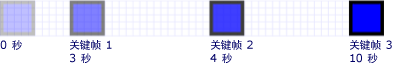
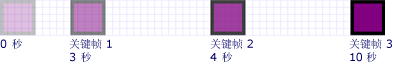
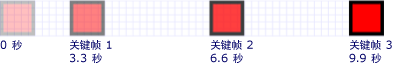
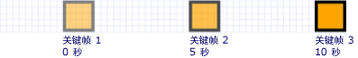

# 如何：控制关键帧动画的计时How to: Control Key-Frame Animation Timing
此示例演示如何控制关键帧动画中的关键帧的时间。This example shows how to control the timing of key frames within a key-frame animation. 像其他动画关键帧动画具有<xref:System.Windows.Media.Animation.Timeline.Duration%2A>属性。Like other animations, key-frame animations have a <xref:System.Windows.Media.Animation.Timeline.Duration%2A> property. 除了指定动画的持续时间，您需要指定该持续时间的哪一部分分配给每个其关键帧。In addition to specifying the duration of an animation, you need to specify what part of that duration is allotted to each of its key frames. 若要分配的时间，则指定<xref:System.Windows.Media.Animation.KeyTime>中每个关键帧动画。To allot the time, you specify a <xref:System.Windows.Media.Animation.KeyTime> for each key frame in the animation.  
  
 <xref:System.Windows.Media.Animation.KeyTime>为每个关键帧指定 （未指定关键帧播放的时间长度） 的关键帧结束时。The <xref:System.Windows.Media.Animation.KeyTime> for each key frame specifies when a key frame ends (it does not specify the length of time a key frame plays). 您可以指定<xref:System.Windows.Media.Animation.KeyTime>作为<xref:System.TimeSpan>值，以百分比表示，或作为<xref:System.Windows.Media.Animation.KeyTime.Uniform%2A>或<xref:System.Windows.Media.Animation.KeyTime.Paced%2A>特殊值。You can specify a <xref:System.Windows.Media.Animation.KeyTime> as a <xref:System.TimeSpan> value, as a percentage, or as the <xref:System.Windows.Media.Animation.KeyTime.Uniform%2A> or <xref:System.Windows.Media.Animation.KeyTime.Paced%2A> special value.  
  
## 示例Example  
 下面的示例使用<xref:System.Windows.Media.Animation.DoubleAnimationUsingKeyFrames>若要在屏幕上对矩形进行动画处理。The following example uses a <xref:System.Windows.Media.Animation.DoubleAnimationUsingKeyFrames> to animate a rectangle across the screen. 使用设置关键帧的关键时间<xref:System.TimeSpan>值。The key frames' key times are set with <xref:System.TimeSpan> values.  
  
 [!code-csharp[keyframes_snip#KeyTimesTimeSpanExample](../../../../samples/snippets/csharp/VS_Snippets_Wpf/keyframes_snip/CSharp/KeyTimesExample.cs#keytimestimespanexample)]
 [!code-vb[keyframes_snip#KeyTimesTimeSpanExample](../../../../samples/snippets/visualbasic/VS_Snippets_Wpf/keyframes_snip/visualbasic/keytimesexample.vb#keytimestimespanexample)]
 [!code-xaml[keyframes_snip#KeyTimesTimeSpanExample](../../../../samples/snippets/xaml/VS_Snippets_Wpf/keyframes_snip/XAML/KeyTimesExample.xaml#keytimestimespanexample)]  
  
 下图显示达到每个关键帧的值。The following illustration shows when the value of each key frame is reached.  
  
   
  
 下一个示例演示具有完全相同，只不过使用百分比值设置关键帧的关键时间的动画。The next example shows an animation that is identical, except that the key frames' key times are set with percentage values.  
  
 [!code-csharp[keyframes_snip#KeyTimesPercentageExample](../../../../samples/snippets/csharp/VS_Snippets_Wpf/keyframes_snip/CSharp/KeyTimesExample.cs#keytimespercentageexample)]
 [!code-vb[keyframes_snip#KeyTimesPercentageExample](../../../../samples/snippets/visualbasic/VS_Snippets_Wpf/keyframes_snip/visualbasic/keytimesexample.vb#keytimespercentageexample)]
 [!code-xaml[keyframes_snip#KeyTimesPercentageExample](../../../../samples/snippets/xaml/VS_Snippets_Wpf/keyframes_snip/XAML/KeyTimesExample.xaml#keytimespercentageexample)]  
  
 下图显示达到每个关键帧的值。The following illustration shows when the value of each key frame is reached.  
  
   
  
 下面的示例使用<xref:System.Windows.Media.Animation.KeyTime.Uniform%2A>关键时间值。The next example uses <xref:System.Windows.Media.Animation.KeyTime.Uniform%2A> key time values.  
  
 [!code-csharp[keyframes_snip#KeyTimesUniformExample](../../../../samples/snippets/csharp/VS_Snippets_Wpf/keyframes_snip/CSharp/KeyTimesExample.cs#keytimesuniformexample)]
 [!code-vb[keyframes_snip#KeyTimesUniformExample](../../../../samples/snippets/visualbasic/VS_Snippets_Wpf/keyframes_snip/visualbasic/keytimesexample.vb#keytimesuniformexample)]
 [!code-xaml[keyframes_snip#KeyTimesUniformExample](../../../../samples/snippets/xaml/VS_Snippets_Wpf/keyframes_snip/XAML/KeyTimesExample.xaml#keytimesuniformexample)]  
  
 下图显示达到每个关键帧的值。The following illustration shows when the value of each key frame is reached.  
  
   
  
 最后一个示例使用<xref:System.Windows.Media.Animation.KeyTime.Paced%2A>关键时间值。The final example uses <xref:System.Windows.Media.Animation.KeyTime.Paced%2A> key time values.  
  
 [!code-csharp[keyframes_snip#KeyTimesPacedExample](../../../../samples/snippets/csharp/VS_Snippets_Wpf/keyframes_snip/CSharp/KeyTimesExample.cs#keytimespacedexample)]
 [!code-vb[keyframes_snip#KeyTimesPacedExample](../../../../samples/snippets/visualbasic/VS_Snippets_Wpf/keyframes_snip/visualbasic/keytimesexample.vb#keytimespacedexample)]
 [!code-xaml[keyframes_snip#KeyTimesPacedExample](../../../../samples/snippets/xaml/VS_Snippets_Wpf/keyframes_snip/XAML/KeyTimesExample.xaml#keytimespacedexample)]  
  
 下图显示达到每个关键帧的值。The following illustration shows when the value of each key frame is reached.  
  
   
  
 为简单起见，此示例使用本地动画的代码版本不是演示图板，因为仅将一个动画应用到单个属性，但可以修改示例以改为使用情节提要。For simplicity, the code versions of this example use local animations, not storyboards, because only a single animation is being applied to a single property, but the examples may be modified to use storyboards instead. 有关演示如何声明中的代码将情节提要的示例，请参阅[使用情节提要对属性进行动画处理](../../../../docs/framework/wpf/graphics-multimedia/how-to-animate-a-property-by-using-a-storyboard.md)。For an example showing how to declare a storyboard in code, see [Animate a Property by Using a Storyboard](../../../../docs/framework/wpf/graphics-multimedia/how-to-animate-a-property-by-using-a-storyboard.md).  
  
 有关完整示例，请参阅[关键帧动画示例](https://go.microsoft.com/fwlink/?LinkID=160012)。For the complete sample, see [KeyFrame Animation Sample](https://go.microsoft.com/fwlink/?LinkID=160012). 关键帧动画的详细信息，请参阅[关键帧动画概述](../../../../docs/framework/wpf/graphics-multimedia/key-frame-animations-overview.md)。For more information about key frame animations, see the [Key-Frame Animations Overview](../../../../docs/framework/wpf/graphics-multimedia/key-frame-animations-overview.md).  
  
## 请参阅See Also  
 [关键帧动画概述Key-Frame Animations Overview](../../../../docs/framework/wpf/graphics-multimedia/key-frame-animations-overview.md)  
 [动画概述Animation Overview](../../../../docs/framework/wpf/graphics-multimedia/animation-overview.md)  
 [帮助主题How-to Topics](../../../../docs/framework/wpf/graphics-multimedia/animation-and-timing-how-to-topics.md)
