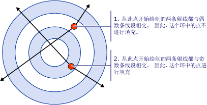
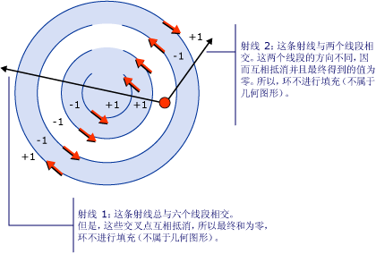
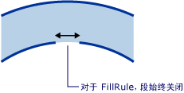

# 如何：控制复合形状的填充How to: Control the Fill of a Composite Shape
<xref:System.Windows.Media.GeometryGroup.FillRule%2A>属性<xref:System.Windows.Media.GeometryGroup>或<xref:System.Windows.Media.PathGeometry>，指定"规则"复合形状用于确定给定的点是否为的几何图形的一部分。The <xref:System.Windows.Media.GeometryGroup.FillRule%2A> property of a <xref:System.Windows.Media.GeometryGroup> or a <xref:System.Windows.Media.PathGeometry>, specifies a "rule" which the composite shape uses to determine whether a given point is part of the geometry. 有两个可能值<xref:System.Windows.Media.FillRule>:<xref:System.Windows.Media.FillRule.EvenOdd>和<xref:System.Windows.Media.FillRule.Nonzero>。There are two possible values for <xref:System.Windows.Media.FillRule>: <xref:System.Windows.Media.FillRule.EvenOdd> and <xref:System.Windows.Media.FillRule.Nonzero>. 以下各节将介绍如何使用这两个规则。The following sections will describe how to use these two rules.  
  
 **EvenOdd：**此规则通过从一点向任意方向绘制一条射向无穷远的射线，然后计算给定形状中与该射线相交的路径段的数量，从而确定该点是否位于填充区域中。**EvenOdd:** This rule determines whether a point is in the fill region by drawing a ray from that point to infinity in any direction and counting the number of path segments within the given shape that the ray crosses. 如果此数目为奇数，那么该点则在内部；如果为偶数，则该点在外部。If this number is odd, the point is inside; if even, the point is outside.  
  
 例如，下面的 XAML 创建复合形状组成同心环 （目标） 的一系列具有<xref:System.Windows.Media.GeometryGroup.FillRule%2A>设置为<xref:System.Windows.Media.FillRule.EvenOdd>。For example, the XAML below creates a composite shape made up of a series of concentric rings (target) with a <xref:System.Windows.Media.GeometryGroup.FillRule%2A> set to <xref:System.Windows.Media.FillRule.EvenOdd>.  
  
 [!code-xaml[GeometriesMiscSnippets_snip#FillRuleEvenOddValue](../../../../samples/snippets/xaml/VS_Snippets_Wpf/GeometriesMiscSnippets_snip/XAML/FillRuleExample.xaml#fillruleevenoddvalue)]  
  
 下图显示在上一个示例中创建的形状。The following illustration shows the shape created in the previous example.  
  
   
  
 在上图中，请注意，中心和第三个环并未填充。In the illustration above, notice that the center and 3rd ring are not filled. 这是因为射线是从穿过偶数段的这两个环中的点绘制的。This is because a ray drawn from any point within either of those two rings passes through an even number of segments. 请参阅下图：See illustration below:  
  
   
  
 **NonZero：**此规则通过从一点向任意方向绘制一条射向无穷远的射线，并检查一段形状与射线相交的位置，从而确定该点是否位于路径的填充区域。**NonZero:** This rule determines whether a point is in the fill region of the path by drawing a ray from that point to infinity in any direction and then examining the places where a segment of the shape crosses the ray. 从零计数开始，从左到右每次添加与射线相交的一个段，然后从右到左每次减去与射线相交的一个路径段。Starting with a count of zero, add one each time a Segment crosses the ray from left to right and subtract one each time a path segment crosses the ray from right to left. 在对交叉点进行计数后，如果结果为零，那么该点则位于路径外。After counting the crossings, if the result is zero then the point is outside the path. 否则，该点则在路径内。Otherwise, it is inside.  
  
 [!code-xaml[GeometriesMiscSnippets_snip#FillRuleNonZeroValueEllipseGeometry](../../../../samples/snippets/xaml/VS_Snippets_Wpf/GeometriesMiscSnippets_snip/XAML/FillRuleExample.xaml#fillrulenonzerovalueellipsegeometry)]  
  
 使用以下示例中，值为<xref:System.Windows.Media.FillRule.Nonzero>为<xref:System.Windows.Media.GeometryGroup.FillRule%2A>因此提供下图：Using the example above, a value of <xref:System.Windows.Media.FillRule.Nonzero> for <xref:System.Windows.Media.GeometryGroup.FillRule%2A> gives the following illustration as a result:  
  
   
  
 如图所示，所有环都已填充。As you can see, all the rings are filled. 这是因为所有段按同一方向运行，因此从任一点绘制的射线将与一个或多个段相交，并且交点总数不会等于零。This is because all the segments are running in the same direction and so a ray drawn from any point will cross one or more segments and the sum of the crossings will not equal zero. 例如，在下图中，红色箭头表示段的绘制方向，白色箭头表示从最内部环中的某一个点运行的任意一条射线。For example, in the illustration below, the red arrows represent the direction the segments are drawn and the white arrow represents an arbitrary ray running from a point in the innermost ring. 从零值开始，对于该射线相交的每个段，会加值“1”，因为从左到右该段与该射线相交。Starting with a value of zero, for each segment that the ray crosses, a value of one is added because the segment crosses the ray from left to right.  
  
   
  
 为了更好地演示行为<xref:System.Windows.Media.FillRule.Nonzero>规则更复杂的形状段运行采用不同的方向是必需的。To better demonstrate the behavior of <xref:System.Windows.Media.FillRule.Nonzero> rule a more complex shape with segments running in different directions is required. 下面的 XAML 代码与前面的示例创建形状是类似，只不过使用创建<xref:System.Windows.Media.PathGeometry>而不是<xref:System.Windows.Media.EllipseGeometry>这将创建四个同心弧而不是完全关闭同心圆。The XAML code below creates a similar shape as the previous example except that it is created with a <xref:System.Windows.Media.PathGeometry> rather then a <xref:System.Windows.Media.EllipseGeometry> which creates four concentric arcs rather then fully closed concentric circles.  
  
 [!code-xaml[GeometriesMiscSnippets_snip#FillRuleNonZeroValuePathGeometry](../../../../samples/snippets/xaml/VS_Snippets_Wpf/GeometriesMiscSnippets_snip/XAML/FillRuleExample.xaml#fillrulenonzerovaluepathgeometry)]  
  
 下图显示在上一个示例中创建的形状。The following illustration shows the shape created in the previous example.  
  
   
  
 请注意，自中心数起的第三条弧未填充。Notice that the third arc from the center is not filled. 下图说明了出现这种情况的原因。The illustration below shows why this is. 在图中，红色箭头表示绘制段的方向。In the illustration, the red arrows represent the direction the segments are drawn. 两个白色箭头表示以“未填充”区域中的某个点为起点绘制的任意两条射线。The two white arrows represent two arbitrary rays that move out from a point in the "non-filled" region. 如图所示，与给定射线路径中的段相交的该射线值的总和为零。As can be seen from the illustration, the sum of the values from a given ray crossing the segments in its path is zero. 如上文所定义，总和为零意味着该点不是几何图形的一部分（也不是填充的一部分），而总和*不*为零（包括负值）意味着该点是几何图形的一部分。As defined above, a sum of zero means that the point is not part of the geometry (not part of the fill) while a sum that is *not* zero, including a negative value, is part of the geometry.  
  
   
  
 **注意：**出于<xref:System.Windows.Media.FillRule>，所有形状被都视为闭合。**Note:** For the purposes of <xref:System.Windows.Media.FillRule>, all shapes are considered closed. 如果段中存在间隙，请绘制用于闭合该段的假想线。If there is a gap in a segment, draw an imaginary line to close it. 在以上示例中，环中存在多个较小间隙。In the example above, there are small gaps in the rings. 考虑到这一点，人们可能希望穿过间隙的射线产生不同的结果，然后射线在另一个方向上运行。Given this, one might expect a ray that runs through the gap to give a different result then a ray running in another direction. 下面是放大的举例说明了这些缺口和"虚部段"之一 (为了应用绘制的段<xref:System.Windows.Media.FillRule>)，将其关闭。Below is an enlarged illustration of one of these gaps and the "imaginary segment" (segment that is drawn for purposes of applying the <xref:System.Windows.Media.FillRule>) that closes it.  
  
   
  
## 示例Example  
  
## 另请参阅See Also  
 [创建复合形状Create a Composite Shape](../../../../docs/framework/wpf/graphics-multimedia/how-to-create-a-composite-shape.md)  
 [Geometry 概述Geometry Overview](../../../../docs/framework/wpf/graphics-multimedia/geometry-overview.md)
