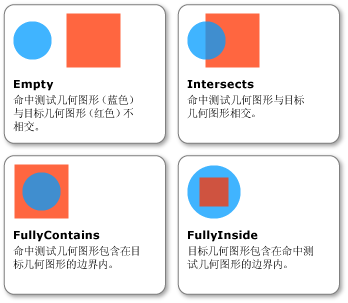

# 如何：将几何图形用作参数的命中测试
本主题中的示例演示在将 <xref:System.Windows.Media.Geometry> 用作命中测试参数的情况下，如何针对可视对象执行[命中测试](GTMT)。  
  
## 示例  
 下面的示例演示如何使用 <xref:System.Windows.Media.VisualTreeHelper.HitTest%2A> 方法的 <xref:System.Windows.Media.GeometryHitTestParameters> 来设置命中测试。  传递给 `OnMouseDown` 方法的 <xref:System.Windows.Point> 值用于创建一个 <xref:System.Windows.Media.Geometry> 对象以扩展命中测试的范围。  
  
 [!code-csharp[HitTestingOverview#HitTestingOverviewSnippet10](../../../../samples/snippets/csharp/VS_Snippets_Wpf/HitTestingOverview/CSharp/GeometryHitTest.cs#hittestingoverviewsnippet10)]
 [!code-vb[HitTestingOverview#HitTestingOverviewSnippet10](../../../../samples/snippets/visualbasic/VS_Snippets_Wpf/HitTestingOverview/visualbasic/geometryhittest.vb#hittestingoverviewsnippet10)]  
  
 <xref:System.Windows.Media.GeometryHitTestResult> 的 <xref:System.Windows.Media.GeometryHitTestResult.IntersectionDetail%2A> 属性提供有关命中测试结果的信息，而 <xref:System.Windows.Media.Geometry> 作为命中测试的参数使用。  下面的插图演示了命中测试几何图形（蓝色圆圈）与目标可视对象（红色正方形）的呈现内容之间的关系。  
  
   
命中测试几何图形与目标可视对象之间的交集  
  
 下面的示例演示在将 <xref:System.Windows.Media.Geometry> 用作命中测试参数时，如何实现命中测试回调。  `result` 参数将强制转换为 <xref:System.Windows.Media.GeometryHitTestResult>，以便检索 <xref:System.Windows.Media.GeometryHitTestResult.IntersectionDetail%2A> 属性的值。  使用属性值，可以确定 <xref:System.Windows.Media.Geometry> 命中测试参数是完全还是部分包含在命中测试目标的呈现内容中。  本例中的代码示例仅将命中测试结果添加到完全包含在目标边界中的可视对象的列表中。  
  
 [!code-csharp[HitTestingOverview#HitTestingOverviewSnippet11](../../../../samples/snippets/csharp/VS_Snippets_Wpf/HitTestingOverview/CSharp/GeometryHitTest.cs#hittestingoverviewsnippet11)]
 [!code-vb[HitTestingOverview#HitTestingOverviewSnippet11](../../../../samples/snippets/visualbasic/VS_Snippets_Wpf/HitTestingOverview/visualbasic/geometryhittest.vb#hittestingoverviewsnippet11)]  
  
> [!NOTE]
>  当交集详细信息为 <xref:System.Windows.Media.IntersectionDetail> 时，不应当调用 <xref:System.Windows.Media.HitTestResult> 回调。  
  
## 请参阅  
 [可视化层中的命中测试](../../../../docs/framework/wpf/graphics-multimedia/hit-testing-in-the-visual-layer.md)   
 [对 Visual 中的几何图形进行命中测试](../../../../docs/framework/wpf/graphics-multimedia/how-to-hit-test-geometry-in-a-visual.md)