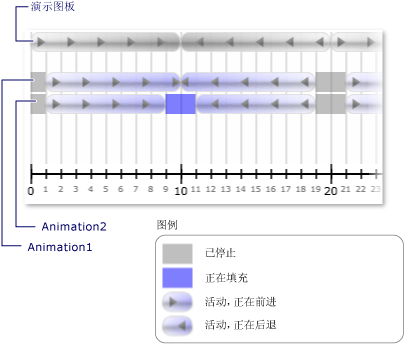

# 如何：在时钟状态发生变化时接收通知
在时钟<xref:System.Windows.Media.Animation.Clock.CurrentStateInvalidated>事件发生时其<xref:System.Windows.Media.Animation.Clock.CurrentState%2A>变为无效，如当时钟启动或停止。 可以直接使用此事件注册<xref:System.Windows.Media.Animation.Clock>，也可以注册使用<xref:System.Windows.Media.Animation.Timeline>。  
  
 在以下示例中，<xref:System.Windows.Media.Animation.Storyboard>和两个<xref:System.Windows.Media.Animation.DoubleAnimation>对象用于对两个矩形的宽度进行动画处理。 <xref:System.Windows.Media.Animation.Timeline.CurrentStateInvalidated>事件用于侦听的时钟状态更改。  
  
## 示例  
 [!code-xaml[timingbehaviors_snip#_graphicsmm_StateExampleMarkupWholePage](../../../../samples/snippets/csharp/VS_Snippets_Wpf/timingbehaviors_snip/CSharp/StateExample.xaml#_graphicsmm_stateexamplemarkupwholepage)]  
  
 [!code-csharp[timingbehaviors_snip#_graphicsmm_StateEventHandlers](../../../../samples/snippets/csharp/VS_Snippets_Wpf/timingbehaviors_snip/CSharp/StateExample.xaml.cs#_graphicsmm_stateeventhandlers)]
 [!code-vb[timingbehaviors_snip#_graphicsmm_StateEventHandlers](../../../../samples/snippets/visualbasic/VS_Snippets_Wpf/timingbehaviors_snip/visualbasic/stateexample.xaml.vb#_graphicsmm_stateeventhandlers)]  
  
 下图显示了输入作为父时间线的动画的不同状态 (*情节提要*) 的进展。  
  
   
  
 下表显示的时间*Animation1*的<xref:System.Windows.Media.Animation.Timeline.CurrentStateInvalidated>触发事件：  
  
||||||||  
|-|-|-|-|-|-|-|  
|时间 （秒）|1|10|19|21|30|39|  
|状态|活动的|活动的|已停止|活动的|活动的|已停止|  
  
 下表显示的时间*Animation2*的<xref:System.Windows.Media.Animation.Timeline.CurrentStateInvalidated>触发事件：  
  
||||||||||  
|-|-|-|-|-|-|-|-|-|  
|时间 （秒）|1|9|11|19|21|29|31|39|  
|状态|活动的|填充|活动的|已停止|活动的|填充|活动的|已停止|  
  
 请注意， *Animation1*的<xref:System.Windows.Media.Animation.Timeline.CurrentStateInvalidated>在 10 秒，激发的事件，即使其状态保持<xref:System.Windows.Media.Animation.ClockState.Active>。 这是因为其状态更改为 10 秒钟，但它从更改<xref:System.Windows.Media.Animation.ClockState.Active>到<xref:System.Windows.Media.Animation.ClockState.Filling>，然后返回<xref:System.Windows.Media.Animation.ClockState.Active>中相同的刻度线。
