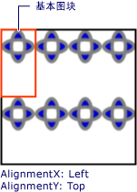
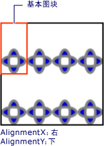

# 如何：设置 TileBrush 的水平和垂直对齐方式How to: Set the Horizontal and Vertical Alignment of a TileBrush
本示例演示如何控制平铺内容的水平对齐方式和垂直对齐方式。This example shows how to control the horizontal and vertical alignment of content in a tile. 若要控制的水平和垂直对齐方式<xref:System.Windows.Media.TileBrush>，使用其<xref:System.Windows.Media.TileBrush.AlignmentX%2A>和<xref:System.Windows.Media.TileBrush.AlignmentY%2A>属性。To control the horizontal and vertical alignment of a <xref:System.Windows.Media.TileBrush>, use its <xref:System.Windows.Media.TileBrush.AlignmentX%2A> and <xref:System.Windows.Media.TileBrush.AlignmentY%2A> properties.  
  
 <xref:System.Windows.Media.TileBrush.AlignmentX%2A>并<xref:System.Windows.Media.TileBrush.AlignmentY%2A>的属性<xref:System.Windows.Media.TileBrush>使用以下条件之一为 true:The <xref:System.Windows.Media.TileBrush.AlignmentX%2A> and <xref:System.Windows.Media.TileBrush.AlignmentY%2A> properties of a <xref:System.Windows.Media.TileBrush> are used when either of the following conditions is true:  
  
- <xref:System.Windows.Media.TileBrush.Stretch%2A>属性是<xref:System.Windows.Media.Stretch.Uniform>或<xref:System.Windows.Media.Stretch.UniformToFill>并且<xref:System.Windows.Media.TileBrush.Viewbox%2A>和<xref:System.Windows.Media.TileBrush.Viewport%2A>的纵横比。The <xref:System.Windows.Media.TileBrush.Stretch%2A> property is <xref:System.Windows.Media.Stretch.Uniform> or <xref:System.Windows.Media.Stretch.UniformToFill> and the <xref:System.Windows.Media.TileBrush.Viewbox%2A> and <xref:System.Windows.Media.TileBrush.Viewport%2A> have different aspect ratios.  
  
- <xref:System.Windows.Media.TileBrush.Stretch%2A>属性是<xref:System.Windows.Media.Stretch.None>并<xref:System.Windows.Media.TileBrush.Viewbox%2A>和<xref:System.Windows.Media.TileBrush.Viewport%2A>大小并不相同。The <xref:System.Windows.Media.TileBrush.Stretch%2A> property is <xref:System.Windows.Media.Stretch.None> and the <xref:System.Windows.Media.TileBrush.Viewbox%2A> and <xref:System.Windows.Media.TileBrush.Viewport%2A> are different sizes.  
  
## 示例Example  
 下面的示例的内容对齐<xref:System.Windows.Media.DrawingBrush>，这是一种类型的<xref:System.Windows.Media.TileBrush>，其磁贴的左上角。The following example aligns the content of a <xref:System.Windows.Media.DrawingBrush>, which is a type of <xref:System.Windows.Media.TileBrush>, to the upper-left corner of its tile. 为了对齐内容，该示例设置<xref:System.Windows.Media.TileBrush.AlignmentX%2A>的属性<xref:System.Windows.Media.DrawingBrush>到<xref:System.Windows.Media.AlignmentX.Left>并且<xref:System.Windows.Media.TileBrush.AlignmentY%2A>属性设置为<xref:System.Windows.Media.AlignmentY.Top>。To align the content, the example sets the <xref:System.Windows.Media.TileBrush.AlignmentX%2A> property of the <xref:System.Windows.Media.DrawingBrush> to <xref:System.Windows.Media.AlignmentX.Left> and the <xref:System.Windows.Media.TileBrush.AlignmentY%2A> property to <xref:System.Windows.Media.AlignmentY.Top>. 本示例生成以下输出。This example produces the following output.  
  
   
内容与左上角对齐的 TileBrushTileBrush with content aligned to the upper-left corner  
  
 [!code-csharp[brushoverviewexamples_snip#TileBrushTopLeftAlignmentInline](~/samples/snippets/csharp/VS_Snippets_Wpf/BrushOverviewExamples_snip/CSharp/TileBrushAlignmentExample.cs#tilebrushtopleftalignmentinline)]
 [!code-vb[brushoverviewexamples_snip#TileBrushTopLeftAlignmentInline](~/samples/snippets/visualbasic/VS_Snippets_Wpf/BrushOverviewExamples_snip/visualbasic/tilebrushalignmentexample.vb#tilebrushtopleftalignmentinline)]
 [!code-xaml[brushoverviewexamples_snip#TileBrushTopLeftAlignmentInline](~/samples/snippets/xaml/VS_Snippets_Wpf/BrushOverviewExamples_snip/XAML/TileBrushAlignmentExample.xaml#tilebrushtopleftalignmentinline)]  
  
## 示例Example  
 下一个示例的内容对齐<xref:System.Windows.Media.DrawingBrush>通过设置其磁贴右下角<xref:System.Windows.Media.TileBrush.AlignmentX%2A>属性设置为<xref:System.Windows.Media.AlignmentX.Right>并且<xref:System.Windows.Media.TileBrush.AlignmentY%2A>属性设置为<xref:System.Windows.Media.AlignmentY.Bottom>。The next example aligns the content of a <xref:System.Windows.Media.DrawingBrush> to the lower-right corner of its tile by setting the <xref:System.Windows.Media.TileBrush.AlignmentX%2A> property to <xref:System.Windows.Media.AlignmentX.Right> and the <xref:System.Windows.Media.TileBrush.AlignmentY%2A> property to <xref:System.Windows.Media.AlignmentY.Bottom>. 该示例生成以下输出。The example produces the following output.  
  
   
内容与右下角对齐的 TileBrushTileBrush with content aligned to the lower-right corner  
  
 [!code-csharp[brushoverviewexamples_snip#TileBrushBottomRightAlignmentInline](~/samples/snippets/csharp/VS_Snippets_Wpf/BrushOverviewExamples_snip/CSharp/TileBrushAlignmentExample.cs#tilebrushbottomrightalignmentinline)]
 [!code-vb[brushoverviewexamples_snip#TileBrushBottomRightAlignmentInline](~/samples/snippets/visualbasic/VS_Snippets_Wpf/BrushOverviewExamples_snip/visualbasic/tilebrushalignmentexample.vb#tilebrushbottomrightalignmentinline)]
 [!code-xaml[brushoverviewexamples_snip#TileBrushBottomRightAlignmentInline](~/samples/snippets/xaml/VS_Snippets_Wpf/BrushOverviewExamples_snip/XAML/TileBrushAlignmentExample.xaml#tilebrushbottomrightalignmentinline)]  
  
## 示例Example  
 下一个示例的内容对齐<xref:System.Windows.Media.DrawingBrush>通过设置其磁贴的左上角<xref:System.Windows.Media.TileBrush.AlignmentX%2A>属性设置为<xref:System.Windows.Media.AlignmentX.Left>并且<xref:System.Windows.Media.TileBrush.AlignmentY%2A>属性设置为<xref:System.Windows.Media.AlignmentY.Top>。The next example aligns the content of a <xref:System.Windows.Media.DrawingBrush> to the upper-left corner of its tile by setting the <xref:System.Windows.Media.TileBrush.AlignmentX%2A> property to <xref:System.Windows.Media.AlignmentX.Left> and the <xref:System.Windows.Media.TileBrush.AlignmentY%2A> property to <xref:System.Windows.Media.AlignmentY.Top>. 它还设置<xref:System.Windows.Media.TileBrush.Viewport%2A>并<xref:System.Windows.Media.TileBrush.TileMode%2A>的<xref:System.Windows.Media.DrawingBrush>以生成平铺图案。It also sets the <xref:System.Windows.Media.TileBrush.Viewport%2A> and <xref:System.Windows.Media.TileBrush.TileMode%2A> of the <xref:System.Windows.Media.DrawingBrush> to produce a tile pattern. 该示例生成以下输出。The example produces the following output.  
  
   
内容与基本平铺图案的左上角对齐的平铺图案Tile pattern with content aligned to upper-left in base tile  
  
 上图突出显示了基本平铺图案，以便显示其内容的对齐方式。The illustration highlights abase tile so that you can see how its content is aligned. 请注意，<xref:System.Windows.Media.TileBrush.AlignmentX%2A>设置没有任何影响，因为内容的<xref:System.Windows.Media.DrawingBrush>完全水平填充基本图块。Notice that the <xref:System.Windows.Media.TileBrush.AlignmentX%2A> setting has no effect because the content of the <xref:System.Windows.Media.DrawingBrush> completely fills the base tile horizontally.  
  
 [!code-csharp[brushoverviewexamples_snip#TileBrushTopLeftAlignmentTiledInline](~/samples/snippets/csharp/VS_Snippets_Wpf/BrushOverviewExamples_snip/CSharp/TileBrushAlignmentExample.cs#tilebrushtopleftalignmenttiledinline)]
 [!code-vb[brushoverviewexamples_snip#TileBrushTopLeftAlignmentTiledInline](~/samples/snippets/visualbasic/VS_Snippets_Wpf/BrushOverviewExamples_snip/visualbasic/tilebrushalignmentexample.vb#tilebrushtopleftalignmenttiledinline)]
 [!code-xaml[brushoverviewexamples_snip#TileBrushTopLeftAlignmentTiledInline](~/samples/snippets/xaml/VS_Snippets_Wpf/BrushOverviewExamples_snip/XAML/TileBrushAlignmentExample.xaml#tilebrushtopleftalignmenttiledinline)]  
  
## 示例Example  
 最后一个示例将对齐的平铺内容<xref:System.Windows.Media.DrawingBrush>到通过设置其基本磁贴右下角<xref:System.Windows.Media.TileBrush.AlignmentX%2A>属性设置为<xref:System.Windows.Media.AlignmentX.Right>并且<xref:System.Windows.Media.TileBrush.AlignmentY%2A>属性设置为<xref:System.Windows.Media.AlignmentY.Bottom>。The final example aligns the content of a tiled <xref:System.Windows.Media.DrawingBrush> to the lower-right of its base tile by setting the <xref:System.Windows.Media.TileBrush.AlignmentX%2A> property to <xref:System.Windows.Media.AlignmentX.Right> and the <xref:System.Windows.Media.TileBrush.AlignmentY%2A> property to <xref:System.Windows.Media.AlignmentY.Bottom>. 该示例生成以下输出。The example produces the following output.  
  
   
内容与基本平铺图案的右下角对齐的平铺图案Tile pattern with content aligned to lower-right in base tile  
  
 同样，<xref:System.Windows.Media.TileBrush.AlignmentX%2A>设置没有任何影响，因为内容的<xref:System.Windows.Media.DrawingBrush>完全水平填充基本图块。Again, the <xref:System.Windows.Media.TileBrush.AlignmentX%2A> setting has no effect because the content of the <xref:System.Windows.Media.DrawingBrush> completely fills the base tile horizontally.  
  
 [!code-csharp[brushoverviewexamples_snip#TileBrushBottomRightAlignmentInline](~/samples/snippets/csharp/VS_Snippets_Wpf/BrushOverviewExamples_snip/CSharp/TileBrushAlignmentExample.cs#tilebrushbottomrightalignmentinline)]
 [!code-vb[brushoverviewexamples_snip#TileBrushBottomRightAlignmentInline](~/samples/snippets/visualbasic/VS_Snippets_Wpf/BrushOverviewExamples_snip/visualbasic/tilebrushalignmentexample.vb#tilebrushbottomrightalignmentinline)]
 [!code-xaml[brushoverviewexamples_snip#TileBrushBottomRightAlignmentInline](~/samples/snippets/xaml/VS_Snippets_Wpf/BrushOverviewExamples_snip/XAML/TileBrushAlignmentExample.xaml#tilebrushbottomrightalignmentinline)]  
  
 这些示例使用<xref:System.Windows.Media.DrawingBrush>对象来演示如何<xref:System.Windows.Media.TileBrush.AlignmentX%2A>和<xref:System.Windows.Media.TileBrush.AlignmentY%2A>使用属性。The examples use <xref:System.Windows.Media.DrawingBrush> objects to demonstrate how the <xref:System.Windows.Media.TileBrush.AlignmentX%2A> and <xref:System.Windows.Media.TileBrush.AlignmentY%2A> properties are used. 这些属性具有相同行为对于所有平铺画笔： <xref:System.Windows.Media.DrawingBrush>， <xref:System.Windows.Media.ImageBrush>，和<xref:System.Windows.Media.VisualBrush>。These properties behave identically for all the tile brushes: <xref:System.Windows.Media.DrawingBrush>, <xref:System.Windows.Media.ImageBrush>, and <xref:System.Windows.Media.VisualBrush>. 有关平铺画笔的详细信息，请参阅[使用图像、绘图和视觉对象进行绘制](painting-with-images-drawings-and-visuals.md)。For more information about tile brushes, see [Painting with Images, Drawings, and Visuals](painting-with-images-drawings-and-visuals.md).  
  
## 请参阅See also

- <xref:System.Windows.Media.DrawingBrush>
- <xref:System.Windows.Media.ImageBrush>
- <xref:System.Windows.Media.VisualBrush>
- [使用图像、绘图和视觉对象进行绘制Painting with Images, Drawings, and Visuals](painting-with-images-drawings-and-visuals.md)
