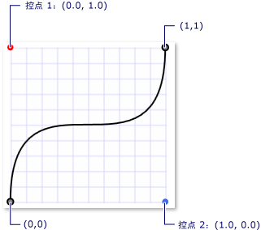
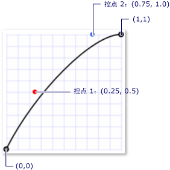

# 关键帧动画概述Key-Frame Animations Overview
本主题介绍关键帧动画。This topic introduces you to key-frame animations. 通过关键帧动画，可以使用两个以上的目标值进行动画处理，并控制动画的内插方法。Key-frame animations enable you to animate using more than two target values, and control an animation's interpolation method.  
  
   
## 系统必备Prerequisites  
 若要理解本概述，用户应熟悉 [!INCLUDE[TLA#tla_winclient](../../../../includes/tlasharptla-winclient-md.md)] 动画和时间线。To understand this overview, you should be familiar with [!INCLUDE[TLA#tla_winclient](../../../../includes/tlasharptla-winclient-md.md)] animations and timelines. 有关动画的简介，请参阅[动画概述](animation-overview.md)。For an introduction to animations, see the [Animation Overview](animation-overview.md). 它还有助于熟悉 From/To/By 动画。It also helps to be familiar with From/To/By animations. 有关详细信息，请参阅“From/To/By 动画概述”。For more information, see the From/To/By Animations Overview.  
  
   
## 什么是关键帧动画？What is a Key-Frame Animation?  
 与 From/To/By 动画类似，关键帧动画对目标属性的值进行动画处理。Like a From/To/By animation, a key-frame animation animates the value of a target property. 它通过创建其目标值之间的转换其<xref:System.Windows.Media.Animation.Timeline.Duration%2A>。It creates a transition among its target values over its <xref:System.Windows.Media.Animation.Timeline.Duration%2A>. 但是，From/To/By 动画可以在两个值之间创建过渡，而单个关键帧动画可以在任意数量的目标值之间创建过渡。However, while a From/To/By animation creates a transition between two values, a single key-frame animation can create transitions among any number of target values. 不同于 From/To/By 动画，关键帧动画没有设置其目标值所需的 From、To 或 By 属性。Unlike a From/To/By animation, a key frame animation has no From, To, or By properties with which to set its target values. 关键帧动画的目标值使用关键帧对象进行描述，因此称作“关键帧动画”。A key-frame animation's target values are described using key frames objects (hence the term, "key-frame animation"). 若要指定动画的目标值，您可以创建关键帧对象并将其添加到动画的<xref:System.Windows.Media.Animation.DoubleAnimationUsingKeyFrames.KeyFrames%2A>集合。To specify the animation's target values, you create key frame objects and add them to the animation's <xref:System.Windows.Media.Animation.DoubleAnimationUsingKeyFrames.KeyFrames%2A> collection. 动画运行时，将在指定的帧之间过渡。When the animation runs, it transitions between the frames you specified.  
  
 某些关键帧方法除支持多个目标值外，甚至还支持多个内插方法。In addition to supporting multiple target values, some key-frame methods even support multiple interpolation methods. 动画的内插方法定义了从一个值过渡到下一个值的方式。An animation's interpolation method defines how it transitions from one value to the next. 有三种内插类型：离散、线性和曲线。There are three types of interpolations: discrete, linear, and splined.  
  
 若要使用关键帧动画进行动画处理，需要完成下列步骤。To animate with a key-frame animation, you complete the following steps.  
  
-   声明动画并指定其<xref:System.Windows.Media.Animation.Timeline.Duration%2A>，就像 from/to/by 动画。Declare the animation and specify its <xref:System.Windows.Media.Animation.Timeline.Duration%2A>, just like you would for a from/to/by animation.  
  
-   对于每个目标值，请创建相应类型的一个关键帧，将其值设置并<xref:System.Windows.Media.Animation.KeyTime>，并将其添加到动画的<xref:System.Windows.Media.Animation.DoubleAnimationUsingKeyFrames.KeyFrames%2A>集合。For each target value, create a key frame of the appropriate type, set its value and <xref:System.Windows.Media.Animation.KeyTime>, and add it to the animation's <xref:System.Windows.Media.Animation.DoubleAnimationUsingKeyFrames.KeyFrames%2A> collection.  
  
-   以针对 From/To/By 动画的方式将该动画与属性相关联。Associate the animation with a property, just like you would with a From/To/By animation. 有关使用演示图板将动画应用到属性的详细信息，请参阅[演示图板概述](storyboards-overview.md)。For more information about applying an animation to a property using a storyboard, see [Storyboards Overview](storyboards-overview.md).  
  
 下面的示例使用<xref:System.Windows.Media.Animation.DoubleAnimationUsingKeyFrames>进行动画处理<xref:System.Windows.Shapes.Rectangle>到四个不同位置的元素。The following example uses a <xref:System.Windows.Media.Animation.DoubleAnimationUsingKeyFrames> to animate a <xref:System.Windows.Shapes.Rectangle> element to four different locations.  
  
 [!code-xaml[keyframes_ovw_snippet#BasicKeyFrameExampleWholePage](~/samples/snippets/csharp/VS_Snippets_Wpf/keyframes_ovw_snippet/CS/KeyFramesIntroduction.xaml#basickeyframeexamplewholepage)]  
  
 喜欢 From/To/By 动画，关键帧动画可以通过使用应用于属性<xref:System.Windows.Media.Animation.Storyboard>标记和代码中或通过使用<xref:System.Windows.Media.Animation.Animatable.BeginAnimation%2A>中代码的方法。Like a From/To/By animation, a key-frame animation can be applied to a property by using a <xref:System.Windows.Media.Animation.Storyboard> in markup and code or by using the <xref:System.Windows.Media.Animation.Animatable.BeginAnimation%2A> method in code. 您还可以使用关键帧动画创建<xref:System.Windows.Media.Animation.AnimationClock>并将其应用到一个或多个属性。You may also use a key-frame animation to create an <xref:System.Windows.Media.Animation.AnimationClock> and apply it to one or more properties. 有关应用动画的不同方法的详细信息，请参阅[属性动画技术概述](property-animation-techniques-overview.md)。For more information about the different methods for applying animations, see the [Property Animation Techniques Overview](property-animation-techniques-overview.md).  
  
   
## 关键帧动画类型Key-Frame Animation Types  
 由于动画会生成属性值，因此不同的属性类型具有不同的动画类型。Because animations generate property values, there are different animation types for different property types. 采用属性进行动画处理<xref:System.Double>(例如元素的<xref:System.Windows.FrameworkElement.Width%2A>属性)，可以使用生成的动画<xref:System.Double>值。To animate a property that takes a <xref:System.Double> (such as an element's <xref:System.Windows.FrameworkElement.Width%2A> property), you use an animation that produces <xref:System.Double> values. 采用属性进行动画处理<xref:System.Windows.Point>，可以使用生成的动画<xref:System.Windows.Point>值，等等。To animate a property that takes a <xref:System.Windows.Point>, you use an animation that produces <xref:System.Windows.Point> values, and so on.  
  
 关键帧动画类属于<xref:System.Windows.Media.Animation>命名空间，并且遵守以下命名约定：The key-frame animation classes belong to the <xref:System.Windows.Media.Animation> namespace and adhere to the following naming convention:  
  
 *\<Type>* `AnimationUsingKeyFrames`*\<Type>* `AnimationUsingKeyFrames`  
  
 其中 *\<Type>* 为该类进行动画处理的值的类型。Where *\<Type>* is the type of value that the class animates.  
  
 [!INCLUDE[TLA2#tla_winclient](../../../../includes/tla2sharptla-winclient-md.md)] 提供了以下关键帧动画类。provides the following key-frame animation classes.  
  
|属性类型Property type|对应的 From/To/By 动画类Corresponding from/to/by animation class|支持的内插方法Interpolation methods supported|  
|-------------------|------------------------------------------------|-------------------------------------|  
|<xref:System.Boolean>|<xref:System.Windows.Media.Animation.BooleanAnimationUsingKeyFrames>|离散Discrete|  
|<xref:System.Byte>|<xref:System.Windows.Media.Animation.ByteAnimationUsingKeyFrames>|离散、线性、曲线Discrete, Linear, Splined|  
|<xref:System.Windows.Media.Color>|<xref:System.Windows.Media.Animation.ColorAnimationUsingKeyFrames>|离散、线性、曲线Discrete, Linear, Splined|  
|<xref:System.Decimal>|<xref:System.Windows.Media.Animation.DecimalAnimationUsingKeyFrames>|离散、线性、曲线Discrete, Linear, Splined|  
|<xref:System.Double>|<xref:System.Windows.Media.Animation.DoubleAnimationUsingKeyFrames>|离散、线性、曲线Discrete, Linear, Splined|  
|<xref:System.Int16>|<xref:System.Windows.Media.Animation.Int16AnimationUsingKeyFrames>|离散、线性、曲线Discrete, Linear, Splined|  
|<xref:System.Int32>|<xref:System.Windows.Media.Animation.Int32AnimationUsingKeyFrames>|离散、线性、曲线Discrete, Linear, Splined|  
|<xref:System.Int64>|<xref:System.Windows.Media.Animation.Int64AnimationUsingKeyFrames>|离散、线性、曲线Discrete, Linear, Splined|  
|<xref:System.Windows.Media.Matrix>|<xref:System.Windows.Media.Animation.MatrixAnimationUsingKeyFrames>|离散Discrete|  
|<xref:System.Object>|<xref:System.Windows.Media.Animation.ObjectAnimationUsingKeyFrames>|离散Discrete|  
|<xref:System.Windows.Point>|<xref:System.Windows.Media.Animation.PointAnimationUsingKeyFrames>|离散、线性、曲线Discrete, Linear, Splined|  
|<xref:System.Windows.Media.Media3D.Quaternion>|<xref:System.Windows.Media.Animation.QuaternionAnimationUsingKeyFrames>|离散、线性、曲线Discrete, Linear, Splined|  
|<xref:System.Windows.Rect>|<xref:System.Windows.Media.Animation.RectAnimationUsingKeyFrames>|离散、线性、曲线Discrete, Linear, Splined|  
|<xref:System.Windows.Media.Media3D.Rotation3D>|<xref:System.Windows.Media.Animation.Rotation3DAnimationUsingKeyFrames>|离散、线性、曲线Discrete, Linear, Splined|  
|<xref:System.Single>|<xref:System.Windows.Media.Animation.SingleAnimationUsingKeyFrames>|离散、线性、曲线Discrete, Linear, Splined|  
|<xref:System.String>|<xref:System.Windows.Media.Animation.StringAnimationUsingKeyFrames>|离散Discrete|  
|<xref:System.Windows.Size>|<xref:System.Windows.Media.Animation.SizeAnimationUsingKeyFrames>|离散、线性、曲线Discrete, Linear, Splined|  
|<xref:System.Windows.Thickness>|<xref:System.Windows.Media.Animation.ThicknessAnimationUsingKeyFrames>|离散、线性、曲线Discrete, Linear, Splined|  
|<xref:System.Windows.Media.Media3D.Vector3D>|<xref:System.Windows.Media.Animation.Vector3DAnimationUsingKeyFrames>|离散、线性、曲线Discrete, Linear, Splined|  
|<xref:System.Windows.Vector>|<xref:System.Windows.Media.Animation.VectorAnimationUsingKeyFrames>|离散、线性、曲线Discrete, Linear, Splined|  
  
   
## 目标值（关键帧）和关键时间Target Values (key frames) and Key Times  
 就像在对不同属性类型进行动画处理时有不同类型的关键帧动画一样，关键帧对象的类型也各不相同：对于每种进行动画处理的值和所支持的内插方法，都有一个对象类型。Just as there are different types of key-frame animations for animating different property types, there are also different types of key frame objects: one for each type of value animated and interpolation method supported. 关键帧类型遵循以下命名约定：Key frame types adhere to the following naming convention:  
  
 *\<InterpolationMethod>\<Type>* `KeyFrame`*\<InterpolationMethod>\<Type>* `KeyFrame`  
  
 其中 *\<InterpolationMethod>* 是关键帧使用的内插方法，*\<Type>* 是类进行动画处理的值的类型。Where *\<InterpolationMethod>* is the interpolation method the key frame uses and *\<Type>* is the type of value that the class animates. 支持所有三种内插方法的关键帧动画有三种关键帧类型可供使用。A key-frame animation that supports all three interpolation methods will have three key frame types that you can use. 例如，可以使用三种关键帧类型和<xref:System.Windows.Media.Animation.DoubleAnimationUsingKeyFrames>: <xref:System.Windows.Media.Animation.DiscreteDoubleKeyFrame>， <xref:System.Windows.Media.Animation.LinearDoubleKeyFrame>，和<xref:System.Windows.Media.Animation.SplineDoubleKeyFrame>。For example, you can use three key frame types with a <xref:System.Windows.Media.Animation.DoubleAnimationUsingKeyFrames>: <xref:System.Windows.Media.Animation.DiscreteDoubleKeyFrame>, <xref:System.Windows.Media.Animation.LinearDoubleKeyFrame>, and <xref:System.Windows.Media.Animation.SplineDoubleKeyFrame>. （后面部分将对内插方法进行详细说明。）(Interpolation methods are described in detail in a later section.)  
  
 关键帧的主要用途是指定<xref:System.Windows.Media.Animation.IKeyFrame.KeyTime%2A>和一个<xref:System.Windows.Media.Animation.IKeyFrame.Value%2A>。The primary purpose of a key frame is to specify a <xref:System.Windows.Media.Animation.IKeyFrame.KeyTime%2A> and a <xref:System.Windows.Media.Animation.IKeyFrame.Value%2A>. 每个关键帧类型都可提供这两种属性。Every key frame type provides these two properties.  
  
-   <xref:System.Windows.Media.Animation.IKeyFrame.Value%2A>属性指定该关键帧的目标值。The <xref:System.Windows.Media.Animation.IKeyFrame.Value%2A> property specifies the target value for that key-frame.  
  
-   <xref:System.Windows.Media.Animation.IKeyFrame.KeyTime%2A>属性指定当 (动画的内<xref:System.Windows.Media.Animation.Timeline.Duration%2A>) 关键帧的<xref:System.Windows.Media.Animation.IKeyFrame.Value%2A>为止。The <xref:System.Windows.Media.Animation.IKeyFrame.KeyTime%2A> property specifies when (within the animation's <xref:System.Windows.Media.Animation.Timeline.Duration%2A>) a key frame's <xref:System.Windows.Media.Animation.IKeyFrame.Value%2A> is reached.  
  
 关键帧动画开始后，循环访问其关键帧中定义的顺序按其<xref:System.Windows.Media.Animation.IKeyFrame.KeyTime%2A>属性。When a key frame animation begins, iterates through its key frames in the order defined by their <xref:System.Windows.Media.Animation.IKeyFrame.KeyTime%2A> properties.  
  
-   如果 0 时刻没有关键帧，动画创建目标属性的当前值之间的转换和<xref:System.Windows.Media.Animation.IKeyFrame.Value%2A>的第一个关键帧; 否则，该动画的输出值将成为第一个关键帧的值。If there is no key frame at time 0, the animation creates a transition between the target property's current value and the <xref:System.Windows.Media.Animation.IKeyFrame.Value%2A> of the first key frame; otherwise, the animation's output value becomes the value of the first key frame.  
  
-   动画创建之间的转换<xref:System.Windows.Media.Animation.IKeyFrame.Value%2A>的第一个和第二个关键帧使用指定的第二个关键帧的内插方法。The animation creates a transition between the <xref:System.Windows.Media.Animation.IKeyFrame.Value%2A> of the first and second key frames using the interpolation method specified by the second key frame. 第一个关键帧的过渡起始<xref:System.Windows.Media.Animation.IKeyFrame.KeyTime%2A>时结束和第二个关键帧的<xref:System.Windows.Media.Animation.IKeyFrame.KeyTime%2A>达到。The transition starts at the first key frame's <xref:System.Windows.Media.Animation.IKeyFrame.KeyTime%2A> and ends when the second key frame's <xref:System.Windows.Media.Animation.IKeyFrame.KeyTime%2A> is reached.  
  
-   动画将继续，这会创建每个后续关键帧和其前面的关键帧之间的过渡。The animation continues, creating transitions between each subsequent key frame and its preceding key frame.  
  
-   最后的最大关键时间的关键帧，动画将转换为值是等于或小于动画的<xref:System.Windows.Media.Animation.Timeline.Duration%2A>。Finally, the animation transitions to the value of the key frame with the greatest key time that is equal to or smaller than the animation's <xref:System.Windows.Media.Animation.Timeline.Duration%2A>.  
  
 如果该动画<xref:System.Windows.Media.Animation.Timeline.Duration%2A>是<xref:System.Windows.Duration.Automatic%2A>或其<xref:System.Windows.Media.Animation.Timeline.Duration%2A>等于最后一个关键帧在动画结束的时间。If the animation's <xref:System.Windows.Media.Animation.Timeline.Duration%2A> is <xref:System.Windows.Duration.Automatic%2A> or its <xref:System.Windows.Media.Animation.Timeline.Duration%2A> is equal to the time of the last key frame, the animation ends. 否则为如果动画<xref:System.Windows.Duration>大于关键时间的最后一个关键帧的关键帧值直到其到达末尾的动画保留其<xref:System.Windows.Duration>。Otherwise, if the animation's <xref:System.Windows.Duration> is greater than the key time of the last key frame, the animation holds the key frame value until it reaches the end of its <xref:System.Windows.Duration>. 与所有动画关键帧动画使用其<xref:System.Windows.Media.Animation.Timeline.FillBehavior%2A>属性来确定是否保留最终值到达其活动期结束时。Like all animations, a key-frame animation uses its <xref:System.Windows.Media.Animation.Timeline.FillBehavior%2A> property to determine whether it holds it final value when it reaches the end of its active period. 有关详细信息，请参阅[计时行为概述](timing-behaviors-overview.md)。For more information, see the [Timing Behaviors Overview](timing-behaviors-overview.md).  
  
 下面的示例使用<xref:System.Windows.Media.Animation.DoubleAnimationUsingKeyFrames>对象定义在前面的示例演示如何<xref:System.Windows.Media.Animation.IKeyFrame.Value%2A>和<xref:System.Windows.Media.Animation.IKeyFrame.KeyTime%2A>属性的工作。The following example uses the <xref:System.Windows.Media.Animation.DoubleAnimationUsingKeyFrames> object defined in the preceding example to demonstrate how the <xref:System.Windows.Media.Animation.IKeyFrame.Value%2A> and <xref:System.Windows.Media.Animation.IKeyFrame.KeyTime%2A> properties work.  
  
-   第一个关键帧立即将动画的输出值设置为 0。The first key frame immediately sets the animation's output value to 0.  
  
-   第二个关键帧在 0 和 350 之间进行动画处理。The second key frame animates from 0 to 350. 它在第一个关键帧结束后开始（开始时间 = 0 秒），播放 2 秒钟，结束时间 = 0:0:2。It starts after the first key frame ends (at time = 0 seconds) and plays for 2 seconds, ending at time = 0:0:2.  
  
-   第三个关键帧在 350 和 50 之间进行动画处理。The third key frame animates from 350 to 50. 它在第二个关键帧结束时开始（开始时间 = 2 秒），播放 5 秒钟，结束时间 = 0:0:7。It starts when the second key frame ends (at time = 2 seconds) and plays for 5 seconds, ending at time = 0:0:7.  
  
-   第四个关键帧在 50 和 200 之间进行动画处理。The fourth key frame animates from 50 to 200. 它在第三个关键帧结束时开始（开始时间 = 7 秒），播放 1 秒钟，结束时间 = 0:0:8。It starts when the third key frame ends (at time = 7 seconds) and plays for 1 second, ending at time = 0:0:8.  
  
-   因为<xref:System.Windows.Media.Animation.Timeline.Duration%2A>动画属性设置为 10 秒，则该动画保留其最终值两秒钟，结束之前开始时间 = 0:0:10。Because the <xref:System.Windows.Media.Animation.Timeline.Duration%2A> property of the animation was set to 10 seconds, the animation holds its final value for two seconds before ending at time = 0:0:10.  
  
 [!code-xaml[keyframes_ovw_snippet#BasicKeyFrameExampleWholePage](~/samples/snippets/csharp/VS_Snippets_Wpf/keyframes_ovw_snippet/CS/KeyFramesIntroduction.xaml#basickeyframeexamplewholepage)]  
  
   
## 内插方法Interpolation Methods  
 前面部分提到了某些关键帧动画支持多种内插方法。The preceding sections mentioned that some key-frame animations support multiple interpolation methods. 动画的内插对动画在其持续时间内在值之间进行过渡的方式进行了描述。An animation's interpolation describes how an animation transitions between values over its duration. 通过选择动画要使用哪种关键帧类型，可以定义该关键帧段的内插方法。By selecting which key frame type you use with your animation, you can define the interpolation method for that key frame segment. 有三种不同类型的内插方法：线性、离散和曲线。There are three different types of interpolation methods: linear, discrete, and splined.  
  
### 线性内插Linear Interpolation  
 使用线性内插，动画将以段持续时间的固定速度进行播放。With linear interpolation, the animation progresses at a constant rate of the segment duration. 例如，如果关键帧段从 0 过渡到 10，持续时间为 5 秒，则动画会在指定时间输出以下值：For example, if a key frame segment transitions from 0 to 10 over a duration of 5 seconds, the animation will output the following values at the specified times:  
  
|时间Time|输出值Output value|  
|----------|------------------|  
|00|00|  
|11|22|  
|22|44|  
|33|66|  
|44|88|  
|4.254.25|8.58.5|  
|4.54.5|99|  
|55|1010|  
  
### 离散内插Discrete Interpolation  
 使用离散内插，动画函数将从一个值跳到下一个值，没有内插。With discrete interpolation, the animation function jumps from one value to the next without interpolation. 如果关键帧段从 0 过渡到 10，持续时间为 5 秒，则动画会在指定时间输出以下值：If a key frame segment transitions from 0 to 10 over a duration of 5 seconds, the animation will output the following values at the specified times:  
  
|时间Time|输出值Output value|  
|----------|------------------|  
|00|00|  
|11|00|  
|22|00|  
|33|00|  
|44|00|  
|4.254.25|00|  
|4.54.5|00|  
|55|1010|  
  
 注意动画在段持续时间恰好结束之前不会更改其输出值的方式。Notice how the animation does not change its output value until the very end of the segment duration.  
  
 曲线内插更为复杂。Splined interpolation is more complex. 相关内容将在下一节介绍。It is described in the next section.  
  
   
### 曲线内插Splined Interpolation  
 曲线内插可用于达到更现实的计时效果。Splined interpolation can be used to achieve more realistic timing effects. 由于动画通常用于模拟现实世界中出现的效果，因此开发人员可能需要精确地控制对象的加速和减速，并需要严格地对计时段进行操作。Because animations are so often used to imitate effects that occur in the real world, developers might need fine control of the acceleration and deceleration of objects, and close manipulation of timing segments. 通过自由绘制曲线关键帧，可以使用曲线内插进行动画处理。Spline key frames enable you to animate with splined interpolation. 利用其他关键帧，您可以指定<xref:System.Windows.Media.Animation.IKeyFrame.Value%2A>和<xref:System.Windows.Media.Animation.IKeyFrame.KeyTime%2A>。With other key frames, you specify a <xref:System.Windows.Media.Animation.IKeyFrame.Value%2A> and <xref:System.Windows.Media.Animation.IKeyFrame.KeyTime%2A>. 使用样条关键帧，您还指定<xref:System.Windows.Media.Animation.SplineDoubleKeyFrame.KeySpline%2A>。With a spline key frame, you also specify a <xref:System.Windows.Media.Animation.SplineDoubleKeyFrame.KeySpline%2A>. 下面的示例演示一个单个自由绘制曲线关键帧为<xref:System.Windows.Media.Animation.DoubleAnimationUsingKeyFrames>。The following example shows a single spline key frame for a <xref:System.Windows.Media.Animation.DoubleAnimationUsingKeyFrames>. 请注意<xref:System.Windows.Media.Animation.KeySpline>属性; 它就是自由绘制曲线关键帧不同于其他类型的关键帧。Notice the <xref:System.Windows.Media.Animation.KeySpline> property; that's what makes a spline key frame different from the other types of key frames.  
  
 [!code-xaml[keyframes_ovw_snippet#SingleSplineKeyFrameExample](~/samples/snippets/csharp/VS_Snippets_Wpf/keyframes_ovw_snippet/CS/InterpolationMethodsExample.xaml#singlesplinekeyframeexample)]  
  
 一条三次方贝塞尔曲线由一个起点、一个终点和两个控制点定义。A cubic Bezier curve is defined by a start point, an end point, and two control points. <xref:System.Windows.Media.Animation.KeySpline>自由绘制曲线关键帧的属性定义从 (0，0) 延伸到 (1，1) 的贝塞尔曲线的两个控制点。The <xref:System.Windows.Media.Animation.KeySpline> property of a spline key frame defines the two control point of a Bezier curve that extends from (0,0) to (1,1). 第一个控制点控制贝塞尔曲线前半部分的曲线因子，第二个控制点控制贝塞尔线段后半部分的曲线因子。The first control point controls the curve factor of the first half of the Bezier curve, and the second control point controls the curve factor of the second half of the Bezier segment. 生成的曲线描述了该自由绘制曲线关键帧的变化率。The resulting curve describes the rate of change for that spline key frame. 曲线陡度越大，关键帧更改其值的速度越快。The steeper the curve, the faster the key frame changes its values. 曲线趋于平缓时，关键帧更改其值的速度也趋于缓慢。As the curve gets flatter, the key frame changes its values more slowly.  
  
 可以使用<xref:System.Windows.Media.Animation.KeySpline>，模拟下落的水滴或跳动的球，等的物理轨迹，或将其他"渐入"和"渐出"效果应用于运动动画。You might use <xref:System.Windows.Media.Animation.KeySpline> to simulate physical trajectories like falling water or bouncing balls, or apply other "ease in" and "ease out" effects to motion animations. 对于用户交互效果（例如背景淡入/淡出或控制按钮弹跳等），可能要应用曲线内插，以便以特定方式提高或降低动画的变化率。For user interaction effects like background fades or control button rebound, you might apply splined interpolation to speed up or slow down the rate of change for an animation in a specific way.  
  
 下面的示例指定<xref:System.Windows.Media.Animation.KeySpline>的 0，1 1，这会创建如下贝塞尔曲线，0。The following example specifies a <xref:System.Windows.Media.Animation.KeySpline> of 0,1 1,0, which creates the following Bezier curve.  
  
   
控制点为 (0.0, 1.0) 和 (1.0, 0.0) 的主曲线A key spline with control points (0.0, 1.0) and (1.0, 0.0)  
  
 [!code-xaml[keyframes_ovw_snippet#SingleSplineKeyFrameExample](~/samples/snippets/csharp/VS_Snippets_Wpf/keyframes_ovw_snippet/CS/InterpolationMethodsExample.xaml#singlesplinekeyframeexample)]  
  
 此关键帧的动画处理在开始时快速进行，减速，然后再次加速，直到结束。This key frame animates rapidly when it begins, slows down, and then speeds up again before it ends.  
  
 下面的示例指定<xref:System.Windows.Media.Animation.KeySpline>的 0.5,0.25 0.75,1.0，创建如下贝塞尔曲线。The following example specifies a <xref:System.Windows.Media.Animation.KeySpline> of 0.5,0.25 0.75,1.0, which creates the following Bezier curve.  
  
   
控制点为 (0.25, 0.5) 和 (0.75, 1.0) 的主曲线A key spline with control points (0.25, 0.5) and (0.75, 1.0)  
  
 [!code-xaml[keyframes_ovw_snippet#SingleSplineKeyFrameExampleInline3](~/samples/snippets/csharp/VS_Snippets_Wpf/keyframes_ovw_snippet/CS/InterpolationMethodsExample.xaml#singlesplinekeyframeexampleinline3)]  
  
 由于贝塞尔曲线的曲度变化幅度很小，因此该关键帧的动画处理速率几乎固定不变；只在接近结束时才开始减速。Because the curvature of the Bezier curve changes very little, this key frame animates at an almost constant rate; it slows down somewhat toward its very end.  
  
 下面的示例使用<xref:System.Windows.Media.Animation.DoubleAnimationUsingKeyFrames>矩形的位置进行动画处理。The following example uses a <xref:System.Windows.Media.Animation.DoubleAnimationUsingKeyFrames> to animate the position of rectangle. 因为<xref:System.Windows.Media.Animation.DoubleAnimationUsingKeyFrames>使用<xref:System.Windows.Media.Animation.SplineDoubleKeyFrame>对象，每个关键帧值之间的转换使用曲线内插。Because the <xref:System.Windows.Media.Animation.DoubleAnimationUsingKeyFrames> uses <xref:System.Windows.Media.Animation.SplineDoubleKeyFrame> objects, the transition between each key frame value uses splined interpolation.  
  
 [!code-xaml[keyframes_ovw_snippet#SplinedInterpolationExample](~/samples/snippets/csharp/VS_Snippets_Wpf/keyframes_ovw_snippet/CS/InterpolationMethodsExample.xaml#splinedinterpolationexample)]  
  
 曲线内插可能很难理解；使用不同的设置进行体验有助于理解。Splined interpolation can be difficult to understand; experimenting with different settings can help. 通过[主曲线动画示例](https://go.microsoft.com/fwlink/?LinkID=160011)，可以更改主曲线值，并查看由此所产生的动画结果。The [Key Spline Animation Sample](https://go.microsoft.com/fwlink/?LinkID=160011) enables you to change key spline values and see the result it has on an animation.  
  
   
### 组合内插方法Combining Interpolation Methods  
 可在一个关键帧动画中使用具有不同内插类型的关键帧。You can use key frames with different interpolation types in a single key frame animation. 如果两个具有不同内插的关键帧动画彼此跟随，第二个关键帧的内插方法将用于创建从第一个值到第二个值的过渡。When two key frame animations with different interpolations follow each other, the interpolation method of the second key frame is used to create the transition from the first value to the second.  
  
 在以下示例中，<xref:System.Windows.Media.Animation.DoubleAnimationUsingKeyFrames>创建该使用线性、 曲线和离散内插。In the following example, a <xref:System.Windows.Media.Animation.DoubleAnimationUsingKeyFrames> is created that uses linear, splined, and discrete interpolation.  
  
 [!code-xaml[keyframes_ovw_snippet#ComboInterpolationExample](~/samples/snippets/csharp/VS_Snippets_Wpf/keyframes_ovw_snippet/CS/InterpolationMethodsExample.xaml#combointerpolationexample)]  
  
   
## 有关持续时间和关键时间的更多信息More about Duration and Key Times  
 像其他动画关键帧动画具有<xref:System.Windows.Duration>属性。Like other animations, key-frame animations have a <xref:System.Windows.Duration> property. 除了指定动画的<xref:System.Windows.Duration>，您需要指定该持续时间的哪些部分提供给每个关键帧。In addition to specifying the animation's <xref:System.Windows.Duration>, you need to specify what portion of that duration is given to each key frame. 为此，描述<xref:System.Windows.Media.Animation.IKeyFrame.KeyTime%2A>为每个动画的关键帧。You do so by describing a   <xref:System.Windows.Media.Animation.IKeyFrame.KeyTime%2A> for each of the animation's key frames. 每个关键帧的<xref:System.Windows.Media.Animation.IKeyFrame.KeyTime%2A>指定该关键帧结束时。Each key frame's <xref:System.Windows.Media.Animation.IKeyFrame.KeyTime%2A> specifies when that key frame ends.  
  
 <xref:System.Windows.Media.Animation.IKeyFrame.KeyTime%2A>属性未指定关键时间播放的时间长度。The <xref:System.Windows.Media.Animation.IKeyFrame.KeyTime%2A> property does not specify how long the key time plays. 关键帧的播放时长由关键帧的结束时间、前一个关键帧的结束时间以及动画的持续时间确定。The amount of time a key frame plays is determined by when the key frame ends, when the previous key frame ended, and the animation's duration. 可能指定关键时间，为时间值，一个百分比，或者特殊值<xref:System.Windows.Media.Animation.KeyTime.Uniform%2A>或<xref:System.Windows.Media.Animation.KeyTime.Paced%2A>。Key times may be specified as a time value, a percentage, or as the special values <xref:System.Windows.Media.Animation.KeyTime.Uniform%2A> or <xref:System.Windows.Media.Animation.KeyTime.Paced%2A>.  
  
 下表描述了指定关键时间的不同方式。The following list describes the different ways of specifying key times.  
  
### TimeSpan 值TimeSpan Values  
 可以使用<xref:System.TimeSpan>值，以指定<xref:System.Windows.Media.Animation.KeyTime>。You may use <xref:System.TimeSpan> values to specify a <xref:System.Windows.Media.Animation.KeyTime>. 该值应大于或等于 0 并且小于或等于动画的持续时间。The value should be greater than or equal to 0 and less than or equal to the animation's duration. 以下示例演示一个持续时间为 10 秒钟、有四个关键帧（这些关键帧的关键时间指定为时间值）的动画。The following example shows an animation with a duration of 10 seconds and four key frames whose key times are specified as time values.  
  
-   在前 3 秒钟内，第一个关键帧在基值和 100 之间进行动画处理，结束时间 = 0:0:03。The first key frame animates from the base value to 100 over the first 3 seconds, ending at time = 0:0:03.  
  
-   第二个关键帧在 100 和 200 之间进行动画处理。The second key frame animates from 100 to 200. 它在第一个关键帧结束后开始（开始时间 = 3 秒），播放 5 秒钟，结束时间 = 0:0:8。It starts after the first key frame ends (at time = 3 seconds) and plays for 5 seconds, ending at time = 0:0:8.  
  
-   第三个关键帧在 200 和 500 之间进行动画处理。The third key frame animates from 200 to 500. 它在第二个关键帧结束时开始（开始时间 = 8 秒），播放 1 秒钟，结束时间 = 0:0:9。It starts when the second key frame ends (at time = 8 seconds) and plays for 1 second, ending at time = 0:0:9.  
  
-   第四个关键帧在 500 和 600 之间进行动画处理。The fourth key frame animates from 500 to 600. 它在第三个关键帧结束时开始（开始时间 = 9 秒），播放 1 秒钟，结束时间 = 0:0:10。It starts when the third key frame ends (at time = 9 seconds) and plays for 1 second, ending at time = 0:0:10.  
  
 [!code-xaml[keyframes_ovw_snippet#TimeSpanKeyTimeExample](~/samples/snippets/csharp/VS_Snippets_Wpf/keyframes_ovw_snippet/CS/KeyTimesExample.xaml#timespankeytimeexample)]  
  
### 百分比值Percentage Values  
 百分比值指定关键帧的动画的百分比处结束<xref:System.Windows.Media.Animation.Timeline.Duration%2A>。A percentage value specifies that the key frame ends at some percentage of the animation's <xref:System.Windows.Media.Animation.Timeline.Duration%2A>. 在 [!INCLUDE[TLA2#tla_xaml](../../../../includes/tla2sharptla-xaml-md.md)] 中，指定百分比作为 `%` 符号后的数字。In [!INCLUDE[TLA2#tla_xaml](../../../../includes/tla2sharptla-xaml-md.md)], you specify the percentage as a number followed by the `%` symbol. 在代码中，您使用<xref:System.Windows.Media.Animation.KeyTime.FromPercent%2A>方法并将其传递<xref:System.Double>的百分比。In code, you use the <xref:System.Windows.Media.Animation.KeyTime.FromPercent%2A> method and pass it a <xref:System.Double> indicating the percentage. 该值必须大于或等于 0 并且小于或等于 100%。The value must be greater than or equal to 0 and less than or equal to 100 percent. 以下示例演示一个持续时间为 10 秒钟、有四个关键帧（这些关键帧的关键时间指定为百分比）的动画。The following example shows an animation with a duration of 10 seconds and four key frames whose key times are specified as percentages.  
  
-   在前 3 秒钟内，第一个关键帧将在基值和 100 之间进行动画处理，结束时间 = 0:0:3。The first key frame animates from the base value to 100 over the first 3 seconds, ending at time = 0:0:3.  
  
-   第二个关键帧在 100 和 200 之间进行动画处理。The second key frame animates from 100 to 200. 它在第一个关键帧结束后开始（开始时间 = 3 秒），播放 5 秒钟，结束时间 = 0:0:8 (0.8 \* 10 = 8)。It starts after the first key frame ends (at time = 3 seconds) and plays for 5 seconds, ending at time = 0:0:8 (0.8 \* 10 = 8).  
  
-   第三个关键帧在 200 和 500 之间进行动画处理。The third key frame animates from 200 to 500. 它在第二个关键帧结束时开始（开始时间 = 8 秒），播放 1 秒钟，结束时间 = 0:0:9 (0.9 \* 10 = 9)。It starts when the second key frame ends (at time = 8 seconds) and plays for 1 second, ending at time = 0:0:9 (0.9 \* 10 = 9).  
  
-   第四个关键帧在 500 和 600 之间进行动画处理。The fourth key frame animates from 500 to 600. 它在第三个关键帧结束时开始（开始时间 = 9 秒），播放 1 秒钟，结束时间 = 0:0:10 (1 \* 10 = 10)。It starts when the third key frame ends (at time = 9 seconds) and plays for 1 second, ending at time = 0:0:10 (1 \* 10 = 10).  
  
 [!code-xaml[keyframes_ovw_snippet#PercentageKeyTimeExample](~/samples/snippets/csharp/VS_Snippets_Wpf/keyframes_ovw_snippet/CS/KeyTimesExample.xaml#percentagekeytimeexample)]  
  
### 特殊值 UniformSpecial Value, Uniform  
 使用<xref:System.Windows.Media.Animation.KeyTime.Uniform%2A>计时时所需占用同样的时间每个关键帧。Use <xref:System.Windows.Media.Animation.KeyTime.Uniform%2A> timing when you want each key frame to take the same amount of time.  
  
 一个<xref:System.Windows.Media.Animation.KeyTime.Uniform%2A>关键时间划分的可用时间同样的关键帧，以确定每个关键帧的结束时间数。A <xref:System.Windows.Media.Animation.KeyTime.Uniform%2A> key time divides the available time equally by the number of key frames to determine the end time of each key frame. 下面的示例演示一个持续时间为 10 秒的动画和四个关键帧的关键时间指定为<xref:System.Windows.Media.Animation.KeyTime.Uniform%2A>。The following example shows an animation with a duration of 10 seconds and four key frames whose key times are specified as <xref:System.Windows.Media.Animation.KeyTime.Uniform%2A>.  
  
-   在前 2.5 秒钟内，第一个关键帧在基值和 100 之间进行动画处理，结束时间 = 0:0:2.5。The first key frame animates from the base value to 100 over the first 2.5 seconds, ending at time = 0:0:2.5.  
  
-   第二个关键帧在 100 和 200 之间进行动画处理。The second key frame animates from 100 to 200. 它在第一个关键帧结束后开始（开始时间 = 2.5 秒），播放大约 2.5 秒钟，结束时间 = 0:0:5。It starts after the first key frame ends (at time = 2.5 seconds) and plays for approximately 2.5 seconds, ending at time = 0:0:5.  
  
-   第三个关键帧在 200 和 500 之间进行动画处理。The third key frame animates from 200 to 500. 它在第二个关键帧结束时开始（开始时间 = 5 秒），播放 2.5 秒钟，结束时间 = 0:0:7.5。It starts when the second key frame ends (at time = 5 seconds) and plays for 2.5 seconds, ending at time = 0:0:7.5.  
  
-   第四个关键帧在 500 和 600 之间进行动画处理。The fourth key frame animates from 500 to 600. 它在第二个关键帧结束时开始（开始时间 = 7.5 秒），播放 2.5 秒钟，结束时间 = 0:0:1。It starts when the second key frame ends (at time = 7.5 seconds) and plays for 2.5 seconds, ending at time = 0:0:1.  
  
 [!code-xaml[keyframes_ovw_snippet#UniformKeyTimeExample](~/samples/snippets/csharp/VS_Snippets_Wpf/keyframes_ovw_snippet/CS/KeyTimesExample.xaml#uniformkeytimeexample)]  
  
### 特殊值 PacedSpecial Value, Paced  
 使用<xref:System.Windows.Media.Animation.KeyTime.Paced%2A>计时时要进行动画处理的固定速度。Use <xref:System.Windows.Media.Animation.KeyTime.Paced%2A> timing when you want to animate at a constant rate.  
  
 一个<xref:System.Windows.Media.Animation.KeyTime.Paced%2A>关键时间来分配可用时间根据每个关键帧，以确定每个帧的持续时间的长度。A <xref:System.Windows.Media.Animation.KeyTime.Paced%2A> key time allocates the available time according to the length of each of the key frames to determine the duration of each frame.  这样，动画的速度或速率将保持不变。This will provide the behavior that the velocity or pace of the animation remains constant.  下面的示例演示一个持续时间为 10 秒的动画和三个关键帧的关键时间指定为<xref:System.Windows.Media.Animation.KeyTime.Paced%2A>。The following example shows an animation with a duration of 10 seconds and three key frames whose key times are specified as <xref:System.Windows.Media.Animation.KeyTime.Paced%2A>.  
  
 [!code-xaml[keyframes_ovw_snippet#PacedKeyTimeExample](~/samples/snippets/csharp/VS_Snippets_Wpf/keyframes_ovw_snippet/CS/KeyTimesExample.xaml#pacedkeytimeexample)]  
  
 请注意，如果最后一个关键帧的关键时间<xref:System.Windows.Media.Animation.KeyTime.Paced%2A>或<xref:System.Windows.Media.Animation.KeyTime.Uniform%2A>，其解析的关键时间将设置为 100%。Note that, if the last key frame's key time is <xref:System.Windows.Media.Animation.KeyTime.Paced%2A> or <xref:System.Windows.Media.Animation.KeyTime.Uniform%2A>, its resolved key time will be set to 100 percent. 如果多帧动画中的第一个关键帧为固定速度，其解析的关键时间将设置为 0。If the first key frame in a multiframe animation is paced, its resolved key time will be set to 0. （如果关键帧集合仅包含一个关键帧，并且是一个固定速度的关键帧，其解析的关键时间将设置为 100%。）(If the key frame collection contains only a single key frame and it is a paced key frame, its resolved key time will be set to 100 percent.)  
  
 一个关键帧动画中的不同关键帧可使用不同的关键时间类型。Different key frames within a single key frame animation may use different key time types.  
  
   
## 组合关键时间，顺序紊乱的关键帧Combining Key Times, Out-Of-Order Key Frames  
 可以使用关键帧具有不同<xref:System.Windows.Media.Animation.KeyTime>中同一个动画的值类型。You can use key frames with different <xref:System.Windows.Media.Animation.KeyTime> value types in the same animation. 尽管建议以关键帧的实际播放顺序来添加关键帧，但此操作不是必需的。And, although it's recommended that you add key frames in the order in which they should play, it's not necessary. 动画和计时系统能够处理顺序紊乱的关键帧。The animation and timing system is capable of resolving out of order key frames. 将忽略关键时间无效的关键帧。Key frames with invalid key times are ignored.  
  
 下表描述了为关键帧动画的关键帧解析关键时间的过程。The following list describes the procedure by which key times are resolved for a key-frame animation's key frames.  
  
1. 解决<xref:System.TimeSpan><xref:System.Windows.Media.Animation.KeyTime>值。Resolve <xref:System.TimeSpan> <xref:System.Windows.Media.Animation.KeyTime> values.  
  
2. 确定动画的*总内插时间*，即关键帧动画完成向前迭代所需的全部时间。Determine the animation’s *total interpolation time*, the total time it takes the key-frame animation to complete a forward iteration.  
  
    1.  如果该动画<xref:System.Windows.Media.Animation.Timeline.Duration%2A>不是<xref:System.Windows.Duration.Automatic%2A>或<xref:System.Windows.Duration.Forever%2A>，总内插时间为动画的值<xref:System.Windows.Media.Animation.Timeline.Duration%2A>属性。If the animation's <xref:System.Windows.Media.Animation.Timeline.Duration%2A> is not <xref:System.Windows.Duration.Automatic%2A> or <xref:System.Windows.Duration.Forever%2A>, the total interpolation time is the value of the animation's <xref:System.Windows.Media.Animation.Timeline.Duration%2A> property.  
  
    2.  否则，总内插时间是最大<xref:System.TimeSpan><xref:System.Windows.Media.Animation.KeyTime>指定其关键帧，如果存在任何值。Otherwise, the total interpolation time is the largest <xref:System.TimeSpan> <xref:System.Windows.Media.Animation.KeyTime> value specified among its key frames, if any exist.  
  
    3.  否则，总内插时间为 1 秒。Otherwise, the total interpolation time is 1 second.  
  
3. 使用总内插时间值来解决<xref:System.Windows.Media.Animation.KeyTimeType.Percent><xref:System.Windows.Media.Animation.KeyTime>值。Use the total interpolation time value to resolve <xref:System.Windows.Media.Animation.KeyTimeType.Percent> <xref:System.Windows.Media.Animation.KeyTime> values.  
  
4. 如果最后一个关键帧尚未在之前步骤中解析，则将解析该关键帧。Resolve last key frame, if it wasn't already resolved in the previous steps. 如果<xref:System.Windows.Media.Animation.KeyTime>的最后一个关键帧是<xref:System.Windows.Media.Animation.KeyTime.Uniform%2A>或<xref:System.Windows.Media.Animation.KeyTime.Paced%2A>，其解析的时间将等于总内插时间。If the <xref:System.Windows.Media.Animation.KeyTime> of the last key frame is <xref:System.Windows.Media.Animation.KeyTime.Uniform%2A> or <xref:System.Windows.Media.Animation.KeyTime.Paced%2A>, its resolved time will be equal to the total interpolation time.  
  
     如果<xref:System.Windows.Media.Animation.KeyTime>的第一个关键帧<xref:System.Windows.Media.Animation.KeyTime.Paced%2A>和此动画具有多个关键帧，解决其<xref:System.Windows.Media.Animation.KeyTime>值为零; 如果只有一个关键帧并将其<xref:System.Windows.Media.Animation.KeyTime>值是<xref:System.Windows.Media.Animation.KeyTime.Paced%2A>，被解析为总计内插时间，如前一步骤中所述。If the <xref:System.Windows.Media.Animation.KeyTime> of the first key frame is <xref:System.Windows.Media.Animation.KeyTime.Paced%2A> and this animation has more than on key frames, resolve its <xref:System.Windows.Media.Animation.KeyTime> value to zero; if there is only one key frame and its <xref:System.Windows.Media.Animation.KeyTime> value is <xref:System.Windows.Media.Animation.KeyTime.Paced%2A>, it is resolved to the total interpolation time, as described in the preceding step.  
  
5. 解析其余<xref:System.Windows.Media.Animation.KeyTime.Uniform%2A><xref:System.Windows.Media.Animation.KeyTime>值： 系统将每个提供的可用时间的相等份额。Resolve remaining <xref:System.Windows.Media.Animation.KeyTime.Uniform%2A> <xref:System.Windows.Media.Animation.KeyTime> values: they are each given an equal share of the available time.  在此过程中，无法解析<xref:System.Windows.Media.Animation.KeyTime.Paced%2A><xref:System.Windows.Media.Animation.KeyTime>值将临时视为<xref:System.Windows.Media.Animation.KeyTime.Uniform%2A><xref:System.Windows.Media.Animation.KeyTime>值，并获得临时解析时间。During this process, unresolved <xref:System.Windows.Media.Animation.KeyTime.Paced%2A> <xref:System.Windows.Media.Animation.KeyTime> values  are temporarily treated as <xref:System.Windows.Media.Animation.KeyTime.Uniform%2A> <xref:System.Windows.Media.Animation.KeyTime> values, and get a temporary resolved time.  
  
6. 解决<xref:System.Windows.Media.Animation.KeyTime>的关键帧的值未指定关键时间使用声明距离它们最近解决的关键帧<xref:System.Windows.Media.Animation.KeyTime>值。Resolve the <xref:System.Windows.Media.Animation.KeyTime> values of key frames with unspecified key times by using the key frames declared nearest them that have resolved <xref:System.Windows.Media.Animation.KeyTime> values.  
  
7. 解析其余<xref:System.Windows.Media.Animation.KeyTime.Paced%2A><xref:System.Windows.Media.Animation.KeyTime>值。Resolve remaining <xref:System.Windows.Media.Animation.KeyTime.Paced%2A> <xref:System.Windows.Media.Animation.KeyTime> values. <xref:System.Windows.Media.Animation.KeyTime.Paced%2A> <xref:System.Windows.Media.Animation.KeyTime> 使用<xref:System.Windows.Media.Animation.KeyTime>相邻的值的关键帧，以确定其解析的时间。<xref:System.Windows.Media.Animation.KeyTime.Paced%2A> <xref:System.Windows.Media.Animation.KeyTime> use the <xref:System.Windows.Media.Animation.KeyTime> values of the neighboring key frames to determine their resolved time.  目的是确保动画速度在此关键帧的解析时间内保持固定不变。The goal is to ensure that the velocity of the animation is constant around this key frame's resolved time.  
  
8. 即对关键帧的解析时间 （主键）、 顺序和声明 （辅助密钥） 的顺序进行排序，使用一个稳定排序根据解析关键帧<xref:System.Windows.Media.Animation.KeyTime>值。Sort key frames in order of resolved time (primary key), and order of declaration (secondary key), i.e., use a stable sort based on the resolved key frame <xref:System.Windows.Media.Animation.KeyTime> values.  
  
## 请参阅See also

- <xref:System.Windows.Media.Animation.KeyTime>
- <xref:System.Windows.Media.Animation.KeySpline>
- <xref:System.Windows.Media.Animation.Timeline>
- [主曲线动画示例Key Spline Animation Sample](https://go.microsoft.com/fwlink/?LinkID=160011)
- [关键帧动画示例KeyFrame Animation Sample](https://go.microsoft.com/fwlink/?LinkID=160012)
- [动画概述Animation Overview](animation-overview.md)
- [演示图板概述Storyboards Overview](storyboards-overview.md)
- [关键帧操作说明主题Key-Frame How-to Topics](key-frame-animation-how-to-topics.md)
- [计时行为概述Timing Behaviors Overview](timing-behaviors-overview.md)
