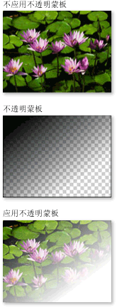
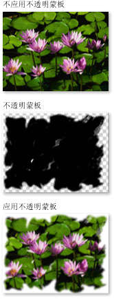
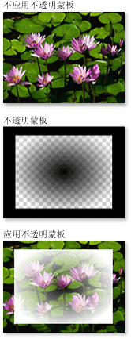

# 不透明蒙板概述Opacity Masks Overview
不透明蒙板能够使部分元素或视觉对象透明或部分透明。Opacity masks enable you to make portions of an element or visual either transparent or partially transparent. 若要创建不透明蒙板，则应用<xref:System.Windows.Media.Brush>到<xref:System.Windows.UIElement.OpacityMask%2A>元素的属性或<xref:System.Windows.Media.Visual>。To create an opacity mask, you apply a <xref:System.Windows.Media.Brush> to the <xref:System.Windows.UIElement.OpacityMask%2A> property of an element or <xref:System.Windows.Media.Visual>.  画笔映射到元素或视觉对象，并且画笔的每个像素的不透明度值用于确定生成的元素或视觉对象的每个相应像素的不透明度。The brush is mapped to the element or visual, and the opacity value of each brush pixel is used to determine the resulting opacity of each corresponding pixel of the element or visual.  
  
   
## 系统必备Prerequisites  
 本概述假定您熟悉<xref:System.Windows.Media.Brush>对象。This overview assumes that you are familiar with <xref:System.Windows.Media.Brush> objects. 有关使用画笔的介绍，请参阅[使用纯色和渐变进行绘制概述](painting-with-solid-colors-and-gradients-overview.md)。For an introduction to using brushes, see [Painting with Solid Colors and Gradients Overview](painting-with-solid-colors-and-gradients-overview.md). 璝惠<xref:System.Windows.Media.ImageBrush>并<xref:System.Windows.Media.DrawingBrush>，请参阅[使用图像、 绘图和视觉对象进行绘制](painting-with-images-drawings-and-visuals.md)。For information about <xref:System.Windows.Media.ImageBrush> and <xref:System.Windows.Media.DrawingBrush>, see [Painting with Images, Drawings, and Visuals](painting-with-images-drawings-and-visuals.md).  
  
   
## 使用不透明蒙板创建视觉效果Creating Visual Effects with Opacity Masks  
 不透明蒙板的工作原理是将其内容映射到元素或视觉对象。An opacity mask works by mapping its contents to the element or visual. 画笔像素的 alpha 通道则用于确定生成的元素或视觉对象相应像素的不透明度；将忽略画笔的实际颜色。The alpha channel of each of the brush's pixels are then used to determine the resulting opacity of the element or visual's corresponding pixels; the actual color of the brush is ignored. 如果画笔的指定部分是透明的，则元素或视觉对象的相应部分将变为透明。If a given portion of the brush is transparent, the corresponding portion of the element or visual becomes transparent. 如果画笔的指定部分是不透明的，则元素或视觉对象的相应部分未改变。If a given portion of the brush is opaque, the opacity of the corresponding portion of the element or visual is unchanged. 不透明蒙板指定的不透明度与元素或视觉对象呈现的任何不透明度设置相结合。The opacity specified by the opacity mask is combined with any opacity settings present in the element or visual. 例如：如果某个元素的不透明度是 25% 并且从完全不透明过渡完全透明时应用不透明蒙板，结果是元素从 25% 的不透明过渡到完全透明。For example, if an element is 25 percent opaque and an opacity mask is applied that transitions from fully opaque to fully transparent, the result is an element that transitions from 25 percent opacity to fully transparent.  
  
> [!NOTE]
>  虽然此概述中的示例演示如何在图像元素上的不透明蒙板，但不透明蒙板可以应用于任何元素或<xref:System.Windows.Media.Visual>，包括面板和控件。Although the examples in this overview demonstrate the use of opacity masks on image elements, an opacity mask may be applied to any element or <xref:System.Windows.Media.Visual>, including panels and controls.  
  
 不透明蒙板用于创建有趣的视觉效果，如创建从视图淡入淡出的图像或按钮、向元素添加纹理或结合渐变产生玻璃般的图面。Opacity masks are used to create interesting visual effects, such as to create images or buttons that fade from view, to add textures to elements, or to combine gradients to produce glass-like surfaces. 以下图示演示了不透明蒙板的使用。The following illustration demonstrates the use of an opacity mask. 棋盘格的背景用于显示蒙板的透明部分。A checkered background is used to show the transparent portions of the mask.  
  
   
不透明蒙板示例Opacity masking example  
  
   
## 创建不透明蒙板Creating an Opacity Mask  
 若要创建不透明蒙板，你可以创建<xref:System.Windows.Media.Brush>并将其应用于<xref:System.Windows.UIElement.OpacityMask%2A>元素或视觉对象的属性。To create an opacity mask, you create a <xref:System.Windows.Media.Brush> and apply it to the <xref:System.Windows.UIElement.OpacityMask%2A> property of an element or visual. 可以使用任何类型的<xref:System.Windows.Media.Brush>作为不透明蒙板。You can use any type of <xref:System.Windows.Media.Brush> as an opacity mask.  
  
-   <xref:System.Windows.Media.LinearGradientBrush>, <xref:System.Windows.Media.RadialGradientBrush>:用于使元素或从视图 visual 淡入淡出。<xref:System.Windows.Media.LinearGradientBrush>, <xref:System.Windows.Media.RadialGradientBrush>: Used to make an element or visual fade from view.  
  
     下图显示了<xref:System.Windows.Media.LinearGradientBrush>用作不透明蒙板。The following image shows a <xref:System.Windows.Media.LinearGradientBrush> used as an opacity mask.  
  
       
LinearGradientBrush 不透明蒙板示例LinearGradientBrush Opacity Masking Example  
  
-   <xref:System.Windows.Media.ImageBrush>：用于创建纹理和软或撕裂边缘效果。<xref:System.Windows.Media.ImageBrush>: Used to create texture and soft or torn edge effects.  
  
     下图显示了<xref:System.Windows.Media.ImageBrush>用作不透明蒙板。The following image shows an <xref:System.Windows.Media.ImageBrush> used as an opacity mask.  
  
       
LinearGradientBrush 不透明蒙板示例LinearGradientBrush opacity masking example  
  
-   <xref:System.Windows.Media.DrawingBrush>：用于从形状、 图像和渐变的模式创建复杂的不透明蒙板。<xref:System.Windows.Media.DrawingBrush>: Used to create complex opacity masks from patterns of shapes, images, and gradients.  
  
     下图显示了<xref:System.Windows.Media.DrawingBrush>用作不透明蒙板。The following image shows a <xref:System.Windows.Media.DrawingBrush> used as an opacity mask.  
  
       
DrawingBrush 不透明蒙板示例DrawingBrush opacity masking example  
  
 渐变画笔 (<xref:System.Windows.Media.LinearGradientBrush>和<xref:System.Windows.Media.RadialGradientBrush>) 非常适合用作不透明蒙板。The gradient brushes (<xref:System.Windows.Media.LinearGradientBrush> and <xref:System.Windows.Media.RadialGradientBrush>) are particularly well-suited for use as an opacity mask. 因为<xref:System.Windows.Media.SolidColorBrush>将区域用统一颜色填充，它们使不佳的不透明度屏蔽; 使用<xref:System.Windows.Media.SolidColorBrush>等效于设置元素或视觉对象的<xref:System.Windows.UIElement.OpacityMask%2A>属性。Because a <xref:System.Windows.Media.SolidColorBrush> fills an area with a uniform color, they make poor opacity masks; using a <xref:System.Windows.Media.SolidColorBrush> is equivalent to setting the element's or visual's <xref:System.Windows.UIElement.OpacityMask%2A> property.  
  
   
## 将渐变用作不透明蒙板Using a Gradient as an Opacity Mask  
 要创建渐变填充，请指定两个或多个梯度停止点。To create a gradient fill, you specify two or more gradient stops. 每个渐变停止点包含描述一种颜色和位置（请参阅[使用纯色和渐变进行绘制概述](painting-with-solid-colors-and-gradients-overview.md)了解关于创建和使用渐变的更多信息）。Each gradient stop contains describes a color and a position (see [Painting with Solid Colors and Gradients Overview](painting-with-solid-colors-and-gradients-overview.md) for more information about creating and using gradients). 将渐变用作不透明蒙板时，除非不使用混合颜色，由不透明蒙板渐变混合 alpha 通道值，否则过程相同。The process is the same when using a gradient as an opacity mask, except that, instead of blending colors, the opacity mask gradient blends alpha channel values. 因此，渐变内容的实际颜色并不重要；只有 alpha 通道或每种颜色的不透明度很重要。So the actual color of the gradient's contents do not matter; only the alpha channel, or opacity, of each color matters. 下面是一个示例。The following is an example.  
  
 [!code-xaml[OpacityMasksSnippet#LinearGradientOpacityMaskonImage](~/samples/snippets/csharp/VS_Snippets_Wpf/OpacityMasksSnippet/CS/GradientBrushExample.xaml#lineargradientopacitymaskonimage)]  
  
   
## 为不透明蒙板指定梯度停止点Specifying Gradient Stops for an Opacity Mask  
 在上一示例中，系统定义颜色<xref:System.Windows.Media.Colors.Black%2A>用作渐变的开始颜色。In the previous example, the system-defined color <xref:System.Windows.Media.Colors.Black%2A> is used as the starting color of the gradient. 因为所有中的颜色<xref:System.Windows.Media.Colors>类，除<xref:System.Windows.Media.Colors.Transparent%2A>，是完全不透明，它们可以用于只需定义渐变不透明蒙板的起始颜色。Because all of the colors in the <xref:System.Windows.Media.Colors> class, except <xref:System.Windows.Media.Colors.Transparent%2A>, are fully opaque, they can be used to simply define a starting color for a gradient opacity mask.  
  
 附加控制 alpha 值定义不透明蒙板时，可以指定使用的颜色的 alpha 通道[!INCLUDE[TLA#tla_argb](../../../../includes/tlasharptla-argb-md.md)]标记中或使用十六进制表示法<xref:System.Windows.Media.Color.FromScRgb%2A?displayProperty=nameWithType>方法。For additional control over alpha values when defining an opacity mask, you can specify the alpha channel of colors using [!INCLUDE[TLA#tla_argb](../../../../includes/tlasharptla-argb-md.md)] hexadecimal notation in markup or using the <xref:System.Windows.Media.Color.FromScRgb%2A?displayProperty=nameWithType> method.  
  
   
### 在“XAML”中指定颜色不透明度Specifying Color Opacity in "XAML"  
 在 [!INCLUDE[TLA#tla_xaml](../../../../includes/tlasharptla-xaml-md.md)] 中，使用 [!INCLUDE[TLA2#tla_argb](../../../../includes/tla2sharptla-argb-md.md)] 十六进制表示法指定个别颜色的不透明度。In [!INCLUDE[TLA#tla_xaml](../../../../includes/tlasharptla-xaml-md.md)], you use  [!INCLUDE[TLA2#tla_argb](../../../../includes/tla2sharptla-argb-md.md)] hexadecimal notation to specify the opacity of individual colors. [!INCLUDE[TLA2#tla_argb](../../../../includes/tla2sharptla-argb-md.md)] 十六进制表示法使用下面语法：hexadecimal notation uses the following syntax:  
  
 `#` **aa** *rrggbb*`#` **aa** *rrggbb*  
  
 上一行中的 *aa* 表示用于指定颜色不透明度的两位十六进制值。The *aa* in the previous line represents a two-digit hexadecimal value used to specify the opacity of the color. *rr*、*gg* 和 *bb* 分别表示用于指定颜色中的红色、绿色和蓝色量的两位十六进制值。The *rr*, *gg*, and *bb* each represent a two digit hexadecimal value used to specify the amount of red, green, and blue in the color. 每个十六进制数字介于 0-9 或 A-F 之间。Each hexadecimal digit may have a value from 0-9 or A-F. 0 是最小值，F 是最大值。0 is the smallest value, and F is the greatest. 00 的 alpha 值指定完全透明的颜色，而 FF 的 alpha 值创建完全不透明的颜色。An alpha value of 00 specifies a color that is completely transparent, while an alpha value of FF creates a color that is fully opaque.  在下面的示例中，十六进制 [!INCLUDE[TLA2#tla_argb](../../../../includes/tla2sharptla-argb-md.md)] 表示法用于指定两种颜色。In the following example, hexadecimal [!INCLUDE[TLA2#tla_argb](../../../../includes/tla2sharptla-argb-md.md)] notation is used to specify two colors. 第一种为完全不透明色，第二种为完全透明色。The first is fully opaque, while the second is completely transparent.  
  
 [!code-xaml[OpacityMasksSnippet#AARRGGBBValueonOpacityMask](~/samples/snippets/csharp/VS_Snippets_Wpf/OpacityMasksSnippet/CS/GradientBrushExample.xaml#aarrggbbvalueonopacitymask)]  
  
   
## 将图像用作不透明蒙板Using an Image as an Opacity Mask  
 图像也可以用作不透明蒙板。Images can also be used as an opacity mask. 下面的图像显示了一个示例。The following image shows an example. 棋盘格的背景用于显示蒙板的透明部分。A checkered background is used to show the transparent portions of the mask.  
  
   
不透明蒙板示例Opacity masking example  
  
 若要将图像用作不透明蒙板，请使用<xref:System.Windows.Media.ImageBrush>包含图像。To use an image as an opacity mask, use an <xref:System.Windows.Media.ImageBrush> to contain the image. 创建要用作不透明蒙板的图像时，以支持多级别不透明度的格式保存图像，例如 [!INCLUDE[TLA#tla_png](../../../../includes/tlasharptla-png-md.md)]。When creating an image to be used as an opacity mask, save the image in a format that supports multiple levels of transparency, such as [!INCLUDE[TLA#tla_png](../../../../includes/tlasharptla-png-md.md)]. 下面的示例显示了用于创建上图的代码。The following example shows the code used to create the previous illustration.  
  
 [!code-xaml[OpacityMasksSnippet#UIElementOpacityMask](~/samples/snippets/csharp/VS_Snippets_Wpf/OpacityMasksSnippet/CS/ImageBrushExample.xaml#uielementopacitymask)]  
  
   
### 将平铺图像用作不透明蒙板Using a Tiled Image as an Opacity Mask  
 在以下示例中，使用相同的映像与另一个<xref:System.Windows.Media.ImageBrush>，但画笔的平铺功能用于生成的图像为 50 像素正方形磁贴。In the following example, the same image is used with another <xref:System.Windows.Media.ImageBrush>, but the brush's tiling features are used to produce tiles of the image 50 pixels square.  
  
 [!code-xaml[OpacityMasksSnippet#TiledImageasOpacityMask](~/samples/snippets/csharp/VS_Snippets_Wpf/OpacityMasksSnippet/CS/ImageBrushExample.xaml#tiledimageasopacitymask)]  
  
   
## 通过图形创建不透明蒙板Creating an Opacity Mask from a Drawing  
 图形可用作不透明蒙板。Drawings can be used an opacity mask. 图形中包含的形状可使用渐变、纯色、图像或甚至其他图形来填充它们自己。The shapes contained within the drawing can themselves be filled with gradients, solid colors, images, or even other drawings. 下面的图像显示了图形用作不透明蒙板的示例。The following image shows an example of a drawing used as an opacity mask. 棋盘格的背景用于显示蒙板的透明部分。A checkered background is used to show the transparent portions of the mask.  
  
   
DrawingBrush 不透明蒙板示例DrawingBrush opacity masking example  
  
 若要将绘图用作不透明蒙板，请使用<xref:System.Windows.Media.DrawingBrush>包含图形。To use a drawing as an opacity mask, use a <xref:System.Windows.Media.DrawingBrush> to contain the drawing. 下面的示例显示了用于创建上图的代码：The following example shows the code used to create the previous illustration:  
  
 [!code-xaml[OpacityMasksSnippet#OpacityMaskfromDrawing](~/samples/snippets/csharp/VS_Snippets_Wpf/OpacityMasksSnippet/CS/DrawingBrushExample.xaml#opacitymaskfromdrawing)]  
  
   
### 将平铺图形用作不透明蒙板Using a Tiled Drawing as an Opacity Mask  
 像<xref:System.Windows.Media.ImageBrush>，则<xref:System.Windows.Media.DrawingBrush>可用于平铺其图形。Like the <xref:System.Windows.Media.ImageBrush>, the <xref:System.Windows.Media.DrawingBrush> can be made to tile its drawing. 在下面的示例中，图形画笔用于创建平铺的不透明蒙板。In the following example, a drawing brush is used to create a tiled opacity mask.  
  
 [!code-xaml[OpacityMasksSnippet#TiledDrawingasOpacityMask](~/samples/snippets/csharp/VS_Snippets_Wpf/OpacityMasksSnippet/CS/DrawingBrushExample.xaml#tileddrawingasopacitymask)]  
  
## 请参阅See also

- [使用图像、绘图和视觉对象进行绘制Painting with Images, Drawings, and Visuals](painting-with-images-drawings-and-visuals.md)
- [使用纯色和渐变进行绘制概述Painting with Solid Colors and Gradients Overview](painting-with-solid-colors-and-gradients-overview.md)
