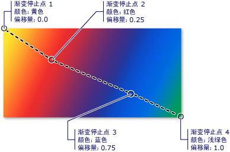
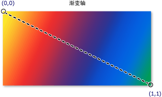
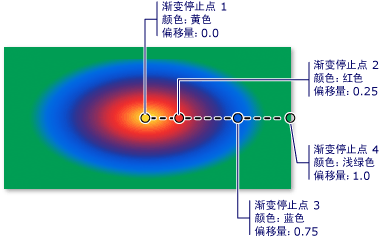

# 使用纯色和渐变进行绘制概述
此主题介绍如何使用 <xref:System.Windows.Media.SolidColorBrush>、<xref:System.Windows.Media.LinearGradientBrush> 和 <xref:System.Windows.Media.RadialGradientBrush> 对象，以纯色、线性渐变和径向渐变进行绘制。  
  
   
  
   
## 使用纯色绘制区域  
 任何平台上的一个最常见操作是使用纯 <xref:System.Windows.Media.Color> 绘制区域。  为了实现此任务，[!INCLUDE[TLA#tla_winclient](../../../../includes/tlasharptla-winclient-md.md)] 提供了 <xref:System.Windows.Media.SolidColorBrush> 类。  以下各节介绍使用 <xref:System.Windows.Media.SolidColorBrush> 进行绘制的不同方式。  
  
   
### 在“XAML”中使用 SolidColorBrush  
 若要在 [!INCLUDE[TLA2#tla_xaml](../../../../includes/tla2sharptla-xaml-md.md)] 中用纯色绘制区域，请使用以下选项之一。  
  
-   通过名称选择一个预定义的纯色画笔。  例如，可以将按钮的 <xref:System.Windows.Controls.Control.Background%2A> 设置为“Red”或“MediumBlue”。  有关其他预定义纯色画笔的列表，请参见 <xref:System.Windows.Media.Brushes> 类的静态属性。  下面是一个示例。  
  
     [!code-xml[BrushOverviewExamples_snip#SolidColorBrushNamedColor1XAML](../../../../samples/snippets/xaml/VS_Snippets_Wpf/BrushOverviewExamples_snip/XAML/SolidColorBrushExample.xaml#solidcolorbrushnamedcolor1xaml)]  
  
-   通过指定红色、绿色和蓝色的分量以组合成单一纯色，从 32 位调色板中选择一种颜色。  从 32 位调色板中指定一种颜色时使用的格式为“*\#rrggbb*”，其中 *rr* 是指定红色相对量的两位十六进制数，*gg* 指定绿色相对量，*bb* 指定蓝色相对量。  此外，还可以按“\#*aarrggbb*”格式指定颜色，其中 *aa* 指定颜色的 *alpha* 值或透明度。  通过此方法可以创建部分透明的颜色。  在下面的示例中，使用十六进制表示法将 <xref:System.Windows.Controls.Button> 的 <xref:System.Windows.Controls.Control.Background%2A> 设置为完全不透明的红色。  
  
     [!code-xml[BrushOverviewExamples_snip#SolidColorBrushHex1XAML](../../../../samples/snippets/xaml/VS_Snippets_Wpf/BrushOverviewExamples_snip/XAML/SolidColorBrushExample.xaml#solidcolorbrushhex1xaml)]  
  
-   使用属性标记语法可描述 <xref:System.Windows.Media.SolidColorBrush>。  此语法更为详细，可用于指定其他设置，如画笔的不透明度。  在下面的示例中，两个 <xref:System.Windows.Controls.Button> 元素的 <xref:System.Windows.Controls.Control.Background%2A> 属性设置为完全不透明的红色。  第一支画笔的颜色使用预定义的颜色名称进行描述。  第二支画笔的颜色使用十六进制表示法进行描述。  
  
     [!code-xml[BrushOverviewExamples_snip#SolidColorBrushPropertyTag1XAML](../../../../samples/snippets/xaml/VS_Snippets_Wpf/BrushOverviewExamples_snip/XAML/SolidColorBrushExample.xaml#solidcolorbrushpropertytag1xaml)]  
  
   
### 在代码中使用 SolidColorBrush 进行绘制  
 若要在代码中使用纯色绘制区域，请使用以下选项之一。  
  
-   使用 <xref:System.Windows.Media.Brushes> 类提供的预定义画笔之一。  在下面的示例中，<xref:System.Windows.Controls.Button> 的 <xref:System.Windows.Controls.Control.Background%2A> 设置为 <xref:System.Windows.Media.Brushes.Red%2A>。  
  
     [!code-csharp[BrushOverviewExamples_snip#SolidColorBrushPredefinedBrush1CSharp](../../../../samples/snippets/csharp/VS_Snippets_Wpf/BrushOverviewExamples_snip/CSharp/SolidColorBrushExample.cs#solidcolorbrushpredefinedbrush1csharp)]  
  
-   创建一个 <xref:System.Windows.Media.SolidColorBrush> 并使用 <xref:System.Windows.Media.Color> 结构设置其 <xref:System.Windows.Media.SolidColorBrush.Color%2A> 属性。  可以使用 <xref:System.Windows.Media.Colors> 类中的预定义颜色，或者可以使用静态 <xref:System.Windows.Media.Color.FromArgb%2A> 方法创建 <xref:System.Windows.Media.Color>。  
  
     下面的示例演示如何使用预定义的颜色设置 <xref:System.Windows.Media.SolidColorBrush> 的 <xref:System.Windows.Media.SolidColorBrush.Color%2A> 属性。  
  
     [!code-csharp[BrushOverviewExamples_snip#SolidColorBrushPredefinedColor1CSharp](../../../../samples/snippets/csharp/VS_Snippets_Wpf/BrushOverviewExamples_snip/CSharp/SolidColorBrushExample.cs#solidcolorbrushpredefinedcolor1csharp)]  
  
 使用静态 <xref:System.Windows.Media.Color.FromArgb%2A> 可以指定颜色的 [alpha](GTMT) 值、红色值、绿色值和蓝色值。  以上每种值的典型范围都是 0\-255。  例如，[alpha](GTMT) 值为 0 表示颜色完全透明，而值 255 表示颜色完全不透明。  同样，红色值 0 表示颜色中没有红色，而值 255 表示颜色中包含可能的最大红色分量。  在下面的示例中，通过指定 alpha 值、红色值、绿色值和蓝色值来描述画笔的颜色。  
  
 [!code-csharp[BrushOverviewExamples_snip#SolidColorBrushfromArgbExample1CSharp](../../../../samples/snippets/csharp/VS_Snippets_Wpf/BrushOverviewExamples_snip/CSharp/SolidColorBrushExample.cs#solidcolorbrushfromargbexample1csharp)]  
  
 有关指定颜色的其他方式，请参见 <xref:System.Windows.Media.Color> 参考主题。  
  
   
## 使用渐变绘制区域  
 渐变画笔使用沿一条轴彼此混合的多种颜色绘制区域。  可以使用它们来形成光和影的效果，使控件具有三维外观。  还可以使用它们来模拟玻璃、镶边、水和其他光滑表面。  [!INCLUDE[TLA2#tla_winclient](../../../../includes/tla2sharptla-winclient-md.md)] 提供两种类型的渐变画笔：<xref:System.Windows.Media.LinearGradientBrush> 和 <xref:System.Windows.Media.RadialGradientBrush>。  
  
   
## 线性渐变  
 <xref:System.Windows.Media.LinearGradientBrush> 使用沿一条直线（即*渐变轴*）定义的渐变绘制区域。  可以使用 <xref:System.Windows.Media.GradientStop> 对象指定渐变的颜色及其在渐变轴上的位置。  还可以修改渐变轴，这样能够创建水平和垂直渐变并反转渐变方向。  渐变轴将在下一节中介绍。  默认情况下创建对角线渐变。  
  
 下面的示例演示使用四种颜色创建线性渐变的代码。  
  
 [!code-xml[GradientBrushExamples_snip#DiagonalGradient1XAML](../../../../samples/snippets/xaml/VS_Snippets_Wpf/GradientBrushExamples_snip/XAML/LinearGradientBrushExample.xaml#diagonalgradient1xaml)]  
  
 [!code-csharp[GradientBrushExamples_snip#DiagonalGradient1CSharp](../../../../samples/snippets/csharp/VS_Snippets_Wpf/GradientBrushExamples_snip/CSharp/LinearGradientBrushExample.cs#diagonalgradient1csharp)]  
  
 此代码产生以下渐变：  
  
   
  
 **注意：**此主题中的渐变示例使用默认坐标系来设置起点和终点。  默认坐标系与边界框相关：0 指示边界框的 0%，1 指示边界框的 100%。  可以通过将 <xref:System.Windows.Media.GradientBrush.MappingMode%2A> 属性设置为值 <xref:System.Windows.Media.BrushMappingMode>，更改此坐标系。  绝对坐标系与边界框不相关。  值直接在本地坐标系中解释。  
  
 <xref:System.Windows.Media.GradientStop> 是渐变画笔的基本构造块。  渐变停止点指定渐变轴上 <xref:System.Windows.Media.GradientStop.Offset%2A> 处的 <xref:System.Windows.Media.GradientStop.Color%2A>。  
  
-   渐变停止点的 <xref:System.Windows.Media.GradientStop.Color%2A> 属性指定渐变停止点的颜色。  可以使用预定义的颜色（由 <xref:System.Windows.Media.Colors> 类提供）设置颜色，或通过指定 ScRGB 或 ARGB 值设置颜色。  在 [!INCLUDE[TLA2#tla_xaml](../../../../includes/tla2sharptla-xaml-md.md)] 中，还可以使用十六进制表示法描述颜色。  有关更多信息，请参见 <xref:System.Windows.Media.Color> 结构。  
  
-   渐变停止点的 <xref:System.Windows.Media.GradientStop.Offset%2A> 属性指定渐变停止点的颜色在渐变轴上的位置。  偏移量是一个范围从 0 至 1 的 <xref:System.Double> 值。  渐变停止点的偏移量值越接近 0，颜色越接近渐变起点。  渐变偏移量值越接近 1，颜色越接近渐变终点。  
  
 渐变停止点之间每个点的颜色按两个边界渐变停止点指定的颜色组合执行线性内插。  下图突出显示了上一示例中的渐变停止点。  圆圈标记渐变停止点的位置，虚线显示渐变轴。  
  
   
  
 第一个渐变停止点指定偏移量 `0.0` 处的颜色为黄色。  第二个渐变停止点指定偏移量 `0.25` 处的颜色为红色。  沿渐变轴从左到右移动，这两个停止点之间的点逐渐从黄色变为红色。  第三个渐变停止点指定偏移量 `0.75` 处的颜色为蓝色。  第二个和第三个渐变停止点之间的点逐渐从红色变为蓝色。  第四个渐变停止点指定偏移量 `1.0` 处的颜色为浅绿色。  第三个和第四个渐变停止点之间的点逐渐从蓝色变为浅绿色。  
  
   
### 渐变轴  
 如前所述，线性渐变画笔的渐变停止点位于一条直线上，即渐变轴上。  可以使用画笔的 <xref:System.Windows.Media.LinearGradientBrush.StartPoint%2A> 和 <xref:System.Windows.Media.LinearGradientBrush.EndPoint%2A> 属性更改直线的方向和大小。  通过操作画笔的 <xref:System.Windows.Media.LinearGradientBrush.StartPoint%2A> 和 <xref:System.Windows.Media.LinearGradientBrush.EndPoint%2A>，可以创建水平和垂直渐变、反转渐变方向以及压缩渐变的范围等。  
  
 默认情况下，线性渐变画笔的 <xref:System.Windows.Media.LinearGradientBrush.StartPoint%2A> 和 <xref:System.Windows.Media.LinearGradientBrush.EndPoint%2A> 与绘制区域相关。  点 \(0,0\) 表示绘制区域的左上角，\(1,1\) 表示绘制区域的右下角。  <xref:System.Windows.Media.LinearGradientBrush> 的默认 <xref:System.Windows.Media.LinearGradientBrush.StartPoint%2A> 为 \(0,0\)，其默认 <xref:System.Windows.Media.LinearGradientBrush.EndPoint%2A> 为 \(1,1\)，这就创建了一个从绘制区域的左上角开始延伸到右下角的对角线渐变。  下图显示了带有默认 <xref:System.Windows.Media.LinearGradientBrush.StartPoint%2A> 和 <xref:System.Windows.Media.LinearGradientBrush.EndPoint%2A> 的线性渐变画笔的渐变轴。  
  
   
  
 下面的示例演示如何通过指定画笔的 <xref:System.Windows.Media.LinearGradientBrush.StartPoint%2A> 和 <xref:System.Windows.Media.LinearGradientBrush.EndPoint%2A> 来创建水平渐变。  请注意，渐变停止点与前面的示例相同；只是更改了 <xref:System.Windows.Media.LinearGradientBrush.StartPoint%2A> 和 <xref:System.Windows.Media.LinearGradientBrush.EndPoint%2A>，就将对角线渐变更改为水平渐变。  
  
 [!code-xml[GradientBrushExamples_snip#HorizontalGradient1XAML](../../../../samples/snippets/xaml/VS_Snippets_Wpf/GradientBrushExamples_snip/XAML/LinearGradientBrushExample.xaml#horizontalgradient1xaml)]  
  
 [!code-csharp[GradientBrushExamples_snip#HorizontalGradient1CSharp](../../../../samples/snippets/csharp/VS_Snippets_Wpf/GradientBrushExamples_snip/CSharp/LinearGradientBrushExample.cs#horizontalgradient1csharp)]  
  
 下图显示所创建的渐变。  渐变轴用虚线标记，而渐变停止点用圆圈标记。  
  
   
  
 下一个示例演示如何创建垂直渐变。  
  
 [!code-xml[GradientBrushExamples_snip#VerticalGradient1XAML](../../../../samples/snippets/xaml/VS_Snippets_Wpf/GradientBrushExamples_snip/XAML/LinearGradientBrushExample.xaml#verticalgradient1xaml)]  
  
 [!code-csharp[GradientBrushExamples_snip#VerticalGradient1CSharp](../../../../samples/snippets/csharp/VS_Snippets_Wpf/GradientBrushExamples_snip/CSharp/LinearGradientBrushExample.cs#verticalgradient1csharp)]  
  
 下图显示所创建的渐变。  渐变轴用虚线标记，而渐变停止点用圆圈标记。  
  
   
  
   
## 径向渐变  
 与 <xref:System.Windows.Media.LinearGradientBrush> 类似，<xref:System.Windows.Media.RadialGradientBrush> 用沿一条轴混合在一起的颜色绘制区域。  前面的示例演示线性渐变画笔的轴是一条直线。  径向渐变画笔的轴由一个圆圈定义；其颜色从圆圈的原点向外“辐射”。  
  
 在下面的示例中，用径向渐变画笔绘制矩形内部。  
  
 [!code-xml[GradientBrushExamples_snip#RadialGradient1XAML](../../../../samples/snippets/xaml/VS_Snippets_Wpf/GradientBrushExamples_snip/XAML/RadialGradientBrushExample.xaml#radialgradient1xaml)]  
  
 [!code-csharp[GradientBrushExamples_snip#RadialGradient1CSharp](../../../../samples/snippets/csharp/VS_Snippets_Wpf/GradientBrushExamples_snip/CSharp/RadialGradientBrushExample.cs#radialgradient1csharp)]  
  
 下图显示了上一示例中创建的渐变。  其中突出显示了画笔的渐变停止点。  请注意，虽然结果不同，但此示例中的渐变停止点与前面的线性渐变画笔示例中的渐变停止点是相同的。  
  
   
  
 <xref:System.Windows.Media.RadialGradientBrush.GradientOrigin%2A> 指定径向渐变画笔的渐变轴的起点。  渐变轴从渐变原点辐射至渐变圆。  画笔的渐变圆由其 <xref:System.Windows.Media.RadialGradientBrush.Center%2A>、<xref:System.Windows.Media.RadialGradientBrush.RadiusX%2A> 和 <xref:System.Windows.Media.RadialGradientBrush.RadiusY%2A> 属性定义。  
  
 下图显示了具有不同的 <xref:System.Windows.Media.RadialGradientBrush.GradientOrigin%2A>、<xref:System.Windows.Media.RadialGradientBrush.Center%2A>、<xref:System.Windows.Media.RadialGradientBrush.RadiusX%2A> 和 <xref:System.Windows.Media.RadialGradientBrush.RadiusY%2A> 设置的多个径向渐变。  
  
   
具有不同 GradientOrigin、Center、RadiusX 和 RadiusY 设置的 RadialGradientBrush。  
  
   
## 指定透明或部分透明的渐变停止点  
 由于渐变停止点不提供 opacity 属性，因此必须使用标记中的 [!INCLUDE[TLA#tla_argb](../../../../includes/tlasharptla-argb-md.md)] 十六进制表示法指定颜色的 alpha 通道，或使用 <xref:System.Windows.Media.Color.FromScRgb%2A?displayProperty=fullName> 方法创建透明或部分透明的渐变停止点。  下面各节介绍如何在 [!INCLUDE[TLA2#tla_xaml](../../../../includes/tla2sharptla-xaml-md.md)] 和代码中创建部分透明的渐变停止点。  有关设置整支画笔的不透明度的信息，请参见[指定画笔的不透明度](#brushesAndOpacity)一节。  
  
   
### 在“XAML”中指定颜色的不透明度  
 在 [!INCLUDE[TLA2#tla_xaml](../../../../includes/tla2sharptla-xaml-md.md)] 中，可以使用 [!INCLUDE[TLA2#tla_argb](../../../../includes/tla2sharptla-argb-md.md)] 十六进制表示法指定各颜色的不透明度。  [!INCLUDE[TLA2#tla_argb](../../../../includes/tla2sharptla-argb-md.md)] 十六进制表示法使用以下语法：  
  
 `#`**aa** *rrggbb*  
  
 上一行中的 *aa* 表示用于指定颜色的不透明度的两位十六进制值。  *rr*、*gg* 和 *bb* 分别表示用于指定颜色中的红色分量、绿色分量和蓝色分量的两位十六进制值。  每个十六进制数字都是 0\-9 或 A\-F 中的一个值。  其中 0 是最小值，F 是最大值。  Alpha 值 00 用于指定完全透明的颜色，而 alpha 值 FF 用于建完全不透明的颜色。  在下面的示例中，使用十六进制 [!INCLUDE[TLA2#tla_argb](../../../../includes/tla2sharptla-argb-md.md)] 表示法来指定两种颜色。  第一种为部分透明（alpha 值为 x20），而第二种为完全不透明。  
  
 [!code-xml[GradientBrushExamples_snip#TransparentGradientStopExample1XAML](../../../../samples/snippets/xaml/VS_Snippets_Wpf/GradientBrushExamples_snip/XAML/GradientStopsExample.xaml#transparentgradientstopexample1xaml)]  
  
   
### 在代码中指定颜色的不透明度  
 如果使用代码，则可以使用静态 <xref:System.Windows.Media.Color.FromArgb%2A> 方法在创建颜色时指定 alpha 值。  该方法接受类型为 <xref:System.Byte> 的四个参数。  第一个参数指定颜色的 alpha 通道；其他三个参数指定颜色的红色、绿色和蓝色值。  每个值应在 0 至 255 之间（含 0 和 255）。  alpha 值 0 指定颜色是完全透明的，而 alpha 值 255 指定颜色是完全不透明的。  在下面的示例中，使用 <xref:System.Windows.Media.Color.FromArgb%2A> 方法产生两种颜色。  第一种颜色为部分透明（alpha 值为 32），而第二种颜色为完全不透明。  
  
 [!code-csharp[GradientBrushExamples_snip#TransparentGradientStopExample1CSharp](../../../../samples/snippets/csharp/VS_Snippets_Wpf/GradientBrushExamples_snip/CSharp/GradientStopsExample.cs#transparentgradientstopexample1csharp)]  
  
 此外，也可以使用 <xref:System.Windows.Media.Color.FromScRgb%2A> 方法，该方法使您能够用 ScRGB 值创建颜色。  
  
   
## 使用图像、绘图、视觉效果和模式进行绘制  
 <xref:System.Windows.Media.ImageBrush>、<xref:System.Windows.Media.DrawingBrush> 和 <xref:System.Windows.Media.VisualBrush> 类使您能够使用图像、绘图或视觉效果绘制区域。  有关使用图像、绘图和模式进行绘制的信息，请参见[使用图像、绘图和 Visual 进行绘制](../../../../docs/framework/wpf/graphics-multimedia/painting-with-images-drawings-and-visuals.md)。  
  
## 请参阅  
 <xref:System.Windows.Media.Brush>   
 <xref:System.Windows.Media.SolidColorBrush>   
 <xref:System.Windows.Media.LinearGradientBrush>   
 <xref:System.Windows.Media.RadialGradientBrush>   
 [使用图像、绘图和 Visual 进行绘制](../../../../docs/framework/wpf/graphics-multimedia/painting-with-images-drawings-and-visuals.md)   
 [Brush 变换概述](../../../../docs/framework/wpf/graphics-multimedia/brush-transformation-overview.md)   
 [图形呈现层](../../../../docs/framework/wpf/advanced/graphics-rendering-tiers.md)