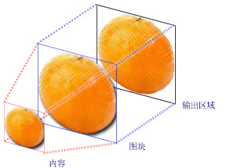
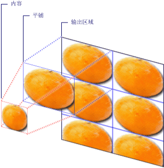
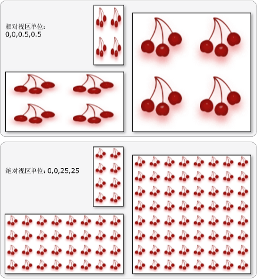

# TileBrush 概述
<xref:System.Windows.Media.TileBrush> 对象提供对如何使用图像、 绘制区域的控制自如地<xref:System.Windows.Media.Drawing>，或<xref:System.Windows.Media.Visual>。 本主题介绍如何使用<xref:System.Windows.Media.TileBrush>功能来获得更好地控制如何<xref:System.Windows.Media.ImageBrush>， <xref:System.Windows.Media.DrawingBrush>，或<xref:System.Windows.Media.VisualBrush>绘制区域。  
  
  
   
## 系统必备  
 要了解本主题，很有帮助，了解如何使用的基本功能<xref:System.Windows.Media.ImageBrush>， <xref:System.Windows.Media.DrawingBrush>，或<xref:System.Windows.Media.VisualBrush>类。 有关这些类型的简介，请参阅[使用图像、 绘图和视觉对象进行绘制](../../../../docs/framework/wpf/graphics-multimedia/painting-with-images-drawings-and-visuals.md)。  
  
   
## 使用图块绘制区域  
 <xref:System.Windows.Media.ImageBrush><xref:System.Windows.Media.DrawingBrush>，将<xref:System.Windows.Media.VisualBrush>类型的<xref:System.Windows.Media.TileBrush>对象。 使用平铺画笔，可以非常自如地控制如何使用图像、绘图或视觉对象来绘制区域。 例如，在绘制一个区域时，可以使用一系列的图像图块创建图案，而不是仅使用拉伸的图像。  
  
 使用平铺画笔绘制区域涉及三个组成部分：内容、基本图块和输出区域。  
  
   
具有单个图块的 TileBrush 的组成部分  
  
   
已指定图块的 TileMode 的 TileBrush 的组成部分  
  
 输出区域是绘制区域，如<xref:System.Windows.Shapes.Shape.Fill%2A>的<xref:System.Windows.Shapes.Ellipse>或<xref:System.Windows.Controls.Control.Background%2A>的<xref:System.Windows.Controls.Button>。 接下来的部分描述的其他两个组件<xref:System.Windows.Media.TileBrush>。  
  
   
## 画笔内容  
 有三种不同类型的<xref:System.Windows.Media.TileBrush>和每个不同类型的内容与绘制。  
  
-   如果画笔为<xref:System.Windows.Media.ImageBrush>，此内容是一个图像<xref:System.Windows.Media.ImageBrush.ImageSource%2A>属性指定的内容<xref:System.Windows.Media.ImageBrush>。  
  
-   如果画笔为<xref:System.Windows.Media.DrawingBrush>，此内容为绘图。 <xref:System.Windows.Media.DrawingBrush.Drawing%2A>属性指定的内容<xref:System.Windows.Media.DrawingBrush>。  
  
-   如果画笔为<xref:System.Windows.Media.VisualBrush>，此内容为视觉对象。 <xref:System.Windows.Media.VisualBrush.Visual%2A>属性指定的内容<xref:System.Windows.Media.VisualBrush>。  
  
 可以指定的位置和尺寸<xref:System.Windows.Media.TileBrush>通过使用内容<xref:System.Windows.Media.TileBrush.Viewbox%2A>属性，尽管通常会保留<xref:System.Windows.Media.TileBrush.Viewbox%2A>设置为其默认值。 默认情况下，<xref:System.Windows.Media.TileBrush.Viewbox%2A>配置为完全包含画笔的内容。 有关配置详细信息<xref:System.Windows.Controls.Viewbox>，请参阅<xref:System.Windows.Controls.Viewbox>属性页。  
  
   
## 基本图块  
 一个<xref:System.Windows.Media.TileBrush>其内容投射到基本图块。 <xref:System.Windows.Media.TileBrush.Stretch%2A>属性控制如何<xref:System.Windows.Media.TileBrush>拉伸内容以填充基本图块。 <xref:System.Windows.Media.TileBrush.Stretch%2A>属性接受以下值，通过定义<xref:System.Windows.Media.Stretch>枚举：  
  
-   <xref:System.Windows.Media.Stretch.None>： 将画笔的内容未拉伸以填充磁贴。  
  
-   <xref:System.Windows.Media.Stretch.Fill>： 将画笔的内容进行缩放以适合图块。 由于内容的高度和宽度独立进行缩放，因此内容的原始纵横比可能不会保留。 也就是说，为了完全填充输出图块，画笔的内容可能会弯曲。  
  
-   <xref:System.Windows.Media.Stretch.Uniform>： 缩放画笔的内容，使其完全符合该磁贴。 内容的纵横比会保留。  
  
-   <xref:System.Windows.Media.Stretch.UniformToFill>： 缩放画笔的内容，使其在保留内容的原始纵横比的同时完全填充输出区域。  
  
 下图阐释了不同<xref:System.Windows.Media.TileBrush.Stretch%2A>设置。  
  
   
  
 在下面的示例的内容<xref:System.Windows.Media.ImageBrush>设置，以便它不会拉伸以填充输出区域。  
  
 [!code-xaml[BrushOverviewExamples_snip#GraphicsMMNoStretchExample](../../../../samples/snippets/xaml/VS_Snippets_Wpf/BrushOverviewExamples_snip/XAML/StretchExample.xaml#graphicsmmnostretchexample)]  
  
 [!code-csharp[BrushOverviewExamples_procedural_snip#GraphicsMMNoStretchExample](../../../../samples/snippets/csharp/VS_Snippets_Wpf/BrushOverviewExamples_procedural_snip/CSharp/StretchExample.cs#graphicsmmnostretchexample)]
 [!code-vb[BrushOverviewExamples_procedural_snip#GraphicsMMNoStretchExample](../../../../samples/snippets/visualbasic/VS_Snippets_Wpf/BrushOverviewExamples_procedural_snip/visualbasic/stretchexample.vb#graphicsmmnostretchexample)]  
  
 默认情况下，<xref:System.Windows.Media.TileBrush>生成单个图块 （基本图块） 并拉伸该图块以完全填充输出区域。 可以通过设置更改的大小和位置的基本图块<xref:System.Windows.Media.TileBrush.Viewport%2A>和<xref:System.Windows.Media.TileBrush.ViewportUnits%2A>属性。  
  
   
### 基本图块大小  
 <xref:System.Windows.Media.TileBrush.Viewport%2A>属性确定的大小和位置的基本图块，并<xref:System.Windows.Media.TileBrush.ViewportUnits%2A>属性确定是否<xref:System.Windows.Media.TileBrush.Viewport%2A>使用绝对或相对坐标指定。 如果坐标是相对坐标，则它们相对于输出区域的大小。 点 (0,0) 表示输出区域的左上角，(1,1) 表示输出区域的右下角。 若要指定的<xref:System.Windows.Media.TileBrush.Viewport%2A>属性使用绝对坐标，设置<xref:System.Windows.Media.TileBrush.ViewportUnits%2A>属性设置为<xref:System.Windows.Media.BrushMappingMode.Absolute>。  
  
 下图显示了输出之间的区别<xref:System.Windows.Media.TileBrush>使用相对和绝对<xref:System.Windows.Media.TileBrush.ViewportUnits%2A>。 请注意每个图都显示了一种图块图案；下一节介绍如何指定图块图案。  
  
   
  
 在下面的示例中，使用一幅图像来创建一个宽度和高度均为 50% 的图块。 基本图块位于输出区域的 (0,0) 处。  
  
 [!code-xaml[BrushOverviewExamples_snip#GraphicsMMRelativeViewportUnitsExample1](../../../../samples/snippets/xaml/VS_Snippets_Wpf/BrushOverviewExamples_snip/XAML/TileSizeExample.xaml#graphicsmmrelativeviewportunitsexample1)]  
  
 [!code-csharp[BrushOverviewExamples_procedural_snip#GraphicsMMRelativeViewportUnitsExample1](../../../../samples/snippets/csharp/VS_Snippets_Wpf/BrushOverviewExamples_procedural_snip/CSharp/TileSizeExample.cs#graphicsmmrelativeviewportunitsexample1)]
 [!code-vb[BrushOverviewExamples_procedural_snip#GraphicsMMRelativeViewportUnitsExample1](../../../../samples/snippets/visualbasic/VS_Snippets_Wpf/BrushOverviewExamples_procedural_snip/visualbasic/tilesizeexample.vb#graphicsmmrelativeviewportunitsexample1)]  
  
 下一个示例设置的磁贴<xref:System.Windows.Media.ImageBrush>到 25 x 25 设备独立像素。 因为<xref:System.Windows.Media.TileBrush.ViewportUnits%2A>是绝对的<xref:System.Windows.Media.ImageBrush>图块始终是 25 x 25 像素，而不考虑所绘制的区域的大小。  
  
 [!code-xaml[BrushOverviewExamples_snip#GraphicsMMAbsoluteViewportUnitsExample1](../../../../samples/snippets/xaml/VS_Snippets_Wpf/BrushOverviewExamples_snip/XAML/TileSizeExample.xaml#graphicsmmabsoluteviewportunitsexample1)]  
  
 [!code-csharp[BrushOverviewExamples_procedural_snip#GraphicsMMAbsoluteViewportUnitsExample1](../../../../samples/snippets/csharp/VS_Snippets_Wpf/BrushOverviewExamples_procedural_snip/CSharp/TileSizeExample.cs#graphicsmmabsoluteviewportunitsexample1)]
 [!code-vb[BrushOverviewExamples_procedural_snip#GraphicsMMAbsoluteViewportUnitsExample1](../../../../samples/snippets/visualbasic/VS_Snippets_Wpf/BrushOverviewExamples_procedural_snip/visualbasic/tilesizeexample.vb#graphicsmmabsoluteviewportunitsexample1)]  
  
   
### 平铺行为  
 一个<xref:System.Windows.Media.TileBrush>其基本图块未完全填充输出区域和其他然后平铺模式时生成的平铺的模式<xref:System.Windows.Media.TileMode.None>指定。 当平铺画笔的图块未完全填充输出区域，其<xref:System.Windows.Media.TileBrush.TileMode%2A>属性指定是否应复制基本图块，以填充输出区域，指定如果是这样，都应复制基本图块的方式。 <xref:System.Windows.Media.TileBrush.TileMode%2A>属性接受以下值，通过定义<xref:System.Windows.Media.TileMode>枚举：  
  
-   <xref:System.Windows.Media.TileMode.None>： 绘制仅在基本图块。  
  
-   <xref:System.Windows.Media.TileMode.Tile>： 绘制基本图块，并通过重复基本磁贴，这样，一个磁贴的右边缘旁边的左边缘的下一步，并同样边缘和上填充剩余的区域。  
  
-   <xref:System.Windows.Media.TileMode.FlipX>： 与相同<xref:System.Windows.Media.TileMode.Tile>，只不过磁贴的交替列水平翻转。  
  
-   <xref:System.Windows.Media.TileMode.FlipY>： 与相同<xref:System.Windows.Media.TileMode.Tile>，只不过磁贴的交替行垂直翻转。  
  
-   <xref:System.Windows.Media.TileMode.FlipXY>： 的组合<xref:System.Windows.Media.TileMode.FlipX>和<xref:System.Windows.Media.TileMode.FlipY>。  
  
 下图阐释了不同的平铺模式。  
  
   
  
 在下面的示例中，使用一个图像来绘制宽度为 100 像素并且高度为 100 像素的矩形。 通过设置画笔的<xref:System.Windows.Media.TileBrush.Viewport%2A>已设置到 0,0,0.25,0.25，画笔的基本图块由为 1/4 占输出区域。 画笔<xref:System.Windows.Media.TileBrush.TileMode%2A>设置为<xref:System.Windows.Media.TileMode.FlipXY>。 这样它便可以用图块行来填充矩形。  
  
 [!code-xaml[BrushOverviewExamples_snip#GraphicsMMFlipXYExample](../../../../samples/snippets/xaml/VS_Snippets_Wpf/BrushOverviewExamples_snip/XAML/TilingExample.xaml#graphicsmmflipxyexample)]  
  
 [!code-csharp[BrushOverviewExamples_procedural_snip#GraphicsMMFlipXYExample](../../../../samples/snippets/csharp/VS_Snippets_Wpf/BrushOverviewExamples_procedural_snip/CSharp/TilingExample.cs#graphicsmmflipxyexample)]
 [!code-vb[BrushOverviewExamples_procedural_snip#GraphicsMMFlipXYExample](../../../../samples/snippets/visualbasic/VS_Snippets_Wpf/BrushOverviewExamples_procedural_snip/visualbasic/tilingexample.vb#graphicsmmflipxyexample)]  
  
## 请参阅  
 <xref:System.Windows.Media.ImageBrush>  
 <xref:System.Windows.Media.DrawingBrush>  
 <xref:System.Windows.Media.VisualBrush>  
 <xref:System.Windows.Media.TileBrush>  
 [使用图像、绘图和视觉对象进行绘制](../../../../docs/framework/wpf/graphics-multimedia/painting-with-images-drawings-and-visuals.md)  
 [帮助主题](../../../../docs/framework/wpf/graphics-multimedia/brushes-how-to-topics.md)  
 [Freezable 对象概述](../../../../docs/framework/wpf/advanced/freezable-objects-overview.md)  
 [ImageBrush 示例](https://go.microsoft.com/fwlink/?LinkID=160005)  
 [VisualBrush 示例](https://go.microsoft.com/fwlink/?LinkID=160049)
