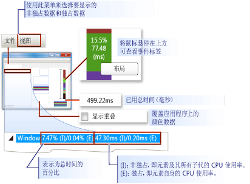
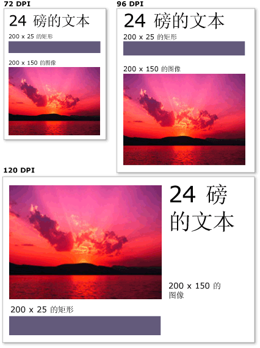

# WPF 图形呈现疑难解答
本主题概述 [!INCLUDE[TLA2#tla_winclient](../../../../includes/tla2sharptla-winclient-md.md)] 可视化层。 它主要关注的角色<xref:System.Windows.Media.Visual>类中呈现支持[!INCLUDE[TLA2#tla_winclient](../../../../includes/tla2sharptla-winclient-md.md)]模型。  
  
  
   
## 视觉对象的角色  
 <xref:System.Windows.Media.Visual>类是从其的基本抽象每个<xref:System.Windows.FrameworkElement>对象派生。 该类还用作在 [!INCLUDE[TLA2#tla_winclient](../../../../includes/tla2sharptla-winclient-md.md)] 中编写新控件的入口点，在 Win32 应用程序模型中，该类在许多方面可视为窗口句柄 (HWND)。  
  
 <xref:System.Windows.Media.Visual>对象是一项核心[!INCLUDE[TLA2#tla_winclient](../../../../includes/tla2sharptla-winclient-md.md)]对象，它的主要角色是提供呈现支持。 用户界面控件，如<xref:System.Windows.Controls.Button>并<xref:System.Windows.Controls.TextBox>，派生自<xref:System.Windows.Media.Visual>类，并使用该类来保持其呈现数据。 <xref:System.Windows.Media.Visual>对象提供支持：  
  
-   输出显示：呈现的持久、 序列化的视觉对象的绘图内容。  
  
-   转换：视觉对象上执行转换。  
  
-   剪裁：为视觉对象提供剪裁区域支持。  
  
-   命中测试：确定是否在视觉对象的边界内包含坐标或几何形状。  
  
-   边界框计算：确定视觉对象的边框。  
  
 但是，<xref:System.Windows.Media.Visual>如对象不包含对非呈现功能的支持：  
  
-   事件处理  
  
-   布局  
  
-   样式  
  
-   数据绑定  
  
-   全球化  
  
 <xref:System.Windows.Media.Visual> 公开为公共抽象类必须从中派生子类。 下图显示了 [!INCLUDE[TLA2#tla_winclient](../../../../includes/tla2sharptla-winclient-md.md)] 中所公开的视觉对象的层次结构。  
  
     
  
### DrawingVisual 类  
 <xref:System.Windows.Media.DrawingVisual>是一个轻量绘图类，用于呈现形状、 图像或文本。 此类之所以为轻量类是因为它不提供布局或事件处理，从而提升其运行时性能。 因此，绘图非常适用于背景和剪贴画。 <xref:System.Windows.Media.DrawingVisual>可用于创建自定义视觉对象。 有关详细信息，请参阅[使用 DrawingVisual 对象](using-drawingvisual-objects.md)。  
  
### Viewport3DVisual 类  
 <xref:System.Windows.Media.Media3D.Viewport3DVisual> 2D 之间的桥梁<xref:System.Windows.Media.Visual>和<xref:System.Windows.Media.Media3D.Visual3D>对象。 <xref:System.Windows.Media.Media3D.Visual3D>类是所有 3D 可视化元素的基类。 <xref:System.Windows.Media.Media3D.Viewport3DVisual>要求您定义<xref:System.Windows.Media.Media3D.Viewport3DVisual.Camera%2A>值和一个<xref:System.Windows.Media.Media3D.Viewport3DVisual.Viewport%2A>值。 借助照相机，可以查看场景。 视区确定投影映射到 2D 图面的位置。 有关 [!INCLUDE[TLA2#tla_winclient](../../../../includes/tla2sharptla-winclient-md.md)] 中 3D 的详细信息，请参阅 [3-D 图形概述](3-d-graphics-overview.md)。  
  
### ContainerVisual 类  
 <xref:System.Windows.Media.ContainerVisual>类用作一系列的容器<xref:System.Windows.Media.Visual>对象。 <xref:System.Windows.Media.DrawingVisual>类派生自<xref:System.Windows.Media.ContainerVisual>类，使其能够包含视觉对象的集合。  
  
### 视觉对象中的绘图内容  
 一个<xref:System.Windows.Media.Visual>对象将存储其呈现数据作为**矢量图形指令列表**。 指令列表中的每一项都以序列化格式表示一组低级别的图形数据及其相关资源。 共有四种不同类型的呈现数据可以包含绘图内容。  
  
|绘图内容类型|描述|  
|--------------------------|-----------------|  
|矢量图形|表示矢量图形数据以及任何相关联<xref:System.Windows.Media.Brush>和<xref:System.Windows.Media.Pen>信息。|  
|图像|表示所定义区域内的图像<xref:System.Windows.Rect>。|  
|标志符号|表示呈现绘图<xref:System.Windows.Media.GlyphRun>，这是一系列字形从指定的字体资源。 这是文本的表示方式。|  
|视频|表示用于呈现视频的绘图。|  
  
 <xref:System.Windows.Media.DrawingContext> ，可填充<xref:System.Windows.Media.Visual>可视化内容。 当你使用<xref:System.Windows.Media.DrawingContext>对象的绘图命令时，实际上存储一组更高版本将由图形系统使用的呈现数据; 您不绘制到屏幕上实时。  
  
 当您创建[!INCLUDE[TLA2#tla_winclient](../../../../includes/tla2sharptla-winclient-md.md)]控件，如<xref:System.Windows.Controls.Button>，控件隐式生成呈现数据为绘图本身。 例如，设置<xref:System.Windows.Controls.ContentControl.Content%2A>属性的<xref:System.Windows.Controls.Button>会导致该控件存储字形的呈现表示形式。  
  
 一个<xref:System.Windows.Media.Visual>其内容描述为一个或多个<xref:System.Windows.Media.Drawing>中包含的对象<xref:System.Windows.Media.DrawingGroup>。 一个<xref:System.Windows.Media.DrawingGroup>还介绍了不透明蒙板、 转换、 位图效果和其他应用于其内容的操作。 <xref:System.Windows.Media.DrawingGroup> 呈现内容时，操作将按以下顺序应用： <xref:System.Windows.Media.DrawingGroup.OpacityMask%2A>， <xref:System.Windows.Media.DrawingGroup.Opacity%2A>， <xref:System.Windows.Media.DrawingGroup.BitmapEffect%2A>， <xref:System.Windows.Media.DrawingGroup.ClipGeometry%2A>， <xref:System.Windows.Media.DrawingGroup.GuidelineSet%2A>，，然后<xref:System.Windows.Media.DrawingGroup.Transform%2A>。  
  
 下图中的显示顺序<xref:System.Windows.Media.DrawingGroup>呈现序列期间应用操作。  
  
   
DrawingGroup 操作的顺序  
  
 有关详细信息，请参阅 [Drawing 对象概述](drawing-objects-overview.md)。  
  
#### 可视化层中的绘图内容  
 您永远不会直接实例化<xref:System.Windows.Media.DrawingContext>; 但是，可以获取绘图上下文通过某些方法，如<xref:System.Windows.Media.DrawingGroup.Open%2A?displayProperty=nameWithType>和<xref:System.Windows.Media.DrawingVisual.RenderOpen%2A?displayProperty=nameWithType>。 下面的示例检索<xref:System.Windows.Media.DrawingContext>从<xref:System.Windows.Media.DrawingVisual>并使用它来绘制一个矩形。  
  
 [!code-csharp[drawingvisualsample#101](~/samples/snippets/csharp/VS_Snippets_Wpf/DrawingVisualSample/CSharp/Window1.xaml.cs#101)]
 [!code-vb[drawingvisualsample#101](~/samples/snippets/visualbasic/VS_Snippets_Wpf/DrawingVisualSample/visualbasic/window1.xaml.vb#101)]  
  
#### 在可视化层中枚举绘图内容  
 除了其其他用途，请<xref:System.Windows.Media.Drawing>对象还提供用于枚举的内容的对象模型<xref:System.Windows.Media.Visual>。  
  
> [!NOTE]
>  当枚举视觉对象的内容时，就在检索<xref:System.Windows.Media.Drawing>对象和表示形式呈现数据作为矢量图形指令列表不基础。  
  
 下面的示例使用<xref:System.Windows.Media.VisualTreeHelper.GetDrawing%2A>方法来检索<xref:System.Windows.Media.DrawingGroup>的值<xref:System.Windows.Media.Visual>并枚举该值。  
  
 [!code-csharp[DrawingMiscSnippets_snip#GraphicsMMRetrieveDrawings](~/samples/snippets/csharp/VS_Snippets_Wpf/DrawingMiscSnippets_snip/CSharp/EnumerateDrawingsExample.xaml.cs#graphicsmmretrievedrawings)]  
  
   
## 如何使用视觉对象来生成控件  
 [!INCLUDE[TLA2#tla_winclient](../../../../includes/tla2sharptla-winclient-md.md)] 中的许多对象都由其他视觉对象组成，这意味着它们可以包含子代对象的各种层次结构。 [!INCLUDE[TLA2#tla_winclient](../../../../includes/tla2sharptla-winclient-md.md)] 中的许多用户界面元素（如控件）都由多个表示不同类型呈现元素的视觉对象组成。 例如，<xref:System.Windows.Controls.Button>控件可以包含其他对象，其中包括许多<xref:Microsoft.Windows.Themes.ClassicBorderDecorator>， <xref:System.Windows.Controls.ContentPresenter>，和<xref:System.Windows.Controls.TextBlock>。  
  
 下面的代码演示<xref:System.Windows.Controls.Button>在标记中定义的控件。  
  
 [!code-xaml[VisualsOverview#VisualsOverviewSnippet1](~/samples/snippets/csharp/VS_Snippets_Wpf/VisualsOverview/CSharp/Window1.xaml#visualsoverviewsnippet1)]  
  
 如果你打算枚举包含默认值的视觉对象<xref:System.Windows.Controls.Button>控件，您将看到如下图所示的视觉对象的层次结构：  
  
  
  
 <xref:System.Windows.Controls.Button>控件包含<xref:Microsoft.Windows.Themes.ClassicBorderDecorator>元素，它又包含<xref:System.Windows.Controls.ContentPresenter>元素。 <xref:Microsoft.Windows.Themes.ClassicBorderDecorator>元素负责绘制边框和背景的<xref:System.Windows.Controls.Button>。 <xref:System.Windows.Controls.ContentPresenter>元素负责显示的内容<xref:System.Windows.Controls.Button>。 在这种情况下，由于您要显示的文本，<xref:System.Windows.Controls.ContentPresenter>元素包含<xref:System.Windows.Controls.TextBlock>元素。 这一事实，<xref:System.Windows.Controls.Button>控件使用<xref:System.Windows.Controls.ContentPresenter>意味着无法通过其他元素，如表示内容<xref:System.Windows.Controls.Image>或几何形状，如<xref:System.Windows.Media.EllipseGeometry>。  
  
### 控件模板  
 为控件的层次结构扩展为控件的关键是<xref:System.Windows.Controls.ControlTemplate>。 控件模板为控件指定了默认的可视化层次结构。 显式引用某个控件时，会隐式引用它的可视化层次结构。 可以重写控件模板的默认值，以便为控件创建自定义的可视化外观。 例如，可以修改的背景颜色值<xref:System.Windows.Controls.Button>控件，以便它而不是使用纯色值使用线性渐变颜色值。 有关详细信息，请参阅[按钮样式和模板](../controls/button-styles-and-templates.md)。  
  
 用户界面元素，如<xref:System.Windows.Controls.Button>控件，包含描述控件的全部呈现定义的多个矢量图形指令列表。 下面的代码演示<xref:System.Windows.Controls.Button>在标记中定义的控件。  
  
 [!code-xaml[VisualsOverview#VisualsOverviewSnippet2](~/samples/snippets/csharp/VS_Snippets_Wpf/VisualsOverview/CSharp/Window1.xaml#visualsoverviewsnippet2)]  
  
 如果要枚举的视觉对象和矢量图形指令列表的构成<xref:System.Windows.Controls.Button>控件，您将看到如下所示对象的层次结构：  
  
   
  
 <xref:System.Windows.Controls.Button>控件包含<xref:Microsoft.Windows.Themes.ClassicBorderDecorator>元素，它又包含<xref:System.Windows.Controls.ContentPresenter>元素。 <xref:Microsoft.Windows.Themes.ClassicBorderDecorator>元素负责绘制所有离散图形元素的边框和背景的按钮构成。 <xref:System.Windows.Controls.ContentPresenter>元素负责显示的内容<xref:System.Windows.Controls.Button>。 在这种情况下，由于您要显示图像，<xref:System.Windows.Controls.ContentPresenter>元素包含<xref:System.Windows.Controls.Image>元素。  
  
 对于视觉对象和矢量图形指令列表的层次结构，需要注意多个事项：  
  
-   该层次结构中的排序表示绘图信息的呈现顺序。 从可视化元素的根，按照从左到右、从上到下的顺序遍历子元素。 如果某个元素有可视化子元素，则会先遍历该元素的子元素，然后再遍历该元素的同级。  
  
-   非叶节点元素中层次结构，如<xref:System.Windows.Controls.ContentPresenter>，用于包含子元素，它们不包含指令列表。  
  
-   如果可视化元素既包含矢量图形指令列表又包含可视化子级，则会先呈现父级可视化元素中的指令列表，然后再呈现任何可视化子对象中的绘图。  
  
-   矢量图形指令列表中的项按照从左到右的顺序呈现。  
  
   
## 可视化树  
 可视化树中包含某个应用程序的用户界面所使用的所有可视化元素。 由于可视化元素中包含持久的绘图信息，因此可以将可视化树视为场景图，其中包含将输出写入显示设备所必需的全部呈现信息。 该树汇集了由该应用程序在代码或标记中直接创建的所有可视化元素。 该可视化树还包含由元素（如控件和数据对象）的模板扩展功能创建的所有可视化元素。  
  
 下面的代码演示<xref:System.Windows.Controls.StackPanel>在标记中定义的元素。  
  
 [!code-xaml[VisualsOverview#VisualsOverviewSnippet3](~/samples/snippets/csharp/VS_Snippets_Wpf/VisualsOverview/CSharp/Window1.xaml#visualsoverviewsnippet3)]  
  
 如果你打算枚举包含的视觉对象<xref:System.Windows.Controls.StackPanel>标记示例中的元素，您将看到如下图所示的视觉对象的层次结构：  
  
   
  
### 呈现顺序  
 通过可视化树，可以确定 [!INCLUDE[TLA2#tla_winclient](../../../../includes/tla2sharptla-winclient-md.md)] 可视化对象和绘图对象的呈现顺序。 将从位于可视化树中最顶层节点中的可视化元素根开始遍历。 然后，将按照从左到右的顺序遍历可视化元素根的子级。 如果可视化元素有子级，则将先遍历该可视化元素的子级，然后再遍历其同级。 这意味着子可视化元素的内容先于该可视化元素本身的内容呈现。  
  
  
  
### 可视化元素根  
 **可视化元素根**是可视化树层次结构中最顶层的元素。 在大多数应用程序的根可视化对象的基类是<xref:System.Windows.Window>或<xref:System.Windows.Navigation.NavigationWindow>。 但是，如果在 Win32 应用程序中承载视觉对象，则可视化元素根将是在 Win32 窗口中承载的最顶层的可视化元素。 有关详细信息，请参阅[教程：承载在 Win32 应用程序中的视觉对象](tutorial-hosting-visual-objects-in-a-win32-application.md)。  
  
### 与逻辑树的关系  
 [!INCLUDE[TLA2#tla_winclient](../../../../includes/tla2sharptla-winclient-md.md)] 中的逻辑树表示应用程序在运行时的元素。 尽管不直接操作该树，但是该应用程序视图对于了解属性继承和事件路由非常有用。 与可视化树中，不同的逻辑树可以表示非可视化数据对象，如<xref:System.Windows.Documents.ListItem>。 在许多情况下，逻辑树密切映射到应用程序的标记定义。 下面的代码演示<xref:System.Windows.Controls.DockPanel>在标记中定义的元素。  
  
 [!code-xaml[VisualsOverview#VisualsOverviewSnippet5](~/samples/snippets/csharp/VS_Snippets_Wpf/VisualsOverview/CSharp/Window1.xaml#visualsoverviewsnippet5)]  
  
 如果你打算枚举包含的逻辑对象<xref:System.Windows.Controls.DockPanel>标记示例中的元素，您将看到如下所示逻辑对象的层次结构：  
  
   
逻辑树关系图  
  
 可视化树和逻辑树与当前的应用程序元素集合同步，并反映对元素进行的任何添加、删除或修改。 但是，这些树表示不同的应用程序视图。 与不同的可视化树中，逻辑树不展开控件的<xref:System.Windows.Controls.ContentPresenter>元素。 这意味着同一组对象的逻辑树和可视化树之间不存在直接的一对一对应关系。 实际上，调用**LogicalTreeHelper**对象的<xref:System.Windows.LogicalTreeHelper.GetChildren%2A>方法并**VisualTreeHelper**对象的<xref:System.Windows.Media.VisualTreeHelper.GetChild%2A>方法使用同一个元素，如参数会产生不同的结果.  
  
 有关逻辑树的详细信息，请参阅 [WPF 中的树](../advanced/trees-in-wpf.md)。  
  
### 使用 XamlPad 查看可视化树  
 [!INCLUDE[TLA2#tla_winclient](../../../../includes/tla2sharptla-winclient-md.md)] 工具 (XamlPad) 提供了一个用来查看和浏览可视化树的选项，该树与当前所定义的 [!INCLUDE[TLA#tla_titlexaml](../../../../includes/tlasharptla-titlexaml-md.md)] 内容相对应。 单击菜单栏上的“显示可视化树”按钮可显示相应的可视化树。 下面将说明如何在 XamlPad 的“可视化树资源管理器”面板中将 [!INCLUDE[TLA#tla_titlexaml](../../../../includes/tlasharptla-titlexaml-md.md)] 内容扩展为可视化树节点：  
  
   

 请注意如何<xref:System.Windows.Controls.Label>， <xref:System.Windows.Controls.TextBox>，并<xref:System.Windows.Controls.Button>每个控件都显示在一个单独的视觉对象层次结构**可视化树资源管理器**XamlPad 的面板。 这是因为[!INCLUDE[TLA2#tla_winclient](../../../../includes/tla2sharptla-winclient-md.md)]控件具有<xref:System.Windows.Controls.ControlTemplate>，其中包含该控件的可视化树。 显式引用某个控件时，会隐式引用它的可视化层次结构。  
  
### 分析可视化性能  
 [!INCLUDE[TLA2#tla_winclient](../../../../includes/tla2sharptla-winclient-md.md)] 提供了一套性能分析工具，此工具可帮助分析应用程序的运行时行为，并确定可应用的性能优化类型。 可视化探查器工具通过直接映射到应用程序的可视化树来为性能数据提供一个丰富的图形视图。 在此屏幕快照中，通过可视化探查器的“CPU 使用率”部分可以清楚地了解对象对 [!INCLUDE[TLA2#tla_winclient](../../../../includes/tla2sharptla-winclient-md.md)] 服务（如呈现和布局）的使用情况。  
  
   
可视化探查器显示输出  
  
   
## 视觉对象的呈现行为  
 [!INCLUDE[TLA2#tla_winclient](../../../../includes/tla2sharptla-winclient-md.md)] 引入了多个影响可视化对象呈现行为的功能：保留的模式图形、矢量图形和与设备无关的图形。  
  
### 保留的模式图形  
 了解 Visual 对象角色的关键之一是，了解**即时模式**和**保留模式**图形系统之间的区别。 基于 GDI 或 GDI+ 的标准 Win32 应用程序使用即时模式图形系统。 这意味着应用程序负责重新绘制由于某项操作（如重设窗口大小）或者对象的可视化外观发生变化而失效的工作区部分。  
  
   
  
 相比之下，[!INCLUDE[TLA2#tla_winclient](../../../../includes/tla2sharptla-winclient-md.md)] 使用保留模式系统。 这意味着具有可视化外观的应用程序对象定义一组序列化绘图数据。 在定义了绘图数据之后，系统会响应所有的重新绘制请求来呈现应用程序对象。 甚至在运行时，用户可以修改或创建应用程序对象，并仍依赖于系统响应绘制请求。 保留模式图形系统中有一个强大功能，即绘图信息总是由应用程序保持为序列化状态，但是呈现功能仍由系统负责。 以下关系图演示应用程序如何依赖 [!INCLUDE[TLA2#tla_winclient](../../../../includes/tla2sharptla-winclient-md.md)] 来响应绘制请求。  
  
   

#### 智能重绘  
 使用保留模型图形的最大好处之一就是，[!INCLUDE[TLA2#tla_winclient](../../../../includes/tla2sharptla-winclient-md.md)] 可以高效率地优化需要在应用程序中重绘的内容。 即使存在一个具有各种不透明度的复杂场景，通常也不必编写特殊用途的代码来优化重绘功能。 将该功能与 Win32 编程进行比较，在后者中可以通过最小化更新区域中的重绘量来尽力优化应用程序。 有关在 Win32 应用程序中优化重绘功能时涉及到的复杂度类型的示例，请参阅[在更新区域中重绘](/windows/desktop/gdi/redrawing-in-the-update-region)。  
  
### 矢量图形  
 [!INCLUDE[TLA2#tla_winclient](../../../../includes/tla2sharptla-winclient-md.md)] 使用**矢量图形**作为其呈现数据的格式。 矢量图形（包括可缩放的矢量图形 (SVG)、Windows 元文件 (.wmf) 和 TrueType 字体）存储呈现数据，并以指令列表的形式传输呈现数据，这些指令描述如何使用图形基元来重新创建图像。 例如，TrueType 字体是描述一组直线、曲线和命令（而不是像素数组）的矢量字。 矢量图形的主要好处之一就是能够缩放到任何大小和分辨率。  
  
 与矢量图形不同，位图图形以图像的逐像素表示形式来存储呈现数据，并在特定的分辨率下预先呈现。 位图图形格式和矢量图形格式的主要区别之一是对原始源图像的保真度。 例如，当修改了某个源图像的大小发时，位图图形系统会拉伸该图像，而矢量图形系统会缩放该图像，从而保持图像的保真度。  
  
 下图显示了其大小重设为 300% 的源图像。 请注意，当源图像作为位图图形图像拉伸而不是作为矢量图形图像缩放时会发生失真。  
  
   
  
 以下标记显示了两个<xref:System.Windows.Shapes.Path>定义的元素。 第二个元素使用<xref:System.Windows.Media.ScaleTransform>调整的第一个元素的绘图指令大小 300%。 请注意，中的绘图指令<xref:System.Windows.Shapes.Path>元素保持不变。  
  
 [!code-xaml[VectorGraphicsSnippets#VectorGraphicsSnippet1](~/samples/snippets/csharp/VS_Snippets_Wpf/VectorGraphicsSnippets/CS/PageOne.xaml#vectorgraphicssnippet1)]  
  
### 关于与分辨率和设备无关的图形  
 确定屏幕上的文本和图形的大小有两个系统因素：分辨率和 DPI。 分辨率描述屏幕上显示的像素数。 因为分辨率变得越来越高，像素将变得更小，从而导致图形和文本会显得更小。 在设置为 1024 x 768 的监视器上所显示的图形将在分辨率更改为 1600 x 1200 时显示得小很多。  
  
 另一个系统设置 DPI 描述屏幕英寸的大小（以像素为单位）。 大多数 [!INCLUDE[TLA#tla_mswin](../../../../includes/tlasharptla-mswin-md.md)] 系统的 DPI 都为 96，这意味着屏幕英寸为 96 像素。 增加 DPI 设置会使屏幕英寸更大；降低 DPI 可使屏幕英寸更小。 这意味着屏幕英寸与实际英寸不同；在大多数系统上，可能不相同。 当增加 DPI 时，可感知 DPI 的图形和文本会变大，因为已增加了屏幕英寸的大小。 增加 DPI 可以使文本更易于阅读，尤其是使用较高的分辨率时。  
  
 并非所有应用程序都可感知 DPI：一些将硬件像素用作主要计量单位；更改系统 DPI 对这些应用程序没有影响。 其他许多应用程序使用可感知 DPI 的单位来描述字体大小，但使用像素来描述其他所有内容。 使 DPI 太小或太大，可能导致这些应用程序的布局问题，因为应用程序的文本会随着系统的 DPI 设置而缩放，但应用程序的 UI 并不会。 对于使用 [!INCLUDE[TLA2#tla_winclient](../../../../includes/tla2sharptla-winclient-md.md)] 开发的应用程序，已消除此问题。  
  
 [!INCLUDE[TLA2#tla_winclient](../../../../includes/tla2sharptla-winclient-md.md)] 通过使用与设备无关的像素（而不是硬件像素）作为主要测量单位支持自动缩放；图形和文本可正确缩放，而无需应用程序开发者执行任何额外的工作。 下图显示 [!INCLUDE[TLA2#tla_winclient](../../../../includes/tla2sharptla-winclient-md.md)] 文本和图形如何采用不同 DPI 设置进行显示的示例。  
  
   
采用不同 DPI 设置的图形和文本  
  
   
## VisualTreeHelper 类  
 <xref:System.Windows.Media.VisualTreeHelper>类是一个静态帮助器类，它在视觉对象级别，可在非常具体的情况下，如开发高性能自定义控件的编程提供低级别的功能。 在大多数情况下，更高级别的[!INCLUDE[TLA2#tla_winclient](../../../../includes/tla2sharptla-winclient-md.md)]framework 对象，如<xref:System.Windows.Controls.Canvas>和<xref:System.Windows.Controls.TextBlock>，提供更大的灵活性和易于使用。  
  
### 命中测试  
 <xref:System.Windows.Media.VisualTreeHelper>类提供方法的命中测试可视化对象上，当默认命中测试支持不满足你的需求。 可以使用<xref:System.Windows.Media.VisualTreeHelper.HitTest%2A>中的方法<xref:System.Windows.Media.VisualTreeHelper>类，以确定几何或点坐标值是否在给定的对象，如控件或图形元素的边界内。 例如，可以使用命中测试确定对象的边框内的鼠标单击落在圆的几何内。还可以选择重写命中测试的默认实现，以执行自己的自定义命中测试计算。  
  
 有关命中测试的详细信息，请参阅[可视化层中的命中测试](hit-testing-in-the-visual-layer.md)。  
  
### 枚举可视化树  
 <xref:System.Windows.Media.VisualTreeHelper>类提供用于枚举可视化树的成员的功能。 若要检索父级，调用<xref:System.Windows.Media.VisualTreeHelper.GetParent%2A>方法。 若要检索的子级或直接后代，视觉对象，调用<xref:System.Windows.Media.VisualTreeHelper.GetChild%2A>方法。 此方法返回子<xref:System.Windows.Media.Visual>的指定索引处的父级。  
  
 下面的示例演示如何枚举视觉对象的所有后代，如果你对序列化可视化对象层次结构的所有呈现信息感兴趣，则可能希望使用该技术。  
  
 [!code-csharp[VisualsOverview#101](~/samples/snippets/csharp/VS_Snippets_Wpf/VisualsOverview/CSharp/Window1.xaml.cs#101)]
 [!code-vb[VisualsOverview#101](~/samples/snippets/visualbasic/VS_Snippets_Wpf/VisualsOverview/visualbasic/window1.xaml.vb#101)]  
  
 在大多数情况下，逻辑树是 [!INCLUDE[TLA2#tla_winclient](../../../../includes/tla2sharptla-winclient-md.md)] 应用程序中元素的更有用的表示形式。 尽管不直接操作逻辑树，但是该应用程序视图对于了解属性继承和事件路由非常有用。 与可视化树中，不同的逻辑树可以表示非可视化数据对象，如<xref:System.Windows.Documents.ListItem>。 有关逻辑树的详细信息，请参阅 [WPF 中的树](../advanced/trees-in-wpf.md)。  
  
 <xref:System.Windows.Media.VisualTreeHelper>类提供了用于返回边框的视觉对象的方法。 可以通过调用返回的视觉对象的边界矩形<xref:System.Windows.Media.VisualTreeHelper.GetContentBounds%2A>。 可以返回的视觉对象，通过调用包括视觉对象本身的所有子代的边框<xref:System.Windows.Media.VisualTreeHelper.GetDescendantBounds%2A>。 下面的代码演示如何计算可视化对象及其所有子代的边框。  
  
 [!code-csharp[VisualsOverview#102](~/samples/snippets/csharp/VS_Snippets_Wpf/VisualsOverview/CSharp/Window1.xaml.cs#102)]
 [!code-vb[VisualsOverview#102](~/samples/snippets/visualbasic/VS_Snippets_Wpf/VisualsOverview/visualbasic/window1.xaml.vb#102)]  
  
## 请参阅
- <xref:System.Windows.Media.Visual>
- <xref:System.Windows.Media.VisualTreeHelper>
- <xref:System.Windows.Media.DrawingVisual>
- [2D 图形和图像处理](../advanced/optimizing-performance-2d-graphics-and-imaging.md)
- [可视化层中的命中测试](hit-testing-in-the-visual-layer.md)
- [使用 DrawingVisual 对象](using-drawingvisual-objects.md)
- [教程：在 Win32 应用程序中承载视觉对象](tutorial-hosting-visual-objects-in-a-win32-application.md)
- [优化 WPF 应用程序性能](../advanced/optimizing-wpf-application-performance.md)
