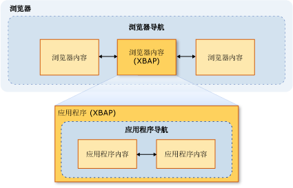

# 安全性 (WPF)
 在开发时 Windows Presentation Foundation (WPF) 独立应用程序和浏览器承载的应用程序，你必须考虑的安全模型。 [!INCLUDE[TLA2#tla_wpf](../../../includes/tla2sharptla-wpf-md.md)] 独立应用程序使用不受限制的权限执行 ( [!INCLUDE[TLA2#tla_cas](../../../includes/tla2sharptla-cas-md.md)] **FullTrust**权限集)、 是否使用 Windows Installer (.msi) XCopy 部署或[!INCLUDE[TLA2#tla_clickonce](../../../includes/tla2sharptla-clickonce-md.md)]。 不支持使用 ClickOnce 部署部分信任的独立 WPF 应用程序。 但是，完全信任主机应用程序可以创建部分信任<xref:System.AppDomain>使用.NET Framework 外接程序模型。 有关详细信息，请参阅[WPF 外接程序概述](../../../docs/framework/wpf/app-development/wpf-add-ins-overview.md)。  
  
 [!INCLUDE[TLA2#tla_wpf](../../../includes/tla2sharptla-wpf-md.md)] 浏览器承载的应用程序托管的[!INCLUDE[TLA#tla_iegeneric](../../../includes/tlasharptla-iegeneric-md.md)]或 Firefox，和可以是[!INCLUDE[TLA#tla_xbap#plural](../../../includes/tlasharptla-xbapsharpplural-md.md)]或松散[!INCLUDE[TLA#tla_xaml](../../../includes/tlasharptla-xaml-md.md)]文档中的详细信息，请参阅[WPF XAML 浏览器应用程序概述](../../../docs/framework/wpf/app-development/wpf-xaml-browser-applications-overview.md)。  
  
 [!INCLUDE[TLA2#tla_wpf](../../../includes/tla2sharptla-wpf-md.md)] 浏览器承载的应用程序在默认情况下，仅限于默认值在部分信任安全沙盒内, 执行[!INCLUDE[TLA2#tla_cas](../../../includes/tla2sharptla-cas-md.md)] **Internet**区域权限集。 这将有效地隔离[!INCLUDE[TLA2#tla_wpf](../../../includes/tla2sharptla-wpf-md.md)]浏览器承载你希望典型 Web 应用程序隔离的相同方式中的客户端计算机的应用程序。 XBAP 最高可以将权限提升到“完全信任”，具体取决于部署 URL 的安全区域和客户端的安全配置。 有关详细信息，请参阅 [WPF 部分信任安全性](../../../docs/framework/wpf/wpf-partial-trust-security.md)。  
  
 本主题讨论 Windows Presentation Foundation (WPF) 独立应用程序和浏览器承载的应用程序的安全模型。  
  
 本主题包含以下各节：  
  
-   [安全导航](#SafeTopLevelNavigation)  
  
-   [Web 浏览软件安全设置](#InternetExplorerSecuritySettings)  
  
-   [WebBrowser 控件和功能控件](#webbrowser_control_and_feature_controls)  
  
-   [对部分受信任的客户端应用程序禁用 APTCA 程序集](#APTCA)  
  
-   [宽松 XAML 文件的沙盒行为](#LooseContentSandboxing)  
  
-   [用于开发可提高安全性的 WPF 应用程序的资源](#BestPractices)  
  
   
## 安全导航  
 有关[!INCLUDE[TLA2#tla_xbap#plural](../../../includes/tla2sharptla-xbapsharpplural-md.md)]，[!INCLUDE[TLA2#tla_wpf](../../../includes/tla2sharptla-wpf-md.md)]区分两种类型的导航： 应用程序和浏览器。  
  
 应用程序导航是指在浏览器托管的应用程序内的内容项之间进行导航。 浏览器导航是指可更改浏览器自身的内容和位置 URL 的导航。 应用程序导航 (通常为 XAML) 和浏览器导航 (通常为 HTML) 之间的关系如下图所示：
  
   
  
 被视为安全的内容类型[!INCLUDE[TLA2#tla_xbap](../../../includes/tla2sharptla-xbap-md.md)]以导航到主要由确定是否使用应用程序导航或浏览器导航。  
  
   
### 应用程序导航安全性  
 被视为安全如果它可以使用打包的标识，应用程序导航[!INCLUDE[TLA2#tla_uri](../../../includes/tla2sharptla-uri-md.md)]，它支持四种类型的内容：  
  
|内容类型|描述|URI 示例|  
|------------------|-----------------|-----------------|  
|资源|添加到项目中的生成类型的文件**资源**。|`pack://application:,,,/MyResourceFile.xaml`|  
|内容|添加到项目中的生成类型的文件**内容**。|`pack://application:,,,/MyContentFile.xaml`|  
|源站点|添加到项目中的生成类型的文件**无**。|`pack://siteoforigin:,,,/MySiteOfOriginFile.xaml`|  
|应用程序代码|具有已编译代码隐藏的 XAML 资源。   -或-   添加到项目中的生成类型的 XAML 文件**页**。|`pack://application:,,,/MyResourceFile` `.xaml`|  
  
> [!NOTE]
>  有关应用程序数据文件和包的详细信息[!INCLUDE[TLA2#tla_uri#plural](../../../includes/tla2sharptla-urisharpplural-md.md)]，请参阅[WPF 应用程序资源、 内容和数据文件](../../../docs/framework/wpf/app-development/wpf-application-resource-content-and-data-files.md)。  
  
 可以由用户导航到这些内容类型的文件，也可以通过编程方式导航到这些内容类型的文件：  
  
-   **用户导航**。 用户可通过单击导航<xref:System.Windows.Documents.Hyperlink>元素。  
  
-   **编程导航**。 应用程序而无需干预的用户，例如，通过设置导航<xref:System.Windows.Navigation.NavigationWindow.Source%2A?displayProperty=nameWithType>属性。  
  
   
### 浏览器导航安全性  
 浏览器导航仅在以下条件下被视为安全：  
  
-   **用户导航**。 用户可通过单击导航<xref:System.Windows.Documents.Hyperlink>在主内的元素<xref:System.Windows.Navigation.NavigationWindow>、 不是在嵌套<xref:System.Windows.Controls.Frame>。  
  
-   **区域**。 要导航到的内容位于 Internet 或本地 Intranet 上。  
  
-   **协议**。 正在使用的协议是**http**， **https**，**文件**，或**mailto**。  
  
 如果[!INCLUDE[TLA2#tla_xbap](../../../includes/tla2sharptla-xbap-md.md)]尝试导航到内容不符合这些条件的方式<xref:System.Security.SecurityException>引发。  
  
   
## Web 浏览软件安全设置  
 计算机上的安全设置决定了任何 Web 浏览软件被授予的访问权限。 Web 浏览软件包括任何应用程序或组件，它使用[WinINet](http://go.microsoft.com/fwlink/?LinkId=179379)或[UrlMon](http://go.microsoft.com/fwlink/?LinkId=179383) Api，包括 Internet Explorer 和 PresentationHost.exe。  
  
 [!INCLUDE[TLA2#tla_iegeneric](../../../includes/tla2sharptla-iegeneric-md.md)] 提供了你可以依据配置允许通过或从要执行的功能的机制[!INCLUDE[TLA2#tla_iegeneric](../../../includes/tla2sharptla-iegeneric-md.md)]，其中包括：  
  
-   .NET framework 依赖于组件  
  
-   ActiveX 控件和插件  
  
-   下载  
  
-   脚本  
  
-   用户身份验证  
  
 可以在这种方式保护的功能的集合配置为基于每个区域**Internet**， **Intranet**，**受信任的站点**，和**受限站点**区域。 以下步骤描述如何配置安全设置：  
  
1.  打开“控制面板” 。  
  
2.  单击**网络和 Internet** ，然后单击**Internet 选项**。  
  
     将显示“Internet 选项”对话框。  
  
3.  上**安全**选项卡上，选择要配置的安全设置的区域。  
  
4.  单击**自定义级别**按钮。  
  
     **安全设置**对话框随即出现，并且你可以配置为所选区域的安全设置。  
  
       
  
> [!NOTE]
>  也可以从 Internet Explorer 中进入“Internet 选项”对话框。 单击**工具**，然后单击**Internet 选项**。  
  
 从开始[!INCLUDE[TLA#tla_ie7](../../../includes/tlasharptla-ie7-md.md)]，专门为.NET Framework 的以下安全设置将包括：  
  
-   **宽松 XAML**。 控件是否[!INCLUDE[TLA2#tla_iegeneric](../../../includes/tla2sharptla-iegeneric-md.md)]可以导航到并丢失[!INCLUDE[TLA2#tla_xaml](../../../includes/tla2sharptla-xaml-md.md)]文件。 （“启用”、“禁用”和“提示”选项）。  
  
-   **XAML 浏览器应用程序**。 控件是否[!INCLUDE[TLA2#tla_iegeneric](../../../includes/tla2sharptla-iegeneric-md.md)]可以导航到并运行[!INCLUDE[TLA2#tla_xbap#plural](../../../includes/tla2sharptla-xbapsharpplural-md.md)]。 （“启用”、“禁用”和“提示”选项）。  
  
 默认情况下，这些设置所有启用了**Internet**，**本地 intranet**，和**受信任的站点**区域，和已禁用**受限站点**区域。  
  
   
### 与安全相关的 WPF 注册表设置  
 除了可通过“Internet 选项”设置的安全设置之外，还可以通过设置以下注册表值有选择地阻止许多安全敏感 WPF 功能。 这些值在以下注册表项下定义：  
  
 `HKEY_LOCAL_MACHINE\SOFTWARE\Microsoft\.NETFramework\Windows Presentation Foundation\Features`  
  
 下表列出了可以设置的值。  
  
|值名称|值类型|值数据|  
|----------------|----------------|----------------|  
|XBAPDisallow|REG_DWORD|1 为禁止；0 为允许。|  
|LooseXamlDisallow|REG_DWORD|1 为禁止；0 为允许。|  
|WebBrowserDisallow|REG_DWORD|1 为禁止；0 为允许。|  
|MediaAudioDisallow|REG_DWORD|1 为禁止；0 为允许。|  
|MediaImageDisallow|REG_DWORD|1 为禁止；0 为允许。|  
|MediaVideoDisallow|REG_DWORD|1 为禁止；0 为允许。|  
|ScriptInteropDisallow|REG_DWORD|1 为禁止；0 为允许。|  
  
   
## WebBrowser 控件和功能控件  
 WPF<xref:System.Windows.Controls.WebBrowser>控件可用来承载 Web 内容。 WPF<xref:System.Windows.Controls.WebBrowser>控件换行的基础的 WebBrowser ActiveX 控件。 WPF 提供了一些支持，用于保护你的应用程序，当你使用 WPF<xref:System.Windows.Controls.WebBrowser>控件来承载不受信任的 Web 内容。 但是，某些安全功能必须将应用直接由应用程序使用<xref:System.Windows.Controls.WebBrowser>控件。 WebBrowser ActiveX 控件有关的详细信息，请参阅[WebBrowser 控件概述和教程](http://go.microsoft.com/fwlink/?LinkId=179388)。  
  
> [!NOTE]
>  本部分还适用于<xref:System.Windows.Controls.Frame>控制，因为它使用<xref:System.Windows.Controls.WebBrowser>以导航到 HTML 内容。  
  
 如果 WPF<xref:System.Windows.Controls.WebBrowser>控件用于承载不受信任的 Web 内容，你的应用程序应使用部分信任<xref:System.AppDomain>有助于防止潜在的恶意 HTML 脚本代码中应用程序代码。 如果你的应用程序与托管的脚本进行交互使用尤其如此<xref:System.Windows.Controls.WebBrowser.InvokeScript%2A>方法和<xref:System.Windows.Controls.WebBrowser.ObjectForScripting%2A>属性。 有关详细信息，请参阅[WPF 外接程序概述](../../../docs/framework/wpf/app-development/wpf-add-ins-overview.md)。  
  
 如果你的应用程序使用 WPF<xref:System.Windows.Controls.WebBrowser>控件，提高安全性并减少攻击另一个方法是，若要启用 Internet Explorer 功能控件。 功能控件是 Internet Explorer，允许管理员和开发人员配置 Internet Explorer 和 WebBrowser ActiveX 控件承载的应用程序的功能补充的 WPF<xref:System.Windows.Controls.WebBrowser>控制包装。 可以使用配置功能控件[CoInternetSetFeatureEnabled](http://go.microsoft.com/fwlink/?LinkId=179394)函数或通过更改注册表中的值。 有关功能控件的详细信息，请参阅[功能控件简介](http://go.microsoft.com/fwlink/?LinkId=179390)和[Internet 功能控件](http://go.microsoft.com/fwlink/?LinkId=179392)。  
  
 如果你正在开发的独立 WPF 应用程序使用 WPF<xref:System.Windows.Controls.WebBrowser>控件，WPF 会自动启用以下功能控制你的应用程序。  
  
|功能控件|  
|---------------------|  
|FEATURE_MIME_HANDLING|  
|FEATURE_MIME_SNIFFING|  
|FEATURE_OBJECT_CACHING|  
|FEATURE_SAFE_BINDTOOBJECT|  
|FEATURE_WINDOW_RESTRICTIONS|  
|FEATURE_ZONE_ELEVATION|  
|FEATURE_RESTRICT_FILEDOWNLOAD|  
|FEATURE_RESTRICT_ACTIVEXINSTALL|  
|FEATURE_ADDON_MANAGEMENT|  
|FEATURE_HTTP_USERNAME_PASSWORD_DISABLE|  
|FEATURE_SECURITYBAND|  
|FEATURE_UNC_SAVEDFILECHECK|  
|FEATURE_VALIDATE_NAVIGATE_URL|  
|FEATURE_DISABLE_TELNET_PROTOCOL|  
|FEATURE_WEBOC_POPUPMANAGEMENT|  
|FEATURE_DISABLE_LEGACY_COMPRESSION|  
|FEATURE_SSLUX|  
  
 由于这些功能控件是无条件启用的，因此它们可能会对完全信任的应用程序造成损害。 在这种情况下，如果特定应用程序及其承载的内容没有安全风险，则可以禁用相应的功能控件。  
  
 通过实例化 WebBrowser ActiveX 对象的过程将应用功能控制。 因此，如果要创建可导航到不受信任的内容的独立应用程序，则应该认真考虑启用附加功能控件。  
  
> [!NOTE]
>  此建议是根据 MSHTML 和 SHDOCVW 主机安全性的一般性建议提出的。 有关详细信息，请参阅[MSHTML 主机安全性常见问题： 第 I 部分的 II](http://go.microsoft.com/fwlink/?LinkId=179396)和[MSHTML 主机安全性常见问题： 第 ii 部分的 ii 部分](http://go.microsoft.com/fwlink/?LinkId=179415)。  
  
 对于可执行文件，请考虑通过将注册表值设置为 1 来启用以下功能控件。  
  
|功能控件|  
|---------------------|  
|FEATURE_ACTIVEX_REPURPOSEDETECTION|  
|FEATURE_BLOCK_LMZ_IMG|  
|FEATURE_BLOCK_LMZ_OBJECT|  
|FEATURE_BLOCK_LMZ_SCRIPT|  
|FEATURE_RESTRICT_RES_TO_LMZ|  
|FEATURE_RESTRICT_ABOUT_PROTOCOL_IE7|  
|FEATURE_SHOW_APP_PROTOCOL_WARN_DIALOG|  
|FEATURE_LOCALMACHINE_LOCKDOWN|  
|FEATURE_FORCE_ADDR_AND_STATUS|  
|FEATURE_RESTRICTED_ZONE_WHEN_FILE_NOT_FOUND|  
  
 对于可执行文件，请考虑通过将注册表值设置为 0 来禁用以下功能控件。  
  
|功能控件|  
|---------------------|  
|FEATURE_ENABLE_SCRIPT_PASTE_URLACTION_IF_PROMPT|  
  
 如果运行部分信任[!INCLUDE[TLA#tla_xbap](../../../includes/tlasharptla-xbap-md.md)]包括 WPF<xref:System.Windows.Controls.WebBrowser>中控制[!INCLUDE[TLA#tla_iegeneric](../../../includes/tlasharptla-iegeneric-md.md)]，WPF 承载 Internet Explorer 进程的地址空间中的 WebBrowser ActiveX 控件。 由于 WebBrowser ActiveX 控件承载在[!INCLUDE[TLA2#tla_iegeneric](../../../includes/tla2sharptla-iegeneric-md.md)]进程，所有 Internet Explorer 的功能控件也已启用了 WebBrowser ActiveX 控件。  
  
 与普通的独立应用程序相比，运行于 Internet Explorer 中的 XBAP 还将另外获得一层安全保护。 此附加的安全性是因为 Internet Explorer 和 WebBrowser ActiveX 控件，因此在运行受保护模式下，默认情况下上,[!INCLUDE[TLA#tla_winvista](../../../includes/tlasharptla-winvista-md.md)]和[!INCLUDE[win7](../../../includes/win7-md.md)]。 有关受保护的模式的详细信息，请参阅[了解和使用受保护模式 Internet 资源管理器](http://go.microsoft.com/fwlink/?LinkId=179393)。  
  
> [!NOTE]
>  如果你尝试运行包括 WPF XBAP<xref:System.Windows.Controls.WebBrowser>在 Firefox 中，在 Internet 区域中，控件<xref:System.Security.SecurityException>将引发。 这是由于 WPF 安全策略造成的。  
  
   
## 对部分受信任的客户端应用程序禁用 APTCA 程序集  
 当托管程序集安装到[!INCLUDE[TLA#tla_gac](../../../includes/tlasharptla-gac-md.md)]，它们成为完全受信任的因为用户必须提供显式权限，将其安装。 因为这些程序集是完全受信任的，所以只有完全受信任的托管客户端应用程序才可以使用它们。 若要允许部分受信任的应用程序以使用它们，它们必须标记为<xref:System.Security.AllowPartiallyTrustedCallersAttribute>(APTCA)。 仅当程序集经过测试，可在部分信任的情况下安全执行时，才应该为其标记此特性。  
  
 但是，很可能 APTCA 程序集安装到后出现安全漏洞[!INCLUDE[TLA2#tla_gac](../../../includes/tla2sharptla-gac-md.md)]。 一旦发现安全漏洞，程序集发布者可以生成安全更新来修复现有安装上的问题，还可以阻止问题发现后进行的安装操作。 其中一个更新选项是卸载程序集，即使这可能中断使用该程序集的其他完全受信任的客户端应用程序。  
  
 [!INCLUDE[TLA2#tla_wpf](../../../includes/tla2sharptla-wpf-md.md)] 提供对于部分受信任，则可以禁用依据 APTCA 程序集的机制[!INCLUDE[TLA2#tla_xbap#plural](../../../includes/tla2sharptla-xbapsharpplural-md.md)]而无需卸载 APTCA 的程序集。  
  
 若要禁用 APTCA 程序集，必须创建一个特殊的注册表项：  
  
 `HKEY_LOCAL_MACHINE\SOFTWARE\Microsoft\.NETFramework\policy\APTCA\<AssemblyFullName>, FileVersion=<AssemblyFileVersion>`  
  
 示例如下：  
  
 `HKEY_LOCAL_MACHINE\SOFTWARE\Microsoft\.NETFramework\policy\APTCA\aptcagac, Version=1.0.0.0, Culture=neutral, PublicKeyToken=215e3ac809a0fea7, FileVersion=1.0.0.0`  
  
 此项建立 APTCA 程序集的条目。 还必须在此项中创建值来启用或禁用程序集。 下面是该值的详细信息：  
  
-   值名称： **APTCA_FLAG**。  
  
-   值类型： **REG_DWORD**。  
  
-   值数据： **1**禁用;**0**启用。  
  
 如果必须为部分受信任的客户端应用程序禁用某程序集，可以编写一个用于创建注册表项和值的更新。  
  
> [!NOTE]
>  核心.NET Framework 程序集不受这种方式禁用它们，因为它们所需的托管应用程序运行。 对禁用 APTCA 程序集的支持主要面向第三方应用程序。  
  
   
## 宽松 XAML 文件的沙盒行为  
 松散[!INCLUDE[TLA2#tla_xaml](../../../includes/tla2sharptla-xaml-md.md)]文件是不依赖于任何代码隐藏、 事件处理程序或应用程序特定的程序集的仅限标记的 XAML 文件。 当丢失[!INCLUDE[TLA2#tla_xaml](../../../includes/tla2sharptla-xaml-md.md)]文件直接从浏览器导航到，它们是在默认 Internet 区域权限集所基于的安全沙盒中加载。  
  
 但是，安全行为是不同时松散[!INCLUDE[TLA2#tla_xaml](../../../includes/tla2sharptla-xaml-md.md)]文件从导航到<xref:System.Windows.Navigation.NavigationWindow>或<xref:System.Windows.Controls.Frame>独立应用程序中。  
  
 在这两种情况下，松散[!INCLUDE[TLA2#tla_xaml](../../../includes/tla2sharptla-xaml-md.md)]导航到的文件将继承其主机应用程序的权限。 但是，此行为可能不需要从安全角度看，尤其是当一个松散[!INCLUDE[TLA2#tla_xaml](../../../includes/tla2sharptla-xaml-md.md)]文件由不受信任或未知的实体生成。 此类型的内容被称为*外部内容*，并且两个<xref:System.Windows.Controls.Frame>和<xref:System.Windows.Navigation.NavigationWindow>可以配置为隔离导航到它时。 通过设置来实现隔离**SandboxExternalContent**属性设置为 true 中的以下示例所示<xref:System.Windows.Controls.Frame>和<xref:System.Windows.Navigation.NavigationWindow>:  
  
 [!code-xaml[SecurityOverviewSnippets#FrameMARKUP](../../../samples/snippets/csharp/VS_Snippets_Wpf/SecurityOverviewSnippets/CS/Window2.xaml#framemarkup)]  
  
 [!code-xaml[SecurityOverviewSnippets#NavigationWindowMARKUP](../../../samples/snippets/csharp/VS_Snippets_Wpf/SecurityOverviewSnippets/CS/Window1.xaml#navigationwindowmarkup)]  
  
 使用此设置，外部内容将加载到不同于承载应用程序的进程的进程中。 此进程被限制在默认 Internet 区域权限集中，从而有效地将其与承载应用程序和客户端计算机隔离。  
  
> [!NOTE]
>  即使导航到宽松[!INCLUDE[TLA2#tla_xaml](../../../includes/tla2sharptla-xaml-md.md)]文件从<xref:System.Windows.Navigation.NavigationWindow>或<xref:System.Windows.Controls.Frame>在独立的应用程序实现的是基于承载基础结构，涉及 PresentationHost 过程中，WPF 浏览器安全级别略微小于内容时直接在 Internet Explorer 中加载上[!INCLUDE[wiprlhext](../../../includes/wiprlhext-md.md)]和[!INCLUDE[win7](../../../includes/win7-md.md)]（将仍能通过 PresentationHost）。 这是因为使用 Web 浏览器的独立 WPF 应用程序不提供 Internet Explorer 的额外“保护模式”安全功能。  
  
   
## 用于开发可提高安全性的 WPF 应用程序的资源  
 以下是一些可帮助开发的其他资源[!INCLUDE[TLA2#tla_wpf](../../../includes/tla2sharptla-wpf-md.md)]提高安全性的应用程序：  
  
|区域|资源|  
|----------|--------------|  
|托管代码|[应用程序的模式和实践安全指南](http://go.microsoft.com/fwlink/?LinkId=117426)|  
|[!INCLUDE[TLA2#tla_cas](../../../includes/tla2sharptla-cas-md.md)]|[代码访问安全性](../../../docs/framework/misc/code-access-security.md)|  
|[!INCLUDE[TLA2#tla_clickonce](../../../includes/tla2sharptla-clickonce-md.md)]|[ClickOnce 安全和部署](/visualstudio/deployment/clickonce-security-and-deployment)|  
|[!INCLUDE[TLA2#tla_wpf](../../../includes/tla2sharptla-wpf-md.md)]|[WPF 部分信任安全](../../../docs/framework/wpf/wpf-partial-trust-security.md)|  
  
## 请参阅  
 [WPF 部分信任安全](../../../docs/framework/wpf/wpf-partial-trust-security.md)  
 [WPF 安全策略 - 平台安全性](../../../docs/framework/wpf/wpf-security-strategy-platform-security.md)  
 [WPF 安全策略 - 安全工程](../../../docs/framework/wpf/wpf-security-strategy-security-engineering.md)  
 [应用程序的模式和实践安全指南](http://go.microsoft.com/fwlink/?LinkId=117426)  
 [代码访问安全性](../../../docs/framework/misc/code-access-security.md)  
 [ClickOnce 安全和部署](/visualstudio/deployment/clickonce-security-and-deployment)  
 [XAML 概述 (WPF)](../../../docs/framework/wpf/advanced/xaml-overview-wpf.md)
