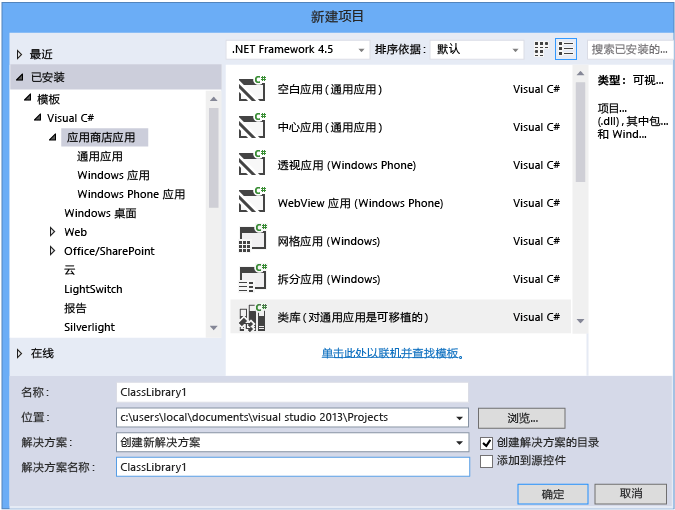
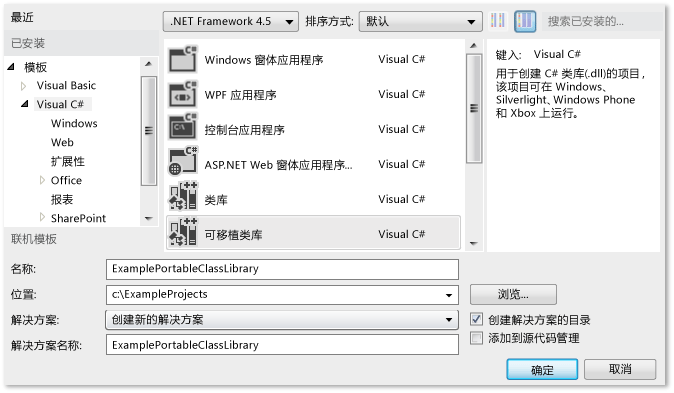
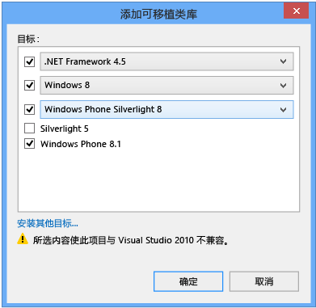
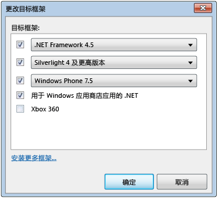
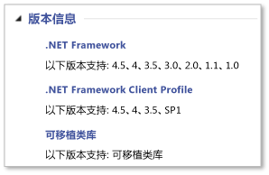

# 使用可移植类库的跨平台开发
Visual Studio 中 .NET Framework 可移植类库项目类型可帮助你快速轻松地为 Microsoft 平台构建跨平台应用和库。  
  
 可移植类库可以帮助你减少开发和测试代码的时间和成本。 使用此项目类型编写和构建可移植 .NET Framework 程序集，然后从面向多个平台（如 Windows 和 Windows Phone）的应用，引用这些程序集。  
  
 即使是在 Visual Studio 中创建可移植类库项目并开始开发它之后，你仍然可以更改目标平台。 Visual Studio 将使用新的程序集编译你的库，这可帮助识别你需要在代码中进行的更改。  
  
 本文讨论了 Visual Studio 中的应用开发，但 Microsoft 还提供了可用于在其他工具（如 Xamarin）中开发应用和库的可移植类库引用程序集。 可以在非 Microsoft 平台的任何基于 .NET Framework 运行时上使用这些应用和库。 有关引用程序集的详细信息，请参阅博客文章[可移植类库 (PCL) 现在在所有平台上可用](http://blogs.msdn.com/b/dotnet/archive/2013/10/14/portable-class-library-pcl-now-available-on-all-platforms.aspx)。 若要下载该程序集，请参阅[Microsoft.NET 可移植库引用程序集](http://www.microsoft.com/download/details.aspx?id=40727)中从 Microsoft 下载中心获得。 有关如何在 Xamarin 中使用程序集的详细信息，请参阅博客文章[PCL 和.NET NuGet 库现在已为 Xamarin 启用](http://blogs.msdn.com/b/dotnet/archive/2013/11/13/pcl-and-net-nuget-libraries-are-now-enabled-for-xamarin.aspx)。  
  
 Visual Studio 提供了帮助你使用可移植类库进行开发的模板。 根据你正在使用的 Visual Studio 版本，可用的模板和菜单可能会与本文中所述的有所不同。  
  
> [!WARNING]
>  [Visual Studio 2013 Update 2](http://go.microsoft.com/fwlink/p/?LinkId=393658)包括对可移植类库模板的更新。 如果您是较早版本的 Visual Studio 和 Visual Studio 2013 安装在同一台计算机，然后再安装 Update 2 中，对更改**目标框架**选择将应用于这两个版本的 Visual Studio。  
  
 在本主题中：  
  
 [Visual Studio 支持](#vs_support)   
 [创建可移植类库项目](#create_pcl)   
 [目标选项](#platforms)   
 [更改目标](#change_targets)   
 [支持的功能](#features)   
 [支持的类型和成员](#members)   
 [可移植类库中的 API 差异](#API_diff)   
 [使用可移植类库](#using)  
  
<a name="vs_support"></a>   
## <a name="visual-studio-support"></a>Visual Studio 支持  
 对可移植类库的 Visual Studio 支持取决于你正在使用的 Visual Studio 的版本。 在某些情况下，你将拥有所需的一切，而在其他情况下，你将需要安装其他的项目，如下表所示。  
  
|Visual Studio SKU|对创建可移植类库的支持|  
|-----------------------|---------------------------------------------------|  
|Visual Studio 2010 专业版、高级专业版或旗舰版|是，当你安装[可移植库工具](http://go.microsoft.com/fwlink/?LinkId=210823)。|  
|Visual Studio Express 2010 版|不是。|  
|Visual Studio 2012 专业版、高级专业版或旗舰版|可以。 有关手机支持安装[Windows Phone SDK 8.0](http://go.microsoft.com/fwlink/?LinkId=265772)。|  
|Visual Studio Express 2012 版|不是。|  
|Visual Studio 2013 专业版、高级专业版或旗舰版|可以。 对于 Windows Phone 8.1 支持，请安装[Visual Studio 2013 Update 2](http://go.microsoft.com/fwlink/p/?LinkId=393658)。|  
|Visual Studio Express 2013 for Windows|是，当你安装[最新版本的 Visual Studio Express](http://go.microsoft.com/fwlink/p/?LinkId=394629)，包括 Update 2 中，或添加[Visual Studio 2013 Update 2](http://go.microsoft.com/fwlink/p/?LinkId=393658)。|  
  
<a name="create_pcl"></a>   
## <a name="creating-a-portable-class-library-project"></a>创建可移植类库项目  
 若要创建可移植类库，你应该使用 Visual Studio 中提供的模板之一。 创建一个新项目，然后在**新项目**对话框中，在**模板**，选择您的目标语言 （C# 或 Visual Basic 中），，然后选择你想要针对的平台之一。 可在下一步选择附加的平台。  
  
 在 Visual Studio 2013 Update 2，您可以选择**类库 （可移植）**为所选的语言和平台来创建可移植类库模板。 你将看到面向以下平台的此模板：  
  
-   应用商店应用  
  
-   Windows 桌面  
  
-   Silverlight  
  
 如果你想要在 C# 中创建库来面向 Windows Phone 8.1 和 Windows 8.1，则可以选择**应用商店应用**，然后选择**类库 （可为通用应用移植）**。  
  
   
  
 此模板自动选择 Windows 8.1 和 Windows Phone 8.1 作为目标。 如果你创建的库仅针对 Windows Phone 8.1 或 Windows 8.1，则可以更改目标平台并在以后添加平台。  
  
 如果您使用 Visual Studio 2012 或没有 Update 2 的 Visual Studio 2013，您将创建一个新项目并选择**可移植类库**Visual C# 或 Visual Basic 下的模板。  
  
   
  
 **添加可移植类库**出现对话框，并可以选择附加的平台。 该对话框将基于你所选的目标向你提供兼容性警告。  
  
   
为 Visual Studio 2013 Update 2 添加可移植类库对话框  
  
 无论是使用 Visual Studio 2012 还是使用 Visual Studio 2013，你都可以在创建可移植类库项目时选择平台，或在创建项目之后使用项目属性来修改目标平台。  
  
<a name="platforms"></a>   
## <a name="target-options"></a>目标选项  
 在创建可移植类库项目时，可以选择操作系统以及你想要针对的 NET Framework 版本。 如果您使用 Visual Studio 2013 和已安装 Update 2 或更高版本，可选择**类库 （可为通用应用移植）**模板来创建面向 Windows 8.1 和 Windows Phone 8.1 可移植类库。 下表显示了可用的目标，具体取决于你使用的 Visual Studio 版本。  
  
|||||  
|-|-|-|-|  
|目标选项|Visual Studio 2012|Visual Studio 2013|Visual Studio 2013 Update 2 或更高版本|  
|.NET Framework|.NET framework 4 和更高版本<br /><br /> .NET framework 4.0.3 和更高版本<br /><br /> .NET framework 4.5|.NET framework 4 和更高版本<br /><br /> .NET framework 4.0.3 和更高版本<br /><br /> .NET framework 4.5 和更高版本<br /><br /> .NET framework 4.5.1|.NET framework 4<br /><br /> .NET framework 4.0.3<br /><br /> .NET framework 4.5<br /><br /> .NET framework 4.5.1|  
|Windows Phone|-Windows Phone 7 及更高版本<br /><br /> -Windows Phone 7.5 和更高版本<br /><br /> -Windows Phone 8|-Windows Phone 8|-Windows Phone Silverlight 8<br /><br /> -Windows Phone Silverlight 8.1<br /><br /> 对于 Windows 运行时和 XAML 支持，请选择：<br /><br /> -Windows Phone 8.1|  
|Windows 应用商店|.NET Windows 应用商店应用|Windows 应用商店应用程序 (Windows 8) 及更高版本<br /><br /> Windows 应用商店应用程序 (Windows 8.1)|Windows 8<br /><br /> Windows 8.1|  
|Silverlight|-Silverlight 4 和更高版本<br /><br /> Silverlight 5|Silverlight 5|Silverlight 5|  
|Xbox|-Xbox 360|不可用|不可用|  
  
<a name="change_targets"></a>   
## <a name="changing-targets"></a>更改目标  
 在你选择可移植类库模板时，已为你选择了默认平台，但这些默认平台将有所不同，具体取决于你安装的 Visual Studio 版本以及你以前选中的目标。 你可以在创建可移植类库时或在开始开发可移植类库后，更改这些平台。  
  
 如果你想要更改这些目标，在创建您的项目之后,**解决方案资源管理器**，打开 （不是解决方案），您可移植类库项目的快捷菜单，然后选择**属性**。 在项目属性页上，**库**选项卡显示您的项目当前针对的平台。  
  
   
用于 Visual Studio 2013 Update 2 的可移植类库属性页  
  
 若要添加或移除目标，请选择**更改**按钮，然后选择和清除相应的复选框。  
  
 在你更改目标时，供你在开发项目时使用的 API 也将发生更改以匹配你的选择。 Visual Studio 报告因目标更改而可能导致的错误和警告。  
  
 如果您想要评估的可移植性的程序集之前在 Visual Studio 中进行更改，可以使用[.NET Portability Analyzer](http://visualstudiogallery.msdn.microsoft.com/1177943e-cfb7-4822-a8a6-e56c7905292b)。  
  
 菜单选项将有所不同，具体取决于你使用的 Visual Studio 版本。  
  
   
更改 Visual Studio 2012 中的目标对话框  
  
<a name="features"></a>   
## <a name="supported-features"></a>支持的功能  
 下表显示了各可用平台和版本上支持的功能。 在某些情况下，Microsoft 已通过发布的 NuGet 包添加了支持功能，并且这已为用户所了解。 适用于.NET Framework NuGet 程序包的详细信息，请参阅[.NET Framework 和带外版本](../../../docs/framework/get-started/the-net-framework-and-out-of-band-releases.md)。  
  
|功能|.NET Framework|.NET Framework|.NET Framework|Windows 应用商店|Windows 应用商店|Windows Phone 应用商店|Windows Phone Silverlight|Windows Phone Silverlight|Windows Phone Silverlight|Silverlight|Silverlight|Xbox 360|  
|-------------|--------------------|--------------------|--------------------|-------------------|-------------------|-------------------------|-------------------------------|-------------------------------|-------------------------------|-----------------|-----------------|--------------|  
||**4**|**4.0.3**|**4.5**|**8**|**8.1**|**8.1**|**7.5**|**8**|**8.1**|**4**|**5**||  
|核心库|✓|✓|✓|✓|✓|✓|✓|✓|✓|✓|✓|✓|  
|异步支持|➊|➊|✓|✓|✓|✓|➊|➊|✓|➊|➊||  
|压缩|||✓|✓|✓|✓||➋|➋||||  
|数据注释||✓|✓|✓|✓|||||✓|✓||  
|动态关键字|✓|✓|✓|✓|✓|||||✓|✓||  
|HTTPClient|➌|➌|✓|✓|✓|✓|➌|➌|➌|➌|➌||  
|IQueryable|✓|✓|✓|✓|✓|✓|✓|✓|✓|✓|✓||  
|语言集成查询 (LINQ)|✓|✓|✓|✓|✓|✓|✓|✓|✓|✓|✓||  
|Managed Extensibility Network (MEF)|✓|✓|✓|✓|✓|||||✓|✓||  
|网络类库 (NCL)|✓|✓|✓|✓|✓|✓|✓|✓|✓|✓|✓||  
|序列化（数据协定、XML 和 JSON）|✓|✓|✓|✓|✓|✓|✓|✓|✓|✓|✓||  
|System.Numerics|✓|✓|✓|✓|✓|||||✓|✓||  
|视图模型 (MVVM)|||✓|✓|✓|✓|✓|✓|✓|✓|✓||  
|Windows Communication Foundation (WCF)|✓|✓|✓|✓|✓||✓|✓|✓|✓|✓||  
|Windows 运行时 API|||||✓|✓|||||||  
|Windows.UI.XAML|||||✓|✓|||||||  
|XLINQ||✓|✓|✓|✓|✓|✓|✓|✓|✓|✓|✓|  
  
 ➊ 要求[Microsoft Async](https://www.nuget.org/packages/Microsoft.Bcl.Async/)包  
 ➋ 要求[Microsoft 压缩](https://www.nuget.org/packages/Microsoft.Bcl.Compression)包  
 ➌ 要求[Microsoft HTTP 客户端库](http://www.nuget.org/packages/Microsoft.Net.Http)包  
  
> [!WARNING]
>  当你引用时，可能会遇到错误[Microsoft 压缩](https://www.nuget.org/packages/Microsoft.Bcl.Compression)和[Microsoft HTTP 客户端库](http://www.nuget.org/packages/Microsoft.Net.Http)使用一个 Windows Phone Silverlight 8.1 应用程序的可移植库中的包。 有关详细信息，请参阅[平台兼容性和重大更改 Windows Phone Silverlight 8.1 应用程序](http://go.microsoft.com/fwlink/p/?LinkId=394744)。  
  
<a name="members"></a>   
## <a name="supported-types-and-members"></a>支持的类型和成员  
 可移植类库项目中可用的类型和成员受若干兼容性因素的约束：  
  
-   它们必须在所选各目标之间共享。  
  
-   它们必须在这些目标上具有类似的行为方式。  
  
-   它们不能是要弃用的候选项。  
  
-   它们必须在可移植环境中有意义，特别是在支持成员不可移植时。  
  
 例如，只有当你针对 Windows 8.1 和 Windows Phone 8.1 时，可移植类库才会包含与 UI 相关的类型。 此外，如果针对的是在引入可移植类库之前发布的平台（如 Xbox、.NET Framework 4 和 Windows Phone 7），那么你可能会遇到一些限制。 .NET Framework 通过 NuGet 发布的程序包，可改进对某些较旧版本的可移植类库支持。 有关详细信息和 NuGet 包的列表，请参阅[.NET Framework 和带外版本](../../../docs/framework/get-started/the-net-framework-and-out-of-band-releases.md)。  
  
 如果一个成员在可移植类库和所选的目标中受支持，它将会你的 IntelliSense 项目中出现。 此外，可移植类库图标成员表中出现在[.NET Framework 类库](http://go.microsoft.com/fwlink/?LinkId=211358)受支持成员旁边。 例如，下面的成员表显示<xref:System.String.Chars%2A>中的属性<xref:System.String>类可移植的类库中受支持︰  
  
   
可移植类库图标  
  
 您还可以查看**版本信息**部分中的一个注释，指示在可移植类库项目中支持的类型或成员参考主题︰  
  
   
版本信息示例  
  
 但是，请记住某一 API 可能在可移植类库中受支持，但你是否可以使用该 API ​​取决于你选择的目标。  
  
<a name="API_diff"></a>   
## <a name="api-differences-in-the-portable-class-library"></a>可移植类库中的 API 差异  
 为了使可移植类库程序集在所有支持的平台中都兼容，可移植类库中对部分成员进行了轻微更改。  
  
<a name="using"></a>   
## <a name="using-the-portable-class-library"></a>使用可移植类库  
 构建可移植类库项目后，只需从其他项目中引用它即可。 可以引用该项目或包含你要访问的类的特定程序集。  
  
 若要运行引用可移植类库程序集的应用，必须在计算机上安装所需版本（或更高版本）的目标平台。 Visual Studio 包含所有必需的框架，因此你无需进一步修改即可在用来开发应用的计算机上运行该应用。  
  
### <a name="deploying-a-windows-store-or-windows-phone-app"></a>部署 Windows 应用商店或 Windows Phone 应用  
 当你创建引用可移植类库程序集的 Windows 应用商店或 Windows Phone 应用时，部署该应用所需的一切皆包含在该应用包中，且无需执行进一步的步骤。  
  
### <a name="deploying-a-net-framework-app"></a>部署 .NET Framework 应用  
 部署引用可移植类库程序集的 .NET Framework 应用时，你必须指定一个对 .NET Framework 正确版本的依赖项。 通过指定此依赖项，可确保与你的应用程序一起安装所需的版本。 如果针对.NET Framework 4 或更高版本，计算机必须具有与.NET Framework 4[更新](http://go.microsoft.com/fwlink/?LinkId=210824)，.NET Framework 4 或.NET Framework 4.5 安装的 4.0.3 版更新。  
  
-   若要创建 ClickOnce 部署的依赖项︰ 在**解决方案资源管理器**，选择想要发布的项目的项目节点。 （这是引用了可移植类库项目的项目）在菜单栏上依次选择**项目**，**属性**，然后选择**发布**选项卡。 在**发布**页上，选择**先决条件**。 选择所需 .NET framework 版本（或 .NET Framework 4 更新）作为系统必备组件。  
  
-   若要创建安装项目的依赖项︰ 在**解决方案资源管理器**，选择安装项目。 在菜单栏上依次选择**项目**，**属性**，**先决条件**。 选择所需 .NET Framework 版本作为系统必备组件。  
  
 有关部署.NET Framework 应用程序的详细信息，请参阅[开发人员部署指南](../../../docs/framework/deployment/deployment-guide-for-developers.md)。  
  
### <a name="deploying-a-silverlight-based-app"></a>部署基于 Silverlight 的应用  
 当部署引用可移植类库程序集的基于 Silverlight 的应用时，必须确保该应用所需的最低运行时版本与其目标版本相匹配。 如果针对 Silverlight 4，则版本必须是 4.0.60129.0 或更高版本。 你可以在承载基于 Silverlight 的应用的网页中包括 `<param name="minRuntimeVersion" value="4.0.60129.0" />`，从而设置版本（如下所示）：  
  
```xaml  
<div id="silverlightControlHost">  
    <object data="data:application/x-silverlight-2,"   
           type="application/x-silverlight-2" width="100%" height="100%">  
    <param name="source" value="ClientBin/SilverlightApplication.xap"/>  
    <param name="onError" value="onSilverlightError" />  
    <param name="background" value="white" />  
    <param name="minRuntimeVersion" value="4.0.60129.0" />  
    <param name="autoUpgrade" value="true" />  
    <a href="http://go.microsoft.com/fwlink/?LinkID=149156&v=4.0.50826.0"   
             style="text-decoration:none">  
        
    </a>  
  </object>  
   <iframe id="_sl_historyFrame"   
              style="visibility:hidden;height:0px;width:0px;border:0px">  
   </iframe>  
</div>  
  
```  
  
## <a name="see-also"></a>另请参阅  
 [可移植类库与 MVVM 配合使用](../../../docs/standard/cross-platform/using-portable-class-library-with-model-view-view-model.md)   
 [面向多个平台的库的应用程序资源](../../../docs/standard/cross-platform/app-resources-for-libraries-that-target-multiple-platforms.md)   
 [.NET portability Analyzer](http://visualstudiogallery.msdn.microsoft.com/1177943e-cfb7-4822-a8a6-e56c7905292b)   
 [.NET framework 对 Windows 应用商店应用和 Windows 运行时支持](../../../docs/standard/cross-platform/support-for-windows-store-apps-and-windows-runtime.md)   
 [部署](../../../docs/framework/deployment/net-framework-and-applications.md)