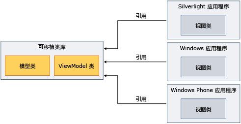

# 将可移植类库与模型-视图-视图模型配合使用Using Portable Class Library with Model-View-View Model
可以使用.NET Framework[可移植类库](../../../docs/standard/cross-platform/cross-platform-development-with-the-portable-class-library.md)实现模型-视图-视图模型 (MVVM) 模式并跨多个平台共享程序集。You can use the .NET Framework [Portable Class Library](../../../docs/standard/cross-platform/cross-platform-development-with-the-portable-class-library.md) to implement the Model-View-View Model (MVVM) pattern and share assemblies across multiple platforms.  

[!INCLUDE[standard](../../../includes/pcl-to-standard.md)]

 MVVM 是将用户界面与基础业务逻辑相隔离的应用程序模式。MVVM is an application pattern that isolates the user interface from the underlying business logic. 您可以在 [!INCLUDE[net_portable](../../../includes/net-portable-md.md)] 中的[!INCLUDE[vs_dev11_long](../../../includes/vs-dev11-long-md.md)]项目中实现模型和视图模型类，然后针对不同的平台创建自定义视图。You can implement the model and view model classes in a [!INCLUDE[net_portable](../../../includes/net-portable-md.md)] project in [!INCLUDE[vs_dev11_long](../../../includes/vs-dev11-long-md.md)], and then create views that are customized for different platforms. 通过此方法，只需编写数据模型和业务逻辑一次，即可将该代码用于 .NET Framework、Silverlight、Windows Phone 和 [!INCLUDE[win8_appname_long](../../../includes/win8-appname-long-md.md)] 应用，如下图所示。This approach enables you to write the data model and business logic only once, and use that code from .NET Framework, Silverlight, Windows Phone, and [!INCLUDE[win8_appname_long](../../../includes/win8-appname-long-md.md)] apps, as shown in the following illustration.  
  
   
  
 本主题不提供有关 MVVM 模式的一般信息。This topic does not provide general information about the MVVM pattern. 它仅提供有关如何使用信息[!INCLUDE[net_portable](../../../includes/net-portable-md.md)]来实现 MVVM。It only provides information about how to use [!INCLUDE[net_portable](../../../includes/net-portable-md.md)] to implement MVVM. 有关 MVVM 的详细信息，请参阅[MVVM 快速入门](https://msdn.microsoft.com/library/gg430869(v=PandP.40).aspx)。For more information about MVVM, see the [MVVM Quickstart](https://msdn.microsoft.com/library/gg430869(v=PandP.40).aspx).  
  
## 支持 MVVM 类Classes That Support MVVM  
 当你针对[!INCLUDE[net_v45](../../../includes/net-v45-md.md)]， [!INCLUDE[net_win8_profile](../../../includes/net-win8-profile-md.md)]，Silverlight 或 Windows Phone 7.5 的应用[!INCLUDE[net_portable](../../../includes/net-portable-md.md)]项目中，下列类是可用于实现 MVVM 模式：When you target the [!INCLUDE[net_v45](../../../includes/net-v45-md.md)], [!INCLUDE[net_win8_profile](../../../includes/net-win8-profile-md.md)], Silverlight, or Windows Phone 7.5 for your [!INCLUDE[net_portable](../../../includes/net-portable-md.md)] project, the following classes are available for implementing the MVVM pattern:  
  
-   <xref:System.Collections.ObjectModel.ObservableCollection%601?displayProperty=nameWithType> 类<xref:System.Collections.ObjectModel.ObservableCollection%601?displayProperty=nameWithType> class  
  
-   <xref:System.Collections.ObjectModel.ReadOnlyObservableCollection%601?displayProperty=nameWithType> 类<xref:System.Collections.ObjectModel.ReadOnlyObservableCollection%601?displayProperty=nameWithType> class  
  
-   <xref:System.Collections.Specialized.INotifyCollectionChanged?displayProperty=nameWithType> 类<xref:System.Collections.Specialized.INotifyCollectionChanged?displayProperty=nameWithType> class  
  
-   <xref:System.Collections.Specialized.NotifyCollectionChangedAction?displayProperty=nameWithType> 类<xref:System.Collections.Specialized.NotifyCollectionChangedAction?displayProperty=nameWithType> class  
  
-   <xref:System.Collections.Specialized.NotifyCollectionChangedEventArgs?displayProperty=nameWithType> 类<xref:System.Collections.Specialized.NotifyCollectionChangedEventArgs?displayProperty=nameWithType> class  
  
-   <xref:System.Collections.Specialized.NotifyCollectionChangedEventHandler?displayProperty=nameWithType> 类<xref:System.Collections.Specialized.NotifyCollectionChangedEventHandler?displayProperty=nameWithType> class  
  
-   <xref:System.ComponentModel.DataErrorsChangedEventArgs?displayProperty=nameWithType> 类<xref:System.ComponentModel.DataErrorsChangedEventArgs?displayProperty=nameWithType> class  
  
-   <xref:System.ComponentModel.INotifyDataErrorInfo?displayProperty=nameWithType> 类<xref:System.ComponentModel.INotifyDataErrorInfo?displayProperty=nameWithType> class  
  
-   <xref:System.ComponentModel.INotifyPropertyChanged?displayProperty=nameWithType> 类<xref:System.ComponentModel.INotifyPropertyChanged?displayProperty=nameWithType> class  
  
-   <xref:System.Windows.Input.ICommand?displayProperty=nameWithType> 类<xref:System.Windows.Input.ICommand?displayProperty=nameWithType> class  
  
-   中的所有类<xref:System.ComponentModel.DataAnnotations?displayProperty=nameWithType>命名空间All classes in the <xref:System.ComponentModel.DataAnnotations?displayProperty=nameWithType> namespace  
  
## 实现 MVVMImplementing MVVM  
 若要实现 MVVM，您通常创建模型和视图模型中的[!INCLUDE[net_portable](../../../includes/net-portable-md.md)]项目，因为[!INCLUDE[net_portable](../../../includes/net-portable-md.md)]项目不能引用不可移植的项目。To implement MVVM, you typically create both the model and the view model in a [!INCLUDE[net_portable](../../../includes/net-portable-md.md)] project, because a [!INCLUDE[net_portable](../../../includes/net-portable-md.md)] project cannot reference a non-portable project. 模型和视图模型可以是同一个项目中或单独的项目中。The model and view model can be in the same project or in separate projects. 如果使用单独的项目，添加从视图模型项目到模型项目的引用。If you use separate projects, add a reference from the view model project to the model project.  
  
 编译模型并查看模型项目后，您引用的包含视图的应用中的这些程序集。After you compile the model and view model projects, you reference those assemblies in the app that contains the view. 如果该视图仅与视图模型进行交互，只需引用包含视图模型的程序集。If the view interacts only with the view model, you only have to reference the assembly that contains the view model.  
  
### 模型Model  
 下面的示例演示可驻留在简化的模型类[!INCLUDE[net_portable](../../../includes/net-portable-md.md)]项目。The following example shows a simplified model class that could reside in a [!INCLUDE[net_portable](../../../includes/net-portable-md.md)] project.  
  
 [!code-csharp[PortableClassLibraryMVVM#1](../../../samples/snippets/csharp/VS_Snippets_CLR/portableclasslibrarymvvm/cs/customer.cs#1)]
 [!code-vb[PortableClassLibraryMVVM#1](../../../samples/snippets/visualbasic/VS_Snippets_CLR/portableclasslibrarymvvm/vb/customer.vb#1)]  
  
 下面的示例演示填充、 检索和更新中的数据的简单方法[!INCLUDE[net_portable](../../../includes/net-portable-md.md)]项目。The following example shows a simple way to populate, retrieve, and update the data in a [!INCLUDE[net_portable](../../../includes/net-portable-md.md)] project. 在实际应用中，将从 Windows Communication Foundation (WCF) 服务等源检索数据。In a real app, you would retrieve the data from a source such as a Windows Communication Foundation (WCF) service.  
  
 [!code-csharp[PortableClassLibraryMVVM#2](../../../samples/snippets/csharp/VS_Snippets_CLR/portableclasslibrarymvvm/cs/customerrepository.cs#2)]
 [!code-vb[PortableClassLibraryMVVM#2](../../../samples/snippets/visualbasic/VS_Snippets_CLR/portableclasslibrarymvvm/vb/customerrepository.vb#2)]  
  
### 视图模型View Model  
 在实现 MVVM 模式时，经常添加的视图模型的基类。A base class for view models is frequently added when implementing the MVVM pattern. 下面的示例显示了一个基类。The following example shows a base class.  
  
 [!code-csharp[PortableClassLibraryMVVM#3](../../../samples/snippets/csharp/VS_Snippets_CLR/portableclasslibrarymvvm/cs/viewmodelbase.cs#3)]
 [!code-vb[PortableClassLibraryMVVM#3](../../../samples/snippets/visualbasic/VS_Snippets_CLR/portableclasslibrarymvvm/vb/viewmodelbase.vb#3)]  
  
 实现<xref:System.Windows.Input.ICommand>接口经常采用 MVVM 模式。An implementation of the <xref:System.Windows.Input.ICommand> interface is frequently used with the MVVM pattern. 下面的示例演示 <xref:System.Windows.Input.ICommand> 接口的实现。The following example shows an implementation of the <xref:System.Windows.Input.ICommand> interface.  
  
 [!code-csharp[PortableClassLibraryMVVM#4](../../../samples/snippets/csharp/VS_Snippets_CLR/portableclasslibrarymvvm/cs/relaycommand.cs#4)]
 [!code-vb[PortableClassLibraryMVVM#4](../../../samples/snippets/visualbasic/VS_Snippets_CLR/portableclasslibrarymvvm/vb/relaycommand.vb#4)]  
  
 下面的示例显示了一个简化的视图模型。The following example shows a simplified view model.  
  
 [!code-csharp[PortableClassLibraryMVVM#5](../../../samples/snippets/csharp/VS_Snippets_CLR/portableclasslibrarymvvm/cs/mainpageviewmodel.cs#5)]
 [!code-vb[PortableClassLibraryMVVM#5](../../../samples/snippets/visualbasic/VS_Snippets_CLR/portableclasslibrarymvvm/vb/customerviewmodel.vb#5)]  
  
### 视图View  
 从[!INCLUDE[net_v45](../../../includes/net-v45-md.md)]应用程序中，[!INCLUDE[win8_appname_long](../../../includes/win8-appname-long-md.md)]应用、 基于 Silverlight 的应用或 Windows Phone 7.5 应用程序，可以引用包含模型和视图模型项目的程序集。From a [!INCLUDE[net_v45](../../../includes/net-v45-md.md)] app, [!INCLUDE[win8_appname_long](../../../includes/win8-appname-long-md.md)] app, Silverlight-based app, or Windows Phone 7.5 app, you can reference the assembly that contains the model and view model projects.  您然后创建视图模型进行交互的视图。You then create a view that interacts with the view model. 下面的示例演示一个简化的 Windows Presentation Foundation (WPF) 应用检索和更新视图模型中的数据。The following example shows a simplified Windows Presentation Foundation (WPF) app that retrieves and updates data from the view model. 可以在 Silverlight 中，Windows Phone 创建类似的视图或[!INCLUDE[win8_appname_long](../../../includes/win8-appname-long-md.md)]应用。You could create similar views in Silverlight, Windows Phone, or [!INCLUDE[win8_appname_long](../../../includes/win8-appname-long-md.md)] apps.  
  
 [!code-xaml[PortableClassLibraryMVVM#6](../../../samples/snippets/csharp/VS_Snippets_CLR/portableclasslibrarymvvm/cs/mainwindow.xaml#6)]  
  
## 请参阅See also

- [可移植类库Portable Class Library](../../../docs/standard/cross-platform/cross-platform-development-with-the-portable-class-library.md)
