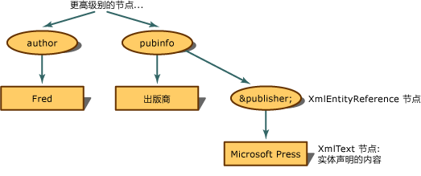

# <a name="entity-references-are-preserved"></a>保留实体引用
如果实体引用不是被扩展，而是被暂留，XML 文档对象模型 (DOM) 在遇到实体引用时生成 XmlEntityReference 节点。  
  
 使用以下 XML，  
  
```xml  
<author>Fred</author>  
<pubinfo>Published by &publisher;</pubinfo>  
```  
  
 DOM 可以在遇到 `&publisher;` 引用时生成 XmlEntityReference 节点。 XmlEntityReference 包含从实体声明内容中复制的子节点。 由于上一代码示例包含实体声明文本，因此 XmlText 节点被创建为实体引用节点的子节点。  
  
   
保留的实体引用的树结构  
  
 XmlEntityReference 的子节点是在遇到实体声明时，从 XmlEntity 节点创建的所有子节点的副本。  
  
> [!NOTE]
>  一旦置于实体引用节点下，从 XmlEntity 复制的节点就不一定是完全相同的副本。 可以有在实体引用节点范围内并影响子节点的最终配置的命名空间。  
  
 默认情况下，暂留的是 `&abc;` 等常规实体，并且始终都会创建 XmlEntityReference 节点。  
  
## <a name="see-also"></a>请参阅  
 [XML 文档对象模型 (DOM)](../../../../docs/standard/data/xml/xml-document-object-model-dom.md)
