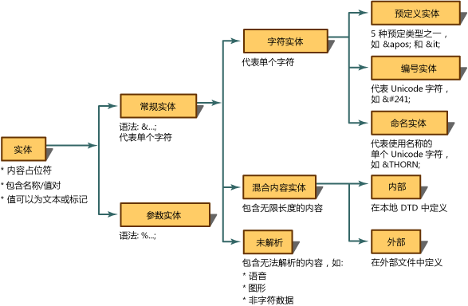
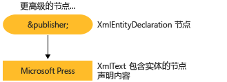

# <a name="reading-entity-declarations-and-entity-references-into-the-dom"></a><span data-ttu-id="79fa5-102">将实体声明和实体引用读入 DOM</span><span class="sxs-lookup"><span data-stu-id="79fa5-102">Reading Entity Declarations and Entity References into the DOM</span></span>
<span data-ttu-id="79fa5-103">实体是一个声明，指定了在 XML 中取代内容或标记而使用的名称。</span><span class="sxs-lookup"><span data-stu-id="79fa5-103">An entity is a declaration that states a name to be used in the XML in place of content or markup.</span></span> <span data-ttu-id="79fa5-104">实体包含两个部分。</span><span class="sxs-lookup"><span data-stu-id="79fa5-104">There are two parts to entities.</span></span> <span data-ttu-id="79fa5-105">首先，必须使用实体声明将名称绑定到替换内容。</span><span class="sxs-lookup"><span data-stu-id="79fa5-105">First, you must tie a name to the replacement content using an entity declaration.</span></span> <span data-ttu-id="79fa5-106">实体声明是使用 `<!ENTITY name "value">` 语法在文档类型定义 (DTD) 或 XML 架构中创建的。</span><span class="sxs-lookup"><span data-stu-id="79fa5-106">An entity declaration is created by using the `<!ENTITY name "value">` syntax in a document type definition (DTD) or XML schema.</span></span> <span data-ttu-id="79fa5-107">其次，在实体声明中定义的名称随后将在 XML 中使用。</span><span class="sxs-lookup"><span data-stu-id="79fa5-107">Secondly, the name defined in the entity declaration is subsequently used in the XML.</span></span> <span data-ttu-id="79fa5-108">在 XML 中使用时，该名称称为实体引用。</span><span class="sxs-lookup"><span data-stu-id="79fa5-108">When used in the XML, it is called an entity reference.</span></span> <span data-ttu-id="79fa5-109">例如，下面的实体声明声明一个名为 `publisher` 的实体，该实体与“Microsoft Press”的内容关联。</span><span class="sxs-lookup"><span data-stu-id="79fa5-109">For example, the following entity declaration declares an entity of the name `publisher` being associated with the content of "Microsoft Press".</span></span>  
  
```xml  
<!ENTITY publisher "Microsoft Press">  
```  
  
 <span data-ttu-id="79fa5-110">下面的示例说明如何在 XML 中将此实体声明作为实体引用使用。</span><span class="sxs-lookup"><span data-stu-id="79fa5-110">The following example shows the use of this entity declaration in XML as an entity reference.</span></span>  
  
```xml  
<author>Fred</author>  
<pubinfo>Published by &publisher;</pubinfo>  
```  
  
 <span data-ttu-id="79fa5-111">某些分析器在文档加载到内存中时自动扩展实体。</span><span class="sxs-lookup"><span data-stu-id="79fa5-111">Some parsers automatically expand entities when a document is loaded into memory.</span></span> <span data-ttu-id="79fa5-112">因此，当将 XML 读入内存中时，实体声明将被记住和保存。</span><span class="sxs-lookup"><span data-stu-id="79fa5-112">Therefore, when the XML is being read into memory, entity declarations are remembered and saved.</span></span> <span data-ttu-id="79fa5-113">当分析器以后遇到 `&;` 字符（用于标识常规实体引用）时，分析器将在实体声明表中查找此名称。</span><span class="sxs-lookup"><span data-stu-id="79fa5-113">When the parser subsequently encounters `&;` characters, which identify a general entity reference, the parser looks up that name in an entity declaration table.</span></span> <span data-ttu-id="79fa5-114">引用 `&publisher;` 被它所表示的内容取代。</span><span class="sxs-lookup"><span data-stu-id="79fa5-114">The reference, `&publisher;` is replaced by the content that it represents.</span></span> <span data-ttu-id="79fa5-115">使用以下 XML，</span><span class="sxs-lookup"><span data-stu-id="79fa5-115">Using the following XML,</span></span>  
  
```xml  
<author>Fred</author>  
<pubinfo>Published by &publisher;</pubinfo>  
```  
  
 <span data-ttu-id="79fa5-116">扩展此实体引用并用 Microsoft Press 内容替换 `&publisher;` 将提供以下扩展的 XML。</span><span class="sxs-lookup"><span data-stu-id="79fa5-116">expanding the entity reference and replacing the `&publisher;` with the Microsoft Press content gives the following expanded XML.</span></span>  
  
 <span data-ttu-id="79fa5-117">**输出**</span><span class="sxs-lookup"><span data-stu-id="79fa5-117">**Output**</span></span>  
  
```xml  
<author>Fred</author>  
<pubinfo>Published by Microsoft Press</pubinfo>  
```  
  
 <span data-ttu-id="79fa5-118">有多种实体。</span><span class="sxs-lookup"><span data-stu-id="79fa5-118">There are many kinds of entities.</span></span> <span data-ttu-id="79fa5-119">下面的关系图显示实体类型和术语的分类。</span><span class="sxs-lookup"><span data-stu-id="79fa5-119">The following diagram shows the breakdown of entity types and terminology.</span></span>  
  
 <span data-ttu-id="79fa5-120"></span><span class="sxs-lookup"><span data-stu-id="79fa5-120"></span></span>  
  
 <span data-ttu-id="79fa5-121">Microsoft .NET Framework 实现的 XML 文档对象模型 (DOM) 的默认设置是暂留实体引用，并在加载 XML 时不扩展这些实体。</span><span class="sxs-lookup"><span data-stu-id="79fa5-121">The default for the Microsoft .NET Framework implementation of the XML Document Object Model (DOM) is to preserve the entities references and not expand the entities when the XML is loaded.</span></span> <span data-ttu-id="79fa5-122">也就是说，将文档加载到 DOM 后，创建的是包含引用变量 `&publisher;` 的 XmlEntityReference 节点，其中子节点表示在 DTD 中声明的实体内容。</span><span class="sxs-lookup"><span data-stu-id="79fa5-122">The implication of this is that as a document is loaded in the DOM, an **XmlEntityReference** node containing the reference variable `&publisher;` is created, with child nodes representing the content in the entity declared in the DTD.</span></span>  
  
 <span data-ttu-id="79fa5-123">下图展示了使用 `<!ENTITY publisher "Microsoft Press">` 实体声明创建的 XmlEntity 和 XmlText 节点。</span><span class="sxs-lookup"><span data-stu-id="79fa5-123">Using the `<!ENTITY publisher "Microsoft Press">` entity declaration, the following diagram shows the **XmlEntity** and **XmlText** nodes created from this declaration.</span></span>  
  
 <span data-ttu-id="79fa5-124"></span><span class="sxs-lookup"><span data-stu-id="79fa5-124"></span></span>  
  
 <span data-ttu-id="79fa5-125">实体引用在展开与未展开时的差异使在内存中的 DOM 树中生成的节点不同。</span><span class="sxs-lookup"><span data-stu-id="79fa5-125">The differences when entity references are expanded and when they are not makes a difference in what nodes are generated in the DOM tree, in memory.</span></span> <span data-ttu-id="79fa5-126">[暂留实体引用](../../../../docs/standard/data/xml/entity-references-are-preserved.md)和[扩展但不暂留实体引用](../../../../docs/standard/data/xml/entity-references-are-expanded-and-not-preserved.md)这两个主题中介绍了生成的节点之间的区别。</span><span class="sxs-lookup"><span data-stu-id="79fa5-126">The difference in the nodes that are generated is explained in the topics [Entity References are Preserved](../../../../docs/standard/data/xml/entity-references-are-preserved.md) and [Entity References are Expanded and Not Preserved](../../../../docs/standard/data/xml/entity-references-are-expanded-and-not-preserved.md).</span></span>  
  
## <a name="see-also"></a><span data-ttu-id="79fa5-127">请参阅</span><span class="sxs-lookup"><span data-stu-id="79fa5-127">See also</span></span>

- [<span data-ttu-id="79fa5-128">XML 文档对象模型 (DOM)</span><span class="sxs-lookup"><span data-stu-id="79fa5-128">XML Document Object Model (DOM)</span></span>](../../../../docs/standard/data/xml/xml-document-object-model-dom.md)
