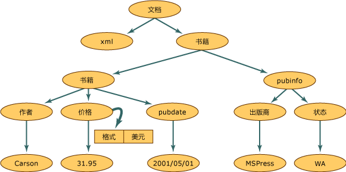

# <a name="xml-document-object-model-dom"></a><span data-ttu-id="ddbd7-102">XML 文档对象模型 (DOM)</span><span class="sxs-lookup"><span data-stu-id="ddbd7-102">XML Document Object Model (DOM)</span></span>
<span data-ttu-id="ddbd7-103">XML 文档对象模型 (DOM) 类是 XML 文档的内存中表示形式。</span><span class="sxs-lookup"><span data-stu-id="ddbd7-103">The XML Document Object Model (DOM) class is an in-memory representation of an XML document.</span></span> <span data-ttu-id="ddbd7-104">DOM 使您能够以编程方式读取、处理和修改 XML 文档。</span><span class="sxs-lookup"><span data-stu-id="ddbd7-104">The DOM allows you to programmatically read, manipulate, and modify an XML document.</span></span> <span data-ttu-id="ddbd7-105">**XmlReader**类也读取 XML，但是，它提供了非缓存、 只进、 只读访问。</span><span class="sxs-lookup"><span data-stu-id="ddbd7-105">The **XmlReader** class also reads XML; however, it provides non-cached, forward-only, read-only access.</span></span> <span data-ttu-id="ddbd7-106">这意味着，若要编辑属性的值或元素或能够插入和移除节点内容的任何功能，则会**XmlReader**。</span><span class="sxs-lookup"><span data-stu-id="ddbd7-106">This means that there are no capabilities to edit the values of an attribute or content of an element, or the ability to insert and remove nodes with the **XmlReader**.</span></span> <span data-ttu-id="ddbd7-107">编辑是 DOM 的主要功能。</span><span class="sxs-lookup"><span data-stu-id="ddbd7-107">Editing is the primary function of the DOM.</span></span> <span data-ttu-id="ddbd7-108">XML 数据在内存中表示是常见的结构化方法，尽管实际的 XML 数据在文件中时或从另一个对象传入时以线性方式存储。</span><span class="sxs-lookup"><span data-stu-id="ddbd7-108">It is the common and structured way that XML data is represented in memory, although the actual XML data is stored in a linear fashion when in a file or coming in from another object.</span></span> <span data-ttu-id="ddbd7-109">以下是 XML 数据。</span><span class="sxs-lookup"><span data-stu-id="ddbd7-109">The following is XML data.</span></span>  
  
## <a name="input"></a><span data-ttu-id="ddbd7-110">输入</span><span class="sxs-lookup"><span data-stu-id="ddbd7-110">Input</span></span>  
  
```xml  
<?xml version="1.0"?>  
  <books>  
    <book>  
        <author>Carson</author>  
        <price format="dollar">31.95</price>  
        <pubdate>05/01/2001</pubdate>  
    </book>  
    <pubinfo>  
        <publisher>MSPress</publisher>  
        <state>WA</state>  
    </pubinfo>  
  </books>   
```  
  
 <span data-ttu-id="ddbd7-111">下图显示将此 XML 数据读入 DOM 结构中时如何构造内存。</span><span class="sxs-lookup"><span data-stu-id="ddbd7-111">The following illustration shows how memory is structured when this XML data is read into the DOM structure.</span></span>  
  
 <span data-ttu-id="ddbd7-112"></span><span class="sxs-lookup"><span data-stu-id="ddbd7-112"></span></span>  
<span data-ttu-id="ddbd7-113">XML 文档结构</span><span class="sxs-lookup"><span data-stu-id="ddbd7-113">XML document structure</span></span>  
  
 <span data-ttu-id="ddbd7-114">在 XML 文档结构中，在此图中的每个圆圈表示一个节点，称为**XmlNode**对象。</span><span class="sxs-lookup"><span data-stu-id="ddbd7-114">Within the XML document structure, each circle in this illustration represents a node, which is called an **XmlNode** object.</span></span> <span data-ttu-id="ddbd7-115">**XmlNode**对象是 DOM 树中的基本对象。</span><span class="sxs-lookup"><span data-stu-id="ddbd7-115">The **XmlNode** object is the basic object in the DOM tree.</span></span> <span data-ttu-id="ddbd7-116">**XmlDocument**类，该类用于扩展**XmlNode**，支持的方法来执行对文档的操作作为一个整体 （例如，加载到内存中，或将 XML 保存到文件中。</span><span class="sxs-lookup"><span data-stu-id="ddbd7-116">The **XmlDocument** class, which extends **XmlNode**, supports methods for performing operations on the document as a whole (for example, loading it into memory or saving the XML to a file.</span></span> <span data-ttu-id="ddbd7-117">此外， **XmlDocument**提供一种方式来查看和操作整个 XML 文档中的节点。</span><span class="sxs-lookup"><span data-stu-id="ddbd7-117">In addition, **XmlDocument** provides a means to view and manipulate the nodes in the entire XML document.</span></span> <span data-ttu-id="ddbd7-118">同时**XmlNode**和**XmlDocument**具有性能和可用性增强功能，并通过方法和属性：</span><span class="sxs-lookup"><span data-stu-id="ddbd7-118">Both **XmlNode** and **XmlDocument** have performance and usability enhancements and have methods and properties to:</span></span>  
  
-   <span data-ttu-id="ddbd7-119">访问和修改 DOM 特定的节点，如元素节点、实体引用节点等。</span><span class="sxs-lookup"><span data-stu-id="ddbd7-119">Access and modify nodes specific to the DOM, such as element nodes, entity reference nodes, and so on.</span></span>  
  
-   <span data-ttu-id="ddbd7-120">除检索节点包含的信息（如元素节点中的文本）外，还检索整个节点。</span><span class="sxs-lookup"><span data-stu-id="ddbd7-120">Retrieve entire nodes, in addition to the information the node contains, such as the text in an element node.</span></span>  
  
    > [!NOTE]
    >  <span data-ttu-id="ddbd7-121">如果应用程序不需要的结构或编辑功能提供的 DOM， **XmlReader**和**XmlWriter**类提供对 XML 的非缓存、 只进流访问。</span><span class="sxs-lookup"><span data-stu-id="ddbd7-121">If an application does not require the structure or editing capabilities provided by the DOM, the **XmlReader** and **XmlWriter** classes provide non-cached, forward-only stream access to XML.</span></span> <span data-ttu-id="ddbd7-122">有关详细信息，请参阅 <xref:System.Xml.XmlReader> 和 <xref:System.Xml.XmlWriter>。</span><span class="sxs-lookup"><span data-stu-id="ddbd7-122">For more information, see <xref:System.Xml.XmlReader> and <xref:System.Xml.XmlWriter>.</span></span>  
  
 <span data-ttu-id="ddbd7-123">**节点**对象具有一组方法和属性，以及基本和定义完善的特征。</span><span class="sxs-lookup"><span data-stu-id="ddbd7-123">**Node** objects have a set of methods and properties, as well as basic and well-defined characteristics.</span></span> <span data-ttu-id="ddbd7-124">其中的某些特性包括：</span><span class="sxs-lookup"><span data-stu-id="ddbd7-124">Some of these characteristics are:</span></span>  
  
-   <span data-ttu-id="ddbd7-125">节点有单个父节点，父节点是与节点相邻的上一级节点。</span><span class="sxs-lookup"><span data-stu-id="ddbd7-125">Nodes have a single parent node, a parent node being a node directly above them.</span></span> <span data-ttu-id="ddbd7-126">唯一没有父级的节点是文档根，因为它是顶级节点，包含了文档本身和文档片段。</span><span class="sxs-lookup"><span data-stu-id="ddbd7-126">The only nodes that do not have a parent is the Document root, as it is the top-level node and contains the document itself and document fragments.</span></span>  
  
-   <span data-ttu-id="ddbd7-127">大多数节点可以有多个子节点，子节点是与节点相邻的下一级节点。</span><span class="sxs-lookup"><span data-stu-id="ddbd7-127">Most nodes can have multiple child nodes, which are nodes directly below them.</span></span> <span data-ttu-id="ddbd7-128">以下是可以有子节点的节点类型列表。</span><span class="sxs-lookup"><span data-stu-id="ddbd7-128">The following is a list of node types that can have child nodes.</span></span>  
  
    -   <span data-ttu-id="ddbd7-129">**文档**</span><span class="sxs-lookup"><span data-stu-id="ddbd7-129">**Document**</span></span>  
  
    -   <span data-ttu-id="ddbd7-130">**DocumentFragment**</span><span class="sxs-lookup"><span data-stu-id="ddbd7-130">**DocumentFragment**</span></span>  
  
    -   <span data-ttu-id="ddbd7-131">**EntityReference**</span><span class="sxs-lookup"><span data-stu-id="ddbd7-131">**EntityReference**</span></span>  
  
    -   <span data-ttu-id="ddbd7-132">**元素**</span><span class="sxs-lookup"><span data-stu-id="ddbd7-132">**Element**</span></span>  
  
    -   <span data-ttu-id="ddbd7-133">**特性**</span><span class="sxs-lookup"><span data-stu-id="ddbd7-133">**Attribute**</span></span>  
  
     <span data-ttu-id="ddbd7-134">**XmlDeclaration**，**表示法**，**实体**， **CDATASection**，**文本**， **注释**， **ProcessingInstruction**，和**DocumentType**节点没有子节点。</span><span class="sxs-lookup"><span data-stu-id="ddbd7-134">The **XmlDeclaration**, **Notation**, **Entity**, **CDATASection**, **Text**, **Comment**, **ProcessingInstruction**, and **DocumentType** nodes do not have child nodes.</span></span>  
  
-   <span data-ttu-id="ddbd7-135">位于相同的级别，在通过图中表示的节点**簿**和**pubinfo**节点是同级。</span><span class="sxs-lookup"><span data-stu-id="ddbd7-135">Nodes that are at the same level, represented in the diagram by the **book** and **pubinfo** nodes, are siblings.</span></span>  
  
 <span data-ttu-id="ddbd7-136">DOM 的一个特性是处理属性的方式。</span><span class="sxs-lookup"><span data-stu-id="ddbd7-136">One characteristic of the DOM is how it handles attributes.</span></span> <span data-ttu-id="ddbd7-137">属性是不属于父子关系和同级关系的节点。</span><span class="sxs-lookup"><span data-stu-id="ddbd7-137">Attributes are not nodes that are part of the parent, child, and sibling relationships.</span></span> <span data-ttu-id="ddbd7-138">属性被视为元素节点的属性，由名称和值对组成。</span><span class="sxs-lookup"><span data-stu-id="ddbd7-138">Attributes are considered a property of the element node and are made up of a name and a value pair.</span></span> <span data-ttu-id="ddbd7-139">例如，如果存在由与元素 `format="dollar` 关联的 `price`" 组成的 XML 数据，则单词 `format` 是名称，`format` 属性的值是 `dollar`。</span><span class="sxs-lookup"><span data-stu-id="ddbd7-139">For example, if you have XML data consisting of `format="dollar`" associated with the element `price`, the word `format` is the name, and the value of the `format` attribute is `dollar`.</span></span> <span data-ttu-id="ddbd7-140">若要检索`format="dollar"`属性**价格**节点，你调用**GetAttribute**方法，当光标位于`price`元素节点。</span><span class="sxs-lookup"><span data-stu-id="ddbd7-140">To retrieve the `format="dollar"` attribute of the **price** node, you call the **GetAttribute** method when the cursor is located at the `price` element node.</span></span> <span data-ttu-id="ddbd7-141">有关详细信息，请参阅[访问 DOM 中的属性](../../../../docs/standard/data/xml/accessing-attributes-in-the-dom.md)。</span><span class="sxs-lookup"><span data-stu-id="ddbd7-141">For more information, see [Accessing Attributes in the DOM](../../../../docs/standard/data/xml/accessing-attributes-in-the-dom.md).</span></span>  
  
 <span data-ttu-id="ddbd7-142">将 XML 读入内存时会创建节点。</span><span class="sxs-lookup"><span data-stu-id="ddbd7-142">As XML is read into memory, nodes are created.</span></span> <span data-ttu-id="ddbd7-143">然而，并非所有节点都是同一类型。</span><span class="sxs-lookup"><span data-stu-id="ddbd7-143">However, not all nodes are the same type.</span></span> <span data-ttu-id="ddbd7-144">XML 中的元素具有不同于处理指令的规则和语法。</span><span class="sxs-lookup"><span data-stu-id="ddbd7-144">An element in XML has different rules and syntax than a processing instruction.</span></span> <span data-ttu-id="ddbd7-145">因此，在读取各种数据时，将为每个节点分配一种节点类型。</span><span class="sxs-lookup"><span data-stu-id="ddbd7-145">Therefore, as various data is read, a node type is assigned to each node.</span></span> <span data-ttu-id="ddbd7-146">此节点类型确定节点的特性和功能。</span><span class="sxs-lookup"><span data-stu-id="ddbd7-146">This node type determines the characteristics and functionality of the node.</span></span>  
  
 <span data-ttu-id="ddbd7-147">在内存中生成的节点的类型的详细信息，请参阅[类型的 XML 节点](../../../../docs/standard/data/xml/types-of-xml-nodes.md)。</span><span class="sxs-lookup"><span data-stu-id="ddbd7-147">For more information on the types of nodes generated in memory, see [Types of XML Nodes](../../../../docs/standard/data/xml/types-of-xml-nodes.md).</span></span> <span data-ttu-id="ddbd7-148">有关在节点树中创建的对象的详细信息，请参阅[对象层次结构映射到 XML 数据](../../../../docs/standard/data/xml/mapping-the-object-hierarchy-to-xml-data.md)。</span><span class="sxs-lookup"><span data-stu-id="ddbd7-148">For more information on the objects created in the node tree, see [Mapping the Object Hierarchy to XML Data](../../../../docs/standard/data/xml/mapping-the-object-hierarchy-to-xml-data.md).</span></span>  
  
 <span data-ttu-id="ddbd7-149">Microsoft 扩展了万维网联合会 (W3C) DOM 级别 1 和级别 2 中可用的 API，使 XML 文档的使用更容易。</span><span class="sxs-lookup"><span data-stu-id="ddbd7-149">Microsoft has extended the APIs that are available in the World Wide Web Consortium (W3C) DOM Level 1 and Level 2 to make it easier to work with an XML document.</span></span> <span data-ttu-id="ddbd7-150">在完全支持 W3C 标准的同时，附加的类、方法和属性增加了使用 W3C XML DOM 无法完成的功能。</span><span class="sxs-lookup"><span data-stu-id="ddbd7-150">While fully supporting the W3C standards, the additional classes, methods, and properties add functionality beyond what can be done using the W3C XML DOM.</span></span> <span data-ttu-id="ddbd7-151">新类使你能够访问关系数据，为你提供与 ADO.NET 数据同步、同时将数据作为 XML 公开的方法。</span><span class="sxs-lookup"><span data-stu-id="ddbd7-151">New classes enable you to access relational data, giving you methods for synchronizing with ADO.NET data, simultaneously exposing data as XML.</span></span> <span data-ttu-id="ddbd7-152">有关详细信息，请参阅[使 DataSet 与 XmlDataDocument 同步](../../../../docs/framework/data/adonet/dataset-datatable-dataview/dataset-and-xmldatadocument-synchronization.md)。</span><span class="sxs-lookup"><span data-stu-id="ddbd7-152">For more information, see [Synchronizing a DataSet with an XmlDataDocument](../../../../docs/framework/data/adonet/dataset-datatable-dataview/dataset-and-xmldatadocument-synchronization.md).</span></span>  
  
 <span data-ttu-id="ddbd7-153">在将 XML 数据读入内存，以更改其结构、添加或移除节点或者与在元素包含的文本中一样修改节点所保存的数据时，DOM 最有用。</span><span class="sxs-lookup"><span data-stu-id="ddbd7-153">The DOM is most useful for reading XML data into memory to change its structure, to add or remove nodes, or to modify the data held by a node as in the text contained by an element.</span></span> <span data-ttu-id="ddbd7-154">不过，在其他方案中，还有其他比 DOM 更快的类。</span><span class="sxs-lookup"><span data-stu-id="ddbd7-154">However, other classes are available that are faster than the DOM in other scenarios.</span></span> <span data-ttu-id="ddbd7-155">XML 快速、 非缓存、 只进流访问，请使用**XmlReader**和**XmlWriter**。</span><span class="sxs-lookup"><span data-stu-id="ddbd7-155">For fast, non-cached, forward-only stream access to XML, use the **XmlReader** and **XmlWriter**.</span></span> <span data-ttu-id="ddbd7-156">如果你需要用游标模型的随机访问和**XPath**，使用**XPathNavigator**类。</span><span class="sxs-lookup"><span data-stu-id="ddbd7-156">If you need random access with a cursor model and **XPath**, use the **XPathNavigator** class.</span></span>  
  
## <a name="see-also"></a><span data-ttu-id="ddbd7-157">另请参阅</span><span class="sxs-lookup"><span data-stu-id="ddbd7-157">See Also</span></span>  
 [<span data-ttu-id="ddbd7-158">XML 节点的类型</span><span class="sxs-lookup"><span data-stu-id="ddbd7-158">Types of XML Nodes</span></span>](../../../../docs/standard/data/xml/types-of-xml-nodes.md)  
 [<span data-ttu-id="ddbd7-159">对象层次结构映射到 XML 数据</span><span class="sxs-lookup"><span data-stu-id="ddbd7-159">Mapping the Object Hierarchy to XML Data</span></span>](../../../../docs/standard/data/xml/mapping-the-object-hierarchy-to-xml-data.md)
