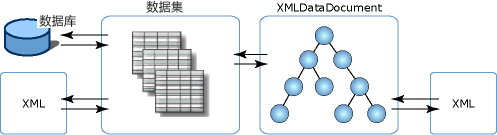

# 关系数据和 ADO.NET 的 XML 集成
XmlDataDocument 类是 XmlDocument 的派生类，包含 XML 数据。 XmlDataDocument 的优势在于，在关系数据和分层数据之间架起了桥梁。 它是可绑定到 DataSet 的 XmlDocument，这两个类可以同步对其中所含数据的更改。 绑定到 DataSet 的 XmlDocument 允许 XML 与关系数据集成，不必将数据表示为 XML 格式或关系格式。 您可以用这两种格式表示数据，而不是限于一种数据表示形式。  
  
 让数据可以以两种视图呈现的好处是：  
  
-   XML 文档的结构化部分可以映射到一个数据集，并可以有效地存储、索引和搜索。  
  
-   转换、验证和导航可以通过以关系形式存储的 XML 数据上的游标模型有效地进行。 有时，与 XML 存储在 XmlDocument 模型中的情况相比，对关系结构执行操作更为高效。  
  
-   DataSet 可以存储一部分 XML。 也就是说，可以使用 XPath 或 XslTransform，只将相关元素和属性存储到 DataSet。 之后，可以对经过筛选的较小数据子集进行更改，这些更改也可以传播到 XmlDataDocument 中的大型数据。  
  
 也可以对从 SQL Server 加载到 DataSet 的数据进行转换。 另一种方法是，将 .NET Framework 类样式托管 WinForm 和 WebForm 控件绑定到通过 XML 输入流填充的 DataSet。  
  
 除支持 XslTransform 外，XmlDataDocument 还将关系数据公开给 XPath 查询和验证。  一般地，所有 XML 服务都可以对关系数据使用，而关系功能（如控件绑定、代码生成等）可以对 XML 的结构化映射使用，不会使 XML 失真。  
  
 由于 XmlDataDocument 继承自 XmlDocument，因此它实现了 W3C DOM。 鉴于 XmlDataDocument 与 DataSet 关联，并将数据子集存储到其中，DataSet 未限制或改变将它用作 XmlDocument。 为使用 XmlDocument 而编写的代码不经更改，即可对 XmlDataDocument 使用。 DataSet 通过定义表、列、关系和约束提供数据相同的关系视图，成为独立的内存中用户数据存储。  
  
 下图展示了 XML 数据与 DataSet 和 XmlDataDocument 的不同关联。  
  
   
  
 此图表明 XML 数据可以直接加载到 DataSet 中，这样就可以关系方式直接控制 XML。 XML 也可以加载到 DOM 的派生类 XmlDataDocument 中，这样就可以随后加载 DataSet 并与它同步。 由于 DataSet 和 XmlDataDocument 是通过一个数据集进行同步，因此对一个存储中数据所做的更改会反映到另一个存储中。  
  
 XmlDataDocument 继承了 XmlDocument 的所有编辑和浏览功能。 有时，使用 XmlDataDocument 及其继承的功能时，与 DataSet 同步比将 XML 直接加载到 DataSet 中更为合适。 下表列出了选择使用哪种方法加载 DataSet 时的注意事项。  
  
|何时将 XML 直接加载到数据集中|何时将 XmlDataDocument 与 DataSet 同步|  
|----------------------------------------------|-----------------------------------------------------------|  
|若要查询 DataSet 中的数据，SQL 比 XPath 更易用。|需要对 DataSet中的数据执行 XPath 查询。|  
|保留源 XML 中的元素顺序并不重要。|保留源 XML 中的元素顺序很重要。|  
|源 XML 中元素间的空白和格式设置不需要保留。|保留源 XML 中的空白和格式设置很重要。|  
  
 如果直接将 XML 加载并写入和写出 DataSet 可满足需求，请参阅[从 XML 加载 DataSet](../../../../docs/framework/data/adonet/dataset-datatable-dataview/loading-a-dataset-from-xml.md) 和[以 XML 数据形式写入 DataSet](../../../../docs/framework/data/adonet/dataset-datatable-dataview/writing-dataset-contents-as-xml-data.md)。  
  
 如果从 XmlDataDocument 加载 DataSet 可满足需求，请参阅[将 DataSet 与 XML 文档同步](../../../../docs/framework/data/adonet/dataset-datatable-dataview/dataset-and-xmldatadocument-synchronization.md)。  
  
## 请参阅  
 [在数据集中使用 XML](../../../../docs/framework/data/adonet/dataset-datatable-dataview/using-xml-in-a-dataset.md)
