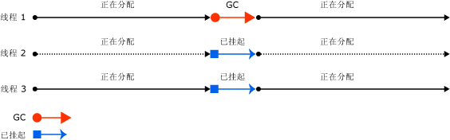
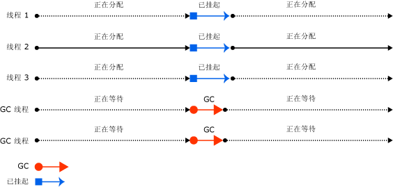
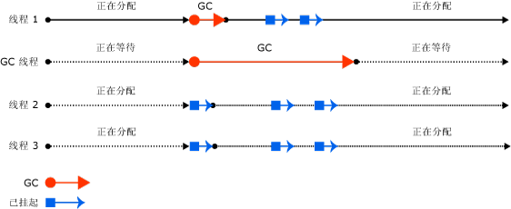
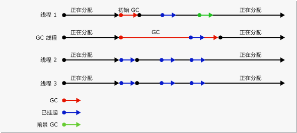
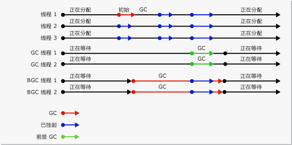

# 垃圾回收的基础Fundamentals of Garbage Collection
 在公共语言运行时 (CLR) 中，垃圾回收器用作自动内存管理器。In the common language runtime (CLR), the garbage collector serves as an automatic memory manager. 它提供如下优点：It provides the following benefits:  
  
-   使你可以在开发应用程序时不必释放内存。Enables you to develop your application without having to free memory.  
  
-   有效分配托管堆上的对象。Allocates objects on the managed heap efficiently.  
  
-   回收不再使用的对象，清除它们的内存，并保留内存以用于将来分配。Reclaims objects that are no longer being used, clears their memory, and keeps the memory available for future allocations. 托管对象会自动获取干净的内容来开始，因此，它们的构造函数不必对每个数据字段进行初始化。Managed objects automatically get clean content to start with, so their constructors do not have to initialize every data field.  
  
-   通过确保对象不能使用另一个对象的内容来提供内存安全。Provides memory safety by making sure that an object cannot use the content of another object.  
  
 本主题介绍垃圾回收的核心概念。This topic describes the core concepts of garbage collection. 它包含下列部分：It contains the following sections:  
  
-   [内存基础知识Fundamentals of memory](#fundamentals_of_memory)  
  
-   [垃圾回收的条件Conditions for a garbage collection](#conditions_for_a_garbage_collection)  
  
-   [托管堆The managed heap](#the_managed_heap)  
  
-   [代数Generations](#generations)  
  
-   [垃圾回收过程中发生的情况What happens during a garbage collection](#what_happens_during_a_garbage_collection)  
  
-   [操作非托管资源Manipulating unmanaged resources](#manipulating_unmanaged_resources)  
  
-   [工作站和服务器垃圾回收Workstation and server garbage collection](#workstation_and_server_garbage_collection)  
  
-   [并行垃圾回收Concurrent garbage collection](#concurrent_garbage_collection)  
  
-   [后台工作站垃圾回收Background workstation garbage collection](#background_garbage_collection)  
  
-   [后台服务器垃圾回收Background server garbage collection](#background_server_garbage_collection)  
  
   
## 内存基础知识Fundamentals of memory  
 下面的列表总结了重要的 CLR 内存概念。The following list summarizes important CLR memory concepts.  
  
-   每个进程都有其自己单独的虚拟地址空间。Each process has its own, separate virtual address space. 同一台计算机上的所有进程共享相同的物理内存，如果有页文件，则也共享页文件。All processes on the same computer share the same physical memory, and share the page file if there is one.  
  
-   默认情况下，32 位计算机上的每个进程都具有 2 GB 的用户模式虚拟地址空间。By default, on 32-bit computers, each process has a 2-GB user-mode virtual address space.  
  
-   作为一名应用程序开发人员，你只能使用虚拟地址空间，请勿直接操控物理内存。As an application developer, you work only with virtual address space and never manipulate physical memory directly. 垃圾回收器为你分配和释放托管堆上的虚拟内存。The garbage collector allocates and frees virtual memory for you on the managed heap.  
  
     如果你编写的是本机代码，请使用 Win32 函数处理虚拟地址空间。If you are writing native code, you use Win32 functions to work with the virtual address space. 这些函数为你分配和释放本机堆上的虚拟内存。These functions allocate and free virtual memory for you on native heaps.  
  
-   虚拟内存有三种状态：Virtual memory can be in three states:  
  
    -   可用。Free. 该内存块没有引用关系，可用于分配。The block of memory has no references to it and is available for allocation.  
  
    -   保留。Reserved. 内存块可供你使用，并且不能用于任何其他分配请求。The block of memory is available for your use and cannot be used for any other allocation request. 但是，在该内存块提交之前，你无法将数据存储到其中。However, you cannot store data to this memory block until it is committed.  
  
    -   提交。Committed. 内存块已指派给物理存储。The block of memory is assigned to physical storage.  
  
-   可能会存在虚拟地址空间碎片。Virtual address space can get fragmented. 就是说地址空间中存在一些被称为孔的可用块。This means that there are free blocks, also known as holes, in the address space. 当请求虚拟内存分配时，虚拟内存管理器必须找到满足该分配请求的足够大的单个可用块。When a virtual memory allocation is requested, the virtual memory manager has to find a single free block that is large enough to satisfy that allocation request. 即使你具有 2 GB 的可用空间，需要 2 GB 的分配将失败，除非该可用空间的所有单个地址块。Even if you have 2 GB of free space, the allocation that requires 2 GB will be unsuccessful unless all of that free space is in a single address block.  
  
-   如果用完保留的虚拟地址空间或提交的物理空间，则可能会用尽内存。You can run out of memory if you run out of virtual address space to reserve or physical space to commit.  
  
 即使在物理内存压力（即物理内存的需求）较低的情况下也会使用页文件。Your page file is used even if physical memory pressure (that is, demand for physical memory) is low. 首次出现物理内存压力较高的情况时，操作系统必须在物理内存中腾出空间来存储数据，并将物理内存中的部分数据备份到页文件中。The first time your physical memory pressure is high, the operating system must make room in physical memory to store data, and it backs up some of the data that is in physical memory to the page file. 该数据只会在需要时进行分页，所以在物理内存压力非常低的情况下也可能会进行分页。That data is not paged until it is needed, so it is possible to encounter paging in situations where the physical memory pressure is very low. 
 
 [返回页首Back to top](#top)  
  
   
## 垃圾回收的条件Conditions for a garbage collection  
 当满足以下条件之一时将发生垃圾回收：Garbage collection occurs when one of the following conditions is true:  
  
-   系统具有低的物理内存。The system has low physical memory. 这是检测到的操作系统中的低内存通知或由主机的内存不足。This is detected by either the low memory notification from the OS or low memory indicated by the host.
  
-   由托管堆上已分配的对象使用的内存超出了可接受的阈值。The memory that is used by allocated objects on the managed heap surpasses an acceptable threshold. 随着进程的运行，此阈值会不断地进行调整。This threshold is continuously adjusted as the process runs.  
  
-   调用 <xref:System.GC.Collect%2A?displayProperty=nameWithType> 方法。The <xref:System.GC.Collect%2A?displayProperty=nameWithType> method is called. 几乎在所有情况下，你都不必调用此方法，因为垃圾回收器会持续运行。In almost all cases, you do not have to call this method, because the garbage collector runs continuously. 此方法主要用于特殊情况和测试。This method is primarily used for unique situations and testing.  
  
 [返回页首Back to top](#top)  
  
   
## 托管堆The managed heap  
 在垃圾回收器由 CLR 初始化之后，它会分配一段内存用于存储和管理对象。After the garbage collector is initialized by the CLR, it allocates a segment of memory to store and manage objects. 此内存称为托管堆（与操作系统中的本机堆相对）。This memory is called the managed heap, as opposed to a native heap in the operating system.  
  
 每个托管进程都有一个托管堆。There is a managed heap for each managed process. 进程中的所有线程都在同一堆上分配对象记忆。All threads in the process allocate memory for objects on the same heap.  
  
 若要保留内存，垃圾回收器将调用 Win32 [VirtualAlloc](http://go.microsoft.com/fwlink/?LinkId=179047) 函数，并且每次会为托管应用程序保留一个内存段。To reserve memory, the garbage collector calls the Win32 [VirtualAlloc](http://go.microsoft.com/fwlink/?LinkId=179047) function, and reserves one segment of memory at a time for managed applications. 垃圾回收器还会根据需要保留段，并通过调用 Win32 [VirtualFree](http://go.microsoft.com/fwlink/?LinkId=179050) 函数将段释放回操作系统（在清除所有对象的段之后）。The garbage collector also reserves segments as needed, and releases segments back to the operating system (after clearing them of any objects) by calling the Win32 [VirtualFree](http://go.microsoft.com/fwlink/?LinkId=179050) function.  
  
> [!IMPORTANT]
>  垃圾回收器分配的段大小特定于实现，并且随时可能更改（包括定期更新）。The size of segments allocated by the garbage collector is implementation-specific and is subject to change at any time, including in periodic updates. 应用程序不应假设特定段的大小或依赖于此大小，也不应尝试配置段分配可用的内存量。Your app should never make assumptions about or depend on a particular segment size, nor should it attempt to configure the amount of memory available for segment allocations.  
  
 堆上分配的对象越少，垃圾回收器必须执行的工作就越少。The fewer objects allocated on the heap, the less work the garbage collector has to do. 分配对象时，请勿使用超出你需求的舍入值，例如在仅需要 15 个字节的情况下分配了 32 个字节的数组。When you allocate objects, do not use rounded-up values that exceed your needs, such as allocating an array of 32 bytes when you need only 15 bytes.  
  
 当触发垃圾回收时，垃圾回收器将回收由死对象占用的内存。When a garbage collection is triggered, the garbage collector reclaims the memory that is occupied by dead objects. 回收进程会对活动对象进行压缩，以便将它们一起移动，并移除死空间，从而使堆更小一些。The reclaiming process compacts live objects so that they are moved together, and the dead space is removed, thereby making the heap smaller. 这将确保一起分配的对象全都位于托管堆上，从而保留它们的局部性。This ensures that objects that are allocated together stay together on the managed heap, to preserve their locality.  
  
 垃圾回收的侵入性（频率和持续时间）是由分配的数量和托管堆上保留的内存数量决定的。The intrusiveness (frequency and duration) of garbage collections is the result of the volume of allocations and the amount of survived memory on the managed heap.  
  
 此堆可视为两个堆的累计：大对象堆和小对象堆。The heap can be considered as the accumulation of two heaps: the large object heap and the small object heap.  
  
 大对象堆包含其大小为 85,000 个字节和更多字节的对象。The large object heap contains very large objects that are 85,000 bytes and larger. 大对象堆上的对象通常是数组。The objects on the large object heap are usually arrays. 非常大的实例对象是很少见的。It is rare for an instance object to be extremely large.  
  
 [返回页首Back to top](#top)  
  
   
## 代数Generations  
 堆按代进行组织，因此它可以处理长生存期的对象和短生存期的对象。The heap is organized into generations so it can handle long-lived and short-lived objects. 垃圾回收主要在回收通常只占用一小部分堆的短生存期对象时发生。Garbage collection primarily occurs with the reclamation of short-lived objects that typically occupy only a small part of the heap. 堆上的对象有三代：There are three generations of objects on the heap:  
  
-   **第 0 代**。**Generation 0**. 这是最年轻的代，其中包含短生存期对象。This is the youngest generation and contains short-lived objects. 短生存期对象的一个示例是临时变量。An example of a short-lived object is a temporary variable. 垃圾回收最常发生在此代中。Garbage collection occurs most frequently in this generation.  
  
     新分配的对象构成新一代的对象并且为隐式的第 0 代回收，除非它们是大对象，在这种情况下，它们将进入第 2 代回收中的大对象堆。Newly allocated objects form a new generation of objects and are implicitly generation 0 collections, unless they are large objects, in which case they go on the large object heap in a generation 2 collection.  
  
     大多数对象通过第 0 代中的垃圾回收进行回收，不会保留到下一代。Most objects are reclaimed for garbage collection in generation 0 and do not survive to the next generation.  
  
-   **第 1 代**。**Generation 1**. 这一代包含短生存期对象并用作短生存期对象和长生存期对象之间的缓冲区。This generation contains short-lived objects and serves as a buffer between short-lived objects and long-lived objects.  
  
-   **第 2 代**。**Generation 2**. 这一代包含长生存期对象。This generation contains long-lived objects. 长生存期对象的一个示例是服务器应用程序中的一个包含在进程期间处于活动状态的静态数据的对象。An example of a long-lived object is an object in a server application that contains static data that is live for the duration of the process.  
  
 当条件得到满足时，垃圾回收将在特定代上发生。Garbage collections occur on specific generations as conditions warrant. 回收某个代意味着回收此代中的对象及其所有更年轻的代。Collecting a generation means collecting objects in that generation and all its younger generations. 第 2 代垃圾回收也称为完整垃圾回收，因为它回收所有代上的所有对象（即，托管堆中的所有对象）。A generation 2 garbage collection is also known as a full garbage collection, because it reclaims all objects in all generations (that is, all objects in the managed heap).  
  
### 幸存和提升Survival and promotions  
 垃圾回收中未回收的对象也称为幸存者，并会被提升到下一代。Objects that are not reclaimed in a garbage collection are known as survivors, and are promoted to the next generation. 在第 0 代垃圾回收中幸存的对象将被提升到第 1 代；在第 1 代垃圾回收中幸存的对象将被提升到第 2 代；而在第 2 代垃圾回收中幸存的对象将仍为第 2 代。Objects that survive a generation 0 garbage collection are promoted to generation 1; objects that survive a generation 1 garbage collection are promoted to generation 2; and objects that survive a generation 2 garbage collection remain in generation 2.  
  
 当垃圾回收器检测到某个代中的幸存率很高时，它会增加该代的分配阈值，因此下一次回收将会获取一个非常大的回收内存。When the garbage collector detects that the survival rate is high in a generation, it increases the threshold of allocations for that generation, so the next collection gets a substantial size of reclaimed memory. CLR 会在以下两个优先级别之前进行平衡：不允许应用程序的工作集获取太大内存以及不允许垃圾回收花费太多时间。The CLR continually balances two priorities: not letting an application's working set get too big and not letting the garbage collection take too much time.  
  
### 暂时代和暂时段Ephemeral generations and segments  
 因为第 0 代和第 1 代中的对象的生存期较短，因此，这些代被称为暂时代。Because objects in generations 0 and 1 are short-lived, these generations are known as the ephemeral generations.  
  
 暂时代必须在称为暂时段的内存段中进行分配。Ephemeral generations must be allocated in the memory segment that is known as the ephemeral segment. 垃圾回收器获取的每个新段将成为新的暂时段，并包含在第 0 代垃圾回收中幸存的对象。Each new segment acquired by the garbage collector becomes the new ephemeral segment and contains the objects that survived a generation 0 garbage collection. 旧的暂时段将成为新的第 2 代段。The old ephemeral segment becomes the new generation 2 segment.  
  
 根据系统为 32 位还是 64 位以及它正在哪种类型的垃圾回收器上运行，暂时段的大小发生相应变化。The size of the ephemeral segment varies depending on whether a system is 32- or 64-bit, and on the type of garbage collector it is running. 下表列出了默认值。Default values are shown in the following table.  
  
||32 位32-bit|64 位64-bit|  
|-|-------------|-------------|  
|工作站 GCWorkstation GC|16 MB16 MB|256 MB256 MB|  
|服务器 GCServer GC|64 MB64 MB|4 GB4 GB|  
|服务器 GC（具有 4 个以上的逻辑 CPU）Server GC with > 4 logical CPUs|32 MB32 MB|2 GB2 GB|  
|服务器 GC（具有 8 个以上的逻辑 CPU）Server GC with > 8 logical CPUs|16 MB16 MB|1 GB1 GB|  
  
 暂时段可以包含第 2 代对象。The ephemeral segment can include generation 2 objects. 第 2 代对象可使用多个段（在内存允许的情况下进程所需的任意数量）。Generation 2 objects can use multiple segments (as many as your process requires and memory allows for).  
  
 从暂时垃圾回收中释放的内存量限制为暂时段的大小。The amount of freed memory from an ephemeral garbage collection is limited to the size of the ephemeral segment. 释放的内存量与死对象占用的空间成比例。The amount of memory that is freed is proportional to the space that was occupied by the dead objects.  
  
 [返回页首Back to top](#top)  
  
   
## 垃圾回收过程中发生的情况What happens during a garbage collection  
 垃圾回收分为以下几个阶段：A garbage collection has the following phases:  
  
-   标记阶段，找到并创建所有活动对象的列表。A marking phase that finds and creates a list of all live objects.  
  
-   重定位阶段，用于更新对将要压缩的对象的引用。A relocating phase that updates the references to the objects that will be compacted.  
  
-   压缩阶段，用于回收由死对象占用的空间，并压缩幸存的对象。A compacting phase that reclaims the space occupied by the dead objects and compacts the surviving objects. 压缩阶段将垃圾回收中幸存下来的对象移至段中时间较早的一端。The compacting phase moves objects that have survived a garbage collection toward the older end of the segment.  
  
     因为第 2 代回收可以占用多个段，所以可以将已提升到第 2 代中的对象移动到时间较早的段中。Because generation 2 collections can occupy multiple segments, objects that are promoted into generation 2 can be moved into an older segment. 可以将第 1 代幸存者和第 2 代幸存者都移动到不同的段，因为它们已被提升到第 2 代。Both generation 1 and generation 2 survivors can be moved to a different segment, because they are promoted to generation 2.  
  
     通常，由于复制大型对象会造成性能代偿，因此不会压缩大型对象堆。Ordinarily, the large object heap is not compacted, because copying large objects imposes a performance penalty. 但是，从 [!INCLUDE[net_v451](../../../includes/net-v451-md.md)] 开始，你可以使用 <xref:System.Runtime.GCSettings.LargeObjectHeapCompactionMode%2A?displayProperty=nameWithType> 属性按需压缩大对象堆。However, starting with the [!INCLUDE[net_v451](../../../includes/net-v451-md.md)], you can use the <xref:System.Runtime.GCSettings.LargeObjectHeapCompactionMode%2A?displayProperty=nameWithType> property to compact the large object heap on demand.  
  
 垃圾回收器使用以下信息来确定对象是否为活动对象：The garbage collector uses the following information to determine whether objects are live:  
  
-   **堆栈根**。**Stack roots**. 由实时 (JIT) 编译器和堆栈查看器提供的堆栈变量。Stack variables provided by the just-in-time (JIT) compiler and stack walker.  
  
-   **垃圾回收句柄**。**Garbage collection handles**. 指向托管对象且可由用户代码或公共语言运行时分配的句柄。Handles that point to managed objects and that can be allocated by user code or by the common language runtime.  
  
-   **静态数据**。**Static data**. 应用程序域中可能引用其他对象的静态对象。Static objects in application domains that could be referencing other objects. 每个应用程序域都会跟踪其静态对象。Each application domain keeps track of its static objects.  
  
 在垃圾回收启动之前，除了触发垃圾回收的线程以外的所有托管线程均会挂起。Before a garbage collection starts, all managed threads are suspended except for the thread that triggered the garbage collection.  
  
 下图演示了触发垃圾回收并导致其他线程挂起的线程。The following illustration shows a thread that triggers a garbage collection and causes the other threads to be suspended.  
  
   
触发垃圾回收的线程Thread that triggers a garbage collection  
  
 [返回页首Back to top](#top)  
  
   
## 操作非托管资源Manipulating unmanaged resources  
 如果你的托管对象使用非托管对象的本机文件句柄来引用非托管对象，则必须显式释放非托管对象，因为垃圾回收器仅跟踪托管堆上的内存。If your managed objects reference unmanaged objects by using their native file handles, you have to explicitly free the unmanaged objects, because the garbage collector tracks memory only on the managed heap.  
  
 托管对象的用户可能不会释放由该对象使用的本机资源。Users of your managed object may not dispose the native resources used by the object. 为了执行清理，可以使托管对象成为可终结的。To perform the cleanup, you can make your managed object finalizable. 终结由不再使用对象时执行的清理操作组成。Finalization consists of cleanup actions that you execute when the object is no longer in use. 当托管对象不活动时，它将执行在其终结器方法中指定的清理操作。When your managed object dies, it performs cleanup actions that are specified in its finalizer method.  
  
 当发现某个可终结对象处于不活动状态时，则会将其终结器放入队列中，以便执行其清理操作，但要将该对象自身提升到下一代。When a finalizable object is discovered to be dead, its finalizer is put in a queue so that its cleanup actions are executed, but the object itself is promoted to the next generation. 因此，你必须等待该代上发生下一次垃圾回收（并不一定是下一次垃圾回收），以确定对象是否已收回。Therefore, you have to wait until the next garbage collection that occurs on that generation (which is not necessarily the next garbage collection) to determine whether the object has been reclaimed.  
  
 [返回页首Back to top](#top)  
  
   
## 工作站和服务器垃圾回收Workstation and server garbage collection  
 垃圾回收器可自行优化并且适用于多种方案。The garbage collector is self-tuning and can work in a wide variety of scenarios. 你可使用配置文件设置来基于工作负荷的特征设置垃圾回收的类型。You can use a configuration file setting to set the type of garbage collection based on the characteristics of the workload. CLR 提供了以下类型的垃圾回收：The CLR provides the following types of garbage collection:  
  
-   工作站垃圾回收，用于所有客户端工作站和独立 PC。Workstation garbage collection, which is for all client workstations and stand-alone PCs. 这是默认设置[ \<gcServer > 元素](../../../docs/framework/configure-apps/file-schema/runtime/gcserver-element.md)在运行时配置架构。This is the default setting for the [\<gcServer> element](../../../docs/framework/configure-apps/file-schema/runtime/gcserver-element.md) in the runtime configuration schema.  
  
     工作站垃圾回收既可以是并发的，也可以是非并发的。Workstation garbage collection can be concurrent or non-concurrent. 并发垃圾回收使托管线程能够在垃圾回收期间继续操作。Concurrent garbage collection enables managed threads to continue operations during a garbage collection.  
  
     从 [!INCLUDE[net_v40_long](../../../includes/net-v40-long-md.md)]开始，后台垃圾回收取代了并发垃圾回收。Starting with the [!INCLUDE[net_v40_long](../../../includes/net-v40-long-md.md)], background garbage collection replaces concurrent garbage collection.  
  
-   服务器垃圾回收，用于需要高吞吐量和可伸缩性的服务器应用程序。Server garbage collection, which is intended for server applications that need high throughput and scalability. 服务器垃圾回收既可以是非并发也可以是背景。Server garbage collection can be non-concurrent or background.  
  
 下图演示了服务器上执行垃圾回收的专用线程。The following illustration shows the dedicated threads that perform the garbage collection on a server.  
  
   
服务器垃圾回收Server garbage collection  
  
### 配置垃圾回收Configuring garbage collection  
 你可以使用[ \<gcServer > 元素](../../../docs/framework/configure-apps/file-schema/runtime/gcserver-element.md)想要 CLR 执行的运行时配置架构指定垃圾回收的类型。You can use the [\<gcServer> element](../../../docs/framework/configure-apps/file-schema/runtime/gcserver-element.md) of the runtime configuration schema to specify the type of garbage collection you want the CLR to perform. 在将此元素的 `enabled` 特性设置为 `false` （默认值）时，CLR 将执行工作站垃圾回收。When this element's `enabled` attribute is set to `false` (the default), the CLR performs workstation garbage collection. 在将 `enabled` 特性设置为 `true`时，CLR 将执行服务器垃圾回收。When you set the `enabled` attribute to `true`, the CLR performs server garbage collection.  
  
 指定并发垃圾回收[ \<gcConcurrent > 元素](../../../docs/framework/configure-apps/file-schema/runtime/gcconcurrent-element.md)的运行时配置架构。Concurrent garbage collection is specified with the [\<gcConcurrent> element](../../../docs/framework/configure-apps/file-schema/runtime/gcconcurrent-element.md) of the runtime configuration schema. 默认设置为 `enabled`。The default setting is `enabled`. 此设置可控制并发和后台垃圾回收。This setting controls both concurrent and background garbage collection.  
  
 还可以使用非托管承载接口来指定服务器垃圾回收。You can also specify server garbage collection with unmanaged hosting interfaces. 请注意，如果你的应用程序承载在这些环境之一中，则 ASP.NET 和 SQL Server 将自动启用服务器垃圾回收。Note that ASP.NET and SQL Server enable server garbage collection automatically if your application is hosted inside one of these environments.  
  
### 工作站和服务器垃圾回收比较Comparing workstation and server garbage collection  
 以下是工作站垃圾回收的线程处理和性能注意事项：The following are threading and performance considerations for workstation garbage collection:  
  
-   回收发生在触发垃圾回收的用户线程上，并保留相同优先级。The collection occurs on the user thread that triggered the garbage collection and remains at the same priority. 因为用户线程通常以普通优先级运行，所以垃圾回收器（在普通优先级线程上运行）必须与其他线程竞争 CPU 时间。Because user threads typically run at normal priority, the garbage collector (which runs on a normal priority thread) must compete with other threads for CPU time.  
  
     不会挂起运行本机代码的线程。Threads that are running native code are not suspended.  
  
-   工作站垃圾回收始终用在只有一个处理器，而不考虑的计算机上[ \<gcServer >](../../../docs/framework/configure-apps/file-schema/runtime/gcserver-element.md)设置。Workstation garbage collection is always used on a computer that has only one processor, regardless of the [\<gcServer>](../../../docs/framework/configure-apps/file-schema/runtime/gcserver-element.md) setting. 如果你指定服务器垃圾回收，则 CLR 会使用工作站垃圾回收，并禁用并发。If you specify server garbage collection, the CLR uses workstation garbage collection with concurrency disabled.  
  
 以下是服务器垃圾回收的线程处理和性能注意事项：The following are threading and performance considerations for server garbage collection:  
  
-   回收发生在以 `THREAD_PRIORITY_HIGHEST` 优先级运行的多个专用线程上。The collection occurs on multiple dedicated threads that are running at `THREAD_PRIORITY_HIGHEST` priority level.  
  
-   为每个 CPU 提供一个用于执行垃圾回收的一个堆和专用线程，并将同时回收这些堆。A heap and a dedicated thread to perform garbage collection are provided for each CPU, and the heaps are collected at the same time. 每个堆都包含一个小对象堆和一个大对象堆，并且所有的堆都可由用户代码访问。Each heap contains a small object heap and a large object heap, and all heaps can be accessed by user code. 不同堆上的对象可以相互引用。Objects on different heaps can refer to each other.  
  
-   因为多个垃圾回收线程一起工作，所以对于相同大小的堆，服务器垃圾回收比工作站垃圾回收更快一些。Because multiple garbage collection threads work together, server garbage collection is faster than workstation garbage collection on the same size heap.  
  
-   服务器垃圾回收通常具有更大的段。Server garbage collection often has larger size segments. 但是请注意，这是通常情况：段大小特定于实现且可能更改。Note, however, that this is only a generalization: segment size is implementation-specific and is subject to change. 调整应用程序时，不应假设垃圾回收器分配的段大小。You should make no assumptions about the size of segments allocated by the garbage collector when tuning your app.  
  
-   服务器垃圾回收会占用大量资源。Server garbage collection can be resource-intensive. 例如，如果在一台具有 4 个处理器的计算机上运行了 12 个进程，则在它们都使用服务器垃圾回收的情况下，将有 48 个专用垃圾回收线程。For example, if you have 12 processes running on a computer that has 4 processors, there will be 48 dedicated garbage collection threads if they are all using server garbage collection. 在高内存加载的情况下，如果所有进程开始执行垃圾回收，则垃圾回收器将要计划 48 个线程。In a high memory load situation, if all the processes start doing garbage collection, the garbage collector will have 48 threads to schedule.  
  
 如果运行应用程序的数百个实例，请考虑使用工作站垃圾回收并禁用并发垃圾回收。If you are running hundreds of instances of an application, consider using workstation garbage collection with concurrent garbage collection disabled. 这可以减少上下文切换，从而提高性能。This will result in less context switching, which can improve performance.  
  
 [返回页首Back to top](#top)  
  
   
## 并行垃圾回收Concurrent garbage collection  
 在工作站或服务器垃圾回收中，你可以启用并发垃圾回收，以便在大多数回收期间，让各线程与执行垃圾回收的专用线程并发运行。In workstation or server garbage collection, you can enable concurrent garbage collection, which enables threads to run concurrently with a dedicated thread that performs the garbage collection for most of the duration of the collection. 此选项只影响第 2 代中的垃圾回收；第 0 代和第 1 代中的垃圾回收始终是非并发的，因为它们完成的速度非常快。This option affects only garbage collections in generation 2; generations 0 and 1 are always non-concurrent because they finish very fast.  
  
 并发垃圾回收通过最大程度地减少因回收引起的暂停，使交互应用程序能够更快地响应。Concurrent garbage collection enables interactive applications to be more responsive by minimizing pauses for a collection. 在运行并发垃圾回收线程的大多数时间，托管线程可以继续运行。Managed threads can continue to run most of the time while the concurrent garbage collection thread is running. 这可以使得在发生垃圾回收时的暂停时间更短。This results in shorter pauses while a garbage collection is occurring.  
  
 若要在运行多个进程时提高性能，请禁用并发垃圾回收。To improve performance when several processes are running, disable concurrent garbage collection. 你可以执行此操作通过添加[ \<gcConcurrent > 元素](../../../docs/framework/configure-apps/file-schema/runtime/gcconcurrent-element.md)到应用程序的配置文件和的值设置其`enabled`属性设为`"false"`。You can do this by adding a [\<gcConcurrent> element](../../../docs/framework/configure-apps/file-schema/runtime/gcconcurrent-element.md) to the app's configuration file and setting the value of its `enabled` attribute to `"false"`.  
  
 并发垃圾回收在一个专用线程上执行。Concurrent garbage collection is performed on a dedicated thread. 默认情况下，CLR 将运行工作站垃圾回收并启用并发垃圾回收。By default, the CLR runs workstation garbage collection with concurrent garbage collection enabled. 对于单处理器计算机和多处理器计算机都是如此。This is true for single-processor and multi-processor computers.  
  
 你在并发垃圾回收期间在堆上为小对象分配空间的能力将受到在并发垃圾回收启动时暂时段上保留的对象的限制。Your ability to allocate small objects on the heap during a concurrent garbage collection is limited by the objects left on the ephemeral segment when a concurrent garbage collection starts. 一旦到达暂时段的末尾，将必须等待并发垃圾回收完成，同时将挂起需要执行小对象分配的托管线程。As soon as you reach the end of the segment, you will have to wait for the concurrent garbage collection to finish while managed threads that have to make small object allocations are suspended.  
  
 并发垃圾回收具有一个稍微大点的工作集（与非并发垃圾回收相比），这是因为你可以在并发回收期间分配对象。Concurrent garbage collection has a slightly bigger working set (compared with non-concurrent garbage collection), because you can allocate objects during concurrent collection. 但是，这会影响性能，原因是分配的对象将会成为你的工作集的一部分。However, this can affect performance, because the objects that you allocate become part of your working set. 实质上，并发垃圾回收会牺牲一些 CPU 和内存来换取更短的暂停。Essentially, concurrent garbage collection trades some CPU and memory for shorter pauses.  
  
 下图演示了在单独的专用线程上执行的并发垃圾回收。The following illustration shows concurrent garbage collection performed on a separate dedicated thread.  
  
   
并行垃圾回收Concurrent garbage collection  
  
 [返回页首Back to top](#top)  
  
   
## 后台工作站垃圾回收Background workstation garbage collection  
 在后台垃圾回收中，在进行第 2 代回收的过程中，将会根据需要收集暂时代（第 0 代和第 1 代）。In background garbage collection, ephemeral generations (0 and 1) are collected as needed while the collection of generation 2 is in progress. 后台垃圾回收无法设置；它会自动运行并启用并发垃圾回收。There is no setting for background garbage collection; it is automatically enabled with concurrent garbage collection. 后台垃圾回收是对并发垃圾回收的替代。Background garbage collection is a replacement for concurrent garbage collection. 与并发垃圾回收一样，后台垃圾回收是在一个专用线程上执行的并且只适用于第 2 代回收。As with concurrent garbage collection, background garbage collection is performed on a dedicated thread and is applicable only to generation 2 collections.  
  
> [!NOTE]
>  后台垃圾回收只在 [!INCLUDE[net_v40_short](../../../includes/net-v40-short-md.md)] 及更高版本中可用。Background garbage collection is available only in the [!INCLUDE[net_v40_short](../../../includes/net-v40-short-md.md)] and later versions. 在 [!INCLUDE[net_v40_short](../../../includes/net-v40-short-md.md)]中，仅支持工作站垃圾回收。In the [!INCLUDE[net_v40_short](../../../includes/net-v40-short-md.md)], it is supported only for workstation garbage collection. 从 .NET Framework 4.5 开始，后台垃圾回收可用于工作站和服务器垃圾回收。Starting with the .NET Framework 4.5, background garbage collection is available for both workstation and server garbage collection.  
  
 后台垃圾回收期间对暂时代的回收称为前台垃圾回收。A collection on ephemeral generations during background garbage collection is known as foreground garbage collection. 发生前台垃圾回收时，所有托管线程都将被挂起。When foreground garbage collections occur, all managed threads are suspended.  
  
 当后台垃圾回收正在进行并且你已在第 0 代中分配了足够的对象时，CLR 将执行第 0 代或第 1 代前台垃圾回收。When background garbage collection is in progress and you have allocated enough objects in generation 0, the CLR performs a generation 0 or generation 1 foreground garbage collection. 专用的后台垃圾回收线程将在常见的安全点上进行检查以确定是否存在对前台垃圾回收的请求。The dedicated background garbage collection thread checks at frequent safe points to determine whether there is a request for foreground garbage collection. 如果存在，则后台回收将挂起自身以便前台垃圾回收可以发生。If there is, the background collection suspends itself so that foreground garbage collection can occur. 在前台垃圾回收完成之后，专用的后台垃圾回收线程和用户线程将继续。After the foreground garbage collection is completed, the dedicated background garbage collection thread and user threads resume.  
  
 后台垃圾回收可以消除并发垃圾回收所带来的分配限制，因为在后台垃圾回收期间，可发生暂时垃圾回收。Background garbage collection removes allocation restrictions imposed by concurrent garbage collection, because ephemeral garbage collections can occur during background garbage collection. 这意味着，后台垃圾回收可以移除暂时代中的死对象，而且还可以在第 1 代垃圾回收期间根据需要展开堆。This means that background garbage collection can remove dead objects in ephemeral generations and can also expand the heap if needed during a generation 1 garbage collection.  
  
 下图显示对工作站上的独立专用线程执行的后台垃圾回收。The following illustration shows background garbage collection performed on a separate dedicated thread on a workstation.  
  
   
后台工作站垃圾回收Background workstation garbage collection  
  
 [返回页首Back to top](#top)  
  
   
## 后台服务器垃圾回收Background server garbage collection  
 从 .NET Framework 4.5 开始，后台服务器垃圾回收是服务器垃圾回收的默认模式。Starting with the .NET Framework 4.5, background server garbage collection is the default mode for server garbage collection. 若要选择此模式下，设置`enabled`属性[ \<gcServer > 元素](../../../docs/framework/configure-apps/file-schema/runtime/gcserver-element.md)到`true`在运行时配置架构。To choose this mode, set the `enabled` attribute of the [\<gcServer> element](../../../docs/framework/configure-apps/file-schema/runtime/gcserver-element.md) to `true` in the runtime configuration schema. 此模式与后台工作站垃圾回收（如上一章节所描述）具有类似功能，但有一些不同之处。This mode functions similarly to background workstation garbage collection, described in the previous section, but there are a few differences. 后台工作区域垃圾回收使用一个专用的后台垃圾回收线程，而后台服务器垃圾回收使用多个线程，通常一个专用的线程用于一台逻辑处理器。Background workstation garbage collection uses one dedicated background garbage collection thread, whereas background server garbage collection uses multiple threads, typically a dedicated thread for each logical processor. 不同于工作站后台垃圾回收线程，这些线程不会超时。Unlike the workstation background garbage collection thread, these threads do not time out.  
  
 下图显示对服务器上的独立专用线程执行的后台垃圾回收。The following illustration shows background garbage collection performed on a separate dedicated thread on a server.  
  
   
后台服务器垃圾回收Background server garbage collection  
  
## 另请参阅See Also  
 [垃圾回收Garbage Collection](../../../docs/standard/garbage-collection/index.md)
