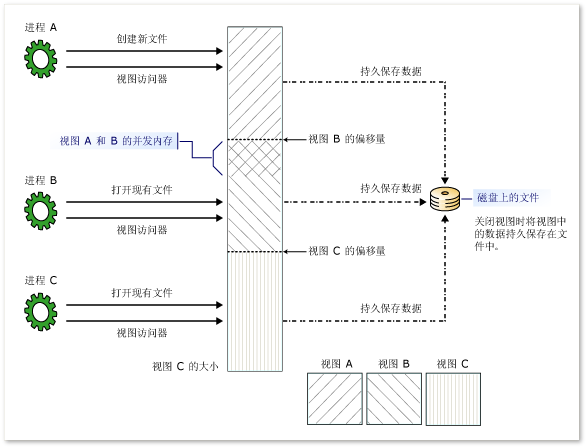

# 内存映射文件
内存映射文件包含虚拟内存中文件的内容。  利用文件与内存空间之间的映射，应用程序（包括多个进程）可以通过直接在内存中进行读写来修改文件。  从 [!INCLUDE[net_v40_long](../../../includes/net-v40-long-md.md)]开始，可以使用托管代码按照本机Windows函数访问内存映射文件的方式来访问内存映射文件，如 MSDN Library 中的[Managing Memory\-Mapped Files in Win32](http://go.microsoft.com/fwlink/?linkid=180801) （管理 Win32 中的内存映射文件）中所述。  
  
 有两种类型的内存映射文件：  
  
-   持久内存映射文件  
  
     持久文件是与磁盘上的源文件关联的内存映射文件。  在最后一个进程使用完此文件后，数据将保存到磁盘上的源文件中。  这些内存映射文件适合用来处理非常大的源文件。  
  
-   非持久内存映射文件  
  
     非持久文件是未与磁盘上的源文件关联的内存映射文件。  当最后一个进程使用完此文件后，数据将丢失，并且垃圾回收功能将回收此文件。  这些文件适用于为进程间通信 \(IPC\) 创建共享内存。  
  
## 进程、视图和管理内存  
 内存映射文件可以在多个进程之间进行共享。  进程可以通过使用由创建同一内存映射文件的进程所指派的公用名来映射到此文件。  
  
 若要使用一个内存映射文件，则必须创建该内存映射文件的完整视图或部分视图。  还可以创建内存映射文件的同一部分的多个视图，进而创建并发内存。  为了使两个视图能够并发，必须基于同一内存映射文件创建这两个视图。  
  
 如果文件大于应用程序用于内存映射的逻辑内存空间（在 32 位计算机上为 2 GB），则还需要使用多个视图。  
  
 有两种类型的视图：流访问视图和随机访问视图。  使用流访问视图可对文件进行顺序访问；对于非持久文件和 IPC，这是建议的方法。  在使用持久文件时，随机访问视图是首选方法。  
  
 由于内存映射文件是通过操作系统的内存管理器访问的，因此会自动将此文件分隔为多个页，并根据需要对其进行访问。  您不需要自行处理内存管理。  
  
 下图演示多个进程如何同时具有对同一内存映射文件的多个重叠视图。  
  
   
内存映射文件的多个重叠视图  
  
## 使用内存映射文件进行编程  
 下表提供有关使用内存映射文件对象及其成员的指南。  
  
|任务|使用的方法或属性|  
|--------|--------------|  
|从磁盘上的文件中获取表示持久内存映射文件的 <xref:System.IO.MemoryMappedFiles.MemoryMappedFile> 对象。|<xref:System.IO.MemoryMappedFiles.MemoryMappedFile.CreateFromFile%2A?displayProperty=fullName> 方法。|  
|获取表示非持久内存映射文件（与磁盘上的文件不关联）的 <xref:System.IO.MemoryMappedFiles.MemoryMappedFile> 对象。|<xref:System.IO.MemoryMappedFiles.MemoryMappedFile.CreateNew%2A?displayProperty=fullName> 方法。<br /><br /> \- 或 \-<br /><br /> <xref:System.IO.MemoryMappedFiles.MemoryMappedFile.CreateOrOpen%2A?displayProperty=fullName> 方法。|  
|获取现有内存映射文件（持久文件或非持久文件）的 <xref:System.IO.MemoryMappedFiles.MemoryMappedFile> 对象。|<xref:System.IO.MemoryMappedFiles.MemoryMappedFile.OpenExisting%2A?displayProperty=fullName> 方法。|  
|获取针对内存映射文件的顺序访问视图的 <xref:System.IO.UnmanagedMemoryStream> 对象。|<xref:System.IO.MemoryMappedFiles.MemoryMappedFile.CreateViewStream%2A?displayProperty=fullName> 方法。|  
|获取针对内存映射文件的随机访问视图的 <xref:System.IO.UnmanagedMemoryAccessor> 对象。|<xref:System.IO.MemoryMappedFiles.MemoryMappedFile.CreateViewAccessor%2A?displayProperty=fullName> 方法。|  
|获取要用于非托管代码的 <xref:Microsoft.Win32.SafeHandles.SafeMemoryMappedViewHandle> 对象。|<xref:System.IO.MemoryMappedFiles.MemoryMappedFile.SafeMemoryMappedFileHandle%2A?displayProperty=fullName> 属性。<br /><br /> \- 或 \-<br /><br /> <xref:System.IO.MemoryMappedFiles.MemoryMappedViewAccessor.SafeMemoryMappedViewHandle%2A?displayProperty=fullName> 属性。<br /><br /> \- 或 \-<br /><br /> <xref:System.IO.MemoryMappedFiles.MemoryMappedViewStream.SafeMemoryMappedViewHandle%2A?displayProperty=fullName> 属性。|  
|将内存分配推迟到创建视图后进行（仅限于非持久文件）。<br /><br /> （若要确定当前系统页大小，请使用 <xref:System.Environment.SystemPageSize%2A?displayProperty=fullName> 属性。）|带 <xref:System.IO.MemoryMappedFiles.MemoryMappedFileOptions?displayProperty=fullName> 值的 <xref:System.IO.MemoryMappedFiles.MemoryMappedFile.CreateNew%2A> 方法。<br /><br /> \- 或 \-<br /><br /> 将 <xref:System.IO.MemoryMappedFiles.MemoryMappedFileOptions> 枚举作为参数的 <xref:System.IO.MemoryMappedFiles.MemoryMappedFile.CreateOrOpen%2A> 方法。|  
  
### 安全性  
 在创建内存映射文件时，可以通过使用以下方法（这些方法采用 <xref:System.IO.MemoryMappedFiles.MemoryMappedFileAccess> 枚举作为参数）来应用访问权限：  
  
-   <xref:System.IO.MemoryMappedFiles.MemoryMappedFile.CreateFromFile%2A?displayProperty=fullName>  
  
-   <xref:System.IO.MemoryMappedFiles.MemoryMappedFile.CreateNew%2A?displayProperty=fullName>  
  
-   <xref:System.IO.MemoryMappedFiles.MemoryMappedFile.CreateOrOpen%2A?displayProperty=fullName>  
  
 通过使用将 <xref:System.IO.MemoryMappedFiles.MemoryMappedFileRights> 用作参数的 <xref:System.IO.MemoryMappedFiles.MemoryMappedFile.OpenExisting%2A> 方法，可以指定用于打开现有内存映射文件的访问权限。  
  
 此外，可以包含一个 <xref:System.IO.MemoryMappedFiles.MemoryMappedFileSecurity> 对象，该对象包括预定义的访问规则。  
  
 若要将新的或已更改的访问规则应用于内存映射文件，请使用 <xref:System.IO.MemoryMappedFiles.MemoryMappedFile.SetAccessControl%2A> 方法。  若要从现有文件中检索访问规则或审核规则，请使用 <xref:System.IO.MemoryMappedFiles.MemoryMappedFile.GetAccessControl%2A> 方法。  
  
## 示例  
  
### 持久内存映射文件  
 <xref:System.IO.MemoryMappedFiles.MemoryMappedFile.CreateFromFile%2A> 方法基于磁盘上的现有文件创建一个内存映射文件。  
  
 下面的示例创建一个特大文件的某一部分的内存映射视图，并操作该文件的某一部分。  
  
 [!code-csharp[MemoryMappedFiles.MemoryMappedFile.CreateFromFile#1](../../../samples/snippets/csharp/VS_Snippets_CLR/memorymappedfiles.memorymappedfile.createfromfile/cs/program.cs#1)]
 [!code-vb[MemoryMappedFiles.MemoryMappedFile.CreateFromFile#1](../../../samples/snippets/visualbasic/VS_Snippets_CLR/memorymappedfiles.memorymappedfile.createfromfile/vb/program.vb#1)]  
  
 下面的示例为另一个进程打开同一内存映射文件。  
  
 [!code-csharp[MemoryMappedFiles.MemoryMappedFile.OpenExisting#1](../../../samples/snippets/csharp/VS_Snippets_CLR/memorymappedfiles.memorymappedfile.openexisting/cs/program.cs#1)]
 [!code-vb[MemoryMappedFiles.MemoryMappedFile.OpenExisting#1](../../../samples/snippets/visualbasic/VS_Snippets_CLR/memorymappedfiles.memorymappedfile.openexisting/vb/program.vb#1)]  
  
### 非持久内存映射文件  
 <xref:System.IO.MemoryMappedFiles.MemoryMappedFile.CreateNew%2A> 和 <xref:System.IO.MemoryMappedFiles.MemoryMappedFile.CreateOrOpen%2A> 方法创建一个未映射到磁盘上的现有文件的内存映射文件。  
  
 下面的示例由三个单独的进程（控制台应用程序）组成，这些进程将布尔值写入到内存映射文件中。  将发生下面一系列操作：  
  
1.  `Process A` 创建内存映射文件并将一个值写入到其中。  
  
2.  `Process B` 打开内存映射文件并将一个值写入到其中。  
  
3.  `Process C` 打开内存映射文件并将一个值写入到其中。  
  
4.  `Process A` 读取并显示内存映射文件中的值。  
  
5.  `Process A` 使用完内存映射文件后，垃圾回收功能将会立即回收该文件。  
  
 若要运行此示例，请执行以下步骤：  
  
1.  编译应用程序并打开三个命令提示符窗口。  
  
2.  在第一个命令提示符窗口中，运行 `Process A`。  
  
3.  在第二个命令提示符窗口中，运行 `Process B`。  
  
4.  返回到 `Process A` 并按 Enter。  
  
5.  在第三个命令提示符窗口中，运行 `Process C`。  
  
6.  返回到 `Process A` 并按 Enter。  
  
 `Process A` 的输出如下所示：  
  
```  
Start Process B and press ENTER to continue.  
Start Process C and press ENTER to continue.  
Process A says: True  
Process B says: False  
Process C says: True  
```  
  
 **进程 A**  
  
 [!code-csharp[System.IO.MemoryMappedFiles_IPC_X#1](../../../samples/snippets/csharp/VS_Snippets_CLR_System/system.io.memorymappedfiles_ipc_x/cs/program.cs#1)]
 [!code-vb[System.IO.MemoryMappedFiles_IPC_X#1](../../../samples/snippets/visualbasic/VS_Snippets_CLR_System/system.io.memorymappedfiles_ipc_x/vb/program.vb#1)]  
  
 **进程 B**  
  
 [!code-csharp[System.IO.MemoryMappedFiles_IPC_A#1](../../../samples/snippets/csharp/VS_Snippets_CLR_System/system.io.memorymappedfiles_ipc_a/cs/program.cs#1)]
 [!code-vb[System.IO.MemoryMappedFiles_IPC_A#1](../../../samples/snippets/visualbasic/VS_Snippets_CLR_System/system.io.memorymappedfiles_ipc_a/vb/program.vb#1)]  
  
 **进程 C**  
  
 [!code-csharp[System.IO.MemoryMappedFiles_IPC_B#1](../../../samples/snippets/csharp/VS_Snippets_CLR_System/system.io.memorymappedfiles_ipc_b/cs/program.cs#1)]
 [!code-vb[System.IO.MemoryMappedFiles_IPC_B#1](../../../samples/snippets/visualbasic/VS_Snippets_CLR_System/system.io.memorymappedfiles_ipc_b/vb/program.vb#1)]  
  
## 请参阅  
 [文件和流 I\/O](../../../docs/standard/io/index.md)