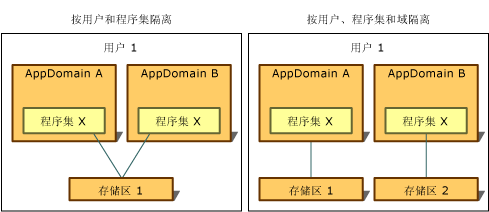

# 隔离的类型Types of Isolation
独立存储始终仅限创建它的用户访问。Access to isolated storage is always restricted to the user who created it. 为了实现这种隔离，公共语言运行时使用操作系统识别的相同用户标识，即与存储打开时的代码运行进程相关联的标识。To implement this type of isolation, the common language runtime uses the same notion of user identity that the operating system recognizes, which is the identity associated with the process in which the code is running when the store is opened. 虽然此标识是已验证用户标识，但模拟可能会导致当前用户的标识发生动态变化。This identity is an authenticated user identity, but impersonation can cause the identity of the current user to change dynamically.  
  
 独立存储访问的限制条件还包括，与应用的域和程序集相关联的标识或仅与程序集相关联的标识。Access to isolated storage is also restricted according to the identity associated with the application's domain and assembly, or with the assembly alone. 运行时通过以下方式获取这些标识：The runtime obtains these identities in the following ways:  
  
-   域标识表示证明应用的证据，对于 Web 应用，这可能就是完整 URL。Domain identity represents the evidence of the application, which in the case of a web application might be the full URL. 对于 shell 托管代码，域标识可能基于应用目录路径。For shell-hosted code, the domain identity might be based on the application directory path. 例如，如果通过路径 C:\Office\MyApp.exe 运行可执行文件，域标识为 C:\Office\MyApp.exe。For example, if the executable runs from the path C:\Office\MyApp.exe, the domain identity would be C:\Office\MyApp.exe.  
  
-   程序集标识是证明程序集的证据。Assembly identity is the evidence of the assembly. 这可能来自加密数字签名，可以是程序集的[强名称](../../../docs/framework/app-domains/strong-named-assemblies.md)、程序集的软件发行者或程序集的 URL 标识。This might come from a cryptographic digital signature, which can be the assembly's [strong name](../../../docs/framework/app-domains/strong-named-assemblies.md), the software publisher of the assembly, or its URL identity. 如果程序集同时包含强名称和软件发行者标识，使用的是软件发行者标识。If an assembly has both a strong name and a software publisher identity, then the software publisher identity is used. 如果程序集来自 Internet 且未签名，使用的是 URL 标识。If the assembly comes from the Internet and is unsigned, the URL identity is used. 若要详细了解程序集和强名称，请参阅[使用程序集编程](../../../docs/framework/app-domains/programming-with-assemblies.md)。For more information about assemblies and strong names, see [Programming with Assemblies](../../../docs/framework/app-domains/programming-with-assemblies.md).  
  
-   漫游存储与有漫游用户策略文件的用户一起移动。Roaming stores move with a user that has a roaming user profile. 文件被写入网络目录，并下载到用户登录的所有计算机中。Files are written to a network directory and are downloaded to any computer the user logs into. 若要详细了解漫游用户策略文件，请参阅 <xref:System.IO.IsolatedStorage.IsolatedStorageScope.Roaming?displayProperty=nameWithType>。For more information about roaming user profiles, see <xref:System.IO.IsolatedStorage.IsolatedStorageScope.Roaming?displayProperty=nameWithType>.  
  
 通过将用户、域和程序集标识这些概念相结合，独立存储可以通过下列方式隔离数据，每种方式都有自己的使用方案：By combining the concepts of user, domain, and assembly identity, isolated storage can isolate data in the following ways, each of which has its own usage scenarios:  
  
-   [按用户和程序集隔离Isolation by user and assembly](#UserAssembly)  
  
-   [按用户、域和程序集隔离Isolation by user, domain, and assembly](#UserDomainAssembly)  
  
 这两种隔离都可以与漫游用户策略文件结合使用。Either of these isolations can be combined with a roaming user profile. 有关详细信息，请参阅[独立存储和漫游](#Roaming)部分。For more information, see the section [Isolated Storage and Roaming](#Roaming).  
  
 下图展示了存储在不同范围的隔离情况。The following illustration demonstrates how stores are isolated in different scopes.  
  
   
独立存储的类型Types of isolated storage  
  
 请注意，除漫游存储外，独立存储始终按计算机隐式隔离，因为它使用指定计算机的本地存储设备。Note that except for roaming stores, isolated storage is always implicitly isolated by computer because it uses the storage facilities that are local to a given computer.  
  
> [!IMPORTANT]
>  独立存储不适用于 [!INCLUDE[win8_appname_long](../../../includes/win8-appname-long-md.md)] 应用。Isolated storage is not available for [!INCLUDE[win8_appname_long](../../../includes/win8-appname-long-md.md)] apps. 相反，使用 `Windows.Storage` API 中包含的 [!INCLUDE[wrt](../../../includes/wrt-md.md)] 命名空间中的应用程序数据类来存储本地数据和文件。Instead, use the application data classes in the `Windows.Storage` namespaces included in the [!INCLUDE[wrt](../../../includes/wrt-md.md)] API to store local data and files. 有关详细信息，请参阅 Windows 开发人员中心中的[应用程序数据](https://docs.microsoft.com/previous-versions/windows/apps/hh464917(v=win.10))。For more information, see [Application data](https://docs.microsoft.com/previous-versions/windows/apps/hh464917(v=win.10)) in the Windows Dev Center.  
  
   
## 按用户和程序集隔离Isolation by User and Assembly  
 如果需要从任何应用的域都可以访问程序集使用的数据存储，按用户和程序集隔离更为合适。When the assembly that uses the data store needs to be accessible from any application's domain, isolation by user and assembly is appropriate. 在这种情况下，独立存储通常用于存储跨多个应用的数据，而不是与任何特定应用绑定的数据，如用户名或许可证信息。Typically, in this situation, isolated storage is used to store data that applies across multiple applications and is not tied to any particular application, such as the user's name or license information. 若要访问按用户和程序集隔离的存储，必须信任代码在应用之间传输信息。To access storage isolated by user and assembly, code must be trusted to transfer information between applications. 通常情况下，按用户和程序集隔离可用于 Intranet，但不可用于 Internet。Typically, isolation by user and assembly is allowed on intranets but not on the Internet. 调用静态 <xref:System.IO.IsolatedStorage.IsolatedStorageFile.GetStore%2A?displayProperty=nameWithType> 方法并传入用户和程序集 <xref:System.IO.IsolatedStorage.IsolatedStorageScope>，即可返回采用这种隔离的存储。Calling the static <xref:System.IO.IsolatedStorage.IsolatedStorageFile.GetStore%2A?displayProperty=nameWithType> method and passing in a user and an assembly <xref:System.IO.IsolatedStorage.IsolatedStorageScope> returns storage with this kind of isolation.  
  
 下面的代码示例检索按用户和程序集隔离的存储。The following code example retrieves a store that is isolated by user and assembly. 可通过 `isoFile` 对象访问此存储。The store can be accessed through the `isoFile` object.  
  
 [!code-cpp[Conceptual.IsolatedStorage#17](../../../samples/snippets/cpp/VS_Snippets_CLR/conceptual.isolatedstorage/cpp/source11.cpp#17)]
 [!code-csharp[Conceptual.IsolatedStorage#17](../../../samples/snippets/csharp/VS_Snippets_CLR/conceptual.isolatedstorage/cs/source11.cs#17)]
 [!code-vb[Conceptual.IsolatedStorage#17](../../../samples/snippets/visualbasic/VS_Snippets_CLR/conceptual.isolatedstorage/vb/source11.vb#17)]  
  
 有关使用证据参数的示例，请参阅 <xref:System.IO.IsolatedStorage.IsolatedStorageFile.GetStore%28System.IO.IsolatedStorage.IsolatedStorageScope%2CSystem.Security.Policy.Evidence%2CSystem.Type%2CSystem.Security.Policy.Evidence%2CSystem.Type%29>。For an example that uses the evidence parameters, see <xref:System.IO.IsolatedStorage.IsolatedStorageFile.GetStore%28System.IO.IsolatedStorage.IsolatedStorageScope%2CSystem.Security.Policy.Evidence%2CSystem.Type%2CSystem.Security.Policy.Evidence%2CSystem.Type%29>.  
  
 <xref:System.IO.IsolatedStorage.IsolatedStorageFile.GetUserStoreForAssembly%2A> 方法可用作快捷方式，如下面的代码示例所示。The <xref:System.IO.IsolatedStorage.IsolatedStorageFile.GetUserStoreForAssembly%2A> method is available as a shortcut, as shown in the following code example. 此快捷方式不能用于打开漫游存储；在这种情况下，请使用 <xref:System.IO.IsolatedStorage.IsolatedStorageFile.GetStore%2A>。This shortcut cannot be used to open stores that are capable of roaming; use <xref:System.IO.IsolatedStorage.IsolatedStorageFile.GetStore%2A> in such cases.  
  
 [!code-cpp[Conceptual.IsolatedStorage#18](../../../samples/snippets/cpp/VS_Snippets_CLR/conceptual.isolatedstorage/cpp/source11.cpp#18)]
 [!code-csharp[Conceptual.IsolatedStorage#18](../../../samples/snippets/csharp/VS_Snippets_CLR/conceptual.isolatedstorage/cs/source11.cs#18)]
 [!code-vb[Conceptual.IsolatedStorage#18](../../../samples/snippets/visualbasic/VS_Snippets_CLR/conceptual.isolatedstorage/vb/source11.vb#18)]  
  
   
## 按用户、域和程序集隔离Isolation by User, Domain, and Assembly  
 如果应用使用需要专用数据存储的第三方程序集，可以使用独立存储来存储专用数据。If your application uses a third-party assembly that requires a private data store, you can use isolated storage to store the private data. 按用户、域和程序集隔离可确保，仅当使用程序集的应用在程序集创建存储时正在运行时，且仅当为其创建存储的用户运行应用时，只有给定程序集中的代码才能访问数据。Isolation by user, domain, and assembly ensures that only code in a given assembly can access the data, and only when the assembly is used by the application that was running when the assembly created the store, and only when the user for whom the store was created runs the application. 按用户、域和程序集隔离可防止第三方程序集将数据泄漏给其他应用。Isolation by user, domain, and assembly keeps the third-party assembly from leaking data to other applications. 如果确定要使用独立存储，但不确定要使用哪种类型的隔离，此隔离类型应为默认选择。This isolation type should be your default choice if you know that you want to use isolated storage but are not sure which type of isolation to use. 调用 <xref:System.IO.IsolatedStorage.IsolatedStorageFile> 的静态 <xref:System.IO.IsolatedStorage.IsolatedStorageFile.GetStore%2A> 方法并传入用户、域和程序集 <xref:System.IO.IsolatedStorage.IsolatedStorageScope>，即可返回采用这种隔离的存储。Calling the static <xref:System.IO.IsolatedStorage.IsolatedStorageFile.GetStore%2A> method of <xref:System.IO.IsolatedStorage.IsolatedStorageFile> and passing in a user, domain, and assembly <xref:System.IO.IsolatedStorage.IsolatedStorageScope> returns storage with this kind of isolation.  
  
 下面的代码示例检索按用户、域和程序集隔离的存储。The following code example retrieves a store isolated by user, domain, and assembly. 可通过 `isoFile` 对象访问此存储。The store can be accessed through the `isoFile` object.  
  
 [!code-cpp[Conceptual.IsolatedStorage#14](../../../samples/snippets/cpp/VS_Snippets_CLR/conceptual.isolatedstorage/cpp/source10.cpp#14)]
 [!code-csharp[Conceptual.IsolatedStorage#14](../../../samples/snippets/csharp/VS_Snippets_CLR/conceptual.isolatedstorage/cs/source10.cs#14)]
 [!code-vb[Conceptual.IsolatedStorage#14](../../../samples/snippets/visualbasic/VS_Snippets_CLR/conceptual.isolatedstorage/vb/source10.vb#14)]  
  
 另一个方法可用作快捷方式，如下面的代码示例所示。Another method is available as a shortcut, as shown in the following code example. 此快捷方式不能用于打开漫游存储；在这种情况下，请使用 <xref:System.IO.IsolatedStorage.IsolatedStorageFile.GetStore%2A>。This shortcut cannot be used to open stores that are capable of roaming; use <xref:System.IO.IsolatedStorage.IsolatedStorageFile.GetStore%2A> in such cases.  
  
 [!code-cpp[Conceptual.IsolatedStorage#15](../../../samples/snippets/cpp/VS_Snippets_CLR/conceptual.isolatedstorage/cpp/source10.cpp#15)]
 [!code-csharp[Conceptual.IsolatedStorage#15](../../../samples/snippets/csharp/VS_Snippets_CLR/conceptual.isolatedstorage/cs/source10.cs#15)]
 [!code-vb[Conceptual.IsolatedStorage#15](../../../samples/snippets/visualbasic/VS_Snippets_CLR/conceptual.isolatedstorage/vb/source10.vb#15)]  
  
   
## 独立存储和漫游Isolated Storage and Roaming  
 漫游用户策略文件是一项 Windows 功能，可便于用户在网络上设置标识，并使用此标识登录任何网络计算机，同时应用所有个性化设置。Roaming user profiles are a Windows feature that enables a user to set up an identity on a network and use that identity to log into any network computer, carrying over all personalized settings. 使用独立存储的程序集可以指定，用户的独立存储应随漫游用户策略文件一起移动。An assembly that uses isolated storage can specify that the user's isolated storage should move with the roaming user profile. 漫游可以与按用户和程序集隔离或按用户、域和程序集隔离结合使用。Roaming can be used in conjunction with isolation by user and assembly or with isolation by user, domain, and assembly. 如果未使用漫游范围，即使使用漫游用户策略文件，存储也不会漫游。If a roaming scope is not used, stores will not roam even if a roaming user profile is used.  
  
 下面的代码示例检索按用户和程序集隔离的漫游存储。The following code example retrieves a roaming store isolated by user and assembly. 可通过 `isoFile` 对象访问此存储。The store can be accessed through the `isoFile` object.  
  
 [!code-cpp[Conceptual.IsolatedStorage#11](../../../samples/snippets/cpp/VS_Snippets_CLR/conceptual.isolatedstorage/cpp/source9.cpp#11)]
 [!code-csharp[Conceptual.IsolatedStorage#11](../../../samples/snippets/csharp/VS_Snippets_CLR/conceptual.isolatedstorage/cs/source9.cs#11)]
 [!code-vb[Conceptual.IsolatedStorage#11](../../../samples/snippets/visualbasic/VS_Snippets_CLR/conceptual.isolatedstorage/vb/source9.vb#11)]  
  
 可以添加域范围，以创建按用户、域和应用隔离的漫游存储。A domain scope can be added to create a roaming store isolated by user, domain, and application. 下面的代码示例展示了此操作。The following code example demonstrates this.  
  
 [!code-cpp[Conceptual.IsolatedStorage#12](../../../samples/snippets/cpp/VS_Snippets_CLR/conceptual.isolatedstorage/cpp/source9.cpp#12)]
 [!code-csharp[Conceptual.IsolatedStorage#12](../../../samples/snippets/csharp/VS_Snippets_CLR/conceptual.isolatedstorage/cs/source9.cs#12)]
 [!code-vb[Conceptual.IsolatedStorage#12](../../../samples/snippets/visualbasic/VS_Snippets_CLR/conceptual.isolatedstorage/vb/source9.vb#12)]  
  
## 请参阅See Also  
 <xref:System.IO.IsolatedStorage.IsolatedStorageScope>  
 [独立存储Isolated Storage](../../../docs/standard/io/isolated-storage.md)
