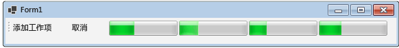

# 如何：取消数据流块How to: Cancel a Dataflow Block
本文档介绍如何在应用程序中启用取消。This document demonstrates how to enable cancellation in your application. 此示例使用 Windows 窗体显示数据流管道中工作项的活动位置以及取消的效果。This example uses Windows Forms to show where work items are active in a dataflow pipeline and also the effects of cancellation.  

[!INCLUDE [tpl-install-instructions](../../../includes/tpl-install-instructions.md)]
  
## 创建 Windows 窗体应用程序To Create the Windows Forms Application  
  
1.  创建一个 C# 或 Visual Basic **Windows 窗体应用程序**项目。Create a C# or Visual Basic **Windows Forms Application** project. 在以下步骤中，该项目命名为 `CancellationWinForms`。In the following steps, the project is named `CancellationWinForms`.  
  
2.  在主窗体的窗体设计器中，Form1.cs（对于 Visual Basic，则为 Form1.vb）添加了 <xref:System.Windows.Forms.ToolStrip> 控件。On the form designer for the main form, Form1.cs (Form1.vb for Visual Basic), add a <xref:System.Windows.Forms.ToolStrip> control.  
  
3.  向 <xref:System.Windows.Forms.ToolStrip> 控件添加 <xref:System.Windows.Forms.ToolStripButton> 控件。Add a <xref:System.Windows.Forms.ToolStripButton> control to the <xref:System.Windows.Forms.ToolStrip> control. 将 <xref:System.Windows.Forms.ToolStripItem.DisplayStyle%2A> 属性设置为 <xref:System.Windows.Forms.ToolStripItemDisplayStyle.Text>，并将 <xref:System.Windows.Forms.ToolStripItem.Text%2A> 属性设置为“添加工作项”。Set the <xref:System.Windows.Forms.ToolStripItem.DisplayStyle%2A> property to <xref:System.Windows.Forms.ToolStripItemDisplayStyle.Text> and the <xref:System.Windows.Forms.ToolStripItem.Text%2A> property to **Add Work Items**.  
  
4.  向 <xref:System.Windows.Forms.ToolStrip> 控件再添加一个 <xref:System.Windows.Forms.ToolStripButton> 控件。Add a second <xref:System.Windows.Forms.ToolStripButton> control to the <xref:System.Windows.Forms.ToolStrip> control. 将 <xref:System.Windows.Forms.ToolStripItem.DisplayStyle%2A> 属性设置为 <xref:System.Windows.Forms.ToolStripItemDisplayStyle.Text>，将 <xref:System.Windows.Forms.ToolStripItem.Text%2A> 属性设置为“Cancel”，并将 <xref:System.Windows.Forms.ToolStripItem.Enabled%2A> 属性设置为 `False`。Set the <xref:System.Windows.Forms.ToolStripItem.DisplayStyle%2A> property to <xref:System.Windows.Forms.ToolStripItemDisplayStyle.Text>, the <xref:System.Windows.Forms.ToolStripItem.Text%2A> property to **Cancel**, and the <xref:System.Windows.Forms.ToolStripItem.Enabled%2A> property to `False`.  
  
5.  向 <xref:System.Windows.Forms.ToolStrip> 控件添加四个 <xref:System.Windows.Forms.ToolStripProgressBar> 对象。Add four <xref:System.Windows.Forms.ToolStripProgressBar> objects to the <xref:System.Windows.Forms.ToolStrip> control.  
  
## 创建数据流管道Creating the Dataflow Pipeline  
 本部分介绍如何创建数据流管道，用以处理工作项以及更新进度条。This section describes how to create the dataflow pipeline that processes work items and updates the progress bars.  
  
### 创建数据流管道To Create the Dataflow Pipeline  
  
1.  在项目中，添加对 System.Threading.Tasks.Dataflow.dll 的引用。In your project, add a reference to System.Threading.Tasks.Dataflow.dll.  
  
2.  确保 Form1.cs（对于 Visual Basic 则为 Form1.vb）包含以下 `using` 语句（Visual Basic 中为 `Imports`）。Ensure that Form1.cs (Form1.vb for Visual Basic) contains the following `using` statements (`Imports` in Visual Basic).  
  
     [!code-csharp[TPLDataflow_CancellationWinForms#1](../../../samples/snippets/csharp/VS_Snippets_Misc/tpldataflow_cancellationwinforms/cs/cancellationwinforms/form1.cs#1)]
     [!code-vb[TPLDataflow_CancellationWinForms#1](../../../samples/snippets/visualbasic/VS_Snippets_Misc/tpldataflow_cancellationwinforms/vb/cancellationwinforms/form1.vb#1)]  
  
3.  将 `WorkItem` 类添加为 `Form1` 类的内部类型。Add the `WorkItem` class as an inner type of the `Form1` class.  
  
     [!code-csharp[TPLDataflow_CancellationWinForms#2](../../../samples/snippets/csharp/VS_Snippets_Misc/tpldataflow_cancellationwinforms/cs/cancellationwinforms/form1.cs#2)]
     [!code-vb[TPLDataflow_CancellationWinForms#2](../../../samples/snippets/visualbasic/VS_Snippets_Misc/tpldataflow_cancellationwinforms/vb/cancellationwinforms/form1.vb#2)]  
  
4.  将以下数据成员添加到 `Form1` 类。Add the following data members to the `Form1` class.  
  
     [!code-csharp[TPLDataflow_CancellationWinForms#3](../../../samples/snippets/csharp/VS_Snippets_Misc/tpldataflow_cancellationwinforms/cs/cancellationwinforms/form1.cs#3)]
     [!code-vb[TPLDataflow_CancellationWinForms#3](../../../samples/snippets/visualbasic/VS_Snippets_Misc/tpldataflow_cancellationwinforms/vb/cancellationwinforms/form1.vb#3)]  
  
5.  将下面的 `CreatePipeline` 方法添加到 `Form1` 类。Add the following method, `CreatePipeline`, to the `Form1` class.  
  
     [!code-csharp[TPLDataflow_CancellationWinForms#4](../../../samples/snippets/csharp/VS_Snippets_Misc/tpldataflow_cancellationwinforms/cs/cancellationwinforms/form1.cs#4)]
     [!code-vb[TPLDataflow_CancellationWinForms#4](../../../samples/snippets/visualbasic/VS_Snippets_Misc/tpldataflow_cancellationwinforms/vb/cancellationwinforms/form1.vb#4)]  
  
 因为 `incrementProgress` 和 `decrementProgress` 数据流块是在用户界面上操作，所以这些操作要在用户界面线程上执行，这一点很重要。Because the `incrementProgress` and `decrementProgress` dataflow blocks act on the user interface, it is important that these actions occur on the user-interface thread. 为此，在构造期间，每个对象都提供将 <xref:System.Threading.Tasks.Dataflow.DataflowBlockOptions.TaskScheduler%2A> 属性设置为 <xref:System.Threading.Tasks.TaskScheduler.FromCurrentSynchronizationContext%2A?displayProperty=nameWithType> 的 <xref:System.Threading.Tasks.Dataflow.ExecutionDataflowBlockOptions> 对象。To accomplish this, during construction these objects each provide a <xref:System.Threading.Tasks.Dataflow.ExecutionDataflowBlockOptions> object that has the <xref:System.Threading.Tasks.Dataflow.DataflowBlockOptions.TaskScheduler%2A> property set to <xref:System.Threading.Tasks.TaskScheduler.FromCurrentSynchronizationContext%2A?displayProperty=nameWithType>. <xref:System.Threading.Tasks.TaskScheduler.FromCurrentSynchronizationContext%2A?displayProperty=nameWithType> 方法会创建一个在当前同步上下文中执行工作的 <xref:System.Threading.Tasks.TaskScheduler> 对象。The <xref:System.Threading.Tasks.TaskScheduler.FromCurrentSynchronizationContext%2A?displayProperty=nameWithType> method creates a <xref:System.Threading.Tasks.TaskScheduler> object that performs work on the current synchronization context. 因为 `Form1` 构造函数是从用户界面线程中调用的，所以 `incrementProgress` 和 `decrementProgress` 数据流块的操作也会在用户界面线程上运行。Because the `Form1` constructor is called from the user-interface thread, the actions for the `incrementProgress` and `decrementProgress` dataflow blocks also run on the user-interface thread.  
  
 此示例在构造管道成员时设置 <xref:System.Threading.Tasks.Dataflow.DataflowBlockOptions.CancellationToken%2A> 属性。This example sets the <xref:System.Threading.Tasks.Dataflow.DataflowBlockOptions.CancellationToken%2A> property when it constructs the members of the pipeline. 由于 <xref:System.Threading.Tasks.Dataflow.DataflowBlockOptions.CancellationToken%2A> 属性永久取消数据流块执行，因此如果用户在取消操作后又想再将更多工作项添加到管道中，必须重新创建整个管道。Because the <xref:System.Threading.Tasks.Dataflow.DataflowBlockOptions.CancellationToken%2A> property permanently cancels dataflow block execution, the whole pipeline must be recreated after the user cancels the operation and then wants to add more work items to the pipeline. 有关演示使用另一种方法取消数据流块以便在取消操作后可以执行其他工作的示例，请参阅[演练：在 Windows 窗体应用程序中使用数据流](../../../docs/standard/parallel-programming/walkthrough-using-dataflow-in-a-windows-forms-application.md)。For an example that demonstrates an alternative way to cancel a dataflow block so that other work can be performed after an operation is canceled, see [Walkthrough: Using Dataflow in a Windows Forms Application](../../../docs/standard/parallel-programming/walkthrough-using-dataflow-in-a-windows-forms-application.md).  
  
## 将数据流管道连接到用户界面Connecting the Dataflow Pipeline to the User Interface  
 本节介绍如何将数据流管道连接到用户界面。This section describes how to connect the dataflow pipeline to the user interface. 创建管道以及将工作项添加到管道中都由“添加工作项”按钮的事件处理程序控制。Both creating the pipeline and adding work items to the pipeline are controlled by the event handler for the **Add Work Items** button. 通过“取消”按钮启动取消操作。Cancellation is initiated by the **Cancel** button. 用户单击以上任一按钮时，都会以异步方式启动相应操作。When the user clicks either of these buttons, the appropriate action is initiated in an asynchronous manner.  
  
### 将数据流管道连接到用户界面To Connect the Dataflow Pipeline to the User Interface  
  
1.  在主窗体的窗体设计器中，创建“添加工作项”按钮的 <xref:System.Windows.Forms.ToolStripItem.Click> 事件的事件处理程序。On the form designer for the main form, create an event handler for the <xref:System.Windows.Forms.ToolStripItem.Click> event for the **Add Work Items** button.  
  
2.  实现“添加工作项”按钮的 <xref:System.Windows.Forms.ToolStripItem.Click> 事件。Implement the <xref:System.Windows.Forms.ToolStripItem.Click> event for the **Add Work Items** button.  
  
     [!code-csharp[TPLDataflow_CancellationWinForms#5](../../../samples/snippets/csharp/VS_Snippets_Misc/tpldataflow_cancellationwinforms/cs/cancellationwinforms/form1.cs#5)]
     [!code-vb[TPLDataflow_CancellationWinForms#5](../../../samples/snippets/visualbasic/VS_Snippets_Misc/tpldataflow_cancellationwinforms/vb/cancellationwinforms/form1.vb#5)]  
  
3.  在主窗体的窗体设计器中，创建“取消”按钮的 <xref:System.Windows.Forms.ToolStripItem.Click> 事件的事件处理程序。On the form designer for the main form, create an event handler for the <xref:System.Windows.Forms.ToolStripItem.Click> event handler for the **Cancel** button.  
  
4.  实现“取消”按钮的 <xref:System.Windows.Forms.ToolStripItem.Click> 事件处理程序。Implement the <xref:System.Windows.Forms.ToolStripItem.Click> event handler for the **Cancel** button.  
  
     [!code-csharp[TPLDataflow_CancellationWinForms#6](../../../samples/snippets/csharp/VS_Snippets_Misc/tpldataflow_cancellationwinforms/cs/cancellationwinforms/form1.cs#6)]
     [!code-vb[TPLDataflow_CancellationWinForms#6](../../../samples/snippets/visualbasic/VS_Snippets_Misc/tpldataflow_cancellationwinforms/vb/cancellationwinforms/form1.vb#6)]  
  
## 示例Example  
 下面的示例演示 Form1.cs（对于 Visual Basic 则为 Form1.vb）的完整代码。The following example shows the complete code for Form1.cs (Form1.vb for Visual Basic).  
  
 [!code-csharp[TPLDataflow_CancellationWinForms#100](../../../samples/snippets/csharp/VS_Snippets_Misc/tpldataflow_cancellationwinforms/cs/cancellationwinforms/form1.cs#100)]
 [!code-vb[TPLDataflow_CancellationWinForms#100](../../../samples/snippets/visualbasic/VS_Snippets_Misc/tpldataflow_cancellationwinforms/vb/cancellationwinforms/form1.vb#100)]  
  
 下图显示正在运行的应用程序。The following illustration shows the running application.  
  
   

## 请参阅See also

- [数据流Dataflow](../../../docs/standard/parallel-programming/dataflow-task-parallel-library.md)
