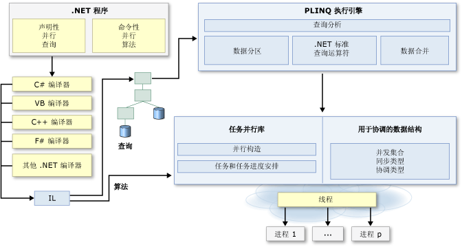

# .NET Framework 中的并行编程
许多个人计算机和工作站都有两个或四个内核（即 CPU），使多个线程能够同时执行。 在不久的将来，计算机预期会有更多的内核。 为了利用当今和未来的硬件，您可以对代码进行并行化，以将工作分摊在多个处理器上。 过去，并行化需要线程和锁的低级操作。 [!INCLUDE[vs_dev10_long](../../../includes/vs-dev10-long-md.md)] 和 [!INCLUDE[net_v40_short](../../../includes/net-v40-short-md.md)] 新增了运行时、类库类型和诊断工具，增强了对并行编程的支持。 这些功能简化了并行开发，使您能够通过固有方法编写高效、细化且可伸缩的并行代码，而不必直接处理线程或线程池。 下图从较高层面上概述了 [!INCLUDE[net_v40_short](../../../includes/net-v40-short-md.md)] 中的并行编程体系结构。  
  
   
  
## 相关主题  
  
|技术|描述|  
|----------------|-----------------|  
|[任务并行库 (TPL)](../../../docs/standard/parallel-programming/task-parallel-library-tpl.md)|收录了 <xref:System.Threading.Tasks.Parallel?displayProperty=fullName> 类的相关文档，其中包含 `For` 和 `ForEach` 循环的并行版本；还收录了 <xref:System.Threading.Tasks.Task?displayProperty=fullName> 类的相关文档，此类代表用于表达异步操作的首选方式。|  
|[并行 LINQ (PLINQ)](../../../docs/standard/parallel-programming/parallel-linq-plinq.md)|LINQ to Objects 的并行实现，该实现显著提高了许多情况下的性能。|  
|[用于并行编程的数据结构](../../../docs/standard/parallel-programming/data-structures-for-parallel-programming.md)|提供一些链接，这些链接指向有关线程安全集合类、轻量同步类型以及延迟初始化类型的文档。|  
|[并行诊断工具](../../../docs/standard/parallel-programming/parallel-diagnostic-tools.md)|收录了有关 Visual Studio 任务和并行堆栈调试器窗口以及[并发可视化工具](http://msdn.microsoft.com/library/ae5879a0-1e1a-455a-ba72-148e57f59289)的文档链接，其中包含 [!INCLUDE[vsprvsts](../../../includes/vsprvsts-md.md)] 探查器中的一组视图，可以使用这些视图来调试和调整并行代码的性能。|  
|[PLINQ 和 TPL 的自定义分区程序](../../../docs/standard/parallel-programming/custom-partitioners-for-plinq-and-tpl.md)|描述分区程序的工作方式，以及如何配置默认分区程序或创建新的分区程序。|  
|[任务计划程序](http://msdn.microsoft.com/library/638f8ea5-21db-47a2-a934-86e1e961bf65)|描述计划程序的工作方式，以及如何配置默认计划程序。|  
|[PLINQ 和 TPL 中的 Lambda 表达式](../../../docs/standard/parallel-programming/lambda-expressions-in-plinq-and-tpl.md)|简要概述 C# 和 Visual Basic 中的 Lambda 表达式，并演示如何在 PLINQ 和任务并行库中使用这些表达式。|  
|[其他阅读材料](../../../docs/standard/parallel-programming/for-further-reading-parallel-programming.md)|提供一些链接，这些链接指向其他文档以及在 .NET Framework 中进行并行编程的示例资源。|  
  
## 另请参阅  
 [并行编程模式：了解并使用 .NET Framework 4 应用并行模式](http://go.microsoft.com/fwlink/?LinkID=185142)   
 [使用 .NET Framework 进行并行编程的示例](http://code.msdn.microsoft.com/Samples-for-Parallel-b4b76364)
