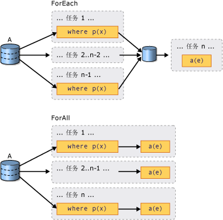

# PLINQ 介绍

## 什么是并行查询？

[!INCLUDE[net_v35_long](../../../includes/net-v35-long-md.md)] 中引入了语言集成查询 (LINQ)。 它具有统一的模型，以类型安全方式查询任何 <xref:System.Collections.IEnumerable?displayProperty=nameWithType> 或 <xref:System.Collections.Generic.IEnumerable%601?displayProperty=nameWithType> 数据源。 LINQ to Objects 是针对内存中集合（如 <xref:System.Collections.Generic.List%601> 和数组）运行的 LINQ 查询的名称。 本文假定你对 LINQ 有基本的了解。 有关详细信息，请参阅[语言集成查询 (LINQ) - C#](../../csharp/programming-guide/concepts/linq/index.md) 或[语言集成查询 (LINQ) - Visual Basic](../../visual-basic/programming-guide/concepts/linq/index.md)。

并行 LINQ (PLINQ) 是 LINQ 模式的并行实现。 一个 PLINQ 查询的许多方面都类似于非并行的 LINQ to Objects 查询。 与顺序 [!INCLUDE[vbteclinq](../../../includes/vbteclinq-md.md)] 查询一样，PLINQ 查询对任何内存中 <xref:System.Collections.IEnumerable> 或 <xref:System.Collections.Generic.IEnumerable%601> 数据源执行操作，并且推迟了执行，即在枚举查询前不会开始执行。 主要区别在于，PLINQ 会尝试充分利用系统上的所有处理器。 方法是将数据源分区成片段，然后在多个处理器上针对单独工作线程上的每个片段执行并行查询。 在许多情况下，并行执行意味着查询运行速度显著提高。

通过并行执行，通常只需向数据源添加 <xref:System.Linq.ParallelEnumerable.AsParallel%2A> 查询操作，PLINQ 即可显著提升性能（与某些类型查询的旧代码相比）。 但是，并行可能会引入其自身的复杂性，因此并非所有的查询操作的运行速度在 PLINQ 中都更快。 事实上，并行实际上会降低某些查询的速度。 因此，应了解排序等问题将如何对并行查询产生影响。 有关详细信息，请参阅[了解 PLINQ 中的加速](../../../docs/standard/parallel-programming/understanding-speedup-in-plinq.md)。

> [!NOTE]
> 本文档使用 lambda 表达式在 PLINQ 中定义委托。 如果不熟悉 C# 或 Visual Basic 中的 lambda 表达式，请参阅 [PLINQ 和 TPL 中的 Lambda 表达式](../../../docs/standard/parallel-programming/lambda-expressions-in-plinq-and-tpl.md)。

本文的其余部分将概述主 PLINQ 类，并讨论如何创建 PLINQ 查询。 每部分包含指向更详细信息以及代码示例的链接。

## ParallelEnumerable 类

<xref:System.Linq.ParallelEnumerable?displayProperty=nameWithType> 类公开了几乎所有的 PLINQ 功能。 它和 <xref:System.Linq?displayProperty=nameWithType> 命名空间类型的其余部分一起被编译到 System.Core.dll 程序集中。 Visual Studio 中默认的 C# 和 Visual Basic 项目均会引用该程序集并导入该命名空间。

尽管 <xref:System.Linq.ParallelEnumerable> 实现了 LINQ to Objects 支持的所有标准查询运算符，但它不会尝试并行执行每个实现。 如果你不熟悉 [!INCLUDE[vbteclinq](../../../includes/vbteclinq-md.md)]，请参阅 [LINQ (C#) 简介](../../csharp/programming-guide/concepts/linq/introduction-to-linq.md)和 [LINQ (Visual Basic) 简介](../../visual-basic/programming-guide/concepts/linq/introduction-to-linq.md)。

除了标准查询运算符外，<xref:System.Linq.ParallelEnumerable> 类还包含一组启用并行执行专用行为的方法。 下表中列出了这些特定于 PLINQ 的方法。

|ParallelEnumerable 运算符|说明|
|---------------------------------|-----------------|
|<xref:System.Linq.ParallelEnumerable.AsParallel%2A>|PLINQ 的入口点。 指定如果可能，应并行化查询的其余部分。|
|<xref:System.Linq.ParallelEnumerable.AsSequential%2A>|指定查询的其余部分应像非并行的 LINQ 查询一样按顺序运行。|
|<xref:System.Linq.ParallelEnumerable.AsOrdered%2A>|指定 PLINQ 应为查询的其余部分保留源序列的排序，或直到例如通过使用 orderby（在 Visual Basic 中为 Order By）子句更改排序为止。|
|<xref:System.Linq.ParallelEnumerable.AsUnordered%2A>|指定保留源序列的排序不需要查询其余部分的 PLINQ。|
|<xref:System.Linq.ParallelEnumerable.WithCancellation%2A>|指定 PLINQ 应定期监视请求取消时所提供的取消标记的状态以及取消执行。|
|<xref:System.Linq.ParallelEnumerable.WithDegreeOfParallelism%2A>|指定 PLINQ 应用于并行化查询的处理器的最大数量。|
|<xref:System.Linq.ParallelEnumerable.WithMergeOptions%2A>|提供有关 PLINQ 应如何（如果可能）将并行结果合并回使用线程上的一个序列的提示。|
|<xref:System.Linq.ParallelEnumerable.WithExecutionMode%2A>|指定 PLINQ 应如何并行化查询（即使是当默认行为是按顺序运行查询时）。|
|<xref:System.Linq.ParallelEnumerable.ForAll%2A>|一种多线程枚举方法，与循环访问查询结果不同，它允许在不首先合并回使用者线程的情况下并行处理结果。|
|<xref:System.Linq.ParallelEnumerable.Aggregate%2A> 重载|对于 PLINQ 唯一的重载，它启用对线程本地分区的中间聚合以及一个用于合并所有分区结果的最终聚合函数。|

## 选择使用模型

编写查询时，请对数据源调用 <xref:System.Linq.ParallelEnumerable.AsParallel%2A?displayProperty=nameWithType> 扩展方法，以选择使用 PLINQ，如下面的示例所示。

[!code-csharp[PLINQ#1](../../../samples/snippets/csharp/VS_Snippets_Misc/plinq/cs/plinq2_cs.cs#1)]
[!code-vb[PLINQ#1](../../../samples/snippets/visualbasic/VS_Snippets_Misc/plinq/vb/plinq2_vb.vb#1)]

<xref:System.Linq.ParallelEnumerable.AsParallel%2A> 扩展方法将后续查询运算符（在此示例中为 `where` 和 `select`）绑定到 <xref:System.Linq.ParallelEnumerable?displayProperty=nameWithType> 实现。

## 执行模式

默认情况下，PLINQ 是保守的。 在运行时，PLINQ 基础结构将分析查询的总体结构。 如果通过并行可能会提高查询速度，PLINQ 则将源序列分区为可以同时运行的任务。 如果并行化查询不安全，PLINQ 则只会按顺序运行查询。 如果 PLINQ 可以在可能会较昂贵的并行算法或成本较低的顺序算法之间进行选择，它会默认选择顺序算法。 可以使用 <xref:System.Linq.ParallelEnumerable.WithExecutionMode%2A> 方法和 <xref:System.Linq.ParallelExecutionMode?displayProperty=nameWithType> 枚举指示 PLINQ 选择并行算法。 如果你通过测试和测量知道特定查询以并行方式执行得更快时，此做法非常有用。 有关详细信息，请参阅[如何：在 PLINQ 中指定执行模式](../../../docs/standard/parallel-programming/how-to-specify-the-execution-mode-in-plinq.md)。

## 并行度

默认情况下，PLINQ 使用主机计算机上的所有处理器。 可以使用 <xref:System.Linq.ParallelEnumerable.WithDegreeOfParallelism%2A> 方法指示 PLINQ 使用不超过指定数量的处理器。 当你要确保计算机上运行的其他进程收到一定的 CPU 时间量时，此做法将非常有用。 下面的片段将查询限制为最多使用两个处理器。

[!code-csharp[PLINQ#5](../../../samples/snippets/csharp/VS_Snippets_Misc/plinq/cs/plinqsamples.cs#5)]
[!code-vb[PLINQ#5](../../../samples/snippets/visualbasic/VS_Snippets_Misc/plinq/vb/plinq2_vb.vb#5)]

在查询要执行大量非受计算限制的工作（如文件 I/O）的情况下，最好指定比计算机上的内核数要大的并行度。

## 已排序和未排序的并行查询

在某些查询中，一个查询运算符必须产生保留源序列排序的结果。 为此，PLINQ 提供了 <xref:System.Linq.ParallelEnumerable.AsOrdered%2A> 运算符。 <xref:System.Linq.ParallelEnumerable.AsOrdered%2A> 不同于 <xref:System.Linq.ParallelEnumerable.AsSequential%2A>。 尽管仍并行处理 <xref:System.Linq.ParallelEnumerable.AsOrdered%2A> 序列，但会缓冲和排序它的结果。 由于顺序暂留通常涉及额外的工作，因此处理 <xref:System.Linq.ParallelEnumerable.AsOrdered%2A> 序列可能比处理默认 <xref:System.Linq.ParallelEnumerable.AsUnordered%2A> 序列更慢。 特定的已排序并行操作是否比操作的顺序版本更快取决于许多因素。

下面的代码示例演示了如何选择使用顺序保留。

[!code-csharp[PLINQ#3](../../../samples/snippets/csharp/VS_Snippets_Misc/plinq/cs/plinq2_cs.cs#3)]
[!code-vb[PLINQ#3](../../../samples/snippets/visualbasic/VS_Snippets_Misc/plinq/vb/plinq2_vb.vb#3)]

有关详细信息，请参阅 [PLINQ 中的顺序保留](../../../docs/standard/parallel-programming/order-preservation-in-plinq.md)。

## 并行和顺序查询

某些操作要求按顺序提供源数据。 必要时，<xref:System.Linq.ParallelEnumerable> 查询运算符自动还原为顺序模式。 对于要求顺序执行的用户定义的查询运算符和用户委托，PLINQ 提供了 <xref:System.Linq.ParallelEnumerable.AsSequential%2A> 方法。 使用 <xref:System.Linq.ParallelEnumerable.AsSequential%2A> 时，查询中的所有后续运算符都会顺序执行，直到再次调用 <xref:System.Linq.ParallelEnumerable.AsParallel%2A>。 有关详细信息，请参阅[如何：合并并行和顺序 LINQ 查询](../../../docs/standard/parallel-programming/how-to-combine-parallel-and-sequential-linq-queries.md)。

## 合并查询结果的选项

当一个 PLINQ 查询并行执行时，它从每个工作线程得到的结果必须合并回到主线程上，以便由 `foreach` 循环（在 Visual Basic 中为 `For Each`）使用或插入到列表或数组中。 例如在某些情况下，指定一个特定类型的合并操作可能会有好处，以更快地开始产生结果。 为此，PLINQ 支持 <xref:System.Linq.ParallelEnumerable.WithMergeOptions%2A> 方法和 <xref:System.Linq.ParallelMergeOptions> 枚举。 有关详细信息，请参阅 [PLINQ 中的合并选项](../../../docs/standard/parallel-programming/merge-options-in-plinq.md)。

## ForAll 运算符

在顺序 [!INCLUDE[vbteclinq](../../../includes/vbteclinq-md.md)] 查询中，执行一直延迟到在 `foreach`（Visual Basic 中为 `For Each`）循环中或通过调用 <xref:System.Linq.ParallelEnumerable.ToList%2A>、<xref:System.Linq.ParallelEnumerable.ToArray%2A> 或 <xref:System.Linq.ParallelEnumerable.ToDictionary%2A> 等方法枚举查询。 在 PLINQ 中，还可以使用 `foreach` 执行查询以及循环访问结果。 但是，`foreach` 本身不会并行运行，因此，它要求将所有并行任务的输出合并回该循环正在上面运行的线程中。 在 PLINQ 中，在必须保留查询结果的最终排序，以及以按串行方式处理结果时，例如当为每个元素调用 `Console.WriteLine` 时，则可以使用 `foreach`。 为了在无需顺序暂留以及可自行并行处理结果时更快地执行查询，请使用 <xref:System.Linq.ParallelEnumerable.ForAll%2A> 方法执行 PLINQ 查询。 <xref:System.Linq.ParallelEnumerable.ForAll%2A> 不执行最终的这一合并步骤。 下面的代码示例说明如何使用 <xref:System.Linq.ParallelEnumerable.ForAll%2A> 方法。 此处使用 <xref:System.Collections.Concurrent.ConcurrentBag%601?displayProperty=nameWithType> 是因为它已优化，可以同时添加多个线程，而无需尝试移除任何项。

[!code-csharp[PLINQ#4](../../../samples/snippets/csharp/VS_Snippets_Misc/plinq/cs/plinq2_cs.cs#4)]
[!code-vb[PLINQ#4](../../../samples/snippets/visualbasic/VS_Snippets_Misc/plinq/vb/plinq2_vb.vb#4)]

下图展示了 `foreach` 与 <xref:System.Linq.ParallelEnumerable.ForAll%2A> 在查询执行方面的区别。

## 取消

PLINQ 在 .NET Framework 4 中与取消类型集成在一起。 （有关详细信息，请参阅[托管线程中的取消](../../../docs/standard/threading/cancellation-in-managed-threads.md)。）因此，与顺序 LINQ to Objects 查询不同，可以取消 PLINQ 查询。 若要创建可取消 PLINQ 查询，请在查询中使用 <xref:System.Linq.ParallelEnumerable.WithCancellation%2A> 运算符，并提供 <xref:System.Threading.CancellationToken> 实例作为参数。 如果令牌上的 <xref:System.Threading.CancellationToken.IsCancellationRequested%2A> 属性设置为 true，PLINQ 就会注意到它，停止处理所有线程并抛出 <xref:System.OperationCanceledException>。

在设置取消标记后，PLINQ 查询还可能会继续处理一些元素。

为了提高响应速度，还可以在长时间运行的用户委托中响应取消请求。 有关详细信息，请参阅[如何：取消 PLINQ 查询](../../../docs/standard/parallel-programming/how-to-cancel-a-plinq-query.md)。

## 异常

当一个 PLINQ 查询执行时，可能会同时从不同的线程引发多个异常。 此外，处理异常的代码可能与引发异常的代码处于不同的线程上。 PLINQ 使用 <xref:System.AggregateException> 类型封装查询抛出的所有异常，并将这些异常封送回调用线程。 在调用线程上，只需要一个 try-catch 块。 不过，可以循环访问在 <xref:System.AggregateException> 中封装的所有异常，并捕获任何可以安全恢复的异常。 在极少数情况下，可能会抛出未在 <xref:System.AggregateException> 中包装的一些异常，<xref:System.Threading.ThreadAbortException> 也没有进行包装。

如果允许异常向上冒泡回到联接线程，则查询也许可以在引发异常后继续处理一些项。

有关详细信息，请参阅[如何：处理 PLINQ 查询中的异常](../../../docs/standard/parallel-programming/how-to-handle-exceptions-in-a-plinq-query.md)。

## 自定义分区程序

在某些情况下，可以通过编写利用源数据的某些特征的自定义分区程序来提高查询性能。 在查询中，自定义分区程序本身是被查询的可枚举对象。

[!code-csharp[PLINQ#2](../../../samples/snippets/csharp/VS_Snippets_Misc/plinq/cs/plinq2_cs.cs#2)]
[!code-vb[PLINQ#2](../../../samples/snippets/visualbasic/VS_Snippets_Misc/plinq/vb/plinq3.vb#2)]

PLINQ 支持固定数量的分区（尽管在运行时期间为了负载均衡可能会将数据重新动态分配到这些分区）。 <xref:System.Threading.Tasks.Parallel.For%2A> 和 <xref:System.Threading.Tasks.Parallel.ForEach%2A> 仅支持动态分区。也就是说，分区数在运行时发生变化。 有关详细信息，请参阅 [PLINQ 和 TPL 的自定义分区程序](../../../docs/standard/parallel-programming/custom-partitioners-for-plinq-and-tpl.md)。

## 衡量 PLINQ 性能

在很多情况下，可以并行化查询，但是设置并行查询的开销可能会超出获得的性能收益。 如果查询不执行大量的计算，或者如果数据源较小，则 PLINQ 查询的速度可能比顺序 LINQ to Objects 查询的速度慢。 可以在 Visual Studio Team Server 中使用并行性能分析器比较各种查询的性能，查找处理瓶颈，以及确定查询是并行运行还是按顺序运行。 有关详细信息，请参阅[并发可视化工具 SDK](/visualstudio/profiling/concurrency-visualizer)和[如何：衡量 PLINQ 查询性能](../../../docs/standard/parallel-programming/how-to-measure-plinq-query-performance.md)。

## 请参阅

- [并行 LINQ (PLINQ)](../../../docs/standard/parallel-programming/parallel-linq-plinq.md)
- [了解 PLINQ 中的加速](../../../docs/standard/parallel-programming/understanding-speedup-in-plinq.md)
