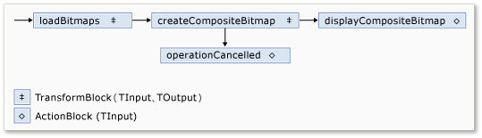
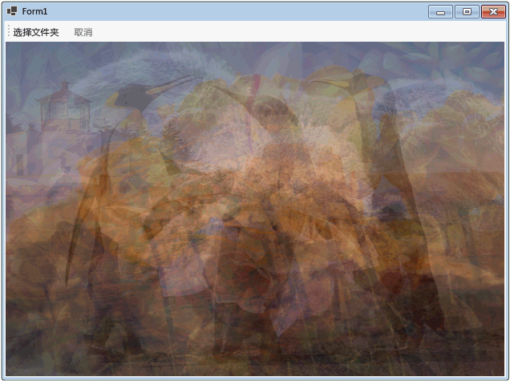

# 演练：在 Windows 窗体应用程序中使用数据流
本文档演示如何创建在 Windows 窗体应用程序中执行图像处理的数据流块网络。  
  
 此示例从指定的文件夹加载图像文件、创建复合图像，并显示结果。 本示例使用数据流模型通过网络路由图像。 在数据流模型中，程序的独立组件之间通过发送消息进行通信。 某个组件收到一条消息时，它会执行某项操作，然后将结果传递给另一个组件。 相比之下，在控制流模型中，应用程序使用控制结构（例如条件语句和循环等等）控制程序中操作的顺序。  
  
## 系统必备  
 开始本演练之前，请阅读[数据流](../../../docs/standard/parallel-programming/dataflow-task-parallel-library.md)。  

[!INCLUDE [tpl-install-instructions](../../../includes/tpl-install-instructions.md)]

## 部分  
 本演练包含以下各节：  
  
-   [创建 Windows 窗体应用程序](#winforms)  
  
-   [创建数据流网络](#network)  
  
-   [将数据流网络连接到用户界面](#ui)  
  
-   [完整示例](#complete)  
  
   
## 创建 Windows 窗体应用程序  
 本节介绍如何创建基本 Windows 窗体应用程序并将控件添加到主窗体。  
  
#### 创建 Windows 窗体应用程序  
  
1.  在 Visual Studio 中，创建 Visual C# 或 Visual Basic“Windows 窗体应用程序”项目。 在本文档中，该项目名为 `CompositeImages`。  
  
2.  在主窗体的窗体设计器中，Form1.cs（对于 Visual Basic，则为 Form1.vb）添加了 <xref:System.Windows.Forms.ToolStrip> 控件。  
  
3.  向 <xref:System.Windows.Forms.ToolStrip> 控件添加 <xref:System.Windows.Forms.ToolStripButton> 控件。 将 <xref:System.Windows.Forms.ToolStripItem.DisplayStyle%2A> 属性设置为 <xref:System.Windows.Forms.ToolStripItemDisplayStyle.Text>，并将 <xref:System.Windows.Forms.ToolStripItem.Text%2A> 属性设置为“Choose Folder”。  
  
4.  向 <xref:System.Windows.Forms.ToolStrip> 控件再添加一个 <xref:System.Windows.Forms.ToolStripButton> 控件。 将 <xref:System.Windows.Forms.ToolStripItem.DisplayStyle%2A> 属性设置为 <xref:System.Windows.Forms.ToolStripItemDisplayStyle.Text>，将 <xref:System.Windows.Forms.ToolStripItem.Text%2A> 属性设置为“Cancel”，并将 <xref:System.Windows.Forms.ToolStripItem.Enabled%2A> 属性设置为 `False`。  
  
5.  向主窗体添加 <xref:System.Windows.Forms.PictureBox> 对象。 将 <xref:System.Windows.Forms.Control.Dock%2A> 属性设置为 <xref:System.Windows.Forms.DockStyle.Fill>。  
  
   
## 创建数据流网络  
 本节介绍如何创建执行图像处理的数据流网络。  
  
#### 创建数据流网络  
  
1.  向项目中添加对 System.Threading.Tasks.Dataflow.dll 的引用。  
  
2.  确保 Form1.cs（对于 Visual Basic，则为 Form1.vb）包含以下 `using`（Visual Basic 中为 `Using`）语句：  
  
     [!code-csharp[TPLDataflow_CompositeImages#1](../../../samples/snippets/csharp/VS_Snippets_Misc/tpldataflow_compositeimages/cs/compositeimages/form1.cs#1)]  
  
3.  将以下数据成员添加到 `Form1` 类：  
  
     [!code-csharp[TPLDataflow_CompositeImages#2](../../../samples/snippets/csharp/VS_Snippets_Misc/tpldataflow_compositeimages/cs/compositeimages/form1.cs#2)]  
  
4.  将下面的 `CreateImageProcessingNetwork` 方法添加到 `Form1` 类。 此方法创建图像处理网络。  
  
     [!code-csharp[TPLDataflow_CompositeImages#3](../../../samples/snippets/csharp/VS_Snippets_Misc/tpldataflow_compositeimages/cs/compositeimages/form1.cs#3)]  
  
5.  实现 `LoadBitmaps` 方法。  
  
     [!code-csharp[TPLDataflow_CompositeImages#4](../../../samples/snippets/csharp/VS_Snippets_Misc/tpldataflow_compositeimages/cs/compositeimages/form1.cs#4)]  
  
6.  实现 `CreateCompositeBitmap` 方法。  
  
     [!code-csharp[TPLDataflow_CompositeImages#5](../../../samples/snippets/csharp/VS_Snippets_Misc/tpldataflow_compositeimages/cs/compositeimages/form1.cs#5)]  
  
    > [!NOTE]
    >  C# 版本的 `CreateCompositeBitmap` 方法使用指针启用高效处理 <xref:System.Drawing.Bitmap?displayProperty=nameWithType> 对象。 因此，若要使用 [unsafe](~/docs/csharp/language-reference/keywords/unsafe.md) 关键字，必须在项目中启用“允许不安全代码”选项。 有关如何在 Visual C# 项目中启用不安全代码的详细信息，请参阅[“项目设计器”->“生成”页 (C#)](/visualstudio/ide/reference/build-page-project-designer-csharp)。  
  
 下表描述了网络的成员。  
  
|成员|类型|描述|  
|------------|----------|-----------------|  
|`loadBitmaps`|<xref:System.Threading.Tasks.Dataflow.TransformBlock%602>|将文件夹路径用作输入，并生成一组 <xref:System.Drawing.Bitmap> 对象作为输出。|  
|`createCompositeBitmap`|<xref:System.Threading.Tasks.Dataflow.TransformBlock%602>|将一组 <xref:System.Drawing.Bitmap> 对象用作输入，并生成复合位图作为输出。|  
|`displayCompositeBitmap`|<xref:System.Threading.Tasks.Dataflow.ActionBlock%601>|在窗体上显示复合位图。|  
|`operationCancelled`|<xref:System.Threading.Tasks.Dataflow.ActionBlock%601>|显示图像以表示操作取消并使用户能够选择其他文件夹。|  
  
 为了连接数据流块以形成网络，此示例使用 <xref:System.Threading.Tasks.Dataflow.ISourceBlock%601.LinkTo%2A> 方法。 <xref:System.Threading.Tasks.Dataflow.ISourceBlock%601.LinkTo%2A> 方法包含重载版本，需要使用 <xref:System.Predicate%601> 对象确定目标数据流块是接受还是拒绝消息。 此筛选机制使消息块只接收特定值。 在此示例中，网络能以两种方式进行分支。 主分支从磁盘加载图像，创建复合图像并在窗体上显示该图像。 备用分支取消当前操作。 借助 <xref:System.Predicate%601> 对象，主分支的数据流块可以拒绝特定消息，从而切换到替换分支。 例如，如果用户取消了操作，数据流块 `createCompositeBitmap` 将生成 `null`（在 Visual Basic 中为 `Nothing`）作为其输出。 数据流块 `displayCompositeBitmap` 拒绝 `null` 输入值，因此该消息将传递到 `operationCancelled`。 数据流块 `operationCancelled` 接受所有消息，并因此显示图像以表示操作取消。  
  
 下图显示图像处理网络。  
  
   
  
 因为 `displayCompositeBitmap` 和 `operationCancelled` 数据流块是在用户界面上操作，所以这些操作要在用户界面线程上执行，这一点很重要。 为此，在构造期间，每个对象都提供将 <xref:System.Threading.Tasks.Dataflow.DataflowBlockOptions.TaskScheduler%2A> 属性设置为 <xref:System.Threading.Tasks.TaskScheduler.FromCurrentSynchronizationContext%2A?displayProperty=nameWithType> 的 <xref:System.Threading.Tasks.Dataflow.ExecutionDataflowBlockOptions> 对象。 <xref:System.Threading.Tasks.TaskScheduler.FromCurrentSynchronizationContext%2A?displayProperty=nameWithType> 方法会创建一个在当前同步上下文中执行工作的 <xref:System.Threading.Tasks.TaskScheduler> 对象。 因为 `CreateImageProcessingNetwork` 方法是通过“选择文件夹”按钮的处理程序调用的，而该处理程序在用户界面线程上运行，所以 `displayCompositeBitmap` 和 `operationCancelled` 数据流块的操作也在用户界面线程上运行。  
  
 此示例使用共享的取消令牌，而不是设置 <xref:System.Threading.Tasks.Dataflow.DataflowBlockOptions.CancellationToken%2A> 属性，因为 <xref:System.Threading.Tasks.Dataflow.DataflowBlockOptions.CancellationToken%2A> 属性永久取消数据流块执行。 利用取消标记，此示例可多次重复使用同一数据流网络，即使用户取消一个或多个操作也是如此。 有关展示了如何使用 <xref:System.Threading.Tasks.Dataflow.DataflowBlockOptions.CancellationToken%2A> 永久取消数据流块执行的示例，请参阅[如何：取消数据流块](../../../docs/standard/parallel-programming/how-to-cancel-a-dataflow-block.md)。  
  
   
## 将数据流网络连接到用户界面  
 本节介绍如何将数据流网络连接到用户界面。 复合图像创建和操作取消都是从“选择文件夹”和“取消”按钮启动的。 用户选择以上任一按钮时，都会以异步方式启动相应操作。  
  
#### 将数据流网络连接到用户界面  
  
1.  在主窗体的窗体设计器中，创建“选择文件夹”按钮的 <xref:System.Windows.Forms.ToolStripItem.Click> 事件的事件处理程序。  
  
2.  实现“选择文件夹”按钮的 <xref:System.Windows.Forms.ToolStripItem.Click> 事件。  
  
     [!code-csharp[TPLDataflow_CompositeImages#6](../../../samples/snippets/csharp/VS_Snippets_Misc/tpldataflow_compositeimages/cs/compositeimages/form1.cs#6)]  
  
3.  在主窗体的窗体设计器中，创建“取消”按钮的 <xref:System.Windows.Forms.ToolStripItem.Click> 事件的事件处理程序。  
  
4.  实现“取消”按钮的 <xref:System.Windows.Forms.ToolStripItem.Click> 事件。  
  
     [!code-csharp[TPLDataflow_CompositeImages#7](../../../samples/snippets/csharp/VS_Snippets_Misc/tpldataflow_compositeimages/cs/compositeimages/form1.cs#7)]  
  
   
## 完整示例  
 下面的示例显示此演练的完整代码。  
  
 [!code-csharp[TPLDataflow_CompositeImages#100](../../../samples/snippets/csharp/VS_Snippets_Misc/tpldataflow_compositeimages/cs/compositeimages/form1.cs#100)]  
  
 下图显示公共 \Sample Pictures\ 文件夹的典型输出。  
  
   

## 请参阅  
 [数据流](../../../docs/standard/parallel-programming/dataflow-task-parallel-library.md)
