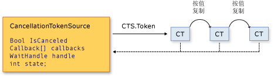

# Cancellation in Managed Threads
从 [!INCLUDE[net_v40_long](../../../includes/net-v40-long-md.md)] 开始，.NET Framework 在协作取消异步操作或长时间运行的同步操作时使用通过一的模型。  此模型基于被称为取消标记的轻量对象。  调用一个或多个可取消操作的对象（例如通过创建新线程或任务）将标记传递给每个操作。  单个操作反过来可将标记的副本传递给其他操作。  稍后，创建标记的对象可使用此标记请求停止执行操作内容。  只有请求对象可以发出取消请求，而每个侦听器负责注意请求并及时适当地响应请求。  
  
 用于实现协作取消模型的常规模式是：  
  
-   实例化 <xref:System.Threading.CancellationTokenSource> 对象，此对象管理取消通知并将其发送给单个取消标记。  
  
-   将 <xref:System.Threading.CancellationTokenSource.Token%2A?displayProperty=fullName> 属性返回的标记传递给每个侦听取消的任务或线程。  
  
-   为每个任务或线程提供响应取消的机制。  
  
-   调用 <xref:System.Threading.CancellationTokenSource.Cancel%2A?displayProperty=fullName> 方法以提供取消通知。  
  
> [!IMPORTANT]
>  <xref:System.Threading.CancellationTokenSource> 类实现 <xref:System.IDisposable> 接口。  使用取消标记源释放所包含的任何非托管资源后，应确保调用 <xref:System.Threading.CancellationTokenSource.Dispose%2A?displayProperty=fullName> 方法。  
  
 下图显示了标记源与标记的所有副本之间的关系。  
  
   
  
 新的取消模型使创建取消感知应用程序和库更简单，并支持以下功能：  
  
-   取消具有协作性，且不会在侦听器上强制执行。  侦听器确定如何适当地以响应取消请求终止操作。  
  
-   请求与侦听不同。  调用可取消操作的对象可以控制何时（如果有）请求取消。  
  
-   请求对象仅使用一种方法调用，向标记的所有副本发出取消请求。  
  
-   侦听器可通过将多个标记联接到一个 *链接标记*同时侦听多个标记。  
  
-   用户代码可以注意并响应来自库代码的取消请求，而库代码可以注意并响应来自用户代码的取消请求。  
  
-   侦听器可通过轮询、回调注册或等待等待句柄来接收到取消请求的通知。  
  
## 取消类型  
 取消框架作为相关类型集实现，如下表所列。  
  
|类型名称|描述|  
|----------|--------|  
|<xref:System.Threading.CancellationTokenSource>|创建取消标记并为此标记的所有副本发出取消请求的对象。|  
|<xref:System.Threading.CancellationToken>|通常作为方法参数传递给一个或多个侦听器的轻量值类型。  侦听器通过轮询、回调或等待句柄监视标记的 `IsCancellationRequested` 属性的值。|  
|<xref:System.OperationCanceledException>|此异常的构造函数的重载将 <xref:System.Threading.CancellationToken> 作为参数接受。  侦听器可能会选择性地引发此异常，议验证取消源并通知其他侦听器它已响应取消请求。|  
  
 新的取消模型以多种类型集成到 [!INCLUDE[dnprdnshort](../../../includes/dnprdnshort-md.md)] 中。最重要的类型包括 <xref:System.Threading.Tasks.Parallel?displayProperty=fullName>、<xref:System.Threading.Tasks.Task?displayProperty=fullName>、<xref:System.Threading.Tasks.Task%601?displayProperty=fullName> 和 <xref:System.Linq.ParallelEnumerable?displayProperty=fullName>。  建议将此新取消模型用于所有新库和应用程序代码。  
  
## 代码示例  
 在以下示例中，请求对象创建 <xref:System.Threading.CancellationTokenSource> 对象，然后传递其 <xref:System.Threading.CancellationTokenSource.Token%2A> 属性到可取消操作中。  接收请求的操作通过轮询监视标记的 <xref:System.Threading.CancellationToken.IsCancellationRequested%2A> 属性的值。  值变为 `true` 后，侦听器可以适当方式终止操作。  在此示例中，方法只需退出，很多情况下都只需执行此操作。  
  
> [!NOTE]
>  此示例使用 <xref:System.Threading.ThreadPool.QueueUserWorkItem%2A> 方法演示新的取消框架与旧版 API 兼容。  有关使用新的首选 <xref:System.Threading.Tasks.Task?displayProperty=fullName> 类型的示例，请参阅[How to: Cancel a Task and Its Children](../../../docs/standard/parallel-programming/how-to-cancel-a-task-and-its-children.md)。  
  
 [!code-csharp[Cancellation#1](../../../samples/snippets/csharp/VS_Snippets_Misc/cancellation/cs/cancellationex1.cs#1)]
 [!code-vb[Cancellation#1](../../../samples/snippets/visualbasic/VS_Snippets_Misc/cancellation/vb/cancellationex1.vb#1)]  
  
## 操作取消与对象取消  
 在新的取消框架中，取消将引用操作（而不是对象）。  取消请求意味着应在执行任何所需的清理后尽快停止操作。  一个取消标记应代指一个“可取消操作”，但可在程序中实现此操作。  在标记的 <xref:System.Threading.CancellationToken.IsCancellationRequested%2A> 属性设置为 `true` 后，不能重置为 `false`。  因此，取消后不能重用取消标记。  
  
 如果需要对象取消机制，可以通过调用 <xref:System.Threading.CancellationToken.Register%2A?displayProperty=fullName> 方法将其基于操作取消机制，如以下示例所示。  
  
 [!code-csharp[Cancellation#2](../../../samples/snippets/csharp/VS_Snippets_Misc/cancellation/cs/objectcancellation1.cs#2)]
 [!code-vb[Cancellation#2](../../../samples/snippets/visualbasic/VS_Snippets_Misc/cancellation/vb/objectcancellation1.vb#2)]  
  
 如果对象支持多个并发可取消操作，则将单独的标记作为输入传递给每个非重复的可取消操作。  这样，无需影响其他操作即可取消某项操作。  
  
## 侦听和响应取消请求  
 在用户委托中，可取消操作的实施者确定如何以响应取消请求来终止操作。  在很多情况下，用户委托只需执行全部所需清理，然后立即返回。  
  
 但是，在更复杂的情况下，用户委托可能需要通知库代码已发生取消。  在这种情况下，终止操作的正确方式是委托调用 <xref:System.Threading.CancellationToken.ThrowIfCancellationRequested%2A> 方法，这将引发 <xref:System.OperationCanceledException>。  库代码可以在用户委托线程上捕获此异常，并检查异常的标记以确定异常是否表示协作取消或一些其他的异常情况。  
  
 <xref:System.Threading.Tasks.Task> 类以此方式处理 <xref:System.OperationCanceledException>。  有关详细信息，请参阅[Task Cancellation](../../../docs/standard/parallel-programming/task-cancellation.md)。  
  
### 通过轮询进行侦听  
 对于循环或递归的长时间运行的计算，可以通过定期轮询 <xref:System.Threading.CancellationToken.IsCancellationRequested%2A?displayProperty=fullName> 属性的值来侦听取消请求。  如果其值为 `true`，则此方法应尽快清理并终止。  最佳的轮询频率取决于应用程序的类型。  由开发人员决定任一给定程序的最佳轮询频率。  轮询本身不会显著影响性能。  以下示例演示了一种轮询方法。  
  
 [!code-csharp[Cancellation#3](../../../samples/snippets/csharp/VS_Snippets_Misc/cancellation/cs/cancellationex11.cs#3)]
 [!code-vb[Cancellation#3](../../../samples/snippets/visualbasic/VS_Snippets_Misc/cancellation/vb/cancellationex11.vb#3)]  
  
 有关更完整的示例，请参阅[How to: Listen for Cancellation Requests by Polling](../../../docs/standard/threading/how-to-listen-for-cancellation-requests-by-polling.md)。  
  
### 通过注册回调进行侦听  
 某些操作可能被阻止，导致其无法及时检查取消标记的值。  对于这些情况，可以注册在接收取消请求时取消阻止此方法的回调方法。  
  
 <xref:System.Threading.CancellationToken.Register%2A> 方法将返回专用于此目的的 <xref:System.Threading.CancellationTokenRegistration> 对象。  以下示例演示了如何使用 <xref:System.Threading.CancellationToken.Register%2A> 方法取消异步 Web 请求。  
  
 [!code-csharp[Cancellation#4](../../../samples/snippets/csharp/VS_Snippets_Misc/cancellation/cs/cancellationex4.cs#4)]
 [!code-vb[Cancellation#4](../../../samples/snippets/visualbasic/VS_Snippets_Misc/cancellation/vb/cancellationex4.vb#4)]  
  
 <xref:System.Threading.CancellationTokenRegistration> 对象管理线程同步，并确保回调将在精确的时间点停止执行。  
  
 为了确保系统的响应能力并避免死锁，注册回调时必须遵循以下准则：  
  
-   回调方法应该快速，因为它进行同步调用，所以对 <xref:System.Threading.CancellationTokenSource.Cancel%2A> 的调用直到回调返回后才会返回。  
  
-   如果回调正在运行时调用 <xref:System.Threading.CancellationTokenRegistration.Dispose%2A> 且你持有回调正在等待的锁定，则程序可能出现死锁。  `Dispose` 返回后，可释放回调所需的任何资源。  
  
-   回调不应在回调中执行任何手动线程或 <xref:System.Threading.SynchronizationContext> 使用情况。  如果回调必须在特定线程上运行，请使用 <xref:System.Threading.CancellationTokenRegistration?displayProperty=fullName> 构造函数，此函数使你能够指定目标 syncContext 是活动的 <xref:System.Threading.SynchronizationContext.Current%2A?displayProperty=fullName>。  在回调中执行手动线程处理可能导致死锁。  
  
 有关更完整的示例，请参阅[How to: Register Callbacks for Cancellation Requests](../../../docs/standard/threading/how-to-register-callbacks-for-cancellation-requests.md)。  
  
### 通过使用等待句柄进行侦听  
 当可取消的操作可在等待同步基元（例如 <xref:System.Threading.ManualResetEvent?displayProperty=fullName> 或 <xref:System.Threading.Semaphore?displayProperty=fullName>）的同时进行阻止时），可使用 <xref:System.Threading.CancellationToken.WaitHandle%2A?displayProperty=fullName> 属性启用操作同时等待事件请求和取消请求。  取消标记的等待句柄将接收到响应取消请求的信号，并且此方法可使用 <xref:System.Threading.WaitHandle.WaitAny%2A> 方法的返回值来确定它是否为发出信号的取消标记。  然后此操作可根据需要直接退出，或者引发 <xref:System.OperationCanceledException>。  
  
 [!code-csharp[Cancellation#5](../../../samples/snippets/csharp/VS_Snippets_Misc/cancellation/cs/cancellationex9.cs#5)]
 [!code-vb[Cancellation#5](../../../samples/snippets/visualbasic/VS_Snippets_Misc/cancellation/vb/cancellationex9.vb#5)]  
  
 在面向 [!INCLUDE[net_v40_long](../../../includes/net-v40-long-md.md)] 的新代码中，<xref:System.Threading.ManualResetEventSlim?displayProperty=fullName> 和 <xref:System.Threading.SemaphoreSlim?displayProperty=fullName> 都支持在其 `Wait` 方法中使用新的取消框架。  可以将 <xref:System.Threading.CancellationToken>传递给此方法，请求取消后，此事件将唤醒并引发 <xref:System.OperationCanceledException>。  
  
 [!code-csharp[Cancellation#6](../../../samples/snippets/csharp/VS_Snippets_Misc/cancellation/cs/cancellationex10.cs#6)]
 [!code-vb[Cancellation#6](../../../samples/snippets/visualbasic/VS_Snippets_Misc/cancellation/vb/cancellationex10.vb#6)]  
  
 有关更完整的示例，请参阅[How to: Listen for Cancellation Requests That Have Wait Handles](../../../docs/standard/threading/how-to-listen-for-cancellation-requests-that-have-wait-handles.md)。  
  
### 同时侦听多个标记  
 在某些情况下，侦听器可能需要同时侦听多个取消标记。  例如，除了在外部作为参数传递到方法参数的标记以外，可取消操纵可能还必须监视内部取消标记。  为此，需创建可将两个或多个标记联接成一个标记的链接标记源，如以下示例所示。  
  
 [!code-csharp[Cancellation#7](../../../samples/snippets/csharp/VS_Snippets_Misc/cancellation/cs/cancellationex13.cs#7)]
 [!code-vb[Cancellation#7](../../../samples/snippets/visualbasic/VS_Snippets_Misc/cancellation/vb/cancellationex13.vb#7)]  
  
 请注意，完成后必须在链接标记源上调用 `Dispose`。  有关更完整的示例，请参阅[How to: Listen for Multiple Cancellation Requests](../../../docs/standard/threading/how-to-listen-for-multiple-cancellation-requests.md)。  
  
## 库代码和用户代码之间的合作  
 借助统一的取消框架，库代码可取消用户代码，而使用户代码可以协作的方式取消库代码。  合作是否顺利取决于两者是否遵循以下准则：  
  
-   如果库代码提供了可取消操作，它还应提供接受外部取消标记的公共方法，以便用户代码可以请求取消。  
  
-   如果库代码调入用户代码，则库代码应将 OperationCanceledException\(externalToken\) 解释为*协作取消*，不一定解释为失败异常。  
  
-   用户委托应尝试及时响应来自库代码的取消请求。  
  
 <xref:System.Threading.Tasks.Task?displayProperty=fullName> 和 <xref:System.Linq.ParallelEnumerable?displayProperty=fullName> 是遵循这些准则的示例类。  有关详细信息，请参阅[Task Cancellation](../../../docs/standard/parallel-programming/task-cancellation.md)和[How to: Cancel a PLINQ Query](../../../docs/standard/parallel-programming/how-to-cancel-a-plinq-query.md)。  
  
## 请参阅  
 [Managed Threading Basics](../../../docs/standard/threading/managed-threading-basics.md)